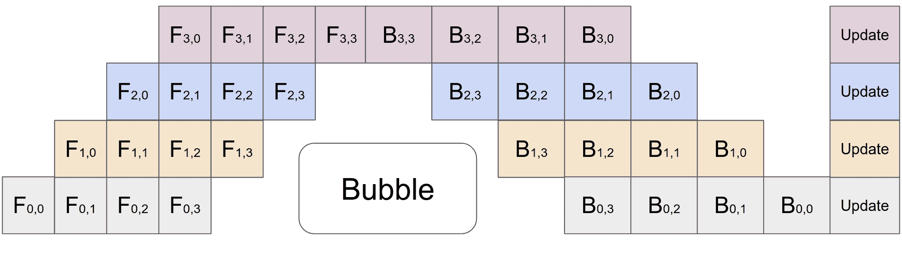

# 使用 🤗 Accelerate 进行分布式推理

> 原始文本：[`huggingface.co/docs/accelerate/usage_guides/distributed_inference`](https://huggingface.co/docs/accelerate/usage_guides/distributed_inference)

分布式推理可以分为三个部分：

1.  将整个模型加载到每个 GPU 上，并一次发送一批数据块到每个 GPU 的模型副本

1.  将模型的部分加载到每个 GPU 上，并一次处理一个输入

1.  将模型的部分加载到每个 GPU 上，并使用所谓的计划管道并行来结合这两种先前的技术。

我们将逐个讨论第一个和最后一个括号，展示如何执行每个括号，因为它们更符合实际情况。

## 自动将一批数据块发送到每个加载的模型

这是最占用内存的解决方案，因为它要求每个 GPU 在给定时间内保留模型的完整副本。

通常在这种情况下，用户将模型发送到特定设备以从 CPU 加载它，然后将每个提示移动到不同的设备。

使用 `diffusers` 库创建一个基本的管道可能看起来像这样：

```py
import torch
import torch.distributed as dist
from diffusers import DiffusionPipeline

pipe = DiffusionPipeline.from_pretrained("runwayml/stable-diffusion-v1-5", torch_dtype=torch.float16)
```

然后根据特定提示执行推理：

```py
def run_inference(rank, world_size):
    dist.init_process_group("nccl", rank=rank, world_size=world_size)
    pipe.to(rank)

    if torch.distributed.get_rank() == 0:
        prompt = "a dog"
    elif torch.distributed.get_rank() == 1:
        prompt = "a cat"

    result = pipe(prompt).images[0]
    result.save(f"result_{rank}.png")
```

人们会注意到我们必须检查等级以知道要发送哪个提示，这可能有点繁琐。

然后用户可能会认为使用 `Accelerator` 在准备数据加载器时也可能是管理这个任务的一种简单方法。（要了解更多，请查看快速入门中的相关部分）

它能够管理吗？是的。但是它是否添加了不必要的额外代码：也是的。

使用 🤗 Accelerate，我们可以通过使用 Accelerator.split_between_processes() 上下文管理器（也存在于 `PartialState` 和 `AcceleratorState` 中）来简化这个过程。这个函数会自动将您传递给它的任何数据（无论是提示、一组张量、先前数据的字典等）自动分配到所有进程（可能需要填充）中，以便立即使用。

让我们使用这个上下文管理器重新编写上面的例子：

```py
from accelerate import PartialState  # Can also be Accelerator or AcceleratorState
from diffusers import DiffusionPipeline

pipe = DiffusionPipeline.from_pretrained("runwayml/stable-diffusion-v1-5", torch_dtype=torch.float16)
distributed_state = PartialState()
pipe.to(distributed_state.device)

# Assume two processes
with distributed_state.split_between_processes(["a dog", "a cat"]) as prompt:
    result = pipe(prompt).images[0]
    result.save(f"result_{distributed_state.process_index}.png")
```

然后启动代码，我们可以使用 🤗 Accelerate：

如果您已经生成了一个要使用的配置文件，请使用 `accelerate config`：

```py
accelerate launch distributed_inference.py
```

如果您有一个特定的配置文件要使用：

```py
accelerate launch --config_file my_config.json distributed_inference.py
```

或者如果不想创建任何配置文件并在两个 GPU 上启动：

> 注意：您将收到一些关于根据您的系统猜测值的警告。要删除这些警告，您可以执行 `accelerate config default` 或通过 `accelerate config` 创建一个配置文件。

```py
accelerate launch --num_processes 2 distributed_inference.py
```

我们现在已经将需要拆分这些数据的样板代码减少到几行代码中，非常容易。

但是如果我们有一个奇数分布的提示到 GPU？例如，如果我们有 3 个提示，但只有 2 个 GPU？

在上下文管理器下，第一个 GPU 将接收前两个提示，第二个 GPU 将接收第三个提示，确保所有提示都被拆分，不需要额外的开销。

*然而*，如果我们想对*所有 GPU*的结果做一些处理怎么办？（比如收集它们并执行某种后处理）您可以传递 `apply_padding=True` 来确保提示列表填充到相同的长度，额外的数据将从最后一个样本中获取。这样所有 GPU 将有相同数量的提示，然后您可以收集结果。

只有在尝试执行诸如收集结果之类的操作时才需要这样做，其中每个设备上的数据需要具有相同的长度。基本推理不需要这样做。

例如：

```py
from accelerate import PartialState  # Can also be Accelerator or AcceleratorState
from diffusers import DiffusionPipeline

pipe = DiffusionPipeline.from_pretrained("runwayml/stable-diffusion-v1-5", torch_dtype=torch.float16)
distributed_state = PartialState()
pipe.to(distributed_state.device)

# Assume two processes
with distributed_state.split_between_processes(["a dog", "a cat", "a chicken"], apply_padding=True) as prompt:
    result = pipe(prompt).images
```

在第一个 GPU 上，提示将是 `["a dog", "a cat"]`，在第二个 GPU 上将是 `["a chicken", "a chicken"]`。确保丢弃最后一个样本，因为它将是前一个样本的副本。

## 内存高效的管道并行（实验性）

接下来的部分将讨论使用*管道并行处理*。这是一个**实验性** API，利用了 [PyTorch 的 PiPPy 库](https://github.com/pytorch/PiPPy/) 作为本地解决方案。

管道并行处理的一般思想是：假设您有 4 个 GPU 和一个足够大的模型，可以使用 `device_map="auto"` 在四个 GPU 上进行*分割*。使用这种方法，您可以一次发送 4 个输入（例如在这里，任意数量都可以），每个模型块将处理一个输入，然后在前一个块完成后接收下一个输入，使其比之前描述的方法*更*高效 **和更快**。这里有一个来自 PyTorch 仓库的可视化：



为了说明您如何在 Accelerate 中使用这个功能，我们创建了一个 [示例动物园](https://github.com/huggingface/accelerate/tree/main/examples/inference)，展示了许多不同的模型和情况。在本教程中，我们将展示如何在两个 GPU 上为 GPT2 使用这种方法。

在继续之前，请确保您已安装了最新的 pippy，方法是运行以下命令：

```py
pip install torchpippy
```

我们至少需要版本 0.2.0。要确认您安装了正确的版本，请运行 `pip show torchpippy`。

首先在 CPU 上创建模型：

```py
from transformers import GPT2ForSequenceClassification, GPT2Config

config = GPT2Config()
model = GPT2ForSequenceClassification(config)
model.eval()
```

接下来，您需要创建一些示例输入以供使用。这有助于 PiPPy 追踪模型。

您制作这个示例的方式将决定在给定时间通过模型传递的相对批次大小，因此请记住有多少项！

```py
input = torch.randint(
    low=0,
    high=config.vocab_size,
    size=(2, 1024),  # bs x seq_len
    device="cpu",
    dtype=torch.int64,
    requires_grad=False,
)
```

接下来我们需要实际执行追踪并准备好模型。为此，请使用 inference.prepare_pippy() 函数，它将自动完全包装模型以进行管道并行处理：

```py
from accelerate.inference import prepare_pippy
example_inputs = {"input_ids": input}
model = prepare_pippy(model, example_args=(input,))
```

您可以通过 `prepare_pippy` 传递各种参数：

+   `split_points` 让您确定在哪些层上拆分模型。默认情况下，我们使用 `device_map="auto"` 声明的位置，例如 `fc` 或 `conv1`。

+   `num_chunks` 决定了批次将如何分割并发送到模型本身（因此 `num_chunks=1`，有四个分割点/四个 GPU 将具有一个简单的 MP，其中单个输入在四个层分割点之间传递）

从这里开始，剩下的就是实际执行分布式推理！

在传递输入时，我们强烈建议将它们作为参数元组传递。支持使用 `kwargs`，但这种方法是实验性的。

```py
args = some_more_arguments
with torch.no_grad():
    output = model(*args)
```

完成后，所有数据将仅在最后一个进程上：

```py
from accelerate import PartialState
if PartialState().is_last_process:
    print(output)
```

如果将 `gather_output=True` 传递给 inference.prepare_pippy()，输出将在之后发送到所有 GPU，无需进行 `is_last_process` 检查。默认情况下为 `False`，因为这会产生通信调用。

就是这样！要了解更多，请查看 [Accelerate 仓库](https://github.com/huggingface/accelerate/tree/main/examples/inference) 中的推理示例和我们的 文档，因为我们正在努力改进这个集成。
