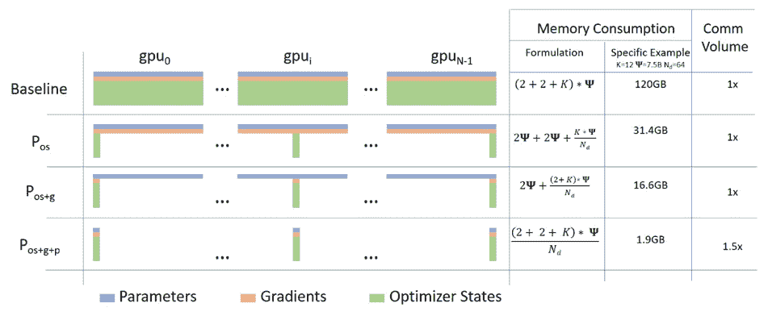

# DeepSpeed

> [原文链接](https://huggingface.co/docs/accelerate/usage_guides/deepspeed)

[DeepSpeed](https://github.com/microsoft/DeepSpeed)实现了[ZeRO 论文](https://arxiv.org/abs/1910.02054)中描述的所有内容。一些显著的优化包括：

1.  优化器状态分区（ZeRO 阶段 1）

1.  梯度分区（ZeRO 阶段 2）

1.  参数分区（ZeRO 阶段 3）

1.  自定义混合精度训练处理

1.  一系列基于快速 CUDA 扩展的优化器

1.  ZeRO-Offload 到 CPU 和磁盘/NVMe

1.  模型参数的分层分区（ZeRO++）

ZeRO-Offload 有自己的专门论文：[ZeRO-Offload:民主化亿级模型训练](https://arxiv.org/abs/2101.06840)。NVMe 支持在论文[ZeRO-Infinity:打破 GPU 内存壁垒，实现极端规模的深度学习](https://arxiv.org/abs/2104.07857)中有描述。

DeepSpeed ZeRO-2 主要仅用于训练，因为其特性对推理无用。

DeepSpeed ZeRO-3 也可用于推理，因为它允许将庞大的模型加载到多个 GPU 上，这在单个 GPU 上是不可能的。

🤗 Accelerate 通过 2 种选项集成[DeepSpeed](https://github.com/microsoft/DeepSpeed)：

1.  通过在`accelerate config`中使用`deepspeed config file`规范集成 DeepSpeed 功能。您只需提供自定义配置文件或使用我们的模板。本文档的大部分内容都集中在这个功能上。这支持 DeepSpeed 的所有核心功能，并为用户提供了很大的灵活性。用户可能需要根据配置更改几行代码。

1.  通过`deepspeed_plugin`进行集成。这支持 DeepSpeed 功能的子集，并对其余配置使用默认选项。用户无需更改任何代码，适用于那些对 DeepSpeed 的大多数默认设置满意的用户。

## 集成了什么？

训练：

1.  🤗 Accelerate 集成了 DeepSpeed ZeRO 的所有功能。这包括所有 ZeRO 阶段 1、2 和 3，以及 ZeRO-Offload、ZeRO-Infinity（可以卸载到磁盘/NVMe）和 ZeRO++。以下是使用 ZeRO 进行数据并行的简短描述 - 零冗余优化器，以及来自这篇[博客文章](https://www.microsoft.com/en-us/research/blog/zero-deepspeed-new-system-optimizations-enable-training-models-with-over-100-billion-parameters/)的图表 

（来源：[链接](https://www.microsoft.com/en-us/research/blog/zero-deepspeed-new-system-optimizations-enable-training-models-with-over-100-billion-parameters/)）

a. **阶段 1**：将优化器状态分片到数据并行工作者/GPU 之间

b. **阶段 2**：将优化器状态+梯度分片到数据并行工作者/GPU 之间

c. **阶段 3**：将优化器状态+梯度+模型参数分片到数据并行工作者/GPU 之间

d. **优化器卸载**：将梯度+优化器状态卸载到 CPU/磁盘，构建在 ZERO 阶段 2 之上

e. **参数卸载**：将模型参数卸载到 CPU/磁盘，构建在 ZERO 阶段 3 之上

f. **分层分区**：通过在 ZeRO 阶段 3 之上构建，实现了跨节点的数据并行训练和节点内的 ZeRO-3 分片的高效多节点训练。

注意：关于磁盘卸载，磁盘应为 NVME 以获得良好的速度，但从技术上讲，它可以在任何磁盘上运行

推理：

1.  DeepSpeed ZeRO 推理支持 ZeRO 阶段 3 和 ZeRO-Infinity。它使用与训练相同的 ZeRO 协议，但不使用优化器和学习率调度器，只有阶段 3 相关。有关更多详细信息，请参阅：deepspeed-zero-inference。

## 它是如何工作的？

**先决条件**：安装 DeepSpeed 版本>=0.6.5。有关更多信息，请参考[DeepSpeed 安装详情](https://github.com/microsoft/DeepSpeed#installation)。

我们将首先看一下通过`accelerate config`进行易于使用的集成。然后是更灵活和功能丰富的`deepspeed 配置文件`集成。

### 加速 DeepSpeed 插件

在您的机器上运行：

```py
accelerate config
```

并回答提出的问题。它会询问您是否要使用一个 DeepSpeed 配置文件，您应该回答否。然后回答以下问题以生成基本的 DeepSpeed 配置。这将生成一个配置文件，将自动用于在执行时正确设置默认选项

```py
accelerate launch my_script.py --args_to_my_script
```

例如，这是如何在 NLP 示例`examples/nlp_example.py`（从存储库的根目录）中使用 DeepSpeed 插件运行的：

**ZeRO Stage-2 DeepSpeed 插件示例**

```py
compute_environment: LOCAL_MACHINE
deepspeed_config:
 gradient_accumulation_steps: 1
 gradient_clipping: 1.0
 offload_optimizer_device: none
 offload_param_device: none
 zero3_init_flag: true
 zero_stage: 2
distributed_type: DEEPSPEED
fsdp_config: {}
machine_rank: 0
main_process_ip: null
main_process_port: null
main_training_function: main
mixed_precision: fp16
num_machines: 1
num_processes: 2
use_cpu: false
```

```py
accelerate launch examples/nlp_example.py --mixed_precision fp16
```

**带 CPU 卸载的 ZeRO Stage-3 DeepSpeed 插件示例**

```py
compute_environment: LOCAL_MACHINE
deepspeed_config:
  gradient_accumulation_steps: 1
  gradient_clipping: 1.0
  offload_optimizer_device: cpu
  offload_param_device: cpu
  zero3_init_flag: true
  zero3_save_16bit_model: true
  zero_stage: 3
distributed_type: DEEPSPEED
fsdp_config: {}
machine_rank: 0
main_process_ip: null
main_process_port: null
main_training_function: main
mixed_precision: fp16
num_machines: 1
num_processes: 2
use_cpu: false
```

```py
accelerate launch examples/nlp_example.py --mixed_precision fp16
```

目前，`Accelerate`通过 CLI 支持以下配置：

```py
`zero_stage`: [0] Disabled, [1] optimizer state partitioning, [2] optimizer+gradient state partitioning and [3] optimizer+gradient+parameter partitioning
`gradient_accumulation_steps`: Number of training steps to accumulate gradients before averaging and applying them.
`gradient_clipping`: Enable gradient clipping with value.
`offload_optimizer_device`: [none] Disable optimizer offloading, [cpu] offload optimizer to CPU, [nvme] offload optimizer to NVMe SSD. Only applicable with ZeRO >= Stage-2.
`offload_param_device`: [none] Disable parameter offloading, [cpu] offload parameters to CPU, [nvme] offload parameters to NVMe SSD. Only applicable with ZeRO Stage-3.
`zero3_init_flag`: Decides whether to enable `deepspeed.zero.Init` for constructing massive models. Only applicable with ZeRO Stage-3.
`zero3_save_16bit_model`: Decides whether to save 16-bit model weights when using ZeRO Stage-3.
`mixed_precision`: `no` for FP32 training, `fp16` for FP16 mixed-precision training and `bf16` for BF16 mixed-precision training.
```

为了能够调整更多选项，您需要使用 DeepSpeed 配置文件。

### DeepSpeed 配置文件

在您的机器上运行：

```py
accelerate config
```

并回答提出的问题。它会询问您是否要使用一个 DeepSpeed 配置文件，您需要回答是，并提供 DeepSpeed 配置文件的路径。这将生成一个配置文件，将自动用于在执行时正确设置默认选项

```py
accelerate launch my_script.py --args_to_my_script
```

例如，这是如何在 NLP 示例`examples/by_feature/deepspeed_with_config_support.py`（从存储库的根目录）中使用 DeepSpeed 配置文件运行的：

**ZeRO Stage-2 DeepSpeed 配置文件示例**

```py
compute_environment: LOCAL_MACHINE
deepspeed_config:
 deepspeed_config_file: /home/ubuntu/accelerate/examples/configs/deepspeed_config_templates/zero_stage2_config.json
 zero3_init_flag: true
distributed_type: DEEPSPEED
fsdp_config: {}
machine_rank: 0
main_process_ip: null
main_process_port: null
main_training_function: main
mixed_precision: fp16
num_machines: 1
num_processes: 2
use_cpu: false
```

使用`zero_stage2_config.json`的内容为：

```py
{
    "fp16": {
        "enabled": true,
        "loss_scale": 0,
        "loss_scale_window": 1000,
        "initial_scale_power": 16,
        "hysteresis": 2,
        "min_loss_scale": 1
    },
    "optimizer": {
        "type": "AdamW",
        "params": {
            "lr": "auto",
            "weight_decay": "auto",
            "torch_adam": true,
            "adam_w_mode": true
        }
    },
    "scheduler": {
        "type": "WarmupDecayLR",
        "params": {
            "warmup_min_lr": "auto",
            "warmup_max_lr": "auto",
            "warmup_num_steps": "auto",
            "total_num_steps": "auto"
        }
    },
    "zero_optimization": {
        "stage": 2,
        "allgather_partitions": true,
        "allgather_bucket_size": 2e8,
        "overlap_comm": true,
        "reduce_scatter": true,
        "reduce_bucket_size": "auto",
        "contiguous_gradients": true
    },
    "gradient_accumulation_steps": 1,
    "gradient_clipping": "auto",
    "steps_per_print": 2000,
    "train_batch_size": "auto",
    "train_micro_batch_size_per_gpu": "auto",
    "wall_clock_breakdown": false
}
```

```py
accelerate launch examples/by_feature/deepspeed_with_config_support.py \
--config_name "gpt2-large" \
--tokenizer_name "gpt2-large" \
--dataset_name "wikitext" \
--dataset_config_name "wikitext-2-raw-v1" \
--block_size 128 \
--output_dir "./clm/clm_deepspeed_stage2_accelerate" \
--learning_rate 5e-4 \
--per_device_train_batch_size 24 \
--per_device_eval_batch_size 24 \
--num_train_epochs 3 \
--with_tracking \
--report_to "wandb"\
```

**带 CPU 卸载的 ZeRO Stage-3 DeepSpeed 配置文件示例**

```py
compute_environment: LOCAL_MACHINE
deepspeed_config:
 deepspeed_config_file: /home/ubuntu/accelerate/examples/configs/deepspeed_config_templates/zero_stage3_offload_config.json
 zero3_init_flag: true
distributed_type: DEEPSPEED
fsdp_config: {}
machine_rank: 0
main_process_ip: null
main_process_port: null
main_training_function: main
mixed_precision: fp16
num_machines: 1
num_processes: 2
use_cpu: false
```

使用`zero_stage3_offload_config.json`的内容为：

```py
{
    "fp16": {
        "enabled": true,
        "loss_scale": 0,
        "loss_scale_window": 1000,
        "initial_scale_power": 16,
        "hysteresis": 2,
        "min_loss_scale": 1
    },
    "optimizer": {
        "type": "AdamW",
        "params": {
            "lr": "auto",
            "weight_decay": "auto"
        }
    },
    "scheduler": {
        "type": "WarmupDecayLR",
        "params": {
            "warmup_min_lr": "auto",
            "warmup_max_lr": "auto",
            "warmup_num_steps": "auto",
            "total_num_steps": "auto"
        }
    },
    "zero_optimization": {
        "stage": 3,
        "offload_optimizer": {
            "device": "cpu",
            "pin_memory": true
        },
        "offload_param": {
            "device": "cpu",
            "pin_memory": true
        },
        "overlap_comm": true,
        "contiguous_gradients": true,
        "reduce_bucket_size": "auto",
        "stage3_prefetch_bucket_size": "auto",
        "stage3_param_persistence_threshold": "auto",
        "sub_group_size": 1e9,
        "stage3_max_live_parameters": 1e9,
        "stage3_max_reuse_distance": 1e9,
        "stage3_gather_16bit_weights_on_model_save": "auto"
    },
    "gradient_accumulation_steps": 1,
    "gradient_clipping": "auto",
    "steps_per_print": 2000,
    "train_batch_size": "auto",
    "train_micro_batch_size_per_gpu": "auto",
    "wall_clock_breakdown": false
}
```

```py
accelerate launch examples/by_feature/deepspeed_with_config_support.py \
--config_name "gpt2-large" \
--tokenizer_name "gpt2-large" \
--dataset_name "wikitext" \
--dataset_config_name "wikitext-2-raw-v1" \
--block_size 128 \
--output_dir "./clm/clm_deepspeed_stage3_offload_accelerate" \
--learning_rate 5e-4 \
--per_device_train_batch_size 32 \
--per_device_eval_batch_size 32 \
--num_train_epochs 3 \
--with_tracking \
--report_to "wandb"\
```

**ZeRO++配置示例** 您可以通过使用适当的配置参数来使用 ZeRO++的功能。请注意，ZeRO++是 ZeRO Stage 3 的扩展。以下是如何修改配置文件，来自[DeepSpeed 的 ZeRO++教程](https://www.deepspeed.ai/tutorials/zeropp/)：

```py
{
    "zero_optimization": {
        "stage": 3,
        "reduce_bucket_size": "auto",

        "zero_quantized_weights": true,
        "zero_hpz_partition_size": 8,
        "zero_quantized_gradients": true,

        "contiguous_gradients": true,
        "overlap_comm": true
    }
}
```

对于分层分区，分区大小`zero_hpz_partition_size`理想情况下应设置为每个节点的 GPU 数量。（例如，上述配置文件假定每个节点有 8 个 GPU）

使用 DeepSpeed 配置文件时的重要代码更改

1.  DeepSpeed 优化器和调度器。有关更多信息，请参阅[DeepSpeed 优化器](https://deepspeed.readthedocs.io/en/latest/optimizers.html)和[DeepSpeed 调度器](https://deepspeed.readthedocs.io/en/latest/schedulers.html)文档。我们将看到在使用这些时代码需要的更改。

    a. DS Optim + DS Scheduler：当 DeepSpeed 配置文件中同时存在`optimizer`和`scheduler`键时。在这种情况下，这些将被使用，用户必须使用`accelerate.utils.DummyOptim`和`accelerate.utils.DummyScheduler`来替换他们代码中的 PyTorch/自定义优化器和调度器。以下是`examples/by_feature/deepspeed_with_config_support.py`中显示的片段：

    ```py
     # Creates Dummy Optimizer if `optimizer` was specified in the config file else creates Adam Optimizer
     optimizer_cls = (
         torch.optim.AdamW
         if accelerator.state.deepspeed_plugin is None
         or "optimizer" not in accelerator.state.deepspeed_plugin.deepspeed_config
         else DummyOptim
     )
     optimizer = optimizer_cls(optimizer_grouped_parameters, lr=args.learning_rate)

     # Creates Dummy Scheduler if `scheduler` was specified in the config file else creates `args.lr_scheduler_type` Scheduler
     if (
         accelerator.state.deepspeed_plugin is None
         or "scheduler" not in accelerator.state.deepspeed_plugin.deepspeed_config
     ):
         lr_scheduler = get_scheduler(
             name=args.lr_scheduler_type,
             optimizer=optimizer,
             num_warmup_steps=args.num_warmup_steps,
             num_training_steps=args.max_train_steps,
         )
     else:
         lr_scheduler = DummyScheduler(
             optimizer, total_num_steps=args.max_train_steps, warmup_num_steps=args.num_warmup_steps
         )
    ```

    b. Custom Optim + Custom Scheduler：当 DeepSpeed 配置文件中`optimizer`和`scheduler`键都不存在时。在这种情况下，用户不需要进行任何代码更改，这是使用 DeepSpeed 插件进行集成时的情况。在上面的示例中，我们可以看到如果 DeepSpeed 配置文件中不存在`optimizer`和`scheduler`键，则代码保持不变。

    c. Custom Optim + DS Scheduler：当 DeepSpeed 配置文件中只有`scheduler`键存在时。在这种情况下，用户必须使用`accelerate.utils.DummyScheduler`来替换他们代码中的 PyTorch/自定义调度器。

    d. DS Optim + Custom Scheduler：当 DeepSpeed 配置文件中只有`optimizer`键存在时。这将导致错误，因为只有在使用 DS Optim 时才能使用 DS Scheduler。

1.  请注意上述示例 DeepSpeed 配置文件中的`auto`值。这些值由`prepare`方法根据提供给`prepare`方法的模型、数据加载器、虚拟优化器和虚拟调度器自动处理。上述示例中指定的`auto`字段由`prepare`方法处理，其余字段必须由用户显式指定。

`auto`值的计算如下：

+   `reduce_bucket_size`: `hidden_size * hidden_size`

+   `stage3_prefetch_bucket_size`: `0.9 * hidden_size * hidden_size`

+   `stage3_param_persistence_threshold`: `10 * hidden_size`

为了使这 3 个配置条目的`auto`功能正常工作 - Accelerate 将使用`model.config.hidden_size`或`max(model.config.hidden_sizes)`作为`hidden_size`。如果这两者都不可用，启动将失败，您将不得不手动设置这 3 个配置条目。请记住，前两个配置条目是通信缓冲区 - 它们越大，通信效率就越高，它们越大，GPU 内存消耗就越大，因此这是一个可调整的性能权衡。

**使用 DeepSpeed 配置文件时需要注意的事项**

以下是在不同场景中使用`deepspeed_config_file`的示例脚本。

代码`test.py`：

```py
from accelerate import Accelerator
from accelerate.state import AcceleratorState

def main():
    accelerator = Accelerator()
    accelerator.print(f"{AcceleratorState()}")

if __name__ == "__main__":
    main()
```

**场景 1**：手动篡改的带有`deepspeed_config_file`的 accelerate 配置文件以及其他条目。

1.  `accelerate`配置的内容：

```py
command_file: null
commands: null
compute_environment: LOCAL_MACHINE
deepspeed_config:
  gradient_accumulation_steps: 1
  gradient_clipping: 1.0
  offload_optimizer_device: 'cpu'
  offload_param_device: 'cpu'
  zero3_init_flag: true
  zero3_save_16bit_model: true
  zero_stage: 3
  deepspeed_config_file: 'ds_config.json'
distributed_type: DEEPSPEED
downcast_bf16: 'no'
dynamo_backend: 'NO'
fsdp_config: {}
gpu_ids: null
machine_rank: 0
main_process_ip: null
main_process_port: null
main_training_function: main
megatron_lm_config: {}
num_machines: 1
num_processes: 2
rdzv_backend: static
same_network: true
tpu_name: null
tpu_zone: null
use_cpu: false
```

1.  `ds_config.json`：

```py
{
    "bf16": {
        "enabled": true
    },
    "zero_optimization": {
        "stage": 3,
        "stage3_gather_16bit_weights_on_model_save": false,
        "offload_optimizer": {
            "device": "none"
        },
        "offload_param": {
            "device": "none"
        }
    },
    "gradient_clipping": 1.0,
    "train_batch_size": "auto",
    "train_micro_batch_size_per_gpu": "auto",
    "gradient_accumulation_steps": 10,
    "steps_per_print": 2000000
}
```

1.  运行`accelerate launch test.py`的输出：

```py
ValueError: When using `deepspeed_config_file`, the following accelerate config variables will be ignored:
['gradient_accumulation_steps', 'gradient_clipping', 'zero_stage', 'offload_optimizer_device', 'offload_param_device',
'zero3_save_16bit_model', 'mixed_precision'].
Please specify them appropriately in the DeepSpeed config file.
If you are using an accelerate config file, remove others config variables mentioned in the above specified list.
The easiest method is to create a new config following the questionnaire via `accelerate config`.
It will only ask for the necessary config variables when using `deepspeed_config_file`.
```

**场景 2**：使用错误的解决方案创建新的 accelerate 配置，并检查是否现在不会抛出任何歧义错误。

1.  运行`accelerate config`：

```py
$ accelerate config
-------------------------------------------------------------------------------------------------------------------------------
In which compute environment are you running?
This machine
-------------------------------------------------------------------------------------------------------------------------------
Which type of machine are you using?
multi-GPU
How many different machines will you use (use more than 1 for multi-node training)? [1]:
Do you wish to optimize your script with torch dynamo?[yes/NO]:
Do you want to use DeepSpeed? [yes/NO]: yes
Do you want to specify a json file to a DeepSpeed config? [yes/NO]: yes
Please enter the path to the json DeepSpeed config file: ds_config.json
Do you want to enable `deepspeed.zero.Init` when using ZeRO Stage-3 for constructing massive models? [yes/NO]: yes
How many GPU(s) should be used for distributed training? [1]:4
accelerate configuration saved at ds_config_sample.yaml
```

1.  `accelerate`配置的内容：

```py
compute_environment: LOCAL_MACHINE
deepspeed_config:
  deepspeed_config_file: ds_config.json
  zero3_init_flag: true
distributed_type: DEEPSPEED
downcast_bf16: 'no'
dynamo_backend: 'NO'
fsdp_config: {}
machine_rank: 0
main_training_function: main
megatron_lm_config: {}
num_machines: 1
num_processes: 4
rdzv_backend: static
same_network: true
use_cpu: false
```

1.  运行`accelerate launch test.py`的输出：

```py
Distributed environment: DEEPSPEED  Backend: nccl
Num processes: 4
Process index: 0
Local process index: 0
Device: cuda:0
Mixed precision type: bf16
ds_config: {'bf16': {'enabled': True}, 'zero_optimization': {'stage': 3, 'stage3_gather_16bit_weights_on_model_save': False, 'offload_optimizer': {'device': 'none'}, 'offload_param': {'device': 'none'}}, 'gradient_clipping': 1.0, 'train_batch_size': 'auto', 'train_micro_batch_size_per_gpu': 'auto', 'gradient_accumulation_steps': 10, 'steps_per_print': inf, 'fp16': {'enabled': False}}
```

**场景 3**：在 DeepSpeed 配置文件中将与 DeepSpeed 相关的`accelerate launch`命令参数设置为`"auto"`，并检查事情是否按预期工作。

1.  使用`"auto"`为`accelerate launch` DeepSpeed 命令参数创建新的`ds_config.json`：

```py
{
    "bf16": {
        "enabled": "auto"
    },
    "zero_optimization": {
        "stage": "auto",
        "stage3_gather_16bit_weights_on_model_save": "auto",
        "offload_optimizer": {
            "device": "auto"
        },
        "offload_param": {
            "device": "auto"
        }
    },
    "gradient_clipping": "auto",
    "train_batch_size": "auto",
    "train_micro_batch_size_per_gpu": "auto",
    "gradient_accumulation_steps": "auto",
    "steps_per_print": 2000000
}
```

1.  运行`accelerate launch --mixed_precision="fp16" --zero_stage=3 --gradient_accumulation_steps=5 --gradient_clipping=1.0 --offload_param_device="cpu" --offload_optimizer_device="nvme" --zero3_save_16bit_model="true" test.py`的输出：

```py
Distributed environment: DEEPSPEED  Backend: nccl
Num processes: 4
Process index: 0
Local process index: 0
Device: cuda:0
Mixed precision type: fp16
ds_config: {'bf16': {'enabled': False}, 'zero_optimization': {'stage': 3, 'stage3_gather_16bit_weights_on_model_save': True, 'offload_optimizer': {'device': 'nvme'}, 'offload_param': {'device': 'cpu'}}, 'gradient_clipping': 1.0, 'train_batch_size': 'auto', 'train_micro_batch_size_per_gpu': 'auto', 'gradient_accumulation_steps': 5, 'steps_per_print': inf, 'fp16': {'enabled': True, 'auto_cast': True}}
```

**注意**：

1.  剩余的`"auto"`值在`accelerator.prepare()`调用中处理，如在使用 DeepSpeed 配置文件时的重要代码更改的第 2 点中所解释的。

1.  只有当`gradient_accumulation_steps`为`auto`时，创建`Accelerator`对象时通过`Accelerator(gradient_accumulation_steps=k)`传递的值才会被使用。使用 DeepSpeed 插件时，将使用其中的值，并且它将覆盖创建 Accelerator 对象时传递的值。

## 保存和加载

1.  对于 ZeRO Stage-1 和 Stage-2，模型的保存和加载保持不变。

1.  在 ZeRO Stage-3 下，`state_dict`仅包含占位符，因为模型权重被分区到多个 GPU 上。ZeRO Stage-3 有 2 个选项：

    a. 将整个 16 位模型权重保存以便以后直接加载，使用`model.load_state_dict(torch.load(pytorch_model.bin))`。为此，在 DeepSpeed 配置文件中将`zero_optimization.stage3_gather_16bit_weights_on_model_save`设置为 True，或者在 DeepSpeed 插件中将`zero3_save_16bit_model`设置为 True。**请注意，此选项要求在一个 GPU 上合并权重，可能会很慢且占用内存，因此只在需要时使用此功能。**以下是`examples/by_feature/deepspeed_with_config_support.py`中显示此功能的片段：

    ```py
    unwrapped_model = accelerator.unwrap_model(model)

    # New Code #
    # Saves the whole/unpartitioned fp16 model when in ZeRO Stage-3 to the output directory if
    # `stage3_gather_16bit_weights_on_model_save` is True in DeepSpeed Config file or
    # `zero3_save_16bit_model` is True in DeepSpeed Plugin.
    # For Zero Stages 1 and 2, models are saved as usual in the output directory.
    # The model name saved is `pytorch_model.bin`
    unwrapped_model.save_pretrained(
        args.output_dir,
        is_main_process=accelerator.is_main_process,
        save_function=accelerator.save,
        state_dict=accelerator.get_state_dict(model),
    )
    ```

    b. 要获取 32 位权重，首先使用`model.save_checkpoint()`保存模型。以下是`examples/by_feature/deepspeed_with_config_support.py`中显示此功能的片段：

    ```py
    success = model.save_checkpoint(PATH, ckpt_id, checkpoint_state_dict)
    status_msg = "checkpointing: PATH={}, ckpt_id={}".format(PATH, ckpt_id)
    if success:
        logging.info(f"Success {status_msg}")
    else:
        logging.warning(f"Failure {status_msg}")
    ```

    这将在检查点目录中创建 ZeRO 模型和优化器分区，以及`zero_to_fp32.py`脚本。您可以使用此脚本进行离线合并。它不需要配置文件或 GPU。以下是其用法示例：

    ```py
    $ cd /path/to/checkpoint_dir
    $ ./zero_to_fp32.py . pytorch_model.bin
    Processing zero checkpoint at global_step1
    Detected checkpoint of type zero stage 3, world_size: 2
    Saving fp32 state dict to pytorch_model.bin (total_numel=60506624)
    ```

    要获得用于保存/推理的 32 位模型，您可以执行：

    ```py
    from deepspeed.utils.zero_to_fp32 import load_state_dict_from_zero_checkpoint

    unwrapped_model = accelerator.unwrap_model(model)
    fp32_model = load_state_dict_from_zero_checkpoint(unwrapped_model, checkpoint_dir)
    ```

    如果您只对`state_dict`感兴趣，可以执行以下操作：

    ```py
    from deepspeed.utils.zero_to_fp32 import get_fp32_state_dict_from_zero_checkpoint

    state_dict = get_fp32_state_dict_from_zero_checkpoint(checkpoint_dir)
    ```

    请注意，所有这些功能需要最终检查点大小的大约 2 倍内存（通用 RAM）。

## ZeRO 推理

DeepSpeed ZeRO 推理支持使用 ZeRO-Infinity 的 ZeRO 阶段 3。它使用与训练相同的 ZeRO 协议，但不使用优化器和学习率调度程序，只有阶段 3 相关。通过加速集成，您只需要准备如下所示的模型和数据加载器：

```py
model, eval_dataloader = accelerator.prepare(model, eval_dataloader)
```

## 需要注意的一些注意事项

1.  当前集成不支持 DeepSpeed 的管道并行性。

1.  当前集成不支持`mpu`，限制了在 Megatron-LM 中支持的张量并行性。

1.  当前集成不支持多个模型。

## DeepSpeed 资源

有关与 deepspeed 相关的内部文档可以在这里找到。

+   [项目的 github](https://github.com/microsoft/deepspeed)

+   [使用文档](https://www.deepspeed.ai/getting-started/)

+   [API 文档](https://deepspeed.readthedocs.io/en/latest/index.html)

+   [博客文章](https://www.microsoft.com/en-us/research/search/?q=deepspeed)

论文:

+   [ZeRO：朝着训练万亿参数模型的内存优化](https://arxiv.org/abs/1910.02054)

+   [ZeRO-Offload：民主化亿级规模模型训练](https://arxiv.org/abs/2101.06840)

+   [ZeRO-Infinity：打破极端规模深度学习的 GPU 内存壁](https://arxiv.org/abs/2104.07857)

+   [ZeRO++：用于巨型模型训练的极其高效的集体通信](https://arxiv.org/abs/2306.10209)

最后，请记住，🤗 `Accelerate` 只集成了 DeepSpeed，因此如果您在使用 DeepSpeed 时遇到任何问题或疑问，请在[DeepSpeed GitHub](https://github.com/microsoft/DeepSpeed/issues)上提交问题。
