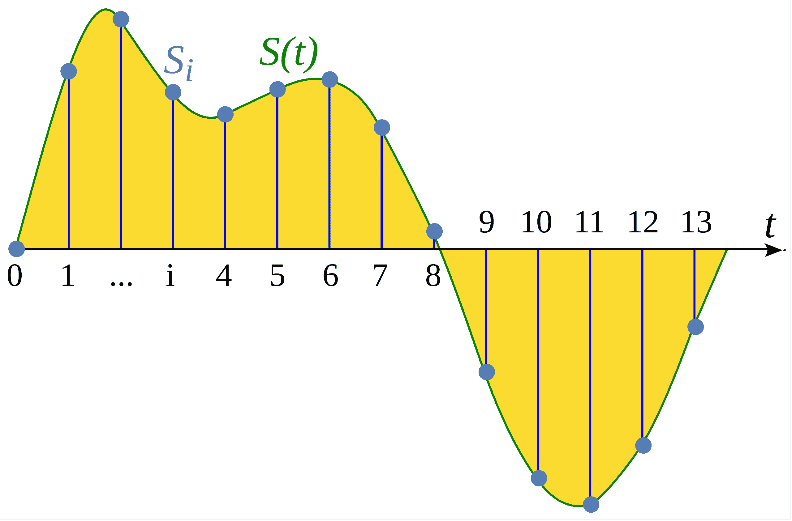
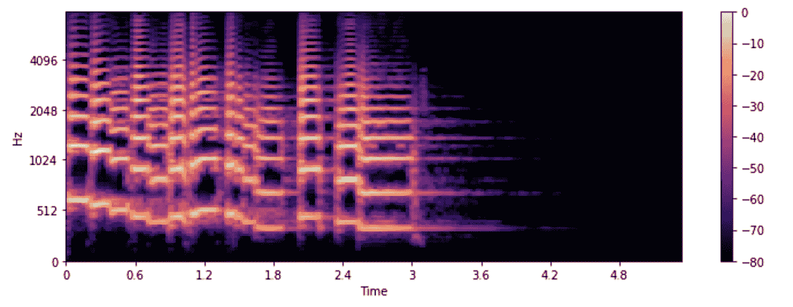

# 音频数据处理入门

> 原文：[`huggingface.co/learn/audio-course/zh-CN/chapter1/audio_data`](https://huggingface.co/learn/audio-course/zh-CN/chapter1/audio_data)

             

声波在本质上是一种连续信号，这意味着在一段给定时间内的声音信号有无数个取值。对于只能读取有限长数组的数字计算机来说，这是一个重要的问题。为了使得数字设备能够处理、储存和传送声波，我们需要将连续的声音信号转换为一个离散的序列。我们称之为数字化表示。

音频数据集里包含了许多音频段落的数字化文件，例如一段旁白或者一段音乐。你可能见过不同的文件格式，例如`.wav` (Waveform Audio File，音频波形文件)、 `.flac` (Free Lossless Audio Codec，免费无损音频编解码) 和 `.mp3` (MPEG-1 音频格式 3)。这些格式的主要区别在于他们的压缩方法不同。

下面我们来了解一下如何将连续的声音信号转换为这些数字化表示。原始的模拟信号首先被麦克风捕捉，并由声音信号转化为电信号。接下来，电信号会由模拟-数字转换器（模数转换器，Analog-to-Digital Converter, ADC）经由采样过程转换为数字化表示。

## 采样过程和采样率

采样是一种在固定的时间间隔上测量连续信号的数值的过程。采样过后的信号被称为*离散信号*，因为这些信号是在固定间隔上记录的有限长度信号。



*示意图取自维基百科词条: [Sampling (signal processing)](https://en.wikipedia.org/wiki/Sampling_(signal_processing)) [采样](https://zh.wikipedia.org/zh-cn/%E5%8F%96%E6%A8%A3)*

**采样率**（sampling rate，也叫采样频率，sampling frequency）指的是每一秒钟内测量信号数值的次数，单位为赫兹（Hz）。作为参照，CD 音质的音频一般采用 44100 赫兹的采样率，意味着每秒钟测量了 44100 次信号的数值。作为对比，高清（High-resolution）音频的采样率一般为 192000 赫兹，即 192 千赫兹。语音模型常用的采样率为 16,000 赫兹，即 16 千赫兹。

采样率决定了能够被捕捉的最高频率。采样率的二分之一被称为奈奎斯特极限，这是该采样率能够捕捉的最高频率。人耳可辨认的语音信号往往在 8 千赫兹以下，因此 16 千赫兹的采样率足够捕捉所有可听到的语音内容。使用更高的采样率并不能采集到更多的信息，并且往往会导致计算成本的增加。另一方面，过低的采样率会导致信息丢失。使用 8 千赫兹采样的音频会听起来很闷，因为该采样率无法捕捉更高频率的声音。

在处理音频任务时，切记要保证数据集中的所有数据都使用了相同的采样率。如果你计划使用自己的数据来对预训练模型进行微调，你自己的音频数据和预训练模型所使用的音频数据需要保持相同的采样率。采样率决定了相邻的音频采样点的间隔时间，同时也影响着音频数据的时间分辨率。设想这样一个例子：一段 5 秒长度，16000 赫兹采样率的音频等效于一个 40000 个数据点的序列。Transformer 模型会使用注意力机制来学习音频或多模态表征。由于序列的长度会根据音频采样率而变化，我们的模型很难对不同的采样率进行泛化学习。**重采样**过程可以匹配不同音频文件的采样率，是音频数据预处理过程的一部分。

## 幅值和位深度

采样率告诉了我们每个采样点之间的时间间隔，那么采样点的数值具体又是如何确定的呢？

声音本质上是人类可察觉范围内的气压的周期性波动。声音的**幅值**描述的是任意瞬间的气压大小，使用分贝（dB）作为单位。人类感知到的幅值强度称为响度。举个例子，正常的说话声音响度在 60 分贝以下；一场摇滚演出的响度大概在 125 分贝，几乎是人耳的极限。

在数字音频中，每个采样点都记录了某个时间点上的声波的幅值。采样点的**位深度**决定了采样点的数值可以有多少种变化，即采样的精度。位深度越大，数字化表示就可以越准确地记录下原始的连续声波。

最常见的音频位深度为 16 比特或 24 比特。比特是一个二进制单位，表示了声波的连续幅值被数字化后可以取值的范围：16 比特有 65,536 种可能的取值，而 24 比特有 16,777,216 种可能的取值。在这一量化过程中，原始的连续幅值被约减到最近的离散值上，因此量化过程会引入噪声。位深度越大，量化噪声则越小。在实际应用中，16 比特音频的量化噪声已达到了几乎不可辨别的程度，因此我们通常不会使用更大的位深度。

你也许听说过 32 比特音频。在这种设置下，采样点会被当作浮点数储存，而 16 比特或 24 比特则是将采样点作为整数储存。32 比特的浮点数所拥有的精度实际上也是 24 比特，与 24 比特音频相同。浮点数采样点的数值变化范围是[-1.0, 1.0]。由于机器学习模型在设计上也采用浮点数据，因此事实上任何音频文件在被输入进模型进行训练之前都需要转换为浮点数。在下一个章节音频数据预处理中我们会详细介绍这一过程。

与连续声音信号相同，数字音频信号的响度也通常使用分贝（dB）表示。这是由于人耳对于声音响度的感知是遵循对数关系的：我们的耳朵对于细微声音的微小扰动的敏感度大于对吵闹声音的微小扰动的敏感度。分贝也遵循这样的对数关系。现实世界中声音的分贝值是从 0 分贝开始计算的，0 分贝代表着人耳所能感知到的最小的声音，更大的声音则拥有更高的分贝值。然而在数字音频中，0 分贝代表着最大的幅值，并且任何更小的声音都有着负数的分贝值。一个简单的规则是，每-6 分贝会让幅值减半，而-60 分贝以下的声音基本是不可感知的，除非音量被调到很大。

## 音频的波形表示

你可能见过被可视化为**波形**的声音信号。在这种图表中，采样点随着时间变化的数值被标记在直角坐标系中。这也被称为声音的*时域*表示。

这种可视化表示方法可以很好地帮助我们辨别声音信号中的某些特征，例如某个声音时间发生的时间、音频的整体响度、以及音频中的非正常部分或者噪声部分。

我们可以使用`librosa`这一 Python 库来绘制音频信号的波形图：

```py
pip install librosa
```

我们可以使用库中自带的音频文件”trumpet”绘制示例图：

```py
import librosa

array, sampling_rate = librosa.load(librosa.ex("trumpet"))
```

这一示例音频文件以元组的形式被加载，第一个元素为音频的时间序列（我们命名为`array`），第二个元素为采样率（`sampling_rate`）。我们使用 librosa 的`waveshow()`函数来绘制该音频的波形图：

```py
import matplotlib.pyplot as plt
import librosa.display

plt.figure().set_figwidth(12)
librosa.display.waveshow(array, sr=sampling_rate)
```


该图中的 y 轴表示的是信号的幅值，x 轴则表示时间。换句话说，图中的每个点都代表着该音频对应的原始信号被采样的某一瞬间的取值。同时我们也注意到 librosa 返回的音频序列已经是浮点数的，并且幅值的范围在[-1.0, 1.0]之间。

除了直接聆听音频外，音频的可视化也可以帮助我们更好地理解我们的数据。你可以观察信号的形状、总结信号的规律、学习如何找出信号中的噪音和失真。如果你使用了归一化、重采样或者滤波等的信号预处理方法，你可以用可视化的方法来确认预处理后的信号是否符合你的预期。在完成模型训练之后，你也可以可视化模型出错的数据（例如在音频分类任务中被分到错误类别的样本）来找到模型中的错误。

## 频谱图

另一种音频可视化的方法则是绘制出音频信号的**频谱**（spectrum），也称为信号的**频域**（frequency domain）表示。频谱可以通过离散傅里叶变换（Discrete Fourier Transform， DFT）求得，它描述了音频信号中每个频率成分的强度。

我们可以使用 numpy 的`rfft()`函数来绘制前文提到的小号声音的频谱图。虽然我们也可以绘制整个音频文件的频谱，但绘制一小段音频片段的频谱会更加有用。这里我们使用整段音频的前 4096 个采样点计算 DFT，这差不多是第一个音符的长度：

```py
import numpy as np

dft_input = array[:4096]

# 计算 DFT
window = np.hanning(len(dft_input))
windowed_input = dft_input * window
dft = np.fft.rfft(windowed_input)

# 计算频谱的幅值，转换为分贝标度
amplitude = np.abs(dft)
amplitude_db = librosa.amplitude_to_db(amplitude, ref=np.max)

# 计算每个 DFT 分量对应的频率值
frequency = librosa.fft_frequencies(sr=sampling_rate, n_fft=len(dft_input))

plt.figure().set_figwidth(12)
plt.plot(frequency, amplitude_db)
plt.xlabel("Frequency (Hz)")
plt.ylabel("Amplitude (dB)")
plt.xscale("log")
```


这张图向我们展示了截取的音频片段中各个频率成分的强度。图中的 x 轴是频率的值，一般采用对数表示；y 轴则对于频率的幅值。

可以看到这张频谱图中有几个峰值。这些峰值对应着当前音符的泛音频率，且更高的泛音声音更小。可以看到首个峰对应的频率在 620 赫兹左右，这说明当前演奏的音符的音高是 E♭。

计算 DFT 所得到的频谱是由复数组成的序列，每个复数都包含了实部和虚部。我们可以使用`np.abs(dft)`来计算频谱的绝对值（又称模、幅值）。实部和虚部的夹角组成的序列也成为相位谱，但在机器学习应用中我们通常不关注这一部分。

我们使用了`librosa.amplitude_to_db()`函数将幅值转换为了分贝标度，方便我们观察频谱的细节。有时人们也使用测量能量而非幅值的**能量谱**（power spectrogram），其值为幅值的平方。

💡 在实践中，人们往往将快速傅里叶变换（Fast Fourier Transform, FFT）和离散傅里叶变换（Discrete Fourier Transform, DFT）这两个名词等价使用，这是因为 FFT 是在计算机中可以高效计算 DFT 的唯一方法。

音频信号的频谱和其波形所包含的信息其实完全相同，他们只是相同数据的不同表示方法（这里均表示该小号音频的前 4096 个样本）。两者的区别在于波形表示的是幅值随着时间的变化，而频谱表示的是各个频率成分在该时间段内的强度。

## 时频谱

我们能否用某种方法表示出频率成分随着时间的变化呢？在这段小号音频中，演奏者实际上吹奏了几个不同频率的音符。频谱的问题在于其只能表示一个短暂时间段内各个频率成分的总体幅值。这里的解决方法是我们可以进行多次的 DFT，每次 DFT 都覆盖一小段不同的时间段，然后再把所有的频谱堆叠起来，这样就构成了**时频谱**（spectrogram）。

时频谱表示了音频信号中各个频率成分随时间变化的过程。它可以让你在一张图中看到时间、频率和幅值的所有信息。计算时频谱的算法被成为短时傅里叶变换（Short Time Fourier Transform, STFT）。

时频谱是信息量最大的音频工具之一。举个例子，在分析音乐文件时，时频谱可以清晰地展示出各个乐器和人声在音乐整体中所占的部分。在语音文件中，你可以在时频谱里看到每个元音音节以及它们频率成分的差异。

我们使用 librosa 的`stft()`函数和`specshow()`函数来绘制同一段小号音频的时频谱图：

```py
import numpy as np

D = librosa.stft(array)
S_db = librosa.amplitude_to_db(np.abs(D), ref=np.max)

plt.figure().set_figwidth(12)
librosa.display.specshow(S_db, x_axis="time", y_axis="hz")
plt.colorbar()
```


该图中，x 轴表示的是和波形图中相同的时间，但 y 轴现在表示着不同的频率，以赫兹为单位。颜色的强度表示着当前时间点和频率的幅值强度，使用分贝（dB）标度。

时频谱的计算大概经过以下几个步骤：首先截取很短的音频片段（通常只有几毫秒），然后对每个片段计算其离散傅里叶变换（DFT）；获得所有片段的频谱之后，我们再将频谱延时间轴堆叠起来，这样就得到了我们的时频谱。时频谱图像的每个垂直切片都是一个单独的频谱图。`librosa.stft()`函数在默认条件下会把音频信号分割为 2048 个样本的许多切片，这一数字是在权衡了时频谱的频域分辨率和时域分辨率之后设置的。

由于时频谱和波形是同一信号的不同表示方法，我们也可以利用反向短时傅里叶变换（inverse STFT）将时频谱转换回原始的波形。然而，这一操作除了需要时频谱的强度谱之外，也需要时频谱的相位谱。目前的机器学习模型大多只能生成强度谱。这时我们可以使用一些相位重建（phase reconstruction）方法，包括传统的 Griffin-Lim 算法，或者使用一种被称为声码器（vocoder）的神经网络来从时频谱还原其波形。

时频谱的作用不仅在于音频的可视化。许多机器学习模型也会使用时频谱作为模型的输入和输出而不直接使用音频的波形。

现在我们了解了时频谱的原理和计算方法，我们来进一步学习一下在语音处理中常见的一种时频谱变体：梅尔时频谱。

## 梅尔时频谱

梅尔时频谱（简称梅尔谱）是一种在语音处理和机器学习中常用的时频谱变体。梅尔谱也和时频谱一样表示了频率成分随时间的变化，只是频率所在的轴不同。

在标准的时频谱中，频率所在的轴是赫兹的线性变化轴。然而，人类的听觉系统对于低频率声音的变化更敏感，对于高频率声音的变化则较不敏感。这一敏感度的变化是随频率的上升呈对数关系下降的。梅尔标度作为一种感知标度模拟了人耳对于频率的非线性感知。

为了生成信号的梅尔谱，我们首先使用和标准时频谱相同的短时傅里叶变换（STFT）将音频分割为许多短时片段，并计算每个片段的频谱。然后，我们将每个片段的频谱输入进梅尔滤波器组（mel filterbank），来将频率成分转换到梅尔标度。

下面我们使用 librosa 的`melspectrogram()`函数绘制梅尔谱图，该函数帮我们执行了上述的所有步骤：

```py
S = librosa.feature.melspectrogram(y=array, sr=sampling_rate, n_mels=128, fmax=8000)
S_dB = librosa.power_to_db(S, ref=np.max)

plt.figure().set_figwidth(12)
librosa.display.specshow(S_dB, x_axis="time", y_axis="mel", sr=sampling_rate, fmax=8000)
plt.colorbar()
```



在这段例子中，`n_mels`代表梅尔滤波器组中的滤波器个数。梅尔滤波器组会计算一组频率范围，这些频率范围会将整个频谱分割成许多部分。每个频率范围都对应滤波器组中的一个滤波器，滤波器的形状和间隔是模拟人耳对不同频率的感知差异而计算得出。常用的`n_mels`取值为 40 或 80。`fmax`则代表我们想选取的最大频率（以赫兹为单位）。

和标准频谱一样，我们也会将梅尔频率成分的强度转化为分贝标度。由于分贝的转化过程涉及到对数运算，转化后的梅尔谱通常被称为**对数梅尔时频谱**（log-mel spectrum）。在上面示例中，我们使用`librosa.power_to_db()`函数和`librosa.feature.melspectrogram()`来生成能量对数梅尔时频谱。

💡 梅尔视频谱间也有各种区别！有两种常用的 mel 计算标度（"htk" 和 "slaney"），此外还有能量谱和幅度谱的区别。对数梅尔谱的转换有时仅仅是简单计算`对数`而不会完整转化为分贝标度。因此，在使用以梅尔谱作为输入的机器学习模型时，我们建议你检查梅尔谱的计算过程是否完全一致。

由于梅尔谱的计算过程中需要对信号进行滤波，梅尔谱的计算是一个有损过程。将梅尔谱转化回波形比将标准时频谱转化回波形更加困难，因为我们需要估计在滤波过程中丢失的频率成分。这就是为何我们需要 HiFiGAN 声码器等机器学习模型来将梅尔谱转化回波形。

与标准时频谱相比，梅尔谱可以捕捉更多人类可感知的音频特征，因此梅尔谱也成为了在语音识别、说话人识别、音乐风格分类等任务中更常用的选择。

现在你已经学会如何可视化音频数据了，试着可视化看看你最喜欢的声音吧:)