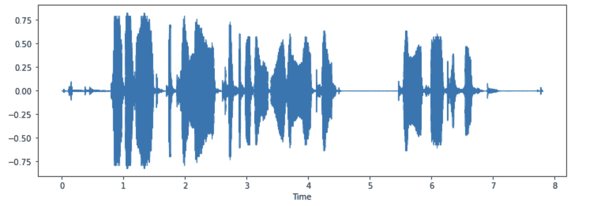

# 加载音频数据集

> 原文：[`huggingface.co/learn/audio-course/zh-CN/chapter1/load_and_explore`](https://huggingface.co/learn/audio-course/zh-CN/chapter1/load_and_explore)

            

本节中我们将会使用🤗 Datasets 来获取音频数据集。🤗 Datasets 是一个下载和准备数据集的开源工具，包含了音频在内的各种模态数据。该工具集为 Hugging Face Hub 上公开的机器学习数据集提供了易用的接口。此外，🤗 Datasets 还提供了专门为音频数据集而设的多种特性，帮助研究者和机器学习实践者更轻松地使用这些数据集。

首先，我们要确认已经安装了🤗 Datasets 库：

```py
pip install datasets[audio]
```

🤗 Datasets 的其中一个重磅功能是可以使用`load_dataset()`函数达到仅用一行代码下载和准备数据集。

这里我们来加载和探索[MINDS-14](https://huggingface.co/datasets/PolyAI/minds14)这一音频数据集。该数据集的内容是人们向某个网银系统提问的录音，包含了多种语言和方言。

为了加载 MINDS-14 数据集，我们需要复制该数据集在 Hugging Face Hub 上的 identifier（`PolyAI/minds14`），并向`load_dataset()`函数传入该参数。这里我们只选取该数据集的澳大利亚子集（`en-AU`）的训练分集：

```py
from datasets import load_dataset

minds = load_dataset("PolyAI/minds14", name="en-AU", split="train")
minds
```

**输出：**

```py
Dataset(
    {
 features: [
            "path",
            "audio",
            "transcription",
            "english_transcription",
            "intent_class",
            "lang_id",
        ],
 num_rows: 654,
    }
)
```

该数据集包含了 654 个音频文件，每个都有对应的转录文字和其英语翻译，以及一个代表询问人目的的标签。“audio”列则包含了原始的音频数据。我们来仔细看看其中的一个样本：

```py
example = minds[0]
example
```

**输出**

```py
{
    "path": "/root/.cache/huggingface/datasets/downloads/extracted/f14948e0e84be638dd7943ac36518a4cf3324e8b7aa331c5ab11541518e9368c/en-AU~PAY_BILL/response_4.wav",
    "audio": {
        "path": "/root/.cache/huggingface/datasets/downloads/extracted/f14948e0e84be638dd7943ac36518a4cf3324e8b7aa331c5ab11541518e9368c/en-AU~PAY_BILL/response_4.wav",
        "array": array(
            [0.0, 0.00024414, -0.00024414, ..., -0.00024414, 0.00024414, 0.0012207],
            dtype=float32,
        ),
        "sampling_rate": 8000,
    },
    "transcription": "I would like to pay my electricity bill using my card can you please assist",
    "english_transcription": "I would like to pay my electricity bill using my card can you please assist",
    "intent_class": 13,
    "lang_id": 2,
}
```

你可能注意到了”audio”列包含了好几个特征，它们分别是：

*   `path`：音频文件的路径（这里为`*.wav`）。
*   `array`：解码后的音频文件，以 1 维 NumPy 数组表示。
*   `sampling_rate`：音频文件的采样率（该样本为 8000 赫兹）。

`intent_class`则是分类的具体类别。我们可以使用`int2str()`方法将该数字转换为有意义的字符串：

```py
id2label = minds.features["intent_class"].int2str
id2label(example["intent_class"])
```

**输出：**

```py
"pay_bill"
```

在该样本的转录文字中，我们可以看到该音频的内容确实是某人在提一个关于账单的问题。

如果你只是想用该子集训练一个音频分类器，你可能不需要使用所有的特征。举个例子，`lang_id`标签在该子集中全部为同样的值；`english_transcription`标签和`transcription`几乎完全含有相同的内容，因此我们也可以舍弃该标签。

你可以使用🤗 Datasets 的`remove_columns()`方法轻松地移除所有不相关的标签：

```py
columns_to_remove = ["lang_id", "english_transcription"]
minds = minds.remove_columns(columns_to_remove)
minds
```

**输出：**

```py
Dataset({features: ["path", "audio", "transcription", "intent_class"], num_rows: 654})
```

现在我们已经加载并检验了数据集的原始内容，让我们来听几个例子吧！我们可以使用`Gradio`中的`Blocks`功能和`Audio`功能从数据集中解码几个样本：

```py
import gradio as gr

def generate_audio():
    example = minds.shuffle()[0]
    audio = example["audio"]
    return (
        audio["sampling_rate"],
        audio["array"],
    ), id2label(example["intent_class"])

with gr.Blocks() as demo:
    with gr.Column():
        for _ in range(4):
            audio, label = generate_audio()
            output = gr.Audio(audio, label=label)

demo.launch(debug=True)
```

你也可以可视化你想要的样本。这里我们试着绘制第一个样本的波形图：

```py
import librosa
import matplotlib.pyplot as plt
import librosa.display

array = example["audio"]["array"]
sampling_rate = example["audio"]["sampling_rate"]

plt.figure().set_figwidth(12)
librosa.display.waveshow(array, sr=sampling_rate)
```



动手试试吧！试着下载 MINDS-14 数据集中其他语言或方言的子集，聆听并可视化其中的一些样本，感受整个数据集的多样性。你可以在[这里](https://huggingface.co/datasets/PolyAI/minds14)找到语言和方言的全部列表（仅英文）。