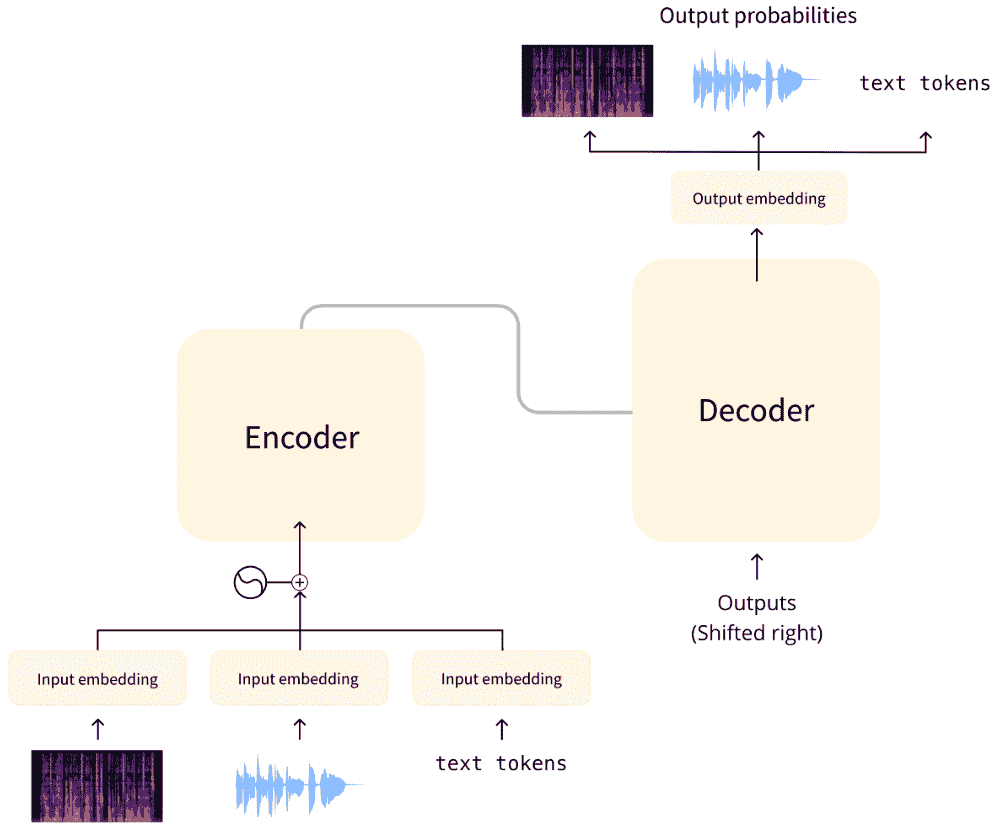
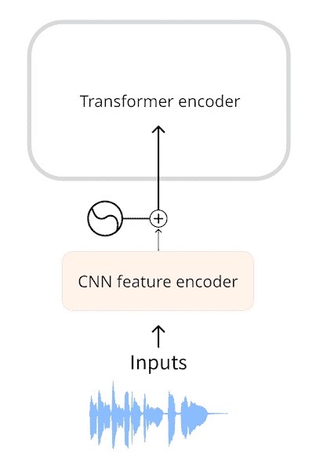
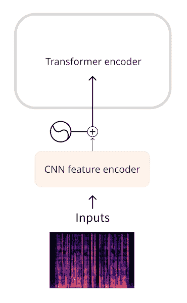
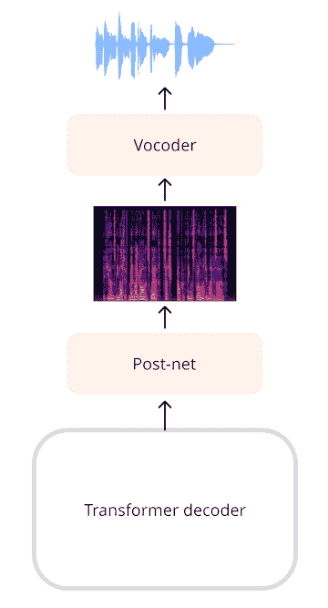

# 第 3 单元：音频 Transformer 架构

> 原文：[`huggingface.co/learn/audio-course/zh-CN/chapter3/introduction`](https://huggingface.co/learn/audio-course/zh-CN/chapter3/introduction)

            

本课程中，我们主要关注 Transformer 模型以及它们如何应用于音频任务。虽然您不需要了解这些模型的内部细节，但了解使它们工作的主要概念很有用，因此我们在本小节中回顾一下关于 Transformer 的知识。有关 transformer 的深入了解，请查看我们的[NLP 课程](https://huggingface.co/course/chapter1/1)。

## Transformer 的原理是什么？

Transformer 架构最早是为文本翻译的任务而设计的。它的结构如下：

左边是**编码器**（encoder），右边是**解码器**（decoder）。

*   编码器负责接收模型的输入，本例中是一系列文本标记(toen)，并构建其表征（representation，或称特征，feature）。Transformer 模型的编码器在经过训练后能够从输入中提取并理解信息。

*   解码器负责使用编码器生成的表征（特征向量）以及其他输入（先前预测的标记）来生成目标序列。Transformer 模型的解码器在经过训练能够根据表征中蕴含的信息生成输出序列。在原始设计中，输出序列由文本标记组成。

有的 Transformer 模型只使用编码器（适用于需要理解输入的任务，例如分类），或者只使用解码器（适用于生成文本的任务）。BERT 就是一个只使用编码器的例子；GPT2 则是一个只使用解码器的例子。

Transformer 模型的一个关键特征是它们使用特殊的层，称为**注意力层**（attention layers）。这些层告诉模型在计算特征表示时，特别关注输入序列中的某些元素，而忽略其他元素。

## 使用 Transformer 进行音频处理

本课程中，我们将介绍的音频模型通常具有上图所示的标准 Transformer 架构，但会在输入或输出端稍作修改来适应音频而非文本序列。由于所有这些模型本质上都是 Transformer，因此它们的大部分架构都是相同的，主要区别在于它们的训练和使用方式。

对于音频任务，输入和/或输出序列可以是音频而非文本：

*   自动语音识别（ASR）：输入为语音，输出为文本。
*   文本到语音（TTS）：输入为文本，输出为语音。
*   语音分类：输入为语音，输出为类别概率——对于序列中的每个元素，或者对于整个序列的单个类别概率。
*   语音转换或语音增强：输入和输出均为语音。

有几种不同的方法可以将音频数据转换为 Transformer 能够处理的格式。主要的区别在于是使用音频的原始波形作为模型的输入序列，还是使用其时频谱作为输入序列。

## 模型的输入格式

音频模型的输入可以是文本或声音。我们的目标是将此输入转换为一个嵌入向量（embedding vector），以便 Transformer 架构可以处理。

### 文本输入

文本到语音模型（TTS）接受文本作为输入。这与原始 Transformer 或任何其他 NLP 模型的工作方式相同：首先对文本进行标记化（tokenization），得到一系列文本标记。然后将此序列通过输入嵌入层，将标记转换为 512 维向量。然后将这些嵌入向量传递到 Transformer 编码器中。

### 波形输入

自动语音识别模型（ASR）接受语音作为输入。为了使用 Transformer 解决 ASR 任务，我们首先需要以某种方式将音频转换为嵌入向量序列。

**Wav2Vec2**和**HuBERT**一类的模型直接使用音频波形作为模型的输入。如您在音频数据章节中所见，波形是一个浮点数序列，其中的每个数表示某个时间点的幅值。我们首先将原始波形标准化为零均值和单位方差的序列，这有助于标准化不同音量（振幅）的音频样本。

完成标准化后，我们将该波形序列被转换为嵌入向量序列。这是通过一个小型卷积神经网络（CNN）完成的，称为**特征编码器**（feature encoder）。该网络的每个卷积层都处理输入序列，对音频进行下采样（subsampling）以减少序列长度，直到最后一个卷积层输出 512 维向量，即每 25 毫秒音频的嵌入向量（embedding vector）。当输入序列被转换为这样的嵌入向量序列（embedding vector sequence）后，Transformer 便可以像往常一样处理数据了。

### 时频谱输入

使用原始波形作为输入的一个缺点是它们往往具有较长的序列长度。例如，采样率为 16 kHz 的 30 秒音频输入的长度为`30 * 16000 = 480000`。长的序列需要在 Transformer 模型中进行更多的计算，因此会增加内存使用量。

因此，我们认为在大多数情况下原始音频并不是最有效率的表示音频输入的方式。通过使用**时频谱**（spectrogram），我们可以以更紧凑的形式表示相同数量的信息。

**Whisper**等模型首先将波形转换为一个对数梅尔频谱图（log-mel spectrogram）。Whisper 会将音频分成数个 30 秒的片段，每个片段的对数梅尔频谱图的形状为`(80, 3000)`，其中 80 是梅尔频率的数量，3000 是序列的长度。通过将音频转换为对数梅尔频谱图，我们不仅减少了输入数据的数量，而且更重要的是，转换后的序列长度远远小于波形的长度。。最后，对数梅尔频谱图由一个小型 CNN 处理，转换为嵌入向量序列，然后像往常一样输入 Transformer。

无论是波形还是时频谱输入，我们都会先使用一个小型的神经网络在 Transformer 之前将输入转换为嵌入向量序列，然后由 Transformer 接管并完成其工作。

## 模型的输出格式

Transformer 架构会输出一个隐藏状态向量（hidden-state vectors）的序列，也称为输出嵌入向量（output embedding）。我们的目标是将这些向量转换为文本或音频输出。

### 文本输出

自动语音识别模型的目标是预测一个文本标记（text token）的序列。这是通过在 Transformer 的输出上添加一个语言建模（language modeling）头——通常是一个单独的线性层———然后在 transformer 的输出上添加一个 softmax 来完成的。该输出预测的是词汇表中文本标记的概率。

### 时频谱输出

对于生成音频的模型，例如文本到语音（TTS）模型，我们需要添加能够生成音频序列的层。通常会生成一个频谱图，然后使用另一个神经网络（称为**声码器**（vocoder））将该频谱图转换为波形。

举个例子，**SpeechT5** TTS 模型的输出是一个 768 元素向量的序列。线性层将该序列投影到一个对数梅尔频谱图上。然后，一个由线性层和卷积层组成的后处理网络（post-net）会对频谱图进行降噪处理。最后，我们使用声码器生成输出的音频波形。

💡如果我们对波形进行短时傅里叶变换（STFT）得到其时频谱，我们可以通过其逆向过程（ISTFT）重新得到原始的波形。这是因为 STFT 生成的时频谱包含了幅值和相位两部分的信息，而这两部分信息都是重建波形所必需的。然而，音频深度学习模型所生成的时频谱往往仅包含了幅值信息。为了将这样的时频谱转化为波形，我们需要通过某种方式估计其相位信息，这便是声码器的功能。

### 波形输出

除了生成时频谱作为中间输出的方法外，有些模型也可以直接生成波形输出。但是，目前🤗 Transformers 中没有包含能够直接生成波形的模型。

## 小节

总结一下：大多数音频 Transformer 模型都是相似的——它们都是基于相同的 Transformer 架构和注意力层构建的。不过，有些模型只使用 Transformer 的编码器部分，而有些模型则同时使用编码器和解码器。

我们也学习了如何在 Transformer 模型中将音频作为输入或者输出。在 ASR、TTS 等音频任务中，我们可以改变模型中的部分输入层来将数据转换为嵌入向量序列，也可以改变一部分输出层来将生成的嵌入向量序列转化为输出格式，而 Transformer 的主体部分保持不变。

接下来，我们将学习几种不同的训练方法来训练一个自动语音识别模型。