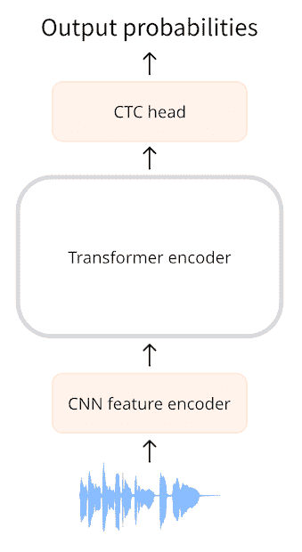

# CTC 结构

> 原文：[`huggingface.co/learn/audio-course/zh-CN/chapter3/ctc`](https://huggingface.co/learn/audio-course/zh-CN/chapter3/ctc)

             

CTC 结构（Connectionist Temporal Classification）是一种仅使用 Transformer 编码器（encoder）结构的语音识别（ASR）模型。使用该架构的模型包括 Wav2Vec2、HuBERT、M-CTC-T 等等。

仅含编码器的 Transformer（encoder-only Transformer）是最简单的 Transformer，因为它只使用模型的编码器部分。编码器读取输入序列（音频波形）并将其映射到隐藏状态序列（sequence of hidden-states），也称为输出嵌入（output embedding）。

使用 CTC 模型时，我们对隐藏状态序列进行额外的线性映射以获得类标签预测。类标签为**字母表中的字母**（a、b、c，…）。这样，我们就能够使用一个很小的分类头来预测目标语言中的任何单词，因为词汇表（vocabulary）只需要包含 26 个字符加上一些特殊的标记。



到目前为止，这与我们在 NLP 中使用 BERT 模型的做法非常相似：仅编码器的 Transformer 模型将文本标记映射到一系列编码器隐藏状态，然后我们应用线性映射，为每个隐藏状态预测一个类标签。

棘手的问题在于：在语音识别中，我们不知道音频输入和文本输出的**对齐方式**（alignment）。我们知道语音的顺序与文本的转录顺序相同（对齐是单调的），但我们不知道转录文本中的字符如何与音频对齐。这就是 CTC 算法的用武之地。

💡 在 NLP 模型中，词汇表（vocabulary，也称字典）通常由数千个标记组成，这些标记不仅描述单个字符，还描述单词的部分甚至整个单词。然而对于 CTC 模型，较小的词汇表效果最好，我们一般会将其保持在 50 个字符以下。我们不关心字母的大小写，因此仅使用大写（或仅使用小写）就足够了。数字则被拼写为单词，例如`"20"`变成`"twenty"`。除了字母，我们还需要至少一个单词分隔符标记（空格，space）和一个填充标记（padding token）。与 NLP 模型一样，填充标记允许我们将多个示例组合成批次，但它也是模型将预测的沉默标记。在英语中，保留`'`字符也很有用——毕竟，`"it's"`和`"its"`的含义完全不同。

## 我们到底该怎么对齐呢？

自动语音识别（ASR）涉及将音频作为输入并产生文本作为输出。我们有几种选择来预测文本：

*   预测单个字母
*   预测音素（phoneme）
*   预测单词标记（word token）

ASR 模型会使用含有`(音频, 文字)`对的数据集进行训练，这些数据集的文字信息通常是人工转录的。通常，数据集不包含任何时间信息，也就是说，我们不知道输入和输出序列应该如何对齐。

假设我们有一个长度为一秒钟的音频文件。在**Wav2Vec2**中，模型首先使用 CNN 特征编码器对音频输入进行下采样，将其映射到较短的隐藏状态序列，其中每 20 毫秒的音频会对应一个隐藏状态向量（hidden-states vector）。对于一秒的音频，我们将生成的隐藏状态序列传递给 Transformer 编码器。 （从输入序列中提取的音频片段会有部分重叠，因此即使每 20 毫秒会生成一个隐藏状态向量，但每个向量实际上包含了 25 毫秒的音频信息。）

Transformer 的编码器会对每个隐藏状态向量产生一个输出预测，因此我们从 Transformer 中得到一个长度同样为 50 的输出向量序列。该序列中的每个向量的维度为 768\. 因此，该示例中 Transformer 编码器的输出序列的形状为`(768, 50)`。每个预测值包含了 25 毫秒的音频信息，而音素（phoneme）通常会持续超过 25 毫秒。因此，我们这里预测音素的效果会好于预测整个单词。CTC 在小词汇表上的效果更好，因此我们将预测字母。


为了进行文本预测，我们使用一个线性层（“CTC 头”）将 768 维的编码器输出映射到我们的字符标签。然后，模型会预测一个`(50, 32)`的张量，其中 32 是词汇表中的标记数。由于我们对序列中的每个特征都进行了一次预测，因此每秒音频会有 50 个字符预测。

然而，如果我们简单地每 20 毫秒预测一个字母，我们的预测结果可能会是这样的：

```py
BRIIONSAWWSOMEETHINGCLOSETOPANICONHHISOPPONENT'SSFAACEWHENTHEMANNFINALLLYRREECOGGNNIIZEDHHISSERRRRORR ...
```

仔细观察这个输出，我们可以发现它看起来有一点像英语，但有很多重复的字母。这是因为我们的模型*必须*每 20 毫秒都输出一些东西，而如果某个字母的持续时间超过了 20 毫秒，模型就会输出重复的字母。我们无法避免这种情况，特别是在训练时我们不知道转录文本的时间信息。而 CTC 就是一个帮助我们过滤重复字母的方法。

（在实际操作中，预测的序列还有可能包含很多填充标记（padding token），用于表示模型不太确定音频表示的是什么，或者用于表示字符之间的空白。为了清晰起见，我们从示例中删除了这些填充标记。音频片段之间的部分重叠也是字符重复的另一个原因。）

## CTC 算法

CTC 算法的关键在于使用一个特殊的标记，通常称为**空白标记**（blank token）。这是一个我们人为加入词汇表的额外标记。在这个例子中，空白标记被表示为`_`。我们用这个特殊的标记来表示字母组之间的硬边界。

CTC 模型的完整输出类似于如下的序列：

```py
B_R_II_O_N_||_S_AWW_|||||_S_OMEE_TH_ING_||_C_L_O_S_E||TO|_P_A_N_I_C_||_ON||HHI_S||_OP_P_O_N_EN_T_'SS||_F_AA_C_E||_W_H_EN||THE||M_A_NN_||||_F_I_N_AL_LL_Y||||_RREE_C_O_GG_NN_II_Z_ED|||HHISS|||_ER_RRR_ORR||||
```

该序列中的`|`标记是单词分隔符。在这个例子中，我们使用`|`而不是空格作为单词分隔符，这样可以更容易地看出单词的分隔位置，但它们的作用是一样的。

CTC 空白标记使我们能够过滤掉重复的字母。例如预测序列中的最后一个单词，`_ER_RRR_ORR`。如果没有 CTC 空白标记，这个单词看起来是这样的：

```py
ERRRRORR
```

如果我们简单地去掉非 CTC 结果中的重复字符，那么它就变成了`EROR`。显然这不是正确的拼写。但是有了 CTC 空白标记，我们就可以在每个字母组中去掉重复的字母：

```py
_ER_RRR_ORR
```

变为：

```py
_ER_R_OR
```

最后我们去掉空白标记`_`，得到最终的单词：

```py
ERROR
```

如果我们将这种逻辑应用到整个文本，包括`|`，并将剩余的`|`字符替换为空格，那么最终的 CTC 解码输出会变成：

```py
BRION SAW SOMETHING CLOSE TO PANIC ON HIS OPPONENT'S FACE WHEN THE MAN FINALLY RECOGNIZED HIS ERROR
```

总结一下，CTC 模型对应每 20 毫秒的输入音频（包括部分重叠）会生成一个预测标记。这样的预测规则会生成很多重复的字母。利用 CTC 空白标记，我们可以轻松地移除这些重复的字母，而不会破坏单词的正确拼写。这是一种非常简单和方便的方法，可以解决输出文本与输入音频的对齐问题。

💡 在实际的 Wav2Vec2 模型中，CTC 空白标记与填充标记`<pad data-svelte-h="svelte-1mdjn99">`是相同的。模型会预测很多这样的`<pad>`标记，例如当当前 20 毫秒的音频没有明确的字符可以预测时。使用相同的标记作为填充和 CTC 空白标记可以简化解码算法，并有助于保持词汇表的小规模。</pad></pad>

我们可以在 Transomer 编码模型简单地加入 CTC：将编码器的输出序列进入一个线性层，该线性层将音频特征映射到词汇表。模型使用特殊的 CTC 损失进行训练。

CTC 的一个缺点在于，它可能会输出*听起来*正确但*拼写*不正确的单词。毕竟，CTC 分类头只考虑了单个字符，而没有处理整个单词。我们可以使用额外的语言模型来提高音频的转录质量。这个语言模型实际上是作为了 CTC 输出的拼写检查器。

## Wav2Vec2, HuBERT, M-CTC-T 等模型有什么区别？

所有基于 Transformer 的 CTC 模型的架构都非常相似：它们都使用 Transformer 编码器（但不使用解码器），并在最后使用一个 CTC 分类头。从架构上来说，它们的相似程度大于他们的不同程度。

Wav2Vec2 和 M-CTC-T 之间的一个区别在于，前者使用原始音频波形，而后者使用梅尔时频谱（mel spectrogram）作为输入。这些模型还是为不同的目的而训练的。例如，M-CTC-T 是为多语言语音识别而训练的，因此它的 CTC 头相对较大，包含了中文字符以及其他字母。

Wav2Vec2 和 HuBERT 使用了完全相同的架构，但训练方式有很大的区别。Wav2Vec2 的训练方式类似于 BERT 的掩码语言模型（masked language modeling），通过预测音频中被遮盖（mask）的音素来进行预训练。HuBERT 则更进一步，学习预测“离散语音单元”（discrete speech unit），这类似于文本句子中的标记，因此可以使用已有的 NLP 技术来处理语音。

最后，我们在这里介绍的模型并非全部的 Transformer CTC 模型。还有很多其他的模型，但现在我们知道他们都使用了类似的原理。