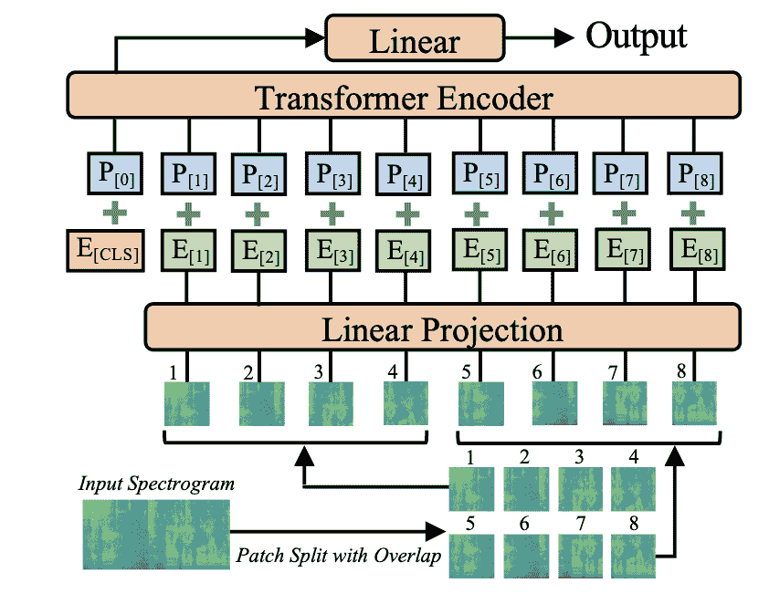

# 音频分类结构

> 原文：[`huggingface.co/learn/audio-course/zh-CN/chapter3/classification`](https://huggingface.co/learn/audio-course/zh-CN/chapter3/classification)

            

音频分类任务的目标是预测音频输出的分类标签。分类模型可以为整个输入序列预测一个标签，也可以为每一帧预测一个不同的标签。在分帧预测时，模型通常为每 20 毫秒的输入音频预测一个标签，并生成一个由分类标签概率分布组成的序列。预测单一标签的例子如预测音频中发出声音的鸟的种类；预测分帧标签的例子如说话人识别，每帧都可能由不同的说话人在发出声音。

## 使用时频谱进行分类

最简单的音频分类方法之一是将其视为一个图像分类问题！

回想一下，时频谱是一个形状为`（频率，序列长度）`的二维张量。在音频数据章节中，我们学习过将这些时频谱绘制为图像。没错，我们可以直接将时频谱视为图像，并将其传递给一个常见的 CNN 分类器模型，如 ResNet，并获得非常好的预测结果。更好的是，也可以使用图像 Transformer 模型，如 ViT。

这就是**AST**（Audio Spectrogram Transformer）的作用。它使用 ViT（即 Vision Transformer）模型，并使用时频谱而非常规图像作为输入。由于 Transformer 的自注意层，该模型能够比 CNN 更好地捕获全局上下文。

与 ViT 一样，AST 模型将音频时频谱分成 16×16 像素的部分重叠的图像块（image patch）序列。然后，我们将此序列中的块投影到嵌入序列中，并像往常一样将其作为输入传递给 Transformer 编码器。AST 是一个仅含编码器的 Transformer 模型，因此输出是一个隐藏状态序列，每个 16×16 输入块对应一个隐藏状态。最后是一个含有 sigmoid 激活函数的简单分类层，将隐藏状态映射为分类概率。

图像来自论文[AST: Audio Spectrogram Transformer](https://arxiv.org/pdf/2104.01778.pdf)

💡 尽管在这里我们假装时频谱与图像相同，但它们之间其实有重要的区别。例如，将图像的内容上下平移通常不会改变图像中的内容的含义。然而，将时频谱上下平移将改变声音中的频率，并完全改变其特性。图像具有一定的上下和左右平移不变性（shift-invariance），但时频谱仅具有一定的左右平移不变性，而几乎完全不具有上下平移不变性。尽管在实践中，将时频谱视为图像可以得到很好的效果，但请记住它们在原理上完全不同。

## 任何 Transformer 都可以是分类器

在 CTC 一节中，我们了解到 CTC 是一种使用仅含编码器的 Transformer 来执行自动语音识别的有效技术。CTC 模型实际上已经可以被视为分类器，因为其预测的是词汇表中每个词素的概率。我们可以通过更改标签并使用常规的交叉熵损失函数代替特殊的 CTC 损失来将 CTC 模型转换为通用的音频分类器。

举个例子，HF Transformers 库中包含了`Wav2Vec2ForCTC`模型，但提供了`Wav2Vec2ForSequenceClassification`和`Wav2Vec2ForAudioFrameClassification`。这些模型之间的唯一区别是分类层的大小和所使用的损失函数。

实际上，任何仅含编码器的音频 Transformer 模型都可以通过在隐藏状态序列之上添加分类层来转换为音频分类器。分类任务通常不需要 Transformer 解码器。

如果需要对整个序列输出一个单独的分类标签（`Wav2Vec2ForSequenceClassification`），模型会对隐藏状态序列沿其长度取平均值，并将其输送到分类层。这样我们就可以对整个序列输出一个概率分布，而不是输出序列中每个元素的概率分布。

如果需要对每一帧输出一个分类标签（`Wav2Vec2ForAudioFrameClassification`），我们就让分类器对隐藏状态序列中的每个元素都输出一个概率分布，这样我们的输出会成为一个具有同样长度的概率分布序列。