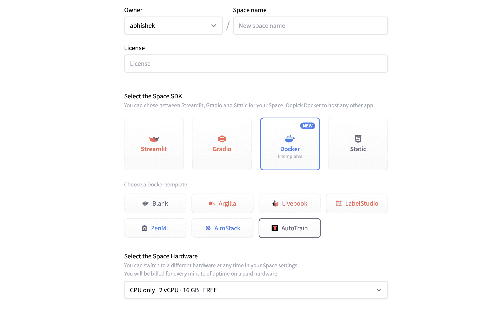
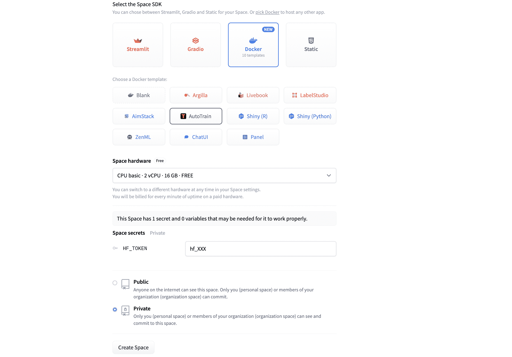
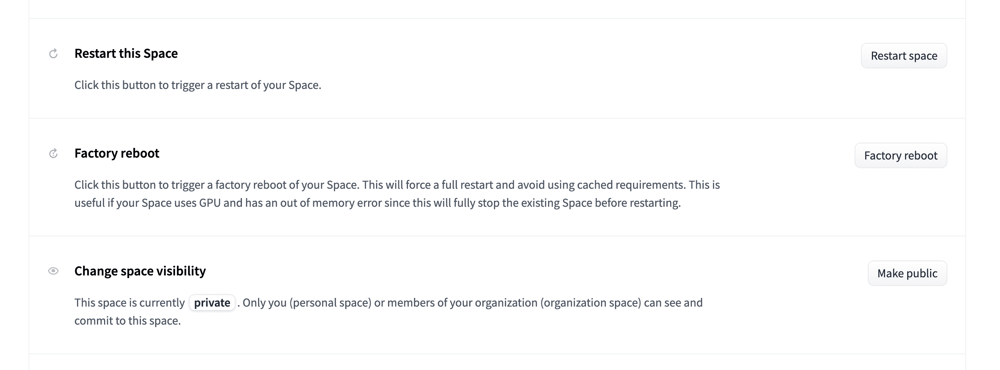
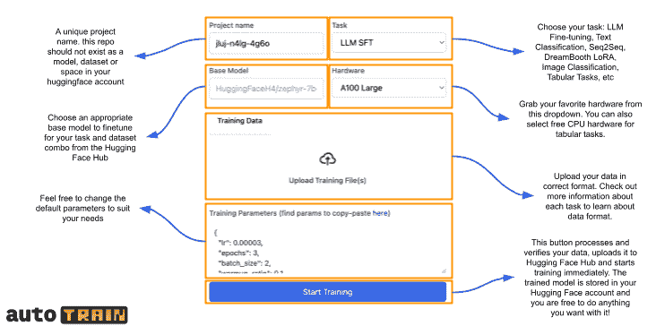

# 安装

> 原文链接：[`huggingface.co/docs/autotrain/getting_started`](https://huggingface.co/docs/autotrain/getting_started)

无需安装！AutoTrain Advanced 在 Hugging Face Spaces 上运行。您只需要使用 AutoTrain Advanced 模板创建一个新空间：[`huggingface.co/new-space?template=autotrain-projects/autotrain-advanced`](https://huggingface.co/new-space?template=autotrain-projects/autotrain-advanced)。请确保将空间保持私密。

一旦您选择了 Docker > AutoTrain 模板和适当的硬件，您可以点击“创建空间”，然后将被重定向到您的新空间。

请确保使用写入令牌并将空间保持私密以防止未经授权的访问。

# 更新 AutoTrain Advanced 到最新版本

我们不断为 AutoTrain Advanced 添加新功能和任务。在开始新项目之前，更新您的空间到最新版本总是一个好主意。最新版本的 AutoTrain Advanced 将具有最新的任务、功能和错误修复！更新只需在空间设置页面点击“工厂重启”按钮即可。

请注意，“重新启动”空间不会将其更新到最新版本。您需要“工厂重启”空间才能将其更新到最新版本。

现在我们已经准备好了，可以开始我们的第一个项目！

# 理解用户界面

