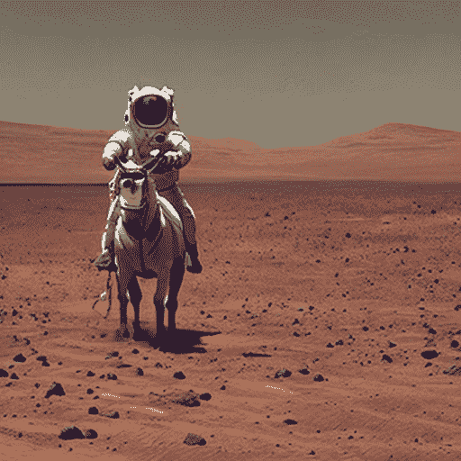
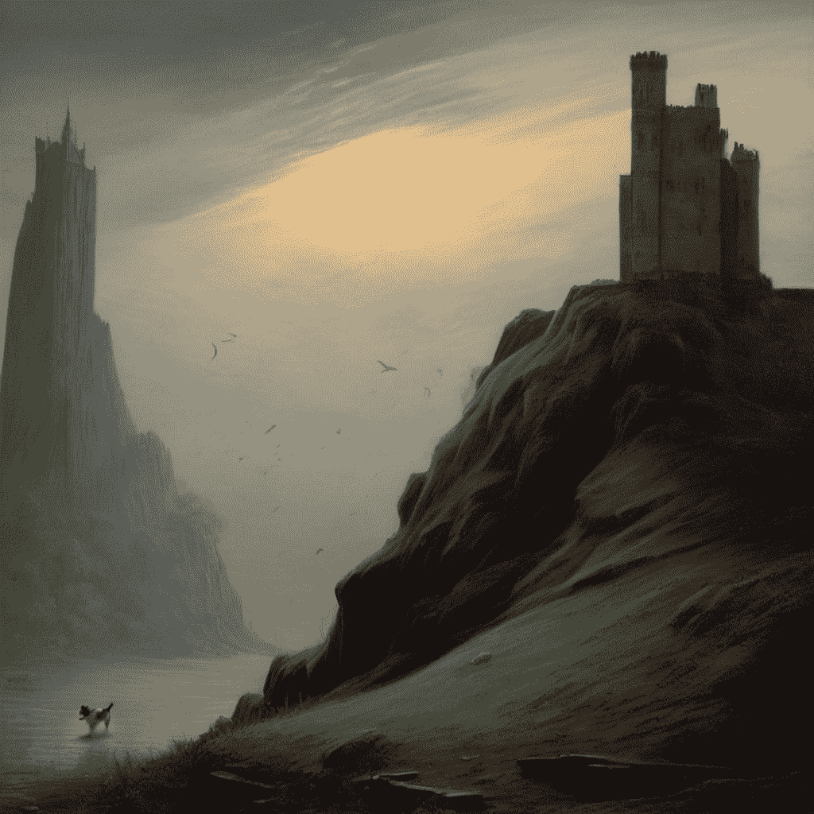
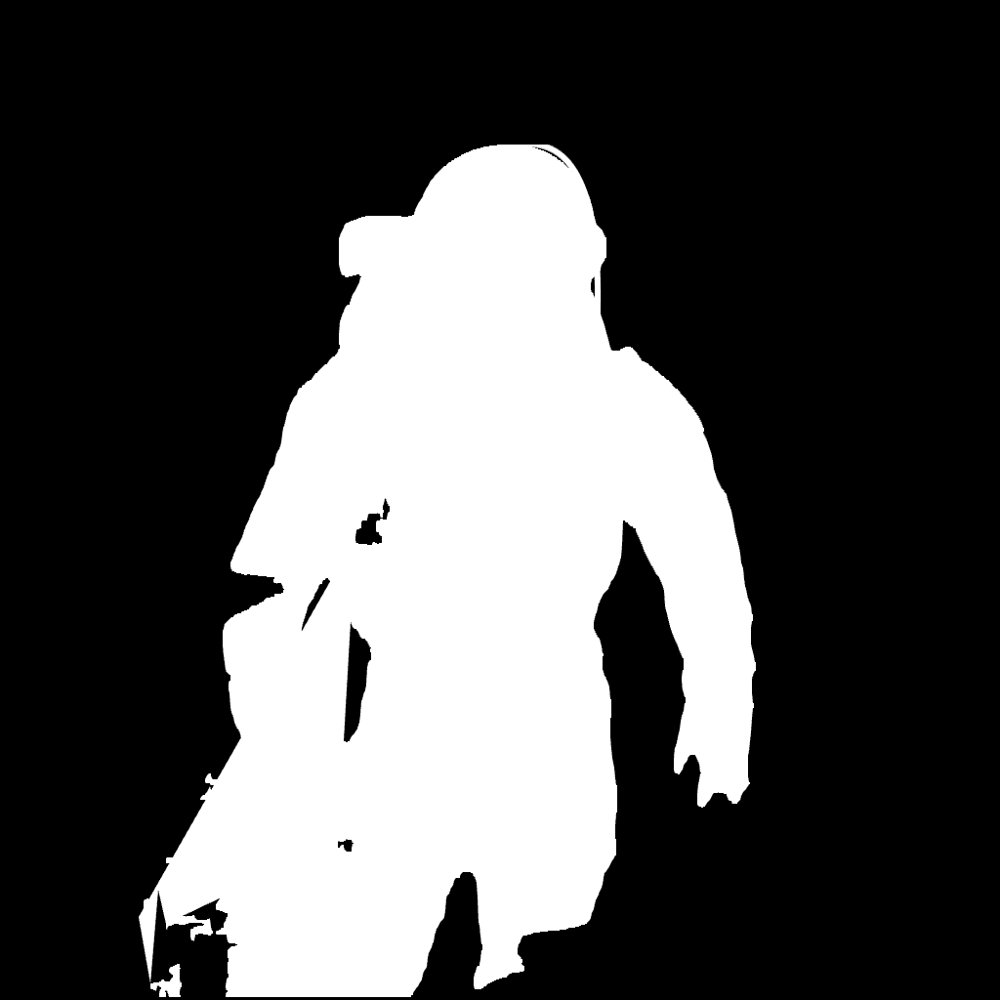
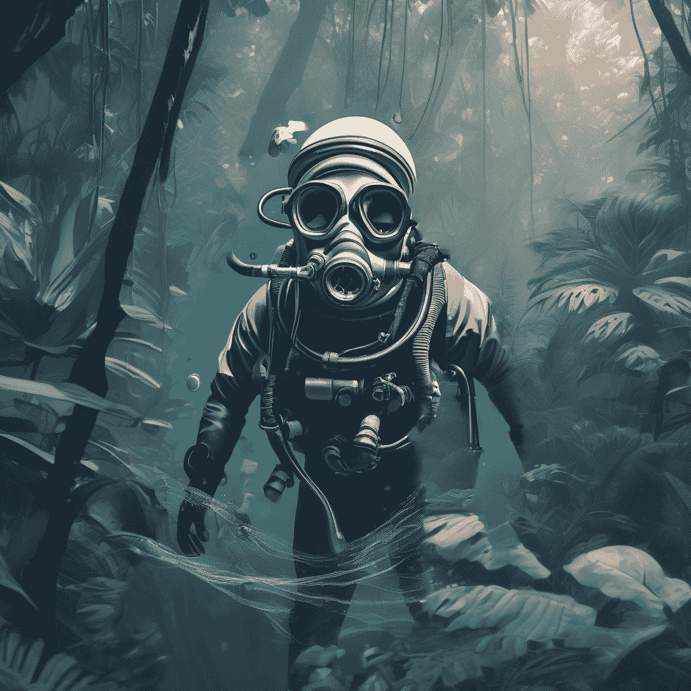

# 在 AWS Inferentia 上使用稳定扩散模型生成图像

> 原始文本：[`huggingface.co/docs/optimum-neuron/tutorials/stable_diffusion`](https://huggingface.co/docs/optimum-neuron/tutorials/stable_diffusion)

## 稳定扩散

*该教程有笔记本版本 [在这里](https://github.com/huggingface/optimum-neuron/blob/main/notebooks/stable-diffusion/stable-diffusion-txt2img.ipynb)*。

🤗 `Optimum` 扩展了 `Diffusers` 以支持第二代 Neuron 设备（驱动 Trainium 和 Inferentia 2）上的推理。它旨在继承 Neuron 上 Diffusers 的易用性。

要开始，请确保您已经配置了您的 inf2 / trn1 实例，并安装了 optimum：

```py
pip install "optimum[neuronx, diffusers]"
```

### 编译稳定扩散

要部署模型，您需要将它们编译为针对 AWS Neuron 优化的 TorchScript。在稳定扩散的情况下，有四个组件需要导出到 `.neuron` 格式以提高性能：

+   文本编码器

+   U-Net

+   VAE 编码器

+   VAE 解码器

您可以通过 CLI 或 `NeuronStableDiffusionPipeline` 类编译和导出稳定扩散检查点。

***通过 CLI 导出***

以下是使用 `Optimum` CLI 导出稳定扩散组件的示例：

```py
optimum-cli export neuron --model stabilityai/stable-diffusion-2-1-base \
  --task stable-diffusion \
  --batch_size 1 \
  --height 512 `# height in pixels of generated image, eg. 512, 768` \
  --width 512 `# width in pixels of generated image, eg. 512, 768` \
  --num_images_per_prompt 4 `# number of images to generate per prompt, defaults to 1` \
  --auto_cast matmul `# cast only matrix multiplication operations` \
  --auto_cast_type bf16 `# cast operations from FP32 to BF16` \
  sd_neuron/
```

我们建议使用 `inf2.8xlarge` 或更大的实例来进行模型编译。您也可以在仅 CPU 实例上使用 Optimum CLI 编译模型（需要约 35 GB 内存），然后在 `inf2.xlarge` 上运行预编译的模型以减少费用。在这种情况下，不要忘记通过添加 `--disable-validation` 参数来禁用推理的验证。

***通过 Python API 导出***

以下是使用 `NeuronStableDiffusionPipeline` 导出稳定扩散组件的示例：

要应用 Unet 的注意力分数的优化计算，请使用 `export NEURON_FUSE_SOFTMAX=1` 配置您的环境变量。

此外，不要犹豫调整编译配置，以在您的用例中找到性能与准确性之间的最佳权衡。默认情况下，我们建议将 FP32 矩阵乘法运算转换为 BF16，这在适度牺牲准确性的情况下提供良好的性能。查看来自 [AWS Neuron 文档](https://awsdocs-neuron.readthedocs-hosted.com/en/latest/general/appnotes/neuronx-cc/neuronx-cc-training-mixed-precision.html#neuronx-cc-training-mixed-precision) 的指南，以更好地了解编译选项。

```py
>>> from optimum.neuron import NeuronStableDiffusionPipeline

>>> model_id = "runwayml/stable-diffusion-v1-5"
>>> compiler_args = {"auto_cast": "matmul", "auto_cast_type": "bf16"}
>>> input_shapes = {"batch_size": 1, "height": 512, "width": 512}

>>> stable_diffusion = NeuronStableDiffusionPipeline.from_pretrained(model_id, export=True, **compiler_args, **input_shapes)

# Save locally or upload to the HuggingFace Hub
>>> save_directory = "sd_neuron/"
>>> stable_diffusion.save_pretrained(save_directory)
>>> stable_diffusion.push_to_hub(
...     save_directory, repository_id="my-neuron-repo", use_auth_token=True
... )
```

### 文本到图像

`NeuronStableDiffusionPipeline` 类允许您在类似于 `Diffusers` 的 Neuron 设备上根据文本提示生成图像。

现在使用预编译的稳定扩散模型，在 Neuron 上生成带提示的图像：

```py
>>> from optimum.neuron import NeuronStableDiffusionPipeline

>>> stable_diffusion = NeuronStableDiffusionPipeline.from_pretrained("sd_neuron/")
>>> prompt = "a photo of an astronaut riding a horse on mars"
>>> image = stable_diffusion(prompt).images[0]
```



### 图像到图像

使用 `NeuronStableDiffusionImg2ImgPipeline` 类，您可以根据文本提示和初始图像生成新图像。

```py
import requests
from PIL import Image
from io import BytesIO
from optimum.neuron import NeuronStableDiffusionImg2ImgPipeline

# compile & save
model_id = "nitrosocke/Ghibli-Diffusion"
input_shapes = {"batch_size": 1, "height": 512, "width": 512}
pipeline = NeuronStableDiffusionImg2ImgPipeline.from_pretrained(model_id, export=True, **input_shapes)
pipeline.save_pretrained("sd_img2img/")

url = "https://raw.githubusercontent.com/CompVis/stable-diffusion/main/assets/stable-samples/img2img/sketch-mountains-input.jpg"

response = requests.get(url)
init_image = Image.open(BytesIO(response.content)).convert("RGB")
init_image = init_image.resize((512, 512))

prompt = "ghibli style, a fantasy landscape with snowcapped mountains, trees, lake with detailed reflection. sunlight and cloud in the sky, warm colors, 8K"

image = pipeline(prompt=prompt, image=init_image, strength=0.75, guidance_scale=7.5).images[0]
image.save("fantasy_landscape.png")
```

| `image` | `prompt` | 输出 |  |
| :-: | :-: | :-: | --: |
|  | ***吉卜力风格，一个幻想的风景，有雪山、树木、湖泊和详细的倒影。暖色调，8K*** |  |  |

### 修补

使用 `NeuronStableDiffusionInpaintPipeline` 类，您可以通过提供蒙版和文本提示来编辑图像的特定部分。

```py
import requests
from PIL import Image
from io import BytesIO
from optimum.neuron import NeuronStableDiffusionInpaintPipeline

model_id = "runwayml/stable-diffusion-inpainting"
input_shapes = {"batch_size": 1, "height": 512, "width": 512}
pipeline = NeuronStableDiffusionInpaintPipeline.from_pretrained(model_id, export=True, **input_shapes)
pipeline.save_pretrained("sd_inpaint/")

def download_image(url):
    response = requests.get(url)
    return Image.open(BytesIO(response.content)).convert("RGB")

img_url = "https://raw.githubusercontent.com/CompVis/latent-diffusion/main/data/inpainting_examples/overture-creations-5sI6fQgYIuo.png"
mask_url = "https://raw.githubusercontent.com/CompVis/latent-diffusion/main/data/inpainting_examples/overture-creations-5sI6fQgYIuo_mask.png"

init_image = download_image(img_url).resize((512, 512))
mask_image = download_image(mask_url).resize((512, 512))

prompt = "Face of a yellow cat, high resolution, sitting on a park bench"
image = pipeline(prompt=prompt, image=init_image, mask_image=mask_image).images[0]
image.save("cat_on_bench.png")
```

| `image` | `mask_image` | `prompt` | 输出 |
| :-: | :-: | :-: | --: |
|  |  | ***一只黄色猫的脸，高分辨率，坐在公园长椅上*** |  |

## 稳定扩散 XL

*该教程有笔记本版本 [在这里](https://github.com/huggingface/optimum-neuron/blob/main/notebooks/stable-diffusion/stable-diffusion-xl-txt2img.ipynb)*。

稳定扩散 XL（SDXL）是一种文本到图像的潜在扩散模型。与之前版本的稳定扩散模型相比，它通过一个比 UNet 大几倍的 UNet 提高了生成图像的质量。

### 编译稳定扩散 XL

要部署 SDXL 模型，我们也将从编译模型开始。我们支持在流水线中导出以下组件以提高速度：

+   文本编码器

+   第二个文本编码器

+   U-Net（比稳定扩散流水线中的 UNet 大三倍）

+   VAE 编码器

+   VAE 解码器

***通过 CLI 导出***

以下是使用`Optimum` CLI 导出 SDXL 组件的示例：

```py
optimum-cli export neuron --model stabilityai/stable-diffusion-xl-base-1.0 \
  --task stable-diffusion-xl \
  --batch_size 1 \
  --height 1024 `# height in pixels of generated image, eg. 768, 1024` \
  --width 1024 `# width in pixels of generated image, eg. 768, 1024` \
  --num_images_per_prompt 4 `# number of images to generate per prompt, defaults to 1` \
  --auto_cast matmul `# cast only matrix multiplication operations` \
  --auto_cast_type bf16 `# cast operations from FP32 to BF16` \
  sd_neuron_xl/
```

我们建议使用`inf2.8xlarge`或更大的实例进行模型编译。您还可以在仅 CPU 实例上使用 Optimum CLI 编译模型（需要约 92 GB 内存），然后在`inf2.xlarge`上运行预编译的模型以减少费用。在这种情况下，不要忘记通过添加`--disable-validation`参数来禁用推理的验证。

***通过 Python API 导出***

以下是使用`NeuronStableDiffusionXLPipeline`导出稳定扩散组件的示例：

```py
>>> from optimum.neuron import NeuronStableDiffusionXLPipeline

>>> model_id = "stabilityai/stable-diffusion-xl-base-1.0"
>>> compiler_args = {"auto_cast": "matmul", "auto_cast_type": "bf16"}
>>> input_shapes = {"batch_size": 1, "height": 1024, "width": 1024}

>>> stable_diffusion_xl = NeuronStableDiffusionXLPipeline.from_pretrained(model_id, export=True, **compiler_args, **input_shapes)

# Save locally or upload to the HuggingFace Hub
>>> save_directory = "sd_neuron_xl/"
>>> stable_diffusion_xl.save_pretrained(save_directory)
>>> stable_diffusion_xl.push_to_hub(
...     save_directory, repository_id="my-neuron-repo", use_auth_token=True
... )
```

### 文本到图像

使用预编译的 SDXL 模型，在 Neuron 上生成带有文本提示的图像：

```py
>>> from optimum.neuron import NeuronStableDiffusionXLPipeline

>>> stable_diffusion_xl = NeuronStableDiffusionXLPipeline.from_pretrained("sd_neuron_xl/")
>>> prompt = "Astronaut in a jungle, cold color palette, muted colors, detailed, 8k"
>>> image = stable_diffusion_xl(prompt).images[0]
```


### 图像到图像

使用`NeuronStableDiffusionXLImg2ImgPipeline`，您可以传递初始图像和文本提示来生成图像：

```py
from optimum.neuron import NeuronStableDiffusionXLImg2ImgPipeline
from diffusers.utils import load_image

prompt = "a dog running, lake, moat"
url = "https://huggingface.co/datasets/optimum/documentation-images/resolve/main/intel/openvino/sd_xl/castle_friedrich.png"
init_image = load_image(url).convert("RGB")

pipe = NeuronStableDiffusionXLImg2ImgPipeline.from_pretrained("sd_neuron_xl/")
image = pipe(prompt=prompt, image=init_image).images[0]
```

| `图像` | `提示` | 输出 |  |
| :-: | :-: | :-: | --: |
|  | ***一只狗奔跑，湖泊，护城河*** |  |  |

### 修补

使用`NeuronStableDiffusionXLInpaintPipeline`，传递原始图像和要替换的原始图像中的遮罩。然后用提示中描述的内容替换遮罩区域。

```py
from optimum.neuron import NeuronStableDiffusionXLInpaintPipeline
from diffusers.utils import load_image

img_url = "https://huggingface.co/datasets/huggingface/documentation-images/resolve/main/diffusers/sdxl-text2img.png"
mask_url = (
    "https://huggingface.co/datasets/huggingface/documentation-images/resolve/main/diffusers/sdxl-inpaint-mask.png"
)

init_image = load_image(img_url).convert("RGB")
mask_image = load_image(mask_url).convert("RGB")
prompt = "A deep sea diver floating"

pipe = NeuronStableDiffusionXLInpaintPipeline.from_pretrained("sd_neuron_xl/")
image = pipe(prompt=prompt, image=init_image, mask_image=mask_image, strength=0.85, guidance_scale=12.5).images[0]
```

| `图像` | `遮罩图像` | `提示` | 输出 |
| :-: | :-: | :-: | --: |
|  |  | ***一名潜水员漂浮*** |  |

### 精化图像质量

SDXL 包括一个[精化模型](https://huggingface.co/stabilityai/stable-diffusion-xl-refiner-1.0)，用于去噪从基础模型生成的低噪声阶段图像。有两种使用精化模型的方式：

1.  将基础和精化模型一起使用以生成精化图像。

1.  使用基础模型生成图像，然后使用精化模型为图像添加更多细节。

#### 基础 + 精化模型

```py
from optimum.neuron import NeuronStableDiffusionXLPipeline, NeuronStableDiffusionXLImg2ImgPipeline

prompt = "A majestic lion jumping from a big stone at night"
base = NeuronStableDiffusionXLPipeline.from_pretrained("sd_neuron_xl/")
image = base(
    prompt=prompt,
    num_images_per_prompt=num_images_per_prompt,
    num_inference_steps=40,
    denoising_end=0.8,
    output_type="latent",
).images[0]
del base  # To avoid neuron device OOM

refiner = NeuronStableDiffusionXLImg2ImgPipeline.from_pretrained("sd_neuron_xl_refiner/")
image = image = refiner(
    prompt=prompt,
    num_inference_steps=40,
    denoising_start=0.8,
    image=image,
).images[0]
```


#### 基础到精化模型

```py
from optimum.neuron import NeuronStableDiffusionXLPipeline, NeuronStableDiffusionXLImg2ImgPipeline

prompt = "A majestic lion jumping from a big stone at night"
base = NeuronStableDiffusionXLPipeline.from_pretrained("sd_neuron_xl/")
image = base(prompt=prompt, output_type="latent").images[0]
del base  # To avoid neuron device OOM

refiner = NeuronStableDiffusionXLImg2ImgPipeline.from_pretrained("sd_neuron_xl_refiner/")
image = refiner(prompt=prompt, image=image[None, :]).images[0]
```

| `基础图像` | 精化图像 |
| :-: | --: |
|  |  |

为避免 Neuron 设备内存不足，建议在运行精化器之前完成所有基础推理并释放设备内存。

## 潜在一致性模型

潜在一致性模型（LCMs）是由 Simian Luo、Yiqin Tan、Longbo Huang、Jian Li 和 Hang Zhao 提出的[潜在一致性模型：通过少步推理合成高分辨率图像](https://huggingface.co/papers/2310.04378)。LCMs 使得在任何预训练的 LDM 上进行推理时可以减少步骤，包括稳定扩散和 SDXL。

在`optimum-neuron`中，您可以：

+   使用类`NeuronLatentConsistencyModelPipeline`来编译和运行从稳定扩散（SD）模型中提炼的 LCMs 的推理。

+   并继续使用从 SDXL 模型中提炼的 LCM 类`NeuronStableDiffusionXLPipeline`。

以下是编译稳定扩散的 LCMs（[SimianLuo/LCM_Dreamshaper_v7](https://huggingface.co/SimianLuo/LCM_Dreamshaper_v7)）和稳定扩散 XL（[latent-consistency/lcm-sdxl](https://huggingface.co/latent-consistency/lcm-sdxl)）的示例，然后在 AWS Inferentia 2 上运行推理：

### 编译 LCM

***稳定扩散的 LCM***

```py
from optimum.neuron import NeuronLatentConsistencyModelPipeline

model_id = "SimianLuo/LCM_Dreamshaper_v7"
num_images_per_prompt = 1
input_shapes = {"batch_size": 1, "height": 768, "width": 768, "num_images_per_prompt": num_images_per_prompt}
compiler_args = {"auto_cast": "matmul", "auto_cast_type": "bf16"}

stable_diffusion = NeuronLatentConsistencyModelPipeline.from_pretrained(
    model_id, export=True, **compiler_args, **input_shapes
)
save_directory = "lcm_sd_neuron/"
stable_diffusion.save_pretrained(save_directory)

# Push to hub
stable_diffusion.push_to_hub(save_directory, repository_id="my-neuron-repo", use_auth_token=True)  # Replace with your repo id, eg. "Jingya/LCM_Dreamshaper_v7_neuronx"
```

***稳定扩散 XL 的 LCM***

```py
from optimum.neuron import NeuronStableDiffusionXLPipeline

model_id = "stabilityai/stable-diffusion-xl-base-1.0"
unet_id = "latent-consistency/lcm-sdxl"
num_images_per_prompt = 1
input_shapes = {"batch_size": 1, "height": 1024, "width": 1024, "num_images_per_prompt": num_images_per_prompt}
compiler_args = {"auto_cast": "matmul", "auto_cast_type": "bf16"}

stable_diffusion = NeuronStableDiffusionXLPipeline.from_pretrained(
    model_id, unet_id=unet_id, export=True, **compiler_args, **input_shapes
)
save_directory = "lcm_sdxl_neuron/"
stable_diffusion.save_pretrained(save_directory)

# Push to hub
stable_diffusion.push_to_hub(save_directory, repository_id="my-neuron-repo", use_auth_token=True)   # Replace with your repo id, eg. "Jingya/lcm-sdxl-neuronx"
```

### 文本到图像

现在我们可以在 Inf2 上使用预编译模型从文本提示生成图像。

***稳定扩散的 LCM***

```py
from optimum.neuron import NeuronLatentConsistencyModelPipeline

pipe = NeuronLatentConsistencyModelPipeline.from_pretrained("Jingya/LCM_Dreamshaper_v7_neuronx")
prompts = ["Self-portrait oil painting, a beautiful cyborg with golden hair, 8k"] * 2

images = pipe(prompt=prompts, num_inference_steps=4, guidance_scale=8.0).images
```

***稳定扩散 XL 的 LCM***

```py
from optimum.neuron import NeuronStableDiffusionXLPipeline

pipe = NeuronStableDiffusionXLPipeline.from_pretrained("Jingya/lcm-sdxl-neuronx")
prompts = ["a close-up picture of an old man standing in the rain"] * 2

images = pipe(prompt=prompts, num_inference_steps=4, guidance_scale=8.0).images
```

## 稳定扩散 XL Turbo

SDXL Turbo 是一种对抗时间蒸馏的稳定扩散 XL（SDXL）模型，能够在仅 1 步骤中运行推断（[查看`🤗diffusers`获取更多详情](https://huggingface.co/docs/diffusers/using-diffusers/sdxl_turbo)）。

在`optimum-neuron`中，您可以：

+   使用类`NeuronStableDiffusionXLPipeline`来编译和运行推断。

在这里，我们将使用 Optimum CLI 编译[`stabilityai/sdxl-turbo`](https://huggingface.co/stabilityai/sdxl-turbo)模型。

### 编译 SDXL Turbo

```py
optimum-cli export neuron --model stabilityai/sdxl-turbo --task stable-diffusion-xl --batch_size 1 --height 512 --width 512 --auto_cast matmul --auto_cast_type bf16 sdxl_turbo_neuron/
```

### 文本到图像

现在我们可以在 Inf2 上使用预编译模型从文本提示生成图像：

```py
from optimum.neuron import NeuronStableDiffusionXLPipeline

pipe = NeuronStableDiffusionXLPipeline.from_pretrained("sdxl_turbo_neuron/", data_parallel_mode="all")
prompt = ["Self-portrait oil painting, a beautiful cyborg with golden hair, 8k"] * 2

images = pipe(prompt=prompt, guidance_scale=0.0, num_inference_steps=1).images
```

Inf2 实例包含一个或多个神经元设备，每个神经元设备包括 2 个 NeuronCore-v2。默认情况下，我们将 LCM 的整个流水线加载到两个神经元核心中。这意味着当批量大小可以被 2 整除时，您可以充分利用两个核心的计算能力。

您是否希望我们支持🤗`Optimum-neuron`中的其他稳定扩散功能？请在[`Optimum-neuron` Github 仓库](https://github.com/huggingface/optimum-neuron)上提交问题或在[HuggingFace 的社区论坛](https://discuss.huggingface.co/c/optimum/)上与我们讨论，谢谢🤗！
