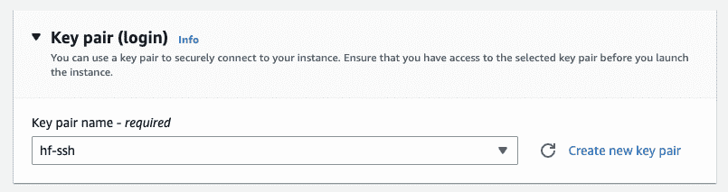

# 设置 AWS Trainium 实例

> 原文链接：[`huggingface.co/docs/optimum-neuron/guides/setup_aws_instance`](https://huggingface.co/docs/optimum-neuron/guides/setup_aws_instance)

使用[Hugging Face Neuron 深度学习 AMI](https://aws.amazon.com/marketplace/pp/prodview-gr3e6yiscria2)（DLAMI）和 Hugging Face Transformers 的最简单方法。DLAMI 为您预打包了所有所需的库，包括 Neuron Drivers、Transformers、Datasets 和 Accelerate。

要创建 EC2 Trainium 实例，您可以从控制台或市场开始。本指南将从[EC2 控制台](https://console.aws.amazon.com/ec2sp/v2/)开始。

从 us-east-1 地区的[EC2 控制台](https://console.aws.amazon.com/ec2sp/v2/)开始，首先点击**启动实例**并为实例定义一个名称（`trainium-huggingface-demo`）。


接下来，您可以在亚马逊市场搜索 Hugging Face AMI。在“应用程序和操作系统映像”的搜索栏中输入“Hugging Face”并点击“enter”。


现在应该打开“选择 Amazon 机器映像”视图并进行搜索。您现在可以导航到“AWS Marketplace AMIs”并找到[Hugging Face Neuron 深度学习 AMI](https://aws.amazon.com/marketplace/pp/prodview-gr3e6yiscria2)，然后点击选择。


*如果您尚未订阅，系统将要求您订阅。AMI 完全免费，您只需支付 EC2 计算费用。*

然后您需要定义一个密钥对，用于通过`ssh`连接到实例。如果没有密钥对，您可以现场创建一个。



之后，创建或选择一个[安全组](https://docs.aws.amazon.com/vpc/latest/userguide/VPC_SecurityGroups.html)。重要的是要允许`ssh`流量。


您已准备好启动我们的实例。因此，请在右侧点击“启动实例”。


AWS 现在将使用[Hugging Face Neuron 深度学习 AMI](https://aws.amazon.com/marketplace/pp/prodview-gr3e6yiscria2)来配置实例。可以通过增加磁盘空间或创建实例配置文件来进行其他配置以访问其他 AWS 服务。

实例运行后，您可以查看并复制公共 IPv4 地址以通过`ssh`连接到该机器。


在下面的片段中，用您的实例的 IP 地址和启动实例时创建/选择的密钥对的路径替换空字符串`""`。

```py
PUBLIC_DNS="" # IP address
KEY_PATH="" # local path to key pair

ssh -i $KEY_PATH ubuntu@$PUBLIC_DNS
```

连接后，您可以运行`neuron-ls`来确保您可以访问 Trainium 加速器。您应该看到类似于下面的输出。

```py
ubuntu@ip-172-31-79-164:~$ neuron-ls
instance-type: trn1.2xlarge
instance-id: i-0570615e41700a481
+--------+--------+--------+---------+
| NEURON | NEURON | NEURON |   PCI   |
| DEVICE | CORES  | MEMORY |   BDF   |
+--------+--------+--------+---------+
| 0      | 2      | 32 GB  | 00:1e.0 |
+--------+--------+--------+---------+
```

完成了！您现在可以开始使用 Hugging Face Transformers 的 Trainium 加速器。查看 Fine-tune Transformers with AWS Trainium 指南以开始使用。
