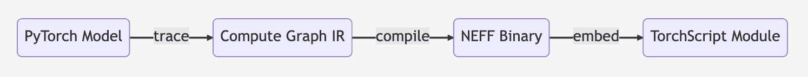

# 将模型导出到 Inferentia

> 原始文本：[`huggingface.co/docs/optimum-neuron/guides/export_model`](https://huggingface.co/docs/optimum-neuron/guides/export_model)

## 总结

将 PyTorch 模型导出为 Neuron 模型就像这样简单

```py
optimum-cli export neuron \
  --model bert-base-uncased \
  --sequence_length 128 \
  --batch_size 1 \
  bert_neuron/
```

查看更多选项的帮助：

```py
optimum-cli export neuron --help
```

## 为什么要编译成 Neuron 模型？

AWS 提供了两代用于机器学习推理的 Inferentia 加速器，具有更高的吞吐量、更低的延迟但更低的成本：[inf2（NeuronCore-v2）](https://awsdocs-neuron.readthedocs-hosted.com/en/latest/general/arch/neuron-hardware/inf2-arch.html) 和 [inf1（NeuronCore-v1）](https://awsdocs-neuron.readthedocs-hosted.com/en/latest/general/arch/neuron-hardware/inf1-arch.html#aws-inf1-arch)。

在生产环境中，要在 Neuron 设备上部署🤗 [Transformers](https://huggingface.co/docs/transformers/index) 模型，您需要在推理之前将模型编译并导出到序列化格式。通过使用 Neuron 编译器（[neuronx-cc](https://awsdocs-neuron.readthedocs-hosted.com/en/latest/release-notes/compiler/neuronx-cc/index.html) 或 [neuron-cc](https://awsdocs-neuron.readthedocs-hosted.com/en/latest/release-notes/compiler/neuron-cc/neuron-cc.html) ）进行提前编译，您的模型将被转换为序列化和优化的[TorchScript 模块](https://pytorch.org/docs/stable/generated/torch.jit.ScriptModule.html)。

为了更好地了解编译过程，这里是在幕后执行的一般步骤：

**NEFF**：Neuron 可执行文件格式，是 Neuron 设备上的二进制可执行文件。

尽管预编译可以避免推理期间的开销，但跟踪的 Neuron 模块有一些限制：

+   跟踪的 Neuron 模块将是静态的，这需要在编译期间使用固定的输入形状和数据类型。由于模型不会动态重新编译，如果上述条件中的任何一个发生变化，推理将失败。(*但这些限制可以通过[动态批处理](https://awsdocs-neuron.readthedocs-hosted.com/en/latest/frameworks/torch/torch-neuronx/api-reference-guide/inference/api-torch-neuronx-trace.html#dynamic-batching)和[分桶](https://awsdocs-neuron.readthedocs-hosted.com/en/latest/general/appnotes/torch-neuron/bucketing-app-note.html#bucketing-app-note)*)。

+   Neuron 模型是硬件专用的，这意味着：

    +   使用 Neuron 跟踪的模型将无法在非 Neuron 环境中执行。

    +   为 inf1（NeuronCore-v1）编译的模型与 inf2（NeuronCore-v2）不兼容，反之亦然。

在本指南中，我们将向您展示如何将您的模型导出为针对 Neuron 设备进行优化的序列化模型。

🤗 Optimum 通过利用配置对象提供了对 Neuron 导出的支持。这些配置对象已经为许多模型架构准备好，并且设计为易于扩展到其他架构。

**要检查支持的架构，请转到配置参考页面。**

## 使用 CLI 将模型导出到 Neuron

将🤗 Transformers 模型导出到 Neuron，您首先需要安装一些额外的依赖项：

**对于 Inf2**

```py
pip install optimum[neuronx]
```

**对于 Inf1**

```py
pip install optimum[neuron]
```

最佳的 Neuron 导出可以通过 Optimum 命令行使用：

```py
optimum-cli export neuron --help

usage: optimum-cli export neuron [-h] -m MODEL [--task TASK] [--atol ATOL] [--cache_dir CACHE_DIR] [--trust-remote-code]
                                 [--compiler_workdir COMPILER_WORKDIR] [--disable-validation] [--auto_cast {none,matmul,all}]
                                 [--auto_cast_type {bf16,fp16,tf32}] [--dynamic-batch-size] [--num_cores NUM_CORES] [--unet UNET]
                                 [--output_hidden_states] [--output_attentions] [--batch_size BATCH_SIZE]
                                 [--sequence_length SEQUENCE_LENGTH] [--num_beams NUM_BEAMS] [--num_choices NUM_CHOICES]
                                 [--num_channels NUM_CHANNELS] [--width WIDTH] [--height HEIGHT]
                                 [--num_images_per_prompt NUM_IMAGES_PER_PROMPT] [-O1 | -O2 | -O3]
                                 output

optional arguments:
  -h, --help            show this help message and exit
  -O1                   Enables the core performance optimizations in the compiler, while also minimizing compile time.
  -O2                   [Default] Provides the best balance between model performance and compile time.
  -O3                   May provide additional model execution performance but may incur longer compile times and higher host
                        memory usage during model compilation.

Required arguments:
  -m MODEL, --model MODEL
                        Model ID on huggingface.co or path on disk to load model from.
  output                Path indicating the directory where to store generated Neuronx compiled TorchScript model.

Optional arguments:
  --task TASK           The task to export the model for. If not specified, the task will be auto-inferred based on the model.
                        Available tasks depend on the model, but are among: ['audio-classification', 'audio-frame-
                        classification', 'audio-xvector', 'automatic-speech-recognition', 'conversational', 'depth-estimation',
                        'feature-extraction', 'fill-mask', 'image-classification', 'image-segmentation', 'image-to-image',
                        'image-to-text', 'mask-generation', 'masked-im', 'multiple-choice', 'object-detection', 'question-
                        answering', 'semantic-segmentation', 'text-to-audio', 'text-generation', 'text2text-generation', 'text-
                        classification', 'token-classification', 'zero-shot-image-classification', 'zero-shot-object-detection',
                        'stable-diffusion', 'stable-diffusion-xl'].
  --atol ATOL           If specified, the absolute difference tolerance when validating the model. Otherwise, the default atol
                        for the model will be used.
  --cache_dir CACHE_DIR
                        Path indicating where to store cache.
  --trust-remote-code   Allow to use custom code for the modeling hosted in the model repository. This option should only be set
                        for repositories you trust and in which you have read the code, as it will execute on your local machine
                        arbitrary code present in the model repository.
  --compiler_workdir COMPILER_WORKDIR
                        Path indicating the directory where to store intermediary files generated by Neuronx compiler.
  --disable-validation  Whether to disable the validation of inference on neuron device compared to the outputs of original
                        PyTorch model on CPU.
  --auto_cast {none,matmul,all}
                        Whether to cast operations from FP32 to lower precision to speed up the inference. Can be `"none"`,
                        `"matmul"` or `"all"`.
  --auto_cast_type {bf16,fp16,tf32}
                        The data type to cast FP32 operations to when auto-cast mode is enabled. Can be `"bf16"`, `"fp16"` or
                        `"tf32"`.
  --dynamic-batch-size  Enable dynamic batch size for neuron compiled model. If this option is enabled, the input batch size can
                        be a multiple of the batch size during the compilation, but it comes with a potential tradeoff in terms
                        of latency.
  --num_cores NUM_CORES
                        The number of cores on which the model should be deployed (text-generation only).
  --unet UNET           UNet model ID on huggingface.co or path on disk to load model from. This will replace the unet in the
                        original Stable Diffusion pipeline.
  --output_hidden_states
                        Whether or not for the traced model to return the hidden states of all layers.
  --output_attentions   Whether or not for the traced model to return the attentions tensors of all attention layers.

Input shapes:
  --batch_size BATCH_SIZE
                        Batch size that the Neuronx-cc compiler exported model will be able to take as input.
  --sequence_length SEQUENCE_LENGTH
                        Sequence length that the Neuronx-cc compiler exported model will be able to take as input.
  --num_beams NUM_BEAMS
                        Number of beams for beam search that the Neuronx-cc compiler exported model will be able to take as
                        input.
  --num_choices NUM_CHOICES
                        Only for the multiple-choice task. Num choices that the Neuronx-cc compiler exported model will be able
                        to take as input.
  --num_channels NUM_CHANNELS
                        Image tasks only. Number of channels that the Neuronx-cc compiler exported model will be able to take as
                        input.
  --width WIDTH         Image tasks only. Width that the Neuronx-cc compiler exported model will be able to take as input.
  --height HEIGHT       Image tasks only. Height that the Neuronx-cc compiler exported model will be able to take as input.
  --num_images_per_prompt NUM_IMAGES_PER_PROMPT
                        Stable diffusion only. Number of images per prompt that the Neuronx-cc compiler exported model will be
                        able to take as input.

```

在最后一节中，您可以看到一些输入形状选项，用于传递给导出静态神经元模型，这意味着在推理期间应使用与编译期间给定的确切形状输入相同的输入。如果您要使用可变大小的输入，您可以将输入填充到用于编译的形状作为解决方法。如果要使批处理大小是动态的，可以传递`--dynamic-batch-size`以启用动态批处理，这意味着您将能够在推理期间使用不同批处理大小的输入，但这可能会在延迟方面产生潜在的折衷。

导出检查点可以按以下方式完成：

```py
optimum-cli export neuron --model distilbert-base-uncased-distilled-squad --batch_size 1 --sequence_length 16 distilbert_base_uncased_squad_neuron/
```

您应该看到以下日志，通过与 CPU 上的 PyTorch 模型进行比较，验证在 Neuron 设备上的模型：

```py
Validating Neuron model...
        -[✓] Neuron model output names match reference model (last_hidden_state)
        - Validating Neuron Model output "last_hidden_state":
                -[✓] (1, 16, 32) matches (1, 16, 32)
                -[✓] all values close (atol: 0.0001)
The Neuronx export succeeded and the exported model was saved at: distilbert_base_uncased_squad_neuron/
```

这将导出由`--model`参数定义的检查点的神经元编译的 TorchScript 模块。

如您所见，任务已被自动检测到。这是因为模型在 Hub 上。对于本地模型，需要提供`--task`参数，否则将默认为没有任何特定任务头的模型架构：

```py
optimum-cli export neuron --model local_path --task question-answering --batch_size 1 --sequence_length 16 --dynamic-batch-size distilbert_base_uncased_squad_neuron/
```

请注意，对于 Hub 上的模型，提供`--task`参数将禁用自动任务检测。然后，生成的`model.neuron`文件可以加载并在 Neuron 设备上运行。

## 通过 NeuronModel 将模型导出到 Neuron

您还可以使用`optimum.neuron.NeuronModelForXXX`模型类将模型导出到 Neuron 格式。这里是一个例子：

```py
>>> from optimum.neuron import NeuronModelForSequenceClassification

>>> input_shapes = {"batch_size": 1, "sequence_length": 64}  # mandatory shapes
>>> model = NeuronModelForSequenceClassification.from_pretrained(
...   "distilbert-base-uncased-finetuned-sst-2-english", export=True, **input_shapes
... )

# Save the model
>>> model.save_pretrained("./distilbert-base-uncased-finetuned-sst-2-english_neuron/")
```

导出的模型可以直接使用`NeuronModelForXXX`类进行推断：

```py
>>> from transformers import AutoTokenizer
>>> from optimum.neuron import NeuronModelForSequenceClassification

>>> tokenizer = AutoTokenizer.from_pretrained("./distilbert-base-uncased-finetuned-sst-2-english_neuron/")
>>> model = NeuronModelForSequenceClassification.from_pretrained("./distilbert-base-uncased-finetuned-sst-2-english_neuron/")

>>> inputs = tokenizer("Hamilton is considered to be the best musical of human history.", return_tensors="pt")
>>> logits = model(**inputs).logits
>>> print(model.config.id2label[logits.argmax().item()])
'POSITIVE'
```

## 将稳定扩散导出到 Neuron

使用 Optimum CLI，您可以编译稳定扩散管道中的组件，以在推断期间在神经元设备上获得加速。

到目前为止，我们支持在管道中导出以下组件：

+   CLIP 文本编码器

+   U-Net

+   VAE 编码器

+   VAE 解码器

“选择这些块是因为它们代表管道中的大部分计算量，并且性能基准测试表明在 Neuron 上运行它们会带来显著的性能优势。”

此外，请随时调整编译配置，以在您的用例中找到性能与准确性之间的最佳权衡。默认情况下，我们建议将 FP32 矩阵乘法运算转换为 BF16，这在适度牺牲准确性的情况下提供良好的性能。查看[AWS Neuron 文档](https://awsdocs-neuron.readthedocs-hosted.com/en/latest/general/appnotes/neuronx-cc/neuronx-cc-training-mixed-precision.html#neuronx-cc-training-mixed-precision)中的指南，以更好地了解编译选项。

可以使用 CLI 导出稳定扩散检查点：

```py
optimum-cli export neuron --model stabilityai/stable-diffusion-2-1-base \
  --task stable-diffusion \
  --batch_size 1 \
  --height 512 `# height in pixels of generated image, eg. 512, 768` \
  --width 512 `# width in pixels of generated image, eg. 512, 768` \
  --num_images_per_prompt 4 `# number of images to generate per prompt, defaults to 1` \
  --auto_cast matmul `# cast only matrix multiplication operations` \
  --auto_cast_type bf16 `# cast operations from FP32 to BF16` \
  sd_neuron/
```

## 将稳定扩散 XL 导出到 Neuron

与稳定扩散类似，您将能够使用 Optimum CLI 在 SDXL 管道上编译组件，以便在神经元设备上进行推断。

我们支持将以下组件导出到管道中以提高速度：

+   文本编码器

+   第二个文本编码器

+   U-Net（比稳定扩散管道中的 UNet 大三倍）

+   VAE 编码器

+   VAE 解码器

“稳定扩散 XL 在 768 到 1024 之间的图像上表现特别好。”

可以使用 CLI 导出 SDXL 检查点：

```py
optimum-cli export neuron --model stabilityai/stable-diffusion-xl-base-1.0 \
  --task stable-diffusion-xl \
  --batch_size 1 \
  --height 1024 `# height in pixels of generated image, eg. 768, 1024` \
  --width 1024 `# width in pixels of generated image, eg. 768, 1024` \
  --num_images_per_prompt 4 `# number of images to generate per prompt, defaults to 1` \
  --auto_cast matmul `# cast only matrix multiplication operations` \
  --auto_cast_type bf16 `# cast operations from FP32 to BF16` \
  sd_neuron/
```

## 选择一个任务

在从 Hugging Face Hub 上的模型导出时，大多数情况下不需要指定`--task`。

但是，如果您需要检查给定模型架构的 Neuron 导出支持哪些任务，我们已经为您提供了。首先，您可以在[这里](https://huggingface.co/docs/optimum/exporters/task_manager#pytorch)检查支持的任务列表。

对于每个模型架构，您可以通过`~exporters.tasks.TasksManager`找到支持的任务列表。例如，对于 DistilBERT，对于 Neuron 导出，我们有：

```py
>>> from optimum.exporters.tasks import TasksManager
>>> from optimum.exporters.neuron.model_configs import *  # Register neuron specific configs to the TasksManager

>>> distilbert_tasks = list(TasksManager.get_supported_tasks_for_model_type("distilbert", "neuron").keys())
>>> print(distilbert_tasks)
['feature-extraction', 'fill-mask', 'multiple-choice', 'question-answering', 'text-classification', 'token-classification']
```

然后，您可以将这些任务之一传递给`optimum-cli export neuron`命令中的`--task`参数，如上所述。
