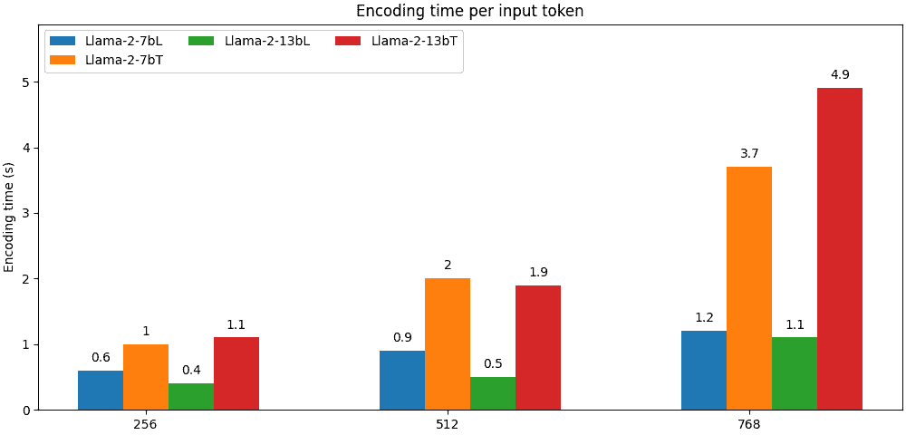
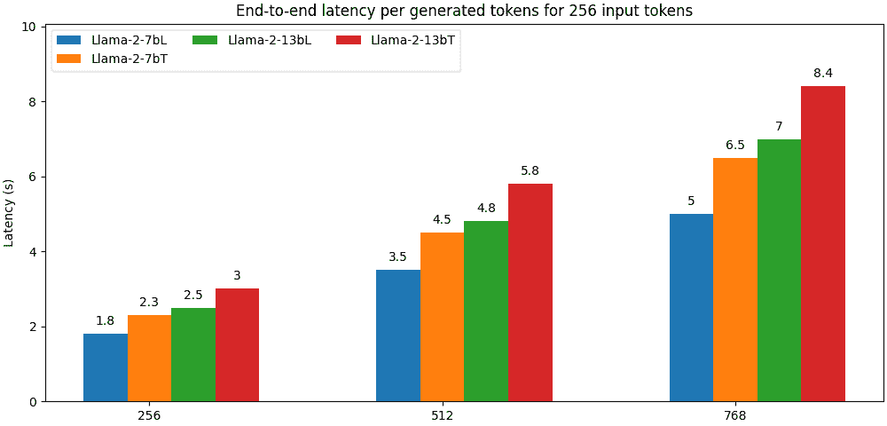
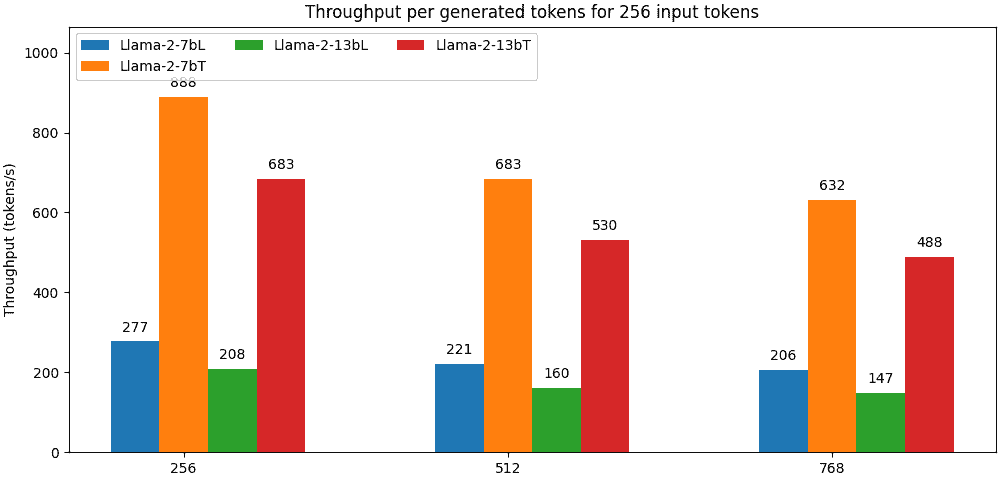

# Llama 在 AWS Inferentia2 上的性能（延迟和吞吐量）

> 原文：[`huggingface.co/docs/optimum-neuron/benchmarks/inferentia-llama2`](https://huggingface.co/docs/optimum-neuron/benchmarks/inferentia-llama2)

Llama 在 Inferentia2 上有多快？让我们来看看！

在此基准测试中，我们将使用具有不同配置的 LLama 2 7B 和 13B 模型：

| 模型类型 | 核心数 | 批处理大小 |
| --- | --- | --- |
| Llama2 7B - L（延迟） | 24 | 1 |
| Llama2 7B - T（吞吐量） | 24 | 4 |
| Llama2 13B - L（延迟） | 24 | 1 |
| Llama2 13B - T（吞吐量） | 24 | 4 |

*注意：所有模型都编译为最大序列长度为 2048。*

所有模型都经过编译，以充分利用`inf2.48xlarge`实例上可用的核心。

*注意：请参考 [inferentia2 产品页面](https://aws.amazon.com/ec2/instance-types/inf2/) 以获取可用实例的详细信息。*

我们为`llama2 7B`和`llama2 13B`模型创建了两种“延迟”导向的配置，每次只能处理一个请求，但速度全开，以及两种“吞吐量”导向的配置，可以同时处理最多四个请求。

为了评估模型，我们生成标记，直到总序列长度达到 1024，从 256 个输入标记开始（即我们生成 256、512 和 768 个标记）。

## 编码时间（第一个标记的时间）

编码时间或第一个标记的时间是处理输入标记并生成第一个输出标记所需的时间。这是一个非常重要的指标，因为它对应于用户在流式生成标记时直接感知到的延迟。

我们测试了不断增加上下文大小的编码时间，256 个输入标记大致对应于典型的问答用途，而 768 个标记更典型于检索增强生成（RAG）用例。

编码时间以**秒**表示。

我们可以看到所有部署的模型都表现出优秀的响应时间，即使是对于长上下文也是如此。

## 端到端延迟

端到端延迟对应于达到 1024 个标记的总时间。

因此，它包括编码和生成时间。

延迟以**秒**表示。

在高端实例上部署的所有模型都表现出良好的延迟，即使那些实际上配置为优化吞吐量的模型也是如此。

### 吞吐量

我们采用与其他基准测试相同的约定来评估吞吐量，即通过将端到端延迟除以输入和输出标记的总和来计算。换句话说，我们将端到端延迟除以`批处理大小 * 序列长度`以获得每秒生成的标记数。

吞吐量以**标记/秒**表示。

在高端实例上部署的模型具有非常好的吞吐量，即使是为延迟进行优化的模型也是如此。
