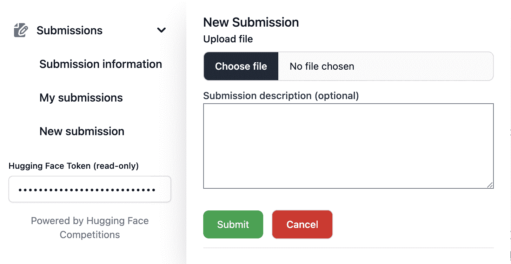
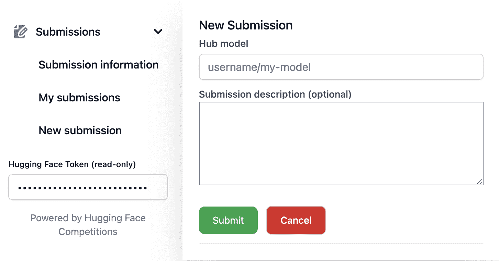

# 进行提交

> 原始文本：[`huggingface.co/docs/competitions/submit`](https://huggingface.co/docs/competitions/submit)

提交格式和示例提交通常由竞赛组织者提供。本页面描述了如何使用竞赛 UI 进行提交。

要进行提交，您必须提供一个只读令牌，允许竞赛访问用户信息。

### 通用竞赛：提交文件

+   提供您的 hugginface 只读令牌

+   上传文件

+   添加描述

+   点击“提交”

### 脚本竞赛：提交带有 script.py 的模型存储库

+   提供您的 hugginface 只读令牌

+   提供您模型存储库的链接（例如 abhishek/submission-model-1）。模型存储库必须包含一个生成所需格式提交的`script.py`文件。

+   添加描述

+   点击“提交”

