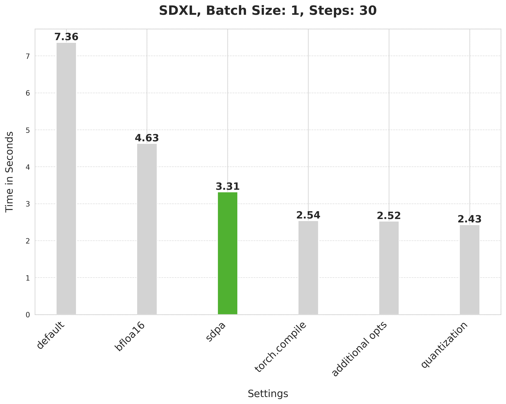
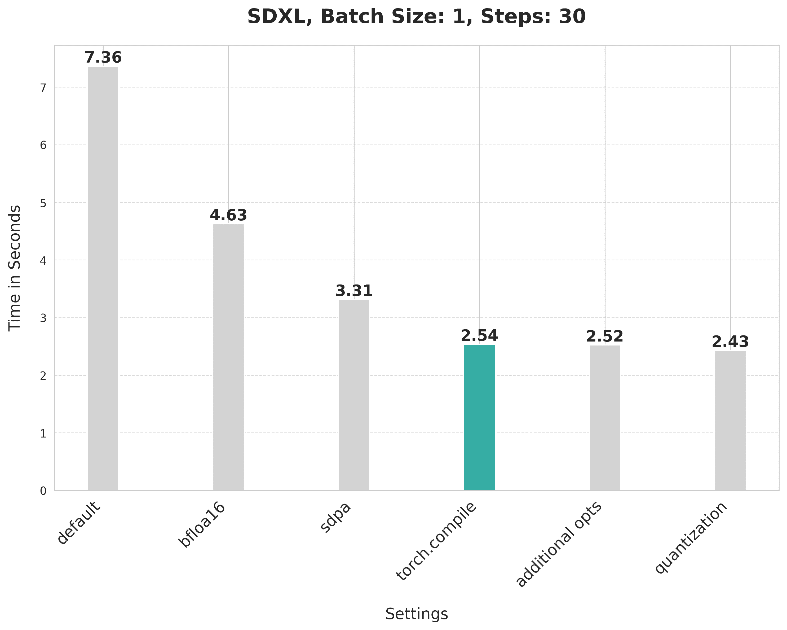
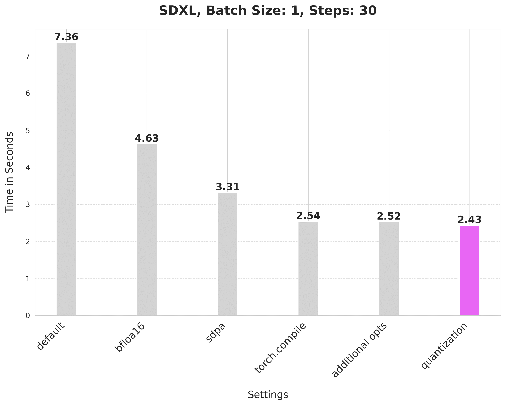

# 加速文本到图像扩散模型的推理

> 原始文本：[`huggingface.co/docs/diffusers/tutorials/fast_diffusion`](https://huggingface.co/docs/diffusers/tutorials/fast_diffusion)

由于迭代和顺序反向扩散过程，扩散模型比它们的 GAN 对应模型慢。有几种技术可以解决这个限制，例如渐进式时间步蒸馏（LCM LoRA）、模型压缩（[SSD-1B](https://huggingface.co/segmind/SSD-1B)）和重用去噪器的相邻特征（DeepCache）。

然而，并不一定需要使用这些技术来加速推理。仅使用 PyTorch 2，您可以将文本到图像扩散管道的推理延迟加速至 3 倍。本教程将向您展示如何逐步应用 PyTorch 2 中发现的优化来减少推理延迟。在本教程中，您将使用 Stable Diffusion XL (SDXL)管道，但这些技术也适用于其他文本到图像扩散管道。

确保您正在使用最新版本的 Diffusers：

```py
pip install -U diffusers
```

然后升级其他所需的库：

```py
pip install -U transformers accelerate peft
```

安装[PyTorch nightly](https://pytorch.org/)以从最新和最快的内核中受益：

```py
pip3 install --pre torch --index-url https://download.pytorch.org/whl/nightly/cu121
```

下面报告的结果来自一个 80GB 400W A100，其时钟频率设置为最大。

如果您对完整的基准代码感兴趣，请查看[huggingface/diffusion-fast](https://github.com/huggingface/diffusion-fast)。

## 基线

让我们从一个基线开始。禁用降低精度和`scaled_dot_product_attention` (SDPA)函数，这个函数会被 Diffusers 自动使用：

```py
from diffusers import StableDiffusionXLPipeline

# Load the pipeline in full-precision and place its model components on CUDA.
pipe = StableDiffusionXLPipeline.from_pretrained(
    "stabilityai/stable-diffusion-xl-base-1.0"
).to("cuda")

# Run the attention ops without SDPA.
pipe.unet.set_default_attn_processor()
pipe.vae.set_default_attn_processor()

prompt = "Astronaut in a jungle, cold color palette, muted colors, detailed, 8k"
image = pipe(prompt, num_inference_steps=30).images[0]
```

这个默认设置需要 7.36 秒。


## bfloat16

启用第一个优化，即降低精度，更具体地是 bfloat16。使用降低精度有几个好处：

+   在推理中使用降低的数值精度（如 float16 或 bfloat16）不会影响生成质量，但会显著提高延迟。

+   与 float16 相比，使用 bfloat16 的好处取决于硬件，但现代 GPU 倾向于支持 bfloat16。

+   与 float16 相比，bfloat16 在与量化一起使用时更具弹性，但我们使用的量化库的更近版本（[torchao](https://github.com/pytorch-labs/ao)）对 float16 没有数值问题。

```py
from diffusers import StableDiffusionXLPipeline
import torch

pipe = StableDiffusionXLPipeline.from_pretrained(
    "stabilityai/stable-diffusion-xl-base-1.0", torch_dtype=torch.bfloat16
).to("cuda")

# Run the attention ops without SDPA.
pipe.unet.set_default_attn_processor()
pipe.vae.set_default_attn_processor()

prompt = "Astronaut in a jungle, cold color palette, muted colors, detailed, 8k"
image = pipe(prompt, num_inference_steps=30).images[0]
```

bfloat16 将延迟从 7.36 秒降至 4.63 秒。


在我们后续的使用 float16 的实验中，最近版本的 torchao 不会出现 float16 的数值问题。

查看加速推理指南，了解更多关于使用降低精度进行推理的信息。

## SDPA

注意力块的运行是密集的。但是使用 PyTorch 的`scaled_dot_product_attention`函数，效率更高。这个函数在 Diffusers 中默认使用，因此您不需要对代码进行任何更改。

```py
from diffusers import StableDiffusionXLPipeline
import torch

pipe = StableDiffusionXLPipeline.from_pretrained(
    "stabilityai/stable-diffusion-xl-base-1.0", torch_dtype=torch.bfloat16
).to("cuda")

prompt = "Astronaut in a jungle, cold color palette, muted colors, detailed, 8k"
image = pipe(prompt, num_inference_steps=30).images[0]
```

缩放点积注意力将延迟从 4.63 秒降至 3.31 秒。



## torch.compile

PyTorch 2 包括`torch.compile`，使用快速和优化的内核。在 Diffusers 中，UNet 和 VAE 通常会被编译，因为这些是最计算密集的模块。首先，配置一些编译器标志（更多选项请参考[完整列表](https://github.com/pytorch/pytorch/blob/main/torch/_inductor/config.py)）：

```py
from diffusers import StableDiffusionXLPipeline
import torch

torch._inductor.config.conv_1x1_as_mm = True
torch._inductor.config.coordinate_descent_tuning = True
torch._inductor.config.epilogue_fusion = False
torch._inductor.config.coordinate_descent_check_all_directions = True
```

将 UNet 和 VAE 的内存布局更改为“channels_last”在编译它们时非常重要，以确保最大速度。

```py
pipe.unet.to(memory_format=torch.channels_last)
pipe.vae.to(memory_format=torch.channels_last)
```

现在编译并执行推理：

```py
# Compile the UNet and VAE.
pipe.unet = torch.compile(pipe.unet, mode="max-autotune", fullgraph=True)
pipe.vae.decode = torch.compile(pipe.vae.decode, mode="max-autotune", fullgraph=True)

prompt = "Astronaut in a jungle, cold color palette, muted colors, detailed, 8k"

# First call to `pipe` is slow, subsequent ones are faster.
image = pipe(prompt, num_inference_steps=30).images[0]
```

`torch.compile`提供不同的后端和模式。为了获得最大的推理速度，对于感应器后端使用“max-autotune”。“max-autotune”使用 CUDA 图形，并专门为延迟优化编译图。CUDA 图形通过一种机制来通过单个 CPU 操作启动多个 GPU 操作，大大减少了启动 GPU 操作的开销。

使用 SDPA 注意力并编译 UNet 和 VAE 可以将延迟从 3.31 秒减少到 2.54 秒。



### 防止图中断

指定`fullgraph=True`可以确保底层模型中没有图中断，以充分利用`torch.compile`而不会降低性能。对于 UNet 和 VAE，这意味着改变访问返回变量的方式。

```py
- latents = unet(
-   latents, timestep=timestep, encoder_hidden_states=prompt_embeds
-).sample

+ latents = unet(
+   latents, timestep=timestep, encoder_hidden_states=prompt_embeds, return_dict=False
+)[0]
```

### 编译后去除 GPU 同步

在迭代反向扩散过程中，每次在去噪器预测出更少噪音的潜在嵌入后，调度器上的`step()`函数会被[调用](https://github.com/huggingface/diffusers/blob/1d686bac8146037e97f3fd8c56e4063230f71751/src/diffusers/pipelines/stable_diffusion_xl/pipeline_stable_diffusion_xl.py#L1228)。在`step()`内，`sigmas`变量会被[索引](https://github.com/huggingface/diffusers/blob/1d686bac8146037e97f3fd8c56e4063230f71751/src/diffusers/schedulers/scheduling_euler_discrete.py#L476)，当放置在 GPU 上时，会导致 CPU 和 GPU 之间的通信同步。这会引入延迟，当去噪器已经被编译时，这种情况会更加明显。

但如果`sigmas`数组始终[保留在 CPU 上](https://github.com/huggingface/diffusers/blob/35a969d297cba69110d175ee79c59312b9f49e1e/src/diffusers/schedulers/scheduling_euler_discrete.py#L240)，CPU 和 GPU 同步就不会发生，也不会有任何延迟。一般来说，任何 CPU 和 GPU 之间的通信同步应该是没有或保持最小的，因为它可能会影响推理延迟。

## 合并注意力块的投影矩阵

SDXL 中的 UNet 和 VAE 使用类似 Transformer 的块，包括注意力块和前馈块。

在注意力块中，输入会使用三个不同的投影矩阵（Q、K 和 V）投影到三个子空间中。这些投影会分别在输入上执行。但是我们可以将投影矩阵水平合并成一个单独的矩阵，并在一步中执行投影。这会增加输入投影的矩阵乘法的大小，并改善量化的影响。

您可以用一行代码合并投影矩阵：

```py
pipe.fuse_qkv_projections()
```

这将将延迟从 2.54 秒略微提高到 2.52 秒。


对 fuse_qkv_projections()的支持是有限的且实验性的。对于许多非稳定扩散管道（如 Kandinsky），它不可用。您可以参考这个[PR](https://github.com/huggingface/diffusers/pull/6179)来了解如何为其他管道启用此功能。

## 动态量化

您还可以使用超轻量级的 PyTorch 量化库[torchao](https://github.com/pytorch-labs/ao)（提交 SHA `54bcd5a10d0abbe7b0c045052029257099f83fd9`）来对 UNet 和 VAE 应用[动态 int8 量化](https://pytorch.org/tutorials/recipes/recipes/dynamic_quantization.html)。量化会为模型增加额外的转换开销，希望通过更快的矩阵乘法（动态量化）来弥补。如果矩阵乘法太小，这些技术可能会降低性能。

首先，配置所有编译器标签：

```py
from diffusers import StableDiffusionXLPipeline
import torch 

# Notice the two new flags at the end.
torch._inductor.config.conv_1x1_as_mm = True
torch._inductor.config.coordinate_descent_tuning = True
torch._inductor.config.epilogue_fusion = False
torch._inductor.config.coordinate_descent_check_all_directions = True
torch._inductor.config.force_fuse_int_mm_with_mul = True
torch._inductor.config.use_mixed_mm = True
```

UNet 和 VAE 中的某些线性层不受动态 int8 量化的益处。您可以使用下面显示的[`dynamic_quant_filter_fn`](https://github.com/huggingface/diffusion-fast/blob/0f169640b1db106fe6a479f78c1ed3bfaeba3386/utils/pipeline_utils.py#L16)来过滤掉这些层。

```py
def dynamic_quant_filter_fn(mod, *args):
    return (
        isinstance(mod, torch.nn.Linear)
        and mod.in_features > 16
        and (mod.in_features, mod.out_features)
        not in [
            (1280, 640),
            (1920, 1280),
            (1920, 640),
            (2048, 1280),
            (2048, 2560),
            (2560, 1280),
            (256, 128),
            (2816, 1280),
            (320, 640),
            (512, 1536),
            (512, 256),
            (512, 512),
            (640, 1280),
            (640, 1920),
            (640, 320),
            (640, 5120),
            (640, 640),
            (960, 320),
            (960, 640),
        ]
    )

def conv_filter_fn(mod, *args):
    return (
        isinstance(mod, torch.nn.Conv2d) and mod.kernel_size == (1, 1) and 128 in [mod.in_channels, mod.out_channels]
    )
```

最后，应用到目前为止讨论的所有优化：

```py
# SDPA + bfloat16.
pipe = StableDiffusionXLPipeline.from_pretrained(
    "stabilityai/stable-diffusion-xl-base-1.0", torch_dtype=torch.bfloat16
).to("cuda")

# Combine attention projection matrices.
pipe.fuse_qkv_projections()

# Change the memory layout.
pipe.unet.to(memory_format=torch.channels_last)
pipe.vae.to(memory_format=torch.channels_last)
```

由于动态量化仅限于线性层，将适当的逐点卷积层转换为线性层，以最大化其效益。

```py
from torchao import swap_conv2d_1x1_to_linear

swap_conv2d_1x1_to_linear(pipe.unet, conv_filter_fn)
swap_conv2d_1x1_to_linear(pipe.vae, conv_filter_fn)
```

应用动态量化：

```py
from torchao import apply_dynamic_quant

apply_dynamic_quant(pipe.unet, dynamic_quant_filter_fn)
apply_dynamic_quant(pipe.vae, dynamic_quant_filter_fn)
```

最后，编译并执行推理：

```py
pipe.unet = torch.compile(pipe.unet, mode="max-autotune", fullgraph=True)
pipe.vae.decode = torch.compile(pipe.vae.decode, mode="max-autotune", fullgraph=True)

prompt = "Astronaut in a jungle, cold color palette, muted colors, detailed, 8k"
image = pipe(prompt, num_inference_steps=30).images[0]
```

应用动态量化将延迟从 2.52 秒降低到 2.43 秒。


