# 加载适配器

> 原始文本：[`huggingface.co/docs/diffusers/using-diffusers/loading_adapters`](https://huggingface.co/docs/diffusers/using-diffusers/loading_adapters)

有几种训练技术可用于个性化扩散模型，以生成特定主题的图像或特定风格的图像。每种训练方法都会产生不同类型的适配器。一些适配器会生成全新的模型，而其他适配器只会修改一小部分嵌入或权重。这意味着每个适配器的加载过程也是不同的。

本指南将向您展示如何加载 DreamBooth、文本反转和 LoRA 权重。

随意浏览[稳定扩散概念化器](https://huggingface.co/spaces/sd-concepts-library/stable-diffusion-conceptualizer)、[LoRA 探险家](https://huggingface.co/spaces/multimodalart/LoraTheExplorer)和[Diffusers 模型库](https://huggingface.co/spaces/huggingface-projects/diffusers-gallery)以获取检查点和嵌入以供使用。

## DreamBooth

[DreamBooth](https://dreambooth.github.io/)在仅使用几幅主题图像对整个扩散模型进行微调，以生成该主题的新风格和设置的图像。这种方法通过在提示中使用一个特殊词，模型学会将其与主题图像关联起来。在所有训练方法中，DreamBooth 产生的文件大小最大（通常为几 GB），因为它是一个完整的检查点模型。

让我们加载[herge_style](https://huggingface.co/sd-dreambooth-library/herge-style)检查点，该检查点仅训练了由 Hergé绘制的 10 幅图像，以在该风格中生成图像。为了使其工作，您需要在提示中包含特殊词`herge_style`来触发检查点：

```py
from diffusers import AutoPipelineForText2Image
import torch

pipeline = AutoPipelineForText2Image.from_pretrained("sd-dreambooth-library/herge-style", torch_dtype=torch.float16).to("cuda")
prompt = "A cute herge_style brown bear eating a slice of pizza, stunning color scheme, masterpiece, illustration"
image = pipeline(prompt).images[0]
image
```

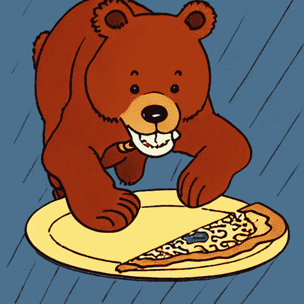

## 文本反转

[文本反转](https://textual-inversion.github.io/)与 DreamBooth 非常相似，它也可以个性化扩散模型，从几幅图像中生成特定概念（风格、对象）。这种方法通过训练并找到代表您在提示中提供的图像的新嵌入来工作。因此，扩散模型的权重保持不变，训练过程产生一个相对较小（几 KB）的文件。

因为文本反转会创建嵌入，所以不能像 DreamBooth 那样单独使用，需要另一个模型。

```py
from diffusers import AutoPipelineForText2Image
import torch

pipeline = AutoPipelineForText2Image.from_pretrained("runwayml/stable-diffusion-v1-5", torch_dtype=torch.float16).to("cuda")
```

现在您可以使用 load_textual_inversion()方法加载文本反转嵌入，并生成一些图像。让我们加载[sd-concepts-library/gta5-artwork](https://huggingface.co/sd-concepts-library/gta5-artwork)嵌入，您需要在提示中包含特殊词`<gta5-artwork>`来触发它：

```py
pipeline.load_textual_inversion("sd-concepts-library/gta5-artwork")
prompt = "A cute brown bear eating a slice of pizza, stunning color scheme, masterpiece, illustration, <gta5-artwork> style"
image = pipeline(prompt).images[0]
image
```

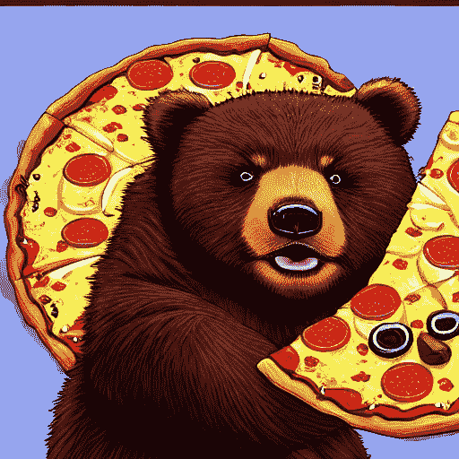

文本反转也可以训练不良事物，创建*负嵌入*，以阻止模型生成带有这些不良事物的图像，如模糊图像或手上额外的手指。这可以是快速改进提示的简单方法。您还将使用 load_textual_inversion()加载嵌入，但这次，您需要两个额外的参数：

+   `weight_name`：指定要加载的权重文件，如果文件以特定名称保存在🤗 Diffusers 格式中，或者文件存储在 A1111 格式中

+   `token`：指定在提示中触发嵌入的特殊词

让我们加载[sayakpaul/EasyNegative-test](https://huggingface.co/sayakpaul/EasyNegative-test)嵌入：

```py
pipeline.load_textual_inversion(
    "sayakpaul/EasyNegative-test", weight_name="EasyNegative.safetensors", token="EasyNegative"
)
```

现在您可以使用`token`生成带有负嵌入的图像：

```py
prompt = "A cute brown bear eating a slice of pizza, stunning color scheme, masterpiece, illustration, EasyNegative"
negative_prompt = "EasyNegative"

image = pipeline(prompt, negative_prompt=negative_prompt, num_inference_steps=50).images[0]
image
```

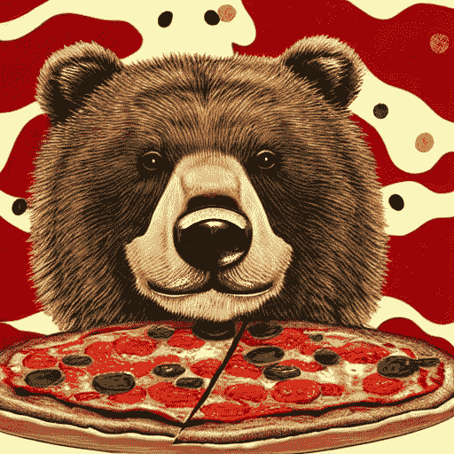

## LoRA

[低秩适应（LoRA）](https://huggingface.co/papers/2106.09685)是一种流行的训练技术，因为它快速且生成较小的文件大小（几百 MB）。与本指南中的其他方法一样，LoRA 可以训练模型仅从少量图像中学习新样式。它通过将新权重插入扩散模型，然后仅训练新权重而不是整个模型。这使得 LoRA 训练更快，存储更容易。

LoRA 是一种非常通用的训练技术，可以与其他训练方法一起使用。例如，通常会使用 DreamBooth 和 LoRA 来训练模型。

LoRA 还需要与另一个模型一起使用：

```py
from diffusers import AutoPipelineForText2Image
import torch

pipeline = AutoPipelineForText2Image.from_pretrained("stabilityai/stable-diffusion-xl-base-1.0", torch_dtype=torch.float16).to("cuda")
```

然后使用 load_lora_weights()方法加载[ostris/super-cereal-sdxl-lora](https://huggingface.co/ostris/super-cereal-sdxl-lora)权重，并从存储库中指定权重文件名：

```py
pipeline.load_lora_weights("ostris/super-cereal-sdxl-lora", weight_name="cereal_box_sdxl_v1.safetensors")
prompt = "bears, pizza bites"
image = pipeline(prompt).images[0]
image
```


load_lora_weights()方法将 LoRA 权重加载到 UNet 和文本编码器中。这是加载 LoRA 的首选方式，因为它可以处理以下情况：

+   LoRA 权重没有 UNet 和文本编码器的单独标识符

+   LoRA 权重对 UNet 和文本编码器有单独的标识符

但是，如果只需要将 LoRA 权重加载到 UNet 中，则可以使用 load_attn_procs()方法。让我们加载[jbilcke-hf/sdxl-cinematic-1](https://huggingface.co/jbilcke-hf/sdxl-cinematic-1) LoRA：

```py
from diffusers import AutoPipelineForText2Image
import torch

pipeline = AutoPipelineForText2Image.from_pretrained("stabilityai/stable-diffusion-xl-base-1.0", torch_dtype=torch.float16).to("cuda")
pipeline.unet.load_attn_procs("jbilcke-hf/sdxl-cinematic-1", weight_name="pytorch_lora_weights.safetensors")

# use cnmt in the prompt to trigger the LoRA
prompt = "A cute cnmt eating a slice of pizza, stunning color scheme, masterpiece, illustration"
image = pipeline(prompt).images[0]
image
```

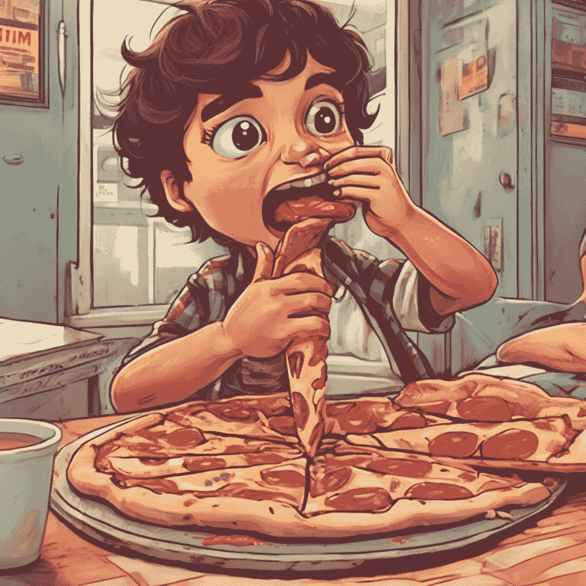

对于 load_lora_weights()和 load_attn_procs()，您可以传递`cross_attention_kwargs={"scale": 0.5}`参数来调整使用 LoRA 权重的比例。值为`0`相当于仅使用基本模型权重，值为`1`相当于使用完全微调的 LoRA。

要卸载 LoRA 权重，请使用 unload_lora_weights()方法丢弃 LoRA 权重并将模型恢复为其原始权重：

```py
pipeline.unload_lora_weights()
```

### 加载多个 LoRA

将多个 LoRA 一起使用可以创建全新且独特的东西，这很有趣。fuse_lora()方法允许您将 LoRA 权重与基础模型的原始权重融合。

融合权重可以加快推理延迟，因为您无需单独加载基本模型和 LoRA！您可以使用 save_pretrained()保存融合的管道，以避免每次使用模型时加载和融合权重。

加载初始模型：

```py
from diffusers import StableDiffusionXLPipeline, AutoencoderKL
import torch

vae = AutoencoderKL.from_pretrained("madebyollin/sdxl-vae-fp16-fix", torch_dtype=torch.float16)
pipeline = StableDiffusionXLPipeline.from_pretrained(
    "stabilityai/stable-diffusion-xl-base-1.0",
    vae=vae,
    torch_dtype=torch.float16,
).to("cuda")
```

接下来，加载 LoRA 检查点并将其与原始权重融合。`lora_scale`参数控制使用 LoRA 权重时输出的缩放比例。在 fuse_lora()方法中进行`lora_scale`调整很重要，因为如果尝试在管道中将`scale`传递给`cross_attention_kwargs`，则不起作用。

如果出于任何原因需要重置原始模型权重（使用不同的`lora_scale`），应使用 unfuse_lora()方法。

```py
pipeline.load_lora_weights("ostris/ikea-instructions-lora-sdxl")
pipeline.fuse_lora(lora_scale=0.7)

# to unfuse the LoRA weights
pipeline.unfuse_lora()
```

然后将此管道与下一组 LoRA 权重融合：

```py
pipeline.load_lora_weights("ostris/super-cereal-sdxl-lora")
pipeline.fuse_lora(lora_scale=0.7)
```

您无法解除多个 LoRA 检查点的融合，因此如果需要将模型重置为其原始权重，您需要重新加载它。

现在您可以生成一张使用两个 LoRA 权重的图片：

```py
prompt = "A cute brown bear eating a slice of pizza, stunning color scheme, masterpiece, illustration"
image = pipeline(prompt).images[0]
image
```

### 🤗 PEFT

阅读使用🤗 PEFT 进行推断教程，了解更多关于它与🤗 Diffusers 集成以及如何轻松使用和切换多个适配器的信息。您需要从源代码安装🤗 Diffusers 和 PEFT 才能运行本节中的示例。

另一种加载和使用多个 LoRA 的方法是在 load_lora_weights()中指定`adapter_name`参数。这种方法利用了🤗 PEFT 集成。例如，加载并命名两个 LoRA 权重：

```py
from diffusers import DiffusionPipeline
import torch

pipeline = DiffusionPipeline.from_pretrained("stabilityai/stable-diffusion-xl-base-1.0", torch_dtype=torch.float16).to("cuda")
pipeline.load_lora_weights("ostris/ikea-instructions-lora-sdxl", weight_name="ikea_instructions_xl_v1_5.safetensors", adapter_name="ikea")
pipeline.load_lora_weights("ostris/super-cereal-sdxl-lora", weight_name="cereal_box_sdxl_v1.safetensors", adapter_name="cereal")
```

现在使用 set_adapters()来激活两个 LoRA，并可以配置每个 LoRA 在输出上的权重：

```py
pipeline.set_adapters(["ikea", "cereal"], adapter_weights=[0.7, 0.5])
```

然后，生成一张图片：

```py
prompt = "A cute brown bear eating a slice of pizza, stunning color scheme, masterpiece, illustration"
image = pipeline(prompt, num_inference_steps=30, cross_attention_kwargs={"scale": 1.0}).images[0]
image
```

### Kohya 和 TheLastBen

社区中其他流行的 LoRA 训练器包括[Kohya](https://github.com/kohya-ss/sd-scripts/)和[TheLastBen](https://github.com/TheLastBen/fast-stable-diffusion)的训练器。这些训练器创建的 LoRA 检查点与🤗 Diffusers 训练的不同，但仍然可以以相同的方式加载。

让我们从[Civitai](https://civitai.com/)下载[Blueprintify SD XL 1.0](https://civitai.com/models/150986/blueprintify-sd-xl-10)的检查点：

```py
!wget https://civitai.com/api/download/models/168776 -O blueprintify-sd-xl-10.safetensors
```

使用 load_lora_weights()方法加载 LoRA 检查点，并在`weight_name`参数中指定文件名：

```py
from diffusers import AutoPipelineForText2Image
import torch

pipeline = AutoPipelineForText2Image.from_pretrained("stabilityai/stable-diffusion-xl-base-1.0", torch_dtype=torch.float16).to("cuda")
pipeline.load_lora_weights("path/to/weights", weight_name="blueprintify-sd-xl-10.safetensors")
```

生成一张图片：

```py
# use bl3uprint in the prompt to trigger the LoRA
prompt = "bl3uprint, a highly detailed blueprint of the eiffel tower, explaining how to build all parts, many txt, blueprint grid backdrop"
image = pipeline(prompt).images[0]
image
```

使用 Kohya LoRA 与🤗 Diffusers 的一些限制包括：

+   由于多种原因，生成的图片可能不像 UIs（如 ComfyUI）生成的图片，这些原因在[这里](https://github.com/huggingface/diffusers/pull/4287/#issuecomment-1655110736)有解释。

+   [LyCORIS 检查点](https://github.com/KohakuBlueleaf/LyCORIS)不受完全支持。load_lora_weights()方法使用 LoRA 和 LoCon 模块加载 LyCORIS 检查点，但不支持 Hada 和 LoKR。

加载 TheLastBen 的检查点非常类似。例如，要加载[TheLastBen/William_Eggleston_Style_SDXL](https://huggingface.co/TheLastBen/William_Eggleston_Style_SDXL)的检查点：

```py
from diffusers import AutoPipelineForText2Image
import torch

pipeline = AutoPipelineForText2Image.from_pretrained("stabilityai/stable-diffusion-xl-base-1.0", torch_dtype=torch.float16).to("cuda")
pipeline.load_lora_weights("TheLastBen/William_Eggleston_Style_SDXL", weight_name="wegg.safetensors")

# use by william eggleston in the prompt to trigger the LoRA
prompt = "a house by william eggleston, sunrays, beautiful, sunlight, sunrays, beautiful"
image = pipeline(prompt=prompt).images[0]
image
```

## IP-Adapter

[IP-Adapter](https://ip-adapter.github.io/)是一种有效且轻量级的适配器，可为扩散模型添加图像提示功能。该适配器通过解耦图像和文本特征的交叉注意力层来工作。所有其他模型组件都被冻结，只有 UNet 中的嵌入图像特征被训练。因此，IP-Adapter 文件通常只有约 100MB。

IP-Adapter 适用于我们的大多数管道，包括稳定扩散、稳定扩散 XL（SDXL）、ControlNet、T2I-Adapter、AnimateDiff。您还可以使用从相同基础模型微调的任何自定义模型。它还可以与 LCM-Lora 直接配合使用。

您可以在[h94/IP-Adapter](https://huggingface.co/h94/IP-Adapter)中找到官方 IP-Adapter 检查点。

IP-Adapter 由[okotaku](https://github.com/okotaku)贡献。

让我们首先创建一个稳定扩散管道。

```py
from diffusers import AutoPipelineForText2Image
import torch
from diffusers.utils import load_image

pipeline = AutoPipelineForText2Image.from_pretrained("runwayml/stable-diffusion-v1-5", torch_dtype=torch.float16).to("cuda")
```

现在使用 load_ip_adapter()方法加载[h94/IP-Adapter](https://huggingface.co/h94/IP-Adapter)的权重。

```py
pipeline.load_ip_adapter("h94/IP-Adapter", subfolder="models", weight_name="ip-adapter_sd15.bin")
```

IP-适配器依赖于图像编码器来生成图像特征，如果您的 IP-适配器权重文件夹包含一个名为“image_encoder”的子文件夹，则图像编码器将自动加载并注册到管道中。否则，您可以加载一个[CLIPVisionModelWithProjection](https://huggingface.co/docs/transformers/v4.37.2/en/model_doc/clip#transformers.CLIPVisionModelWithProjection)模型，并在创建时将其传递给稳定扩散管道。

```py
from diffusers import AutoPipelineForText2Image
from transformers import CLIPVisionModelWithProjection
import torch

image_encoder = CLIPVisionModelWithProjection.from_pretrained(
    "h94/IP-Adapter", 
    subfolder="models/image_encoder",
    torch_dtype=torch.float16,
).to("cuda")

pipeline = AutoPipelineForText2Image.from_pretrained("runwayml/stable-diffusion-v1-5", image_encoder=image_encoder, torch_dtype=torch.float16).to("cuda")
```

IP-适配器允许您同时使用图像和文本来调节图像生成过程。例如，让我们使用来自文本反转部分的熊图像作为图像提示（`ip_adapter_image`），并附上一个文本提示添加“太阳镜”。 😎

```py
pipeline.set_ip_adapter_scale(0.6)
image = load_image("https://huggingface.co/datasets/huggingface/documentation-images/resolve/main/diffusers/load_neg_embed.png")
generator = torch.Generator(device="cpu").manual_seed(33)
images = pipeline(
    prompt='best quality, high quality, wearing sunglasses', 
    ip_adapter_image=image,
    negative_prompt="monochrome, lowres, bad anatomy, worst quality, low quality", 
    num_inference_steps=50,
    generator=generator,
).images
images[0]
```

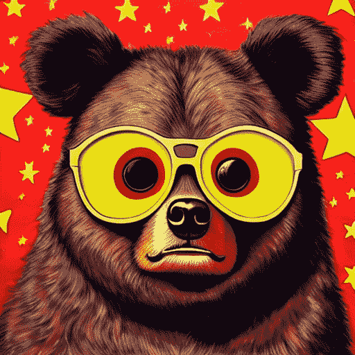

您可以使用`set_ip_adapter_scale()`方法来调整文本提示和图像提示的条件比例。如果您只使用图像提示，应将比例设置为`1.0`。您可以降低比例以获得更多的生成多样性，但它将与提示不太一致。在大多数情况下，当您同时使用文本和图像提示时，`scale=0.5`可以获得良好的结果。

IP-适配器也与图像到图像和修补管道非常配合。请看下面如何将其与图像到图像和修补一起使用的示例。

图像到图像修补

```py
from diffusers import AutoPipelineForImage2Image
import torch
from diffusers.utils import load_image

pipeline = AutoPipelineForImage2Image.from_pretrained("runwayml/stable-diffusion-v1-5", torch_dtype=torch.float16).to("cuda")

image = load_image("https://huggingface.co/datasets/YiYiXu/testing-images/resolve/main/vermeer.jpg")
ip_image = load_image("https://huggingface.co/datasets/YiYiXu/testing-images/resolve/main/river.png")

pipeline.load_ip_adapter("h94/IP-Adapter", subfolder="models", weight_name="ip-adapter_sd15.bin")
generator = torch.Generator(device="cpu").manual_seed(33)
images = pipeline(
    prompt='best quality, high quality', 
    image = image,
    ip_adapter_image=ip_image,
    num_inference_steps=50,
    generator=generator,
    strength=0.6,
).images
images[0]
```

IP-适配器也可以与 SDXL 一起使用

```py
from diffusers import AutoPipelineForText2Image
from diffusers.utils import load_image
import torch

pipeline = AutoPipelineForText2Image.from_pretrained(
    "stabilityai/stable-diffusion-xl-base-1.0",
    torch_dtype=torch.float16
).to("cuda")

image = load_image("https://huggingface.co/datasets/sayakpaul/sample-datasets/resolve/main/watercolor_painting.jpeg")

pipeline.load_ip_adapter("h94/IP-Adapter", subfolder="sdxl_models", weight_name="ip-adapter_sdxl.bin")

generator = torch.Generator(device="cpu").manual_seed(33)
image = pipeline(
    prompt="best quality, high quality", 
    ip_adapter_image=image,
    negative_prompt="monochrome, lowres, bad anatomy, worst quality, low quality", 
    num_inference_steps=25,
    generator=generator,
).images[0]
image.save("sdxl_t2i.png")
```


输入图像

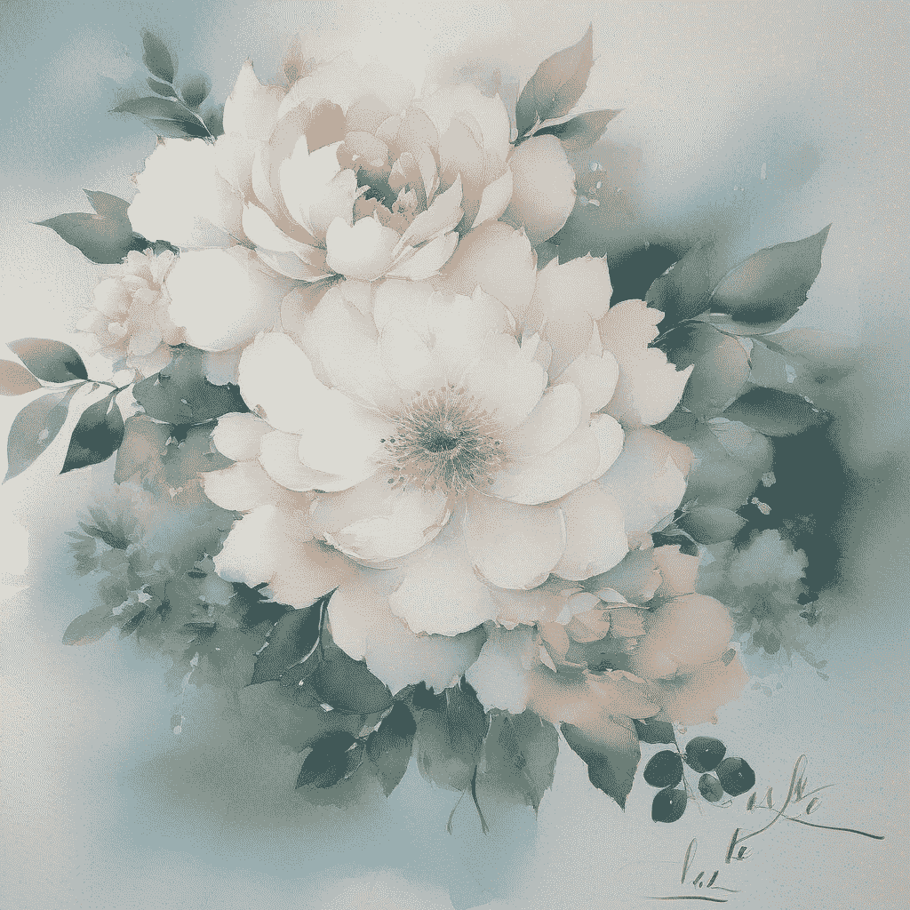

调整后的图像

您可以使用 IP-适配器面部模型将特定面部应用于您的图像。这是在图像生成中保持一致角色的有效方法。权重的加载方式与其他 IP-适配器相同。

```py
# Load ip-adapter-full-face_sd15.bin
pipeline.load_ip_adapter("h94/IP-Adapter", subfolder="models", weight_name="ip-adapter-full-face_sd15.bin")
```

建议使用`DDIMScheduler`和`EulerDiscreteScheduler`来进行面部模型。

```py
import torch
from diffusers import StableDiffusionPipeline, DDIMScheduler
from diffusers.utils import load_image

pipeline = StableDiffusionPipeline.from_pretrained(
    "runwayml/stable-diffusion-v1-5",
    torch_dtype=torch.float16,
).to("cuda")
pipeline.scheduler = DDIMScheduler.from_config(pipeline.scheduler.config)
pipeline.load_ip_adapter("h94/IP-Adapter", subfolder="models", weight_name="ip-adapter-full-face_sd15.bin")

pipeline.set_ip_adapter_scale(0.7)

image = load_image("https://huggingface.co/datasets/YiYiXu/testing-images/resolve/main/ai_face2.png")

generator = torch.Generator(device="cpu").manual_seed(33)

image = pipeline(
    prompt="A photo of a girl wearing a black dress, holding red roses in hand, upper body, behind is the Eiffel Tower",
    ip_adapter_image=image,
    negative_prompt="monochrome, lowres, bad anatomy, worst quality, low quality", 
    num_inference_steps=50, num_images_per_prompt=1, width=512, height=704,
    generator=generator,
).images[0]
```

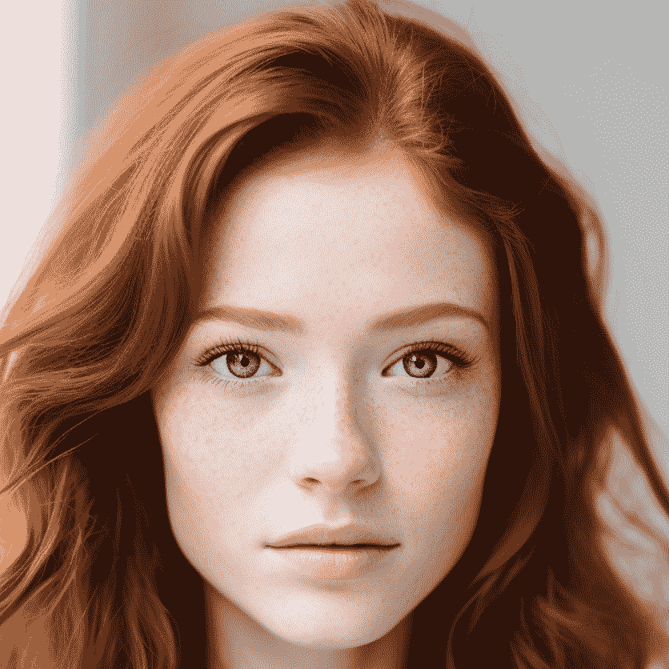

输入图像

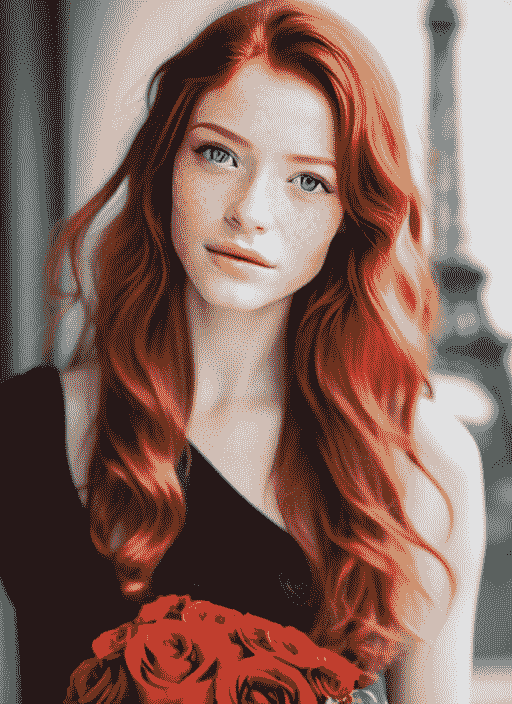

输出图像

您可以同时加载多个 IP-适配器模型并使用多个参考图像。在此示例中，我们使用 IP-适配器-Plus 面部模型创建一致的角色，并同时使用 IP-适配器-Plus 模型以及 10 个图像创建我们生成的图像中的连贯样式。

```py
import torch
from diffusers import AutoPipelineForText2Image, DDIMScheduler
from transformers import CLIPVisionModelWithProjection
from diffusers.utils import load_image

image_encoder = CLIPVisionModelWithProjection.from_pretrained(
    "h94/IP-Adapter", 
    subfolder="models/image_encoder",
    torch_dtype=torch.float16,
)

pipeline = AutoPipelineForText2Image.from_pretrained(
    "stabilityai/stable-diffusion-xl-base-1.0",
    torch_dtype=torch.float16,
    image_encoder=image_encoder,
)
pipeline.scheduler = DDIMScheduler.from_config(pipeline.scheduler.config)
pipeline.load_ip_adapter(
  "h94/IP-Adapter", 
  subfolder="sdxl_models", 
  weight_name=["ip-adapter-plus_sdxl_vit-h.safetensors", "ip-adapter-plus-face_sdxl_vit-h.safetensors"]
)
pipeline.set_ip_adapter_scale([0.7, 0.3])
pipeline.enable_model_cpu_offload()

face_image = load_image("https://huggingface.co/datasets/YiYiXu/testing-images/resolve/main/women_input.png")
style_folder = "https://huggingface.co/datasets/YiYiXu/testing-images/resolve/main/style_ziggy"
style_images =  [load_image(f"{style_folder}/img{i}.png") for i in range(10)]

generator = torch.Generator(device="cpu").manual_seed(0)

image = pipeline(
    prompt="wonderwoman",
    ip_adapter_image=[style_images, face_image],
    negative_prompt="monochrome, lowres, bad anatomy, worst quality, low quality", 
    num_inference_steps=50, num_images_per_prompt=1,
    generator=generator,
).images[0]
```

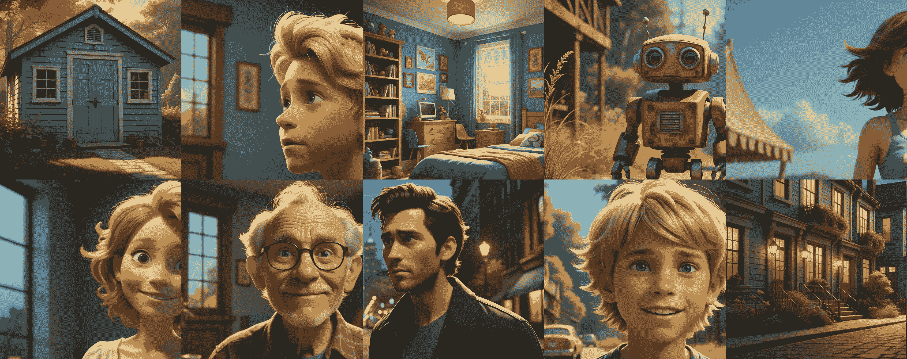

样式输入图像

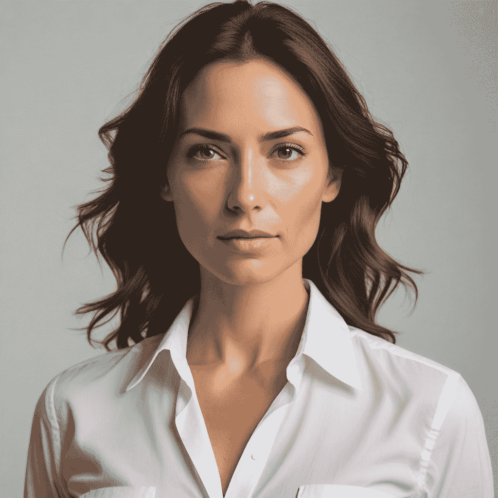

面部输入图像

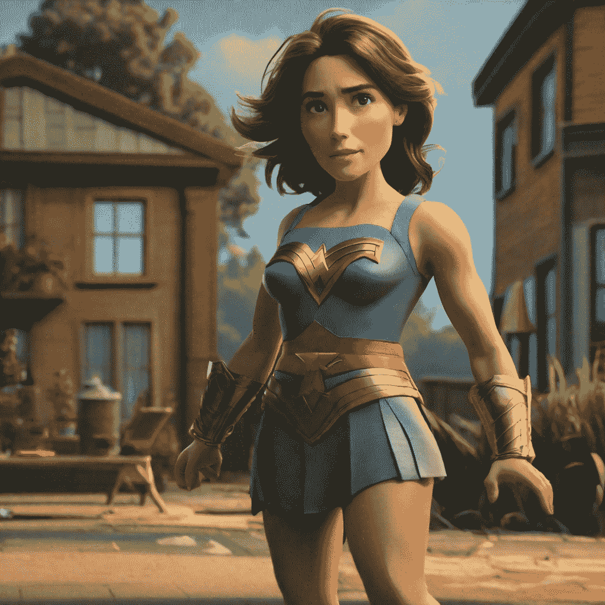

输出图像

### LCM-Lora

您可以使用 IP-适配器与 LCM-Lora 一起实现使用自定义图像的“即时微调”。请注意，在加载 LCM-Lora 权重之前，您需要加载 IP-适配器权重。

```py
from diffusers import DiffusionPipeline, LCMScheduler
import torch
from diffusers.utils import load_image

model_id =  "sd-dreambooth-library/herge-style"
lcm_lora_id = "latent-consistency/lcm-lora-sdv1-5"

pipe = DiffusionPipeline.from_pretrained(model_id, torch_dtype=torch.float16)

pipe.load_ip_adapter("h94/IP-Adapter", subfolder="models", weight_name="ip-adapter_sd15.bin")
pipe.load_lora_weights(lcm_lora_id)
pipe.scheduler = LCMScheduler.from_config(pipe.scheduler.config)
pipe.enable_model_cpu_offload()

prompt = "best quality, high quality"
image = load_image("https://user-images.githubusercontent.com/24734142/266492875-2d50d223-8475-44f0-a7c6-08b51cb53572.png")
images = pipe(
    prompt=prompt,
    ip_adapter_image=image,
    num_inference_steps=4,
    guidance_scale=1,
).images[0]
```

### 其他管道

IP-适配器与任何使用文本提示和使用稳定扩散或稳定扩散 XL 检查点的管道兼容。要在不同管道中使用 IP-适配器，您只需要在创建管道后运行`load_ip_adapter()`方法，然后将您的图像作为`ip_adapter_image`传递给管道

🤗扩散器目前仅支持与一些最受欢迎的管道一起使用 IP-适配器，如果您有一个很酷的用例并需要将 IP 适配器集成到尚不支持的管道中，请随时提出[功能请求](https://github.com/huggingface/diffusers/issues/new/choose)！

您可以在下面找到如何使用 IP-适配器与 ControlNet 和 AnimateDiff 的示例。

ControlNetAnimateDiff

```py
from diffusers import StableDiffusionControlNetPipeline, ControlNetModel
import torch
from diffusers.utils import load_image

controlnet_model_path = "lllyasviel/control_v11f1p_sd15_depth"
controlnet = ControlNetModel.from_pretrained(controlnet_model_path, torch_dtype=torch.float16)

pipeline = StableDiffusionControlNetPipeline.from_pretrained(
    "runwayml/stable-diffusion-v1-5", controlnet=controlnet, torch_dtype=torch.float16)
pipeline.to("cuda")

image = load_image("https://huggingface.co/datasets/YiYiXu/testing-images/resolve/main/statue.png")
depth_map = load_image("https://huggingface.co/datasets/YiYiXu/testing-images/resolve/main/depth.png")

pipeline.load_ip_adapter("h94/IP-Adapter", subfolder="models", weight_name="ip-adapter_sd15.bin")

generator = torch.Generator(device="cpu").manual_seed(33)
images = pipeline(
    prompt='best quality, high quality', 
    image=depth_map,
    ip_adapter_image=image,
    negative_prompt="monochrome, lowres, bad anatomy, worst quality, low quality", 
    num_inference_steps=50,
    generator=generator,
).images
images[0]
```

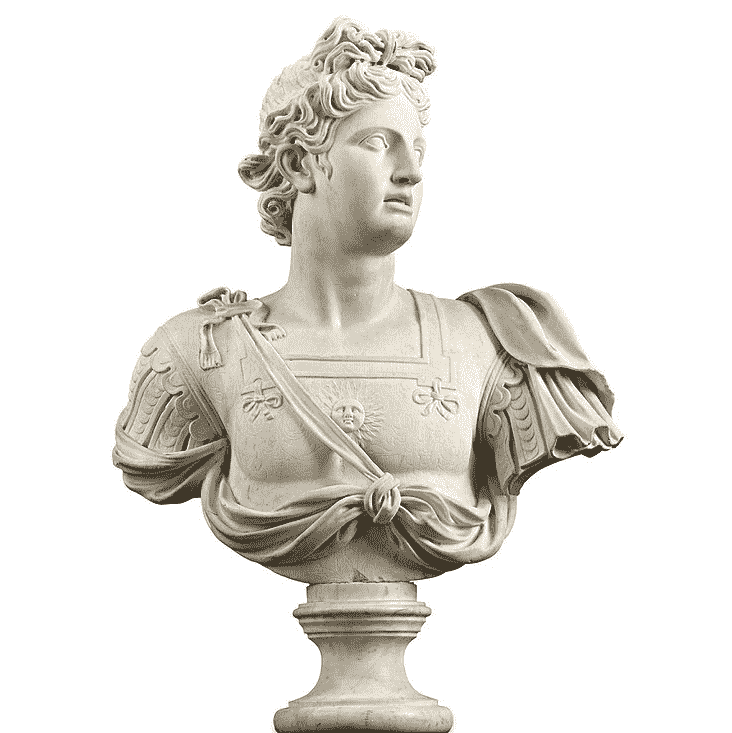

输入图像

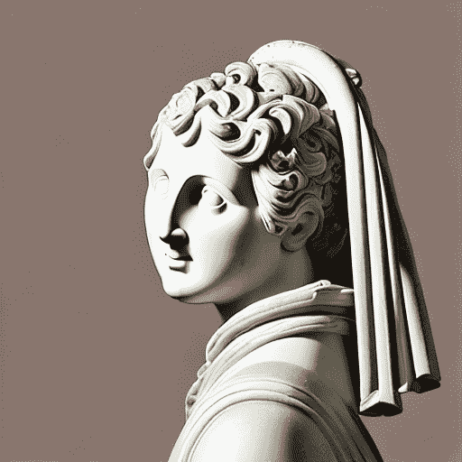

调整后的图像
