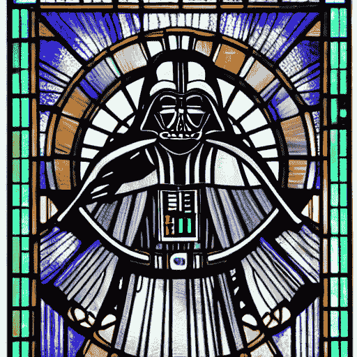
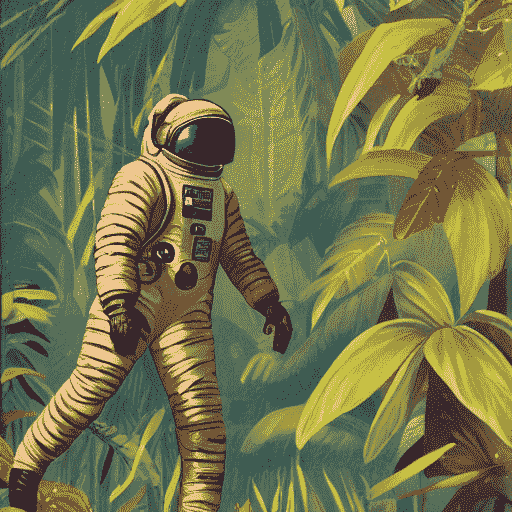
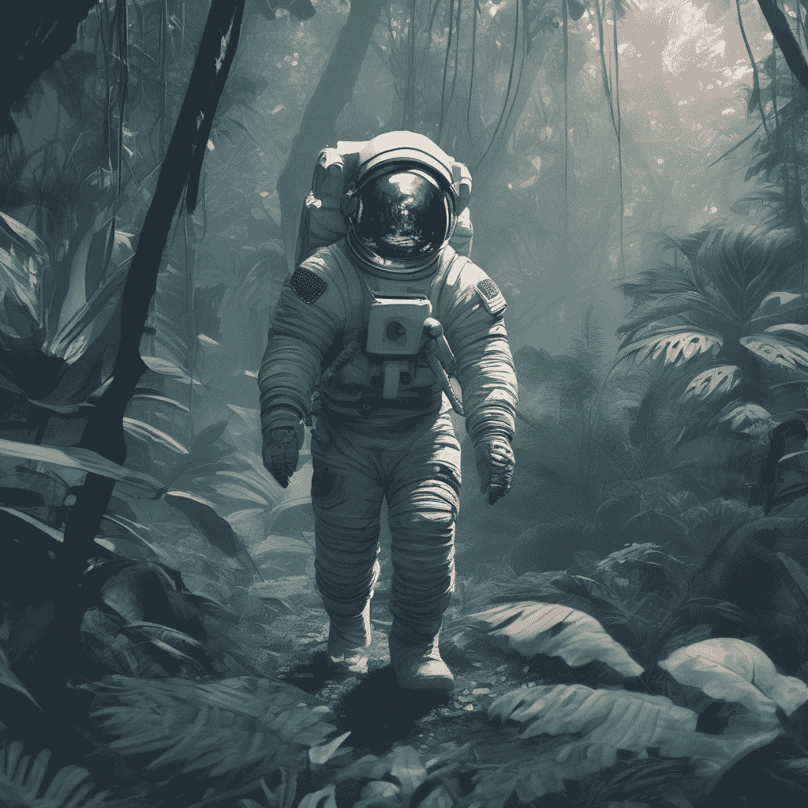
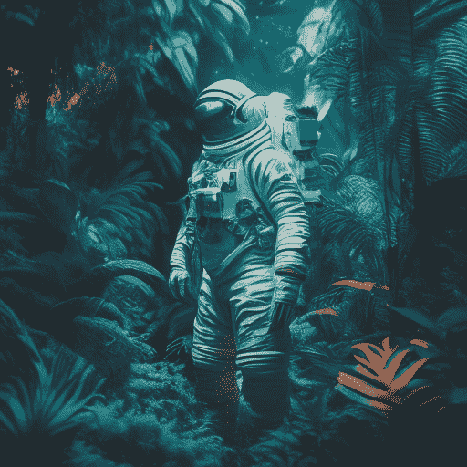
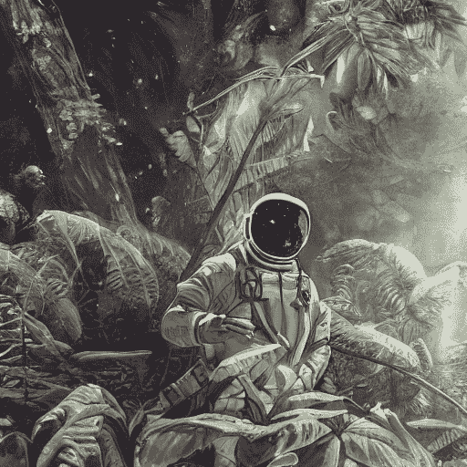

# 文本到图像

> 原始文本：[`huggingface.co/docs/diffusers/using-diffusers/conditional_image_generation`](https://huggingface.co/docs/diffusers/using-diffusers/conditional_image_generation)

当谈到扩散模型时，文本到图像通常是首先想到的。文本到图像从文本描述（例如，“太空人在丛林中，冷色调，柔和的颜色，详细，8k”）生成图像，这也被称为*提示*。

从一个非常高的层面来看，扩散模型接受一个提示和一些随机的初始噪声，并迭代地去除噪声以构建图像。*去噪*过程由提示引导，一旦去噪过程在预定数量的时间步骤之后结束，图像表示将被解码成图像。

阅读[稳定扩散是如何工作的？](https://huggingface.co/blog/stable_diffusion#how-does-stable-diffusion-work)博文，了解潜在扩散模型的工作原理。

您可以在🤗 Diffusers 中通过两个步骤从提示生成图像：

1.  将检查点加载到 AutoPipelineForText2Image 类中，该类会根据检查点自动检测要使用的适当管道类：

```py
from diffusers import AutoPipelineForText2Image
import torch

pipeline = AutoPipelineForText2Image.from_pretrained(
	"runwayml/stable-diffusion-v1-5", torch_dtype=torch.float16, variant="fp16"
).to("cuda")
```

1.  将提示传递给管道以生成图像：

```py
image = pipeline(
	"stained glass of darth vader, backlight, centered composition, masterpiece, photorealistic, 8k"
).images[0]
image
```



## 热门模型

最常见的文本到图像模型是[稳定扩散 v1.5](https://huggingface.co/runwayml/stable-diffusion-v1-5)、[稳定扩散 XL（SDXL）](https://huggingface.co/stabilityai/stable-diffusion-xl-base-1.0)和[坎丁斯基 2.2](https://huggingface.co/kandinsky-community/kandinsky-2-2-decoder)。还有 ControlNet 模型或适配器，可以与文本到图像模型一起使用，以更直接地控制生成图像。由于它们的架构和训练过程不同，每个模型的结果略有不同，但无论选择哪个模型，它们的使用方式基本相同。让我们为每个模型使用相同的提示并比较它们的结果。

### 稳定扩散 v1.5

[稳定扩散 v1.5](https://huggingface.co/runwayml/stable-diffusion-v1-5)是一个从[稳定扩散 v1-4](https://huggingface.co/CompVis/stable-diffusion-v1-4)初始化的潜在扩散模型，并在 LAION-Aesthetics V2 数据集的 512x512 图像上进行了 595K 步的微调。您可以像这样使用这个模型：

```py
from diffusers import AutoPipelineForText2Image
import torch

pipeline = AutoPipelineForText2Image.from_pretrained(
	"runwayml/stable-diffusion-v1-5", torch_dtype=torch.float16, variant="fp16"
).to("cuda")
generator = torch.Generator("cuda").manual_seed(31)
image = pipeline("Astronaut in a jungle, cold color palette, muted colors, detailed, 8k", generator=generator).images[0]
image
```

### 稳定扩散 XL

SDXL 是之前稳定扩散模型的一个更大版本，涉及一个两阶段模型过程，为图像添加了更多细节。它还包括一些额外的*微调*来生成以中心主题为中心的高质量图像。查看更全面的 SDXL 指南，了解如何使用它。一般来说，您可以像这样使用 SDXL：

```py
from diffusers import AutoPipelineForText2Image
import torch

pipeline = AutoPipelineForText2Image.from_pretrained(
    "stabilityai/stable-diffusion-xl-base-1.0", torch_dtype=torch.float16, variant="fp16"
).to("cuda")
generator = torch.Generator("cuda").manual_seed(31)
image = pipeline("Astronaut in a jungle, cold color palette, muted colors, detailed, 8k", generator=generator).images[0]
image
```

### 坎丁斯基 2.2

坎丁斯基模型与稳定扩散模型有些不同，因为它还使用图像先验模型来创建嵌入，这些嵌入用于更好地对齐扩散模型中的文本和图像。

使用坎丁斯基 2.2 的最简单方法是：

```py
from diffusers import AutoPipelineForText2Image
import torch

pipeline = AutoPipelineForText2Image.from_pretrained(
	"kandinsky-community/kandinsky-2-2-decoder", torch_dtype=torch.float16
).to("cuda")
generator = torch.Generator("cuda").manual_seed(31)
image = pipeline("Astronaut in a jungle, cold color palette, muted colors, detailed, 8k", generator=generator).images[0]
image
```

### ControlNet

ControlNet 模型是辅助模型或适配器，它们在文本到图像模型的基础上进行微调，例如[稳定扩散 v1.5](https://huggingface.co/runwayml/stable-diffusion-v1-5)。将 ControlNet 模型与文本到图像模型结合使用，可以提供更多明确控制生成图像的选项。使用 ControlNet，您可以向模型添加额外的条件输入图像。例如，如果您提供一个人体姿势的图像（通常表示为连接成骨架的多个关键点）作为条件输入，模型将生成遵循图像姿势的图像。查看更详细的 ControlNet 指南，了解其他条件输入以及如何使用它们。

在这个例子中，让我们用一个人体姿势估计图像来调节 ControlNet。加载预训练的用于人体姿势估计的 ControlNet 模型：

```py
from diffusers import ControlNetModel, AutoPipelineForText2Image
from diffusers.utils import load_image
import torch

controlnet = ControlNetModel.from_pretrained(
	"lllyasviel/control_v11p_sd15_openpose", torch_dtype=torch.float16, variant="fp16"
).to("cuda")
pose_image = load_image("https://huggingface.co/lllyasviel/control_v11p_sd15_openpose/resolve/main/images/control.png")
```

将`controlnet`传递给 AutoPipelineForText2Image，并提供提示和姿势估计图像：

```py
pipeline = AutoPipelineForText2Image.from_pretrained(
	"runwayml/stable-diffusion-v1-5", controlnet=controlnet, torch_dtype=torch.float16, variant="fp16"
).to("cuda")
generator = torch.Generator("cuda").manual_seed(31)
image = pipeline("Astronaut in a jungle, cold color palette, muted colors, detailed, 8k", image=pose_image, generator=generator).images[0]
image
```



稳定扩散 v1.5



稳定扩散 XL



康定斯基 2.2


ControlNet（姿势调节）

## 配置管道参数

管道中有许多可以配置的参数会影响图像的生成方式。您可以更改图像的输出尺寸，指定负面提示以改善图像质量等。本节将深入探讨如何使用这些参数。

### 高度和宽度

`height`和`width`参数控制生成图像的高度和宽度（以像素为单位）。默认情况下，稳定扩散 v1.5 模型输出 512x512 的图像，但您可以将其更改为任何是 8 的倍数的尺寸。例如，要创建一个矩形图像：

```py
from diffusers import AutoPipelineForText2Image
import torch

pipeline = AutoPipelineForText2Image.from_pretrained(
	"runwayml/stable-diffusion-v1-5", torch_dtype=torch.float16, variant="fp16"
).to("cuda")
image = pipeline(
	"Astronaut in a jungle, cold color palette, muted colors, detailed, 8k", height=768, width=512
).images[0]
image
```


其他模型可能具有不同的默认图像尺寸，具体取决于训练数据集中的图像尺寸。例如，SDXL 的默认图像尺寸为 1024x1024，使用较低的`height`和`width`值可能会导致图像质量降低。确保您首先检查模型的 API 参考！

### 引导比例

`guidance_scale`参数影响提示对图像生成的影响程度。较低的值使模型具有“创造力”，生成与提示更松散相关的图像。较高的`guidance_scale`值会促使模型更紧密地遵循提示，如果这个值太高，您可能会观察到生成图像中的一些伪影。

```py
from diffusers import AutoPipelineForText2Image
import torch

pipeline = AutoPipelineForText2Image.from_pretrained(
	"runwayml/stable-diffusion-v1-5", torch_dtype=torch.float16
).to("cuda")
image = pipeline(
	"Astronaut in a jungle, cold color palette, muted colors, detailed, 8k", guidance_scale=3.5
).images[0]
image
```



guidance_scale = 2.5


guidance_scale = 7.5


guidance_scale = 10.5

### 负面提示

就像提示引导生成一样，*负面提示*会将模型引导远离您不希望模型生成的内容。这通常用于通过消除“低分辨率”或“糟糕细节”等不良图像特征来提高整体图像质量。您还可以使用负面提示来删除或修改图像的内容和风格。

```py
from diffusers import AutoPipelineForText2Image
import torch

pipeline = AutoPipelineForText2Image.from_pretrained(
	"runwayml/stable-diffusion-v1-5", torch_dtype=torch.float16
).to("cuda")
image = pipeline(
	prompt="Astronaut in a jungle, cold color palette, muted colors, detailed, 8k",
	negative_prompt="ugly, deformed, disfigured, poor details, bad anatomy",
).images[0]
image
```


negative_prompt = "丑陋，畸形，毁容，细节差，解剖不良"


negative_prompt = "astronaut"

### 生成器

[`torch.Generator`](https://pytorch.org/docs/stable/generated/torch.Generator.html#generator)对象通过设置手动种子来实现管道中的可重现性。您可以使用`Generator`生成图像批次，并根据使用确定性生成改善图像质量指南中的详细说明逐步改进从种子生成的图像。

您可以设置一个种子和`Generator`如下所示。使用`Generator`创建图像应该每次返回相同的结果，而不是随机生成新图像。

```py
from diffusers import AutoPipelineForText2Image
import torch

pipeline = AutoPipelineForText2Image.from_pretrained(
	"runwayml/stable-diffusion-v1-5", torch_dtype=torch.float16
).to("cuda")
generator = torch.Generator(device="cuda").manual_seed(30)
image = pipeline(
	"Astronaut in a jungle, cold color palette, muted colors, detailed, 8k",
	generator=generator,
).images[0]
image
```

## 控制图像生成

除了配置管道参数外，还有几种方法可以更好地控制图像生成，例如提示加权和 ControlNet 模型。

### Prompt 加权

Prompt 加权是一种增加或减少提示中概念重要性的技术，以强调或最小化图像中的某些特征。我们建议使用[Compel](https://github.com/damian0815/compel)库来帮助您生成加权的提示嵌入。

了解如何在 Prompt 加权指南中创建提示嵌入。本例重点介绍如何在管道中使用提示嵌入。

创建嵌入后，您可以将它们传递给管道中的`prompt_embeds`（如果您使用负提示，则还有`negative_prompt_embeds`参数）。

```py
from diffusers import AutoPipelineForText2Image
import torch

pipeline = AutoPipelineForText2Image.from_pretrained(
	"runwayml/stable-diffusion-v1-5", torch_dtype=torch.float16
).to("cuda")
image = pipeline(
	prompt_embeds=prompt_embeds, # generated from Compel
	negative_prompt_embeds=negative_prompt_embeds, # generated from Compel
).images[0]
```

### ControlNet

在 ControlNet 部分中，正如您所看到的，这些模型通过引入额外的条件图像输入，提供了一种更灵活和准确的生成图像的方式。每个 ControlNet 模型都是在特定类型的条件图像上预训练的，以生成类似的新图像。例如，如果您使用一个在深度图上预训练的 ControlNet 模型，您可以将深度图作为条件输入给模型，它将生成保留其中空间信息的图像。这比在提示中指定深度信息更快更容易。您甚至可以将多个条件输入与 MultiControlNet 结合使用！

您可以使用许多类型的条件输入，并且🤗 Diffusers 支持 Stable Diffusion 和 SDXL 模型的 ControlNet。查看更全面的 ControlNet 指南，了解如何使用这些模型。

## 优化

扩散模型很大，对图像进行去噪的迭代性质在计算上是昂贵且密集的。但这并不意味着您需要访问强大的 - 或者甚至很多 - GPU 来使用它们。有许多优化技术可用于在消费者和免费资源上运行扩散模型。例如，您可以将模型权重加载为半精度以节省 GPU 内存并提高速度，或者将整个模型卸载到 GPU 以节省更多内存。

PyTorch 2.0 还支持一种更节省内存的注意机制，称为*缩放点积注意*，如果您使用 PyTorch 2.0，则会自动启用。您可以将其与[`torch.compile`](https://pytorch.org/tutorials/intermediate/torch_compile_tutorial.html)结合使用，以进一步加快代码速度：

```py
from diffusers import AutoPipelineForText2Image
import torch

pipeline = AutoPipelineForText2Image.from_pretrained("runwayml/stable-diffusion-v1-5", torch_dtype=torch.float16, variant="fp16").to("cuda")
pipeline.unet = torch.compile(pipeline.unet, mode="reduce-overhead", fullgraph=True)
```

有关如何优化代码以节省内存和加快推理速度的更多提示，请阅读内存和速度和 Torch 2.0 指南。
