# 修复

> 原文链接：[`huggingface.co/docs/diffusers/using-diffusers/inpaint`](https://huggingface.co/docs/diffusers/using-diffusers/inpaint)

修复替换或编辑图像的特定区域。这使得它成为像去除缺陷和伪影，甚至用全新内容替换图像区域等图像恢复的有用工具。修复依赖于蒙版来确定要填充图像的哪些区域；要修复的区域由白色像素表示，要保留的区域由黑色像素表示。白色像素由提示填充。

使用🤗 Diffusers，以下是您可以进行修复的方法：

1.  使用 AutoPipelineForInpainting 类加载修复检查点。这将根据检查点自动检测要加载的适当管道类：

```py
import torch
from diffusers import AutoPipelineForInpainting
from diffusers.utils import load_image, make_image_grid

pipeline = AutoPipelineForInpainting.from_pretrained(
    "kandinsky-community/kandinsky-2-2-decoder-inpaint", torch_dtype=torch.float16
)
pipeline.enable_model_cpu_offload()
# remove following line if xFormers is not installed or you have PyTorch 2.0 or higher installed
pipeline.enable_xformers_memory_efficient_attention()
```

在整个指南中，您会注意到我们使用 enable_model_cpu_offload()和 enable_xformers_memory_efficient_attention()，以节省内存并提高推理速度。如果您使用 PyTorch 2.0，则不需要在管道上调用 enable_xformers_memory_efficient_attention()，因为它已经在使用 PyTorch 2.0 的本机 scaled-dot product attention。

1.  加载基础图像和蒙版图像：

```py
init_image = load_image("https://huggingface.co/datasets/huggingface/documentation-images/resolve/main/diffusers/inpaint.png")
mask_image = load_image("https://huggingface.co/datasets/huggingface/documentation-images/resolve/main/diffusers/inpaint_mask.png")
```

1.  创建一个用于修复图像的提示，并将其传递给具有基础图像和蒙版图像的管道：

```py
prompt = "a black cat with glowing eyes, cute, adorable, disney, pixar, highly detailed, 8k"
negative_prompt = "bad anatomy, deformed, ugly, disfigured"
image = pipeline(prompt=prompt, negative_prompt=negative_prompt, image=init_image, mask_image=mask_image).images[0]
make_image_grid([init_image, mask_image, image], rows=1, cols=3)
```

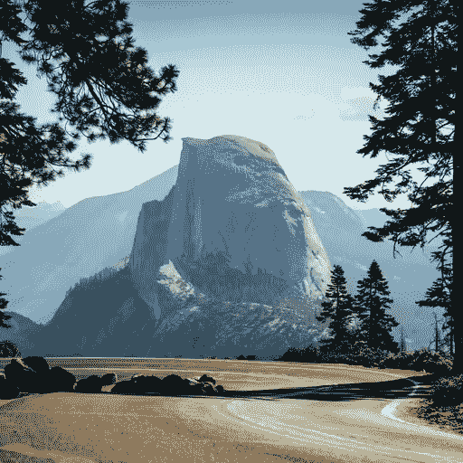

基础图像

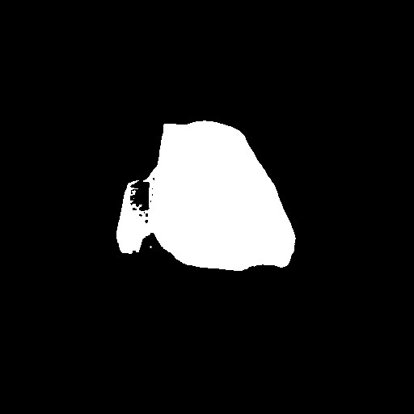

蒙版图像

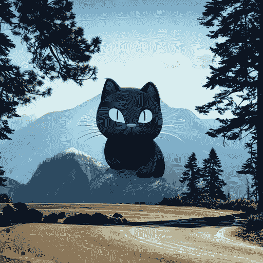

生成的图像

## 创建一个蒙版图像

在整个指南中，蒙版图像在所有代码示例中都提供了，以方便使用。您可以对自己的图像进行修复，但需要为其创建一个蒙版图像。使用下面的空间轻松创建一个蒙版图像。

上传一个基础图像进行修复，并使用草图工具绘制蒙版。完成后，点击**运行**生成并下载蒙版图像。

[`stevhliu-inpaint-mask-maker.hf.space`](https://stevhliu-inpaint-mask-maker.hf.space)

### 蒙版模糊

`~VaeImageProcessor.blur`方法提供了如何混合原始图像和修复区域的选项。模糊程度由`blur_factor`参数确定。增加`blur_factor`会增加应用于蒙版边缘的模糊量，软化原始图像和修复区域之间的过渡。低或零的`blur_factor`会保留蒙版的更清晰边缘。

要使用此功能，请使用图像处理器创建一个模糊的蒙版。

```py
import torch
from diffusers import AutoPipelineForInpainting
from diffusers.utils import load_image
from PIL import Image

pipeline = AutoPipelineForInpainting.from_pretrained("runwayml/stable-diffusion-v1-5", torch_dtype=torch.float16).to('cuda')

mask = load_image("https://huggingface.co/datasets/YiYiXu/testing-images/resolve/main/seashore_mask.png")
blurred_mask = pipeline.mask_processor.blur(mask, blur_factor=33)
blurred_mask
```


无模糊的蒙版

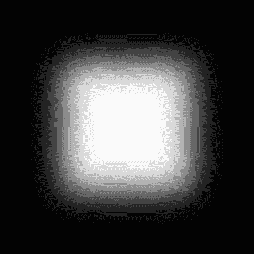

应用了模糊的蒙版

## 热门模型

[稳定扩散修复](https://huggingface.co/runwayml/stable-diffusion-inpainting)、[稳定扩散 XL（SDXL）修复](https://huggingface.co/diffusers/stable-diffusion-xl-1.0-inpainting-0.1)和[Kandinsky 2.2 修复](https://huggingface.co/kandinsky-community/kandinsky-2-2-decoder-inpaint)是修复中最受欢迎的模型之一。SDXL 通常比稳定扩散 v1.5 生成更高分辨率的图像，而 Kandinsky 2.2 也能够生成高质量的图像。

### 稳定扩散修复

稳定扩散修复是一个在修复上进行微调的潜在扩散模型，适用于 512x512 图像。这是一个很好的起点，因为它相对快速并生成高质量的图像。要将此模型用于修复，您需要将提示、基础图像和蒙版图像传递给管道：

```py
import torch
from diffusers import AutoPipelineForInpainting
from diffusers.utils import load_image, make_image_grid

pipeline = AutoPipelineForInpainting.from_pretrained(
    "runwayml/stable-diffusion-inpainting", torch_dtype=torch.float16, variant="fp16"
)
pipeline.enable_model_cpu_offload()
# remove following line if xFormers is not installed or you have PyTorch 2.0 or higher installed
pipeline.enable_xformers_memory_efficient_attention()

# load base and mask image
init_image = load_image("https://huggingface.co/datasets/huggingface/documentation-images/resolve/main/diffusers/inpaint.png")
mask_image = load_image("https://huggingface.co/datasets/huggingface/documentation-images/resolve/main/diffusers/inpaint_mask.png")

generator = torch.Generator("cuda").manual_seed(92)
prompt = "concept art digital painting of an elven castle, inspired by lord of the rings, highly detailed, 8k"
image = pipeline(prompt=prompt, image=init_image, mask_image=mask_image, generator=generator).images[0]
make_image_grid([init_image, mask_image, image], rows=1, cols=3)
```

### 稳定扩散 XL（SDXL）修复

SDXL 是稳定扩散 v1.5 的更大更强大的版本。该模型可以遵循两阶段模型过程（尽管每个模型也可以单独使用）；基础模型生成图像，精化模型接收该图像并进一步增强其细节和质量。查看 SDXL 指南，了解如何使用 SDXL 并配置其参数的更全面指南。

```py
import torch
from diffusers import AutoPipelineForInpainting
from diffusers.utils import load_image, make_image_grid

pipeline = AutoPipelineForInpainting.from_pretrained(
    "diffusers/stable-diffusion-xl-1.0-inpainting-0.1", torch_dtype=torch.float16, variant="fp16"
)
pipeline.enable_model_cpu_offload()
# remove following line if xFormers is not installed or you have PyTorch 2.0 or higher installed
pipeline.enable_xformers_memory_efficient_attention()

# load base and mask image
init_image = load_image("https://huggingface.co/datasets/huggingface/documentation-images/resolve/main/diffusers/inpaint.png")
mask_image = load_image("https://huggingface.co/datasets/huggingface/documentation-images/resolve/main/diffusers/inpaint_mask.png")

generator = torch.Generator("cuda").manual_seed(92)
prompt = "concept art digital painting of an elven castle, inspired by lord of the rings, highly detailed, 8k"
image = pipeline(prompt=prompt, image=init_image, mask_image=mask_image, generator=generator).images[0]
make_image_grid([init_image, mask_image, image], rows=1, cols=3)
```

### Kandinsky 2.2 修复

Kandinsky 模型系列类似于 SDXL，因为它也使用两个模型；图像先验模型创建图像嵌入，扩散模型从中生成图像。您可以分别加载图像先验和扩散模型，但使用 Kandinsky 2.2 的最简单方法是将其加载到 AutoPipelineForInpainting 类中，该类在底层使用 KandinskyV22InpaintCombinedPipeline。

```py
import torch
from diffusers import AutoPipelineForInpainting
from diffusers.utils import load_image, make_image_grid

pipeline = AutoPipelineForInpainting.from_pretrained(
    "kandinsky-community/kandinsky-2-2-decoder-inpaint", torch_dtype=torch.float16
)
pipeline.enable_model_cpu_offload()
# remove following line if xFormers is not installed or you have PyTorch 2.0 or higher installed
pipeline.enable_xformers_memory_efficient_attention()

# load base and mask image
init_image = load_image("https://huggingface.co/datasets/huggingface/documentation-images/resolve/main/diffusers/inpaint.png")
mask_image = load_image("https://huggingface.co/datasets/huggingface/documentation-images/resolve/main/diffusers/inpaint_mask.png")

generator = torch.Generator("cuda").manual_seed(92)
prompt = "concept art digital painting of an elven castle, inspired by lord of the rings, highly detailed, 8k"
image = pipeline(prompt=prompt, image=init_image, mask_image=mask_image, generator=generator).images[0]
make_image_grid([init_image, mask_image, image], rows=1, cols=3)
```


基础图像

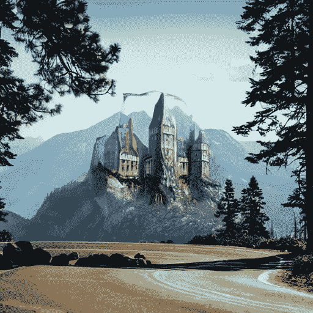

稳定扩散修复

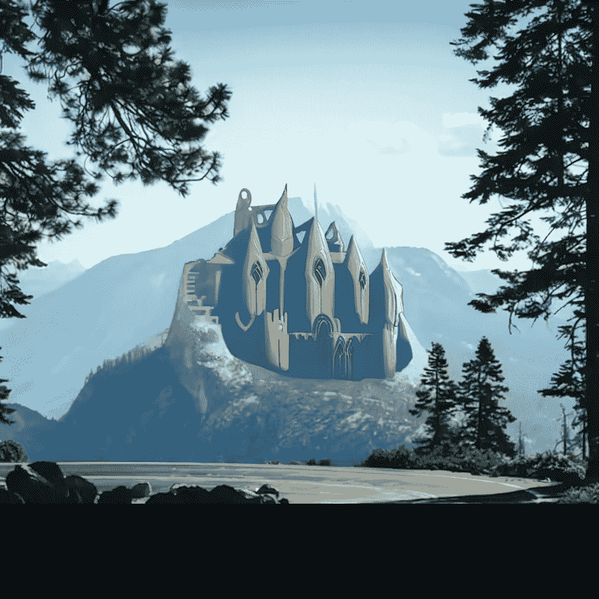

稳定扩散 XL 修复

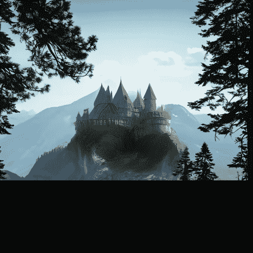

Kandinsky 2.2 修复

## 非修复特定检查点

到目前为止，本指南已使用修复特定检查点，如[runwayml/stable-diffusion-inpainting](https://huggingface.co/runwayml/stable-diffusion-inpainting)。但您也可以使用常规检查点，如[runwayml/stable-diffusion-v1-5](https://huggingface.co/runwayml/stable-diffusion-v1-5)。让我们比较这两个检查点的结果。

左侧的图像是从常规检查点生成的，右侧的图像是从修复检查点生成的。您会立即注意到左侧的图像不够清晰，仍然可以看到模型应该修复的区域的轮廓。右侧的图像更清晰，修复区域看起来更自然。

runwayml/stable-diffusion-v1-5runwayml/stable-diffusion-inpainting

```py
import torch
from diffusers import AutoPipelineForInpainting
from diffusers.utils import load_image, make_image_grid

pipeline = AutoPipelineForInpainting.from_pretrained(
    "runwayml/stable-diffusion-v1-5", torch_dtype=torch.float16, variant="fp16"
).to("cuda")
pipeline.enable_model_cpu_offload()
# remove following line if xFormers is not installed or you have PyTorch 2.0 or higher installed
pipeline.enable_xformers_memory_efficient_attention()

# load base and mask image
init_image = load_image("https://huggingface.co/datasets/huggingface/documentation-images/resolve/main/diffusers/inpaint.png")
mask_image = load_image("https://huggingface.co/datasets/huggingface/documentation-images/resolve/main/diffusers/inpaint_mask.png")

generator = torch.Generator("cuda").manual_seed(92)
prompt = "concept art digital painting of an elven castle, inspired by lord of the rings, highly detailed, 8k"
image = pipeline(prompt=prompt, image=init_image, mask_image=mask_image, generator=generator).images[0]
make_image_grid([init_image, image], rows=1, cols=2)
```

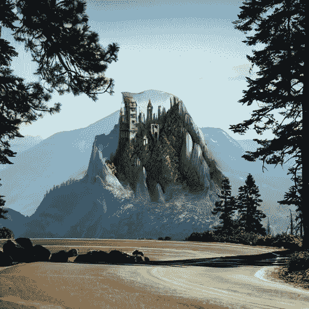

runwayml/stable-diffusion-v1-5

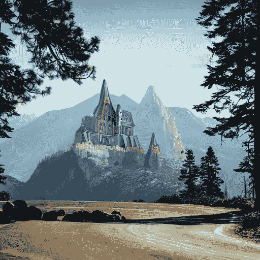

runwayml/stable-diffusion-inpainting

然而，对于更基本的任务，比如从图像中擦除一个对象（比如道路上的岩石），常规检查点会产生相当不错的结果。常规检查点和修复检查点之间的差异不太明显。

runwayml/stable-diffusion-v1-5runwayml/stable-diffusion-inpaint

```py
import torch
from diffusers import AutoPipelineForInpainting
from diffusers.utils import load_image, make_image_grid

pipeline = AutoPipelineForInpainting.from_pretrained(
    "runwayml/stable-diffusion-v1-5", torch_dtype=torch.float16, variant="fp16"
).to("cuda")
pipeline.enable_model_cpu_offload()
# remove following line if xFormers is not installed or you have PyTorch 2.0 or higher installed
pipeline.enable_xformers_memory_efficient_attention()

# load base and mask image
init_image = load_image("https://huggingface.co/datasets/huggingface/documentation-images/resolve/main/diffusers/inpaint.png")
mask_image = load_image("https://huggingface.co/datasets/huggingface/documentation-images/resolve/main/diffusers/road-mask.png")

image = pipeline(prompt="road", image=init_image, mask_image=mask_image).images[0]
make_image_grid([init_image, image], rows=1, cols=2)
```

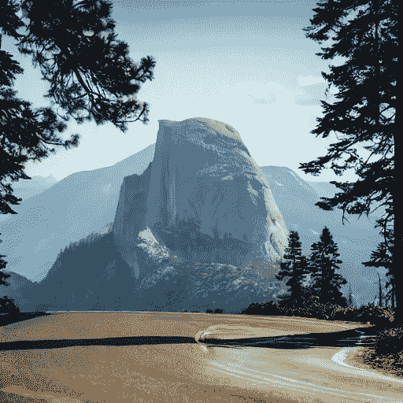

runwayml/stable-diffusion-v1-5

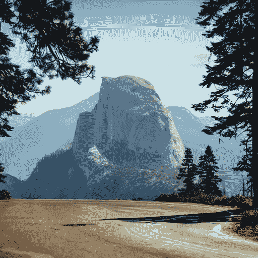

runwayml/stable-diffusion-inpainting

使用非修复特定检查点的折衷是整体图像质量可能较低，但通常倾向于保留蒙版区域（这就是为什么您可以看到蒙版轮廓）。修复特定检查点经过有意训练，以生成更高质量的修复图像，这包括在蒙版和非蒙版区域之间创建更自然的过渡。因此，这些检查点更有可能改变您的非蒙版区域。

如果保留非蒙版区域对您的任务很重要，您可以使用`VaeImageProcessor.apply_overlay`方法，强制图像的非蒙版区域保持不变，但会以一些更不自然的过渡为代价。

```py
import PIL
import numpy as np
import torch

from diffusers import AutoPipelineForInpainting
from diffusers.utils import load_image, make_image_grid

device = "cuda"
pipeline = AutoPipelineForInpainting.from_pretrained(
    "runwayml/stable-diffusion-inpainting",
    torch_dtype=torch.float16,
)
pipeline = pipeline.to(device)

img_url = "https://raw.githubusercontent.com/CompVis/latent-diffusion/main/data/inpainting_examples/overture-creations-5sI6fQgYIuo.png"
mask_url = "https://raw.githubusercontent.com/CompVis/latent-diffusion/main/data/inpainting_examples/overture-creations-5sI6fQgYIuo_mask.png"

init_image = load_image(img_url).resize((512, 512))
mask_image = load_image(mask_url).resize((512, 512))

prompt = "Face of a yellow cat, high resolution, sitting on a park bench"
repainted_image = pipeline(prompt=prompt, image=init_image, mask_image=mask_image).images[0]
repainted_image.save("repainted_image.png")

unmasked_unchanged_image = pipeline.image_processor.apply_overlay(mask_image, init_image, repainted_image)
unmasked_unchanged_image.save("force_unmasked_unchanged.png")
make_image_grid([init_image, mask_image, repainted_image, unmasked_unchanged_image], rows=2, cols=2)
```

## 配置管道参数

图像特征 - 如质量和“创造力” - 取决于管道参数。了解这些参数的作用对于获得想要的结果很重要。让我们看看最重要的参数，并了解更改它们如何影响输出。

### 强度

`强度`是衡量向基础图像添加多少噪音的指标，这影响输出与基础图像的相似程度。

+   📈 高`强度`值意味着向图像添加更多噪音，去噪过程需要更长时间，但您将获得质量更高且与基础图像不同的图像

+   📉 低`强度`值意味着向图像添加的噪音较少，去噪过程更快，但图像质量可能不会很好，生成的图像更类似于基础图像

```py
import torch
from diffusers import AutoPipelineForInpainting
from diffusers.utils import load_image, make_image_grid

pipeline = AutoPipelineForInpainting.from_pretrained(
    "runwayml/stable-diffusion-inpainting", torch_dtype=torch.float16, variant="fp16"
)
pipeline.enable_model_cpu_offload()
# remove following line if xFormers is not installed or you have PyTorch 2.0 or higher installed
pipeline.enable_xformers_memory_efficient_attention()

# load base and mask image
init_image = load_image("https://huggingface.co/datasets/huggingface/documentation-images/resolve/main/diffusers/inpaint.png")
mask_image = load_image("https://huggingface.co/datasets/huggingface/documentation-images/resolve/main/diffusers/inpaint_mask.png")

prompt = "concept art digital painting of an elven castle, inspired by lord of the rings, highly detailed, 8k"
image = pipeline(prompt=prompt, image=init_image, mask_image=mask_image, strength=0.6).images[0]
make_image_grid([init_image, mask_image, image], rows=1, cols=3)
```

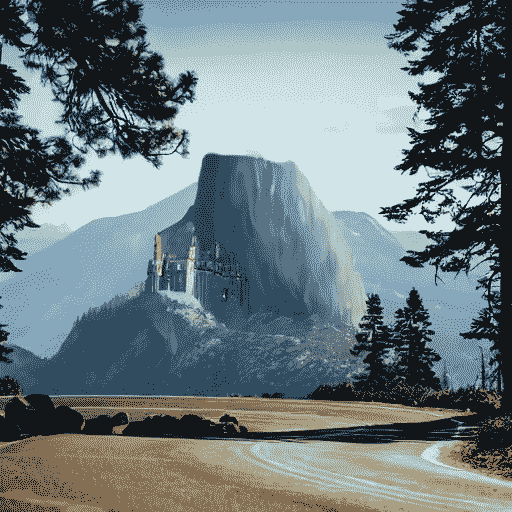

强度 = 0.6

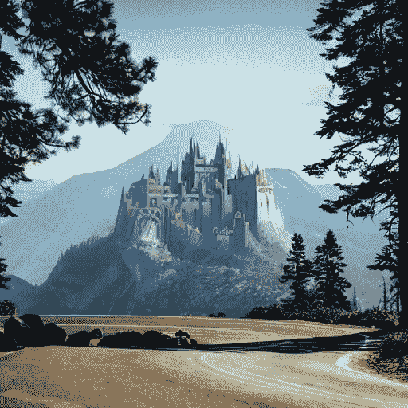

强度 = 0.8

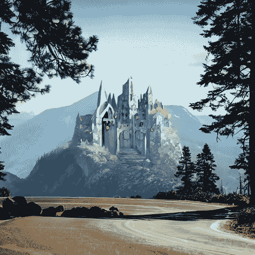

强度 = 1.0

### 引导比例

`guidance_scale`影响文本提示和生成图像的对齐程度。

+   📈 高`guidance_scale`值意味着提示和生成的图像紧密对齐，因此输出是对提示的更严格解释

+   📉 低`guidance_scale`值意味着提示和生成的图像更松散对齐，因此输出可能与提示更为不同

您可以同时使用`强度`和`guidance_scale`来更好地控制模型的表现。例如，高`强度`和`guidance_scale`值的组合给予模型最大的创造自由度。

```py
import torch
from diffusers import AutoPipelineForInpainting
from diffusers.utils import load_image, make_image_grid

pipeline = AutoPipelineForInpainting.from_pretrained(
    "runwayml/stable-diffusion-inpainting", torch_dtype=torch.float16, variant="fp16"
)
pipeline.enable_model_cpu_offload()
# remove following line if xFormers is not installed or you have PyTorch 2.0 or higher installed
pipeline.enable_xformers_memory_efficient_attention()

# load base and mask image
init_image = load_image("https://huggingface.co/datasets/huggingface/documentation-images/resolve/main/diffusers/inpaint.png")
mask_image = load_image("https://huggingface.co/datasets/huggingface/documentation-images/resolve/main/diffusers/inpaint_mask.png")

prompt = "concept art digital painting of an elven castle, inspired by lord of the rings, highly detailed, 8k"
image = pipeline(prompt=prompt, image=init_image, mask_image=mask_image, guidance_scale=2.5).images[0]
make_image_grid([init_image, mask_image, image], rows=1, cols=3)
```

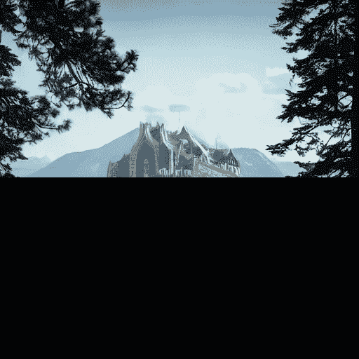

guidance_scale = 2.5

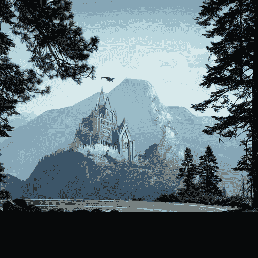

guidance_scale = 7.5


guidance_scale = 12.5

### 负提示

负提示扮演与提示相反角色的作用；它引导模型远离在图像中生成某些内容。这对于快速改善图像质量并防止模型生成您不想要的内容非常有用。

```py
import torch
from diffusers import AutoPipelineForInpainting
from diffusers.utils import load_image, make_image_grid

pipeline = AutoPipelineForInpainting.from_pretrained(
    "runwayml/stable-diffusion-inpainting", torch_dtype=torch.float16, variant="fp16"
)
pipeline.enable_model_cpu_offload()
# remove following line if xFormers is not installed or you have PyTorch 2.0 or higher installed
pipeline.enable_xformers_memory_efficient_attention()

# load base and mask image
init_image = load_image("https://huggingface.co/datasets/huggingface/documentation-images/resolve/main/diffusers/inpaint.png")
mask_image = load_image("https://huggingface.co/datasets/huggingface/documentation-images/resolve/main/diffusers/inpaint_mask.png")

prompt = "concept art digital painting of an elven castle, inspired by lord of the rings, highly detailed, 8k"
negative_prompt = "bad architecture, unstable, poor details, blurry"
image = pipeline(prompt=prompt, negative_prompt=negative_prompt, image=init_image, mask_image=mask_image).images[0]
make_image_grid([init_image, mask_image, image], rows=1, cols=3)
```

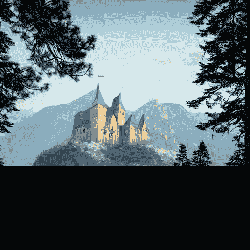

negative_prompt = "bad architecture, unstable, poor details, blurry"

### 填充蒙版裁剪

增加修复图像质量的一种方法是使用[`padding_mask_crop`](https://huggingface.co/docs/diffusers/v0.25.0/en/api/pipelines/stable_diffusion/inpaint#diffusers.StableDiffusionInpaintPipeline.__call__.padding_mask_crop)参数。启用此选项后，该选项将使用一些用户指定的填充裁剪掩码区域，并且还将从原始图像中裁剪相同区域。图像和掩码都将被放大到更高的分辨率进行修复，然后覆盖在原始图像上。这是一种快速简便的方法，可以在不使用单独的管道（如 StableDiffusionUpscalePipeline）的情况下改善图像质量。

在管道调用中添加`padding_mask_crop`参数，并将其设置为所需的填充值。

```py
import torch
from diffusers import AutoPipelineForInpainting
from diffusers.utils import load_image
from PIL import Image

generator = torch.Generator(device='cuda').manual_seed(0)
pipeline = AutoPipelineForInpainting.from_pretrained("runwayml/stable-diffusion-v1-5", torch_dtype=torch.float16).to('cuda')

base = load_image("https://huggingface.co/datasets/YiYiXu/testing-images/resolve/main/seashore.png")
mask = load_image("https://huggingface.co/datasets/YiYiXu/testing-images/resolve/main/seashore_mask.png")

image = pipeline("boat", image=base, mask_image=mask, strength=0.75, generator=generator, padding_mask_crop=32).images[0]
image
```

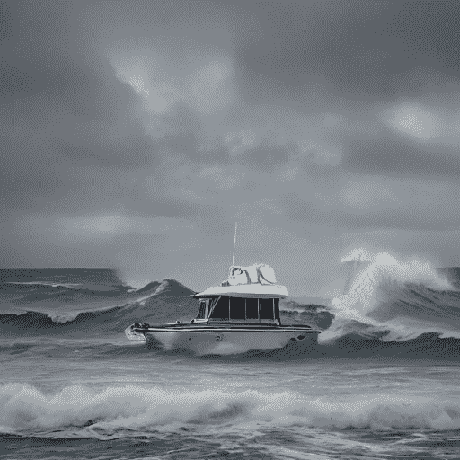

默认修复图像

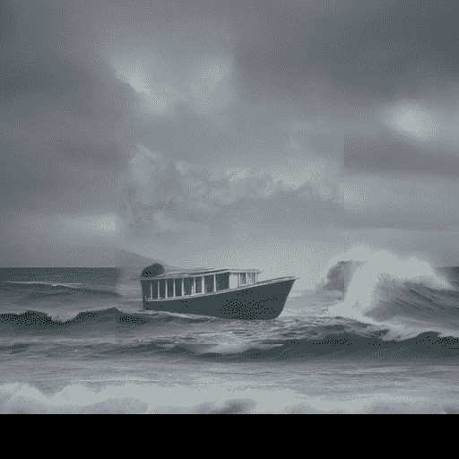

启用`padding_mask_crop`对图像进行修复

## 链接修复管道

AutoPipelineForInpainting 可以与其他🤗 Diffusers 管道链接以编辑它们的输出。这通常对于改善其他扩散管道的输出质量很有用，如果您使用多个管道，则将它们链接在一起以保持输出在潜在空间中并重复使用相同的管道组件可能更节省内存。

### 文本到图像到修复

链接文本到图像和修复管道允许您修复生成的图像，而无需提供基础图像。这使得编辑您喜欢的文本到图像输出变得更加方便，而无需生成全新的图像。

从文本到图像管道开始创建一个城堡：

```py
import torch
from diffusers import AutoPipelineForText2Image, AutoPipelineForInpainting
from diffusers.utils import load_image, make_image_grid

pipeline = AutoPipelineForText2Image.from_pretrained(
    "runwayml/stable-diffusion-v1-5", torch_dtype=torch.float16, variant="fp16", use_safetensors=True
)
pipeline.enable_model_cpu_offload()
# remove following line if xFormers is not installed or you have PyTorch 2.0 or higher installed
pipeline.enable_xformers_memory_efficient_attention()

text2image = pipeline("concept art digital painting of an elven castle, inspired by lord of the rings, highly detailed, 8k").images[0]
```

加载上述输出的蒙版图像：

```py
mask_image = load_image("https://huggingface.co/datasets/huggingface/documentation-images/resolve/main/diffusers/inpaint_text-chain-mask.png")
```

然后让我们用瀑布填补蒙版区域：

```py
pipeline = AutoPipelineForInpainting.from_pretrained(
    "kandinsky-community/kandinsky-2-2-decoder-inpaint", torch_dtype=torch.float16
)
pipeline.enable_model_cpu_offload()
# remove following line if xFormers is not installed or you have PyTorch 2.0 or higher installed
pipeline.enable_xformers_memory_efficient_attention()

prompt = "digital painting of a fantasy waterfall, cloudy"
image = pipeline(prompt=prompt, image=text2image, mask_image=mask_image).images[0]
make_image_grid([text2image, mask_image, image], rows=1, cols=3)
```

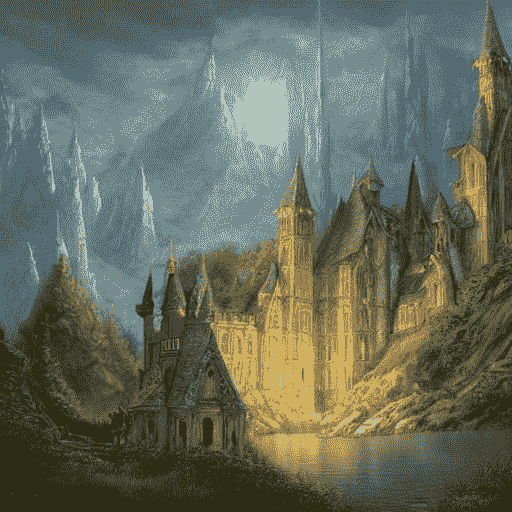

文本到图像

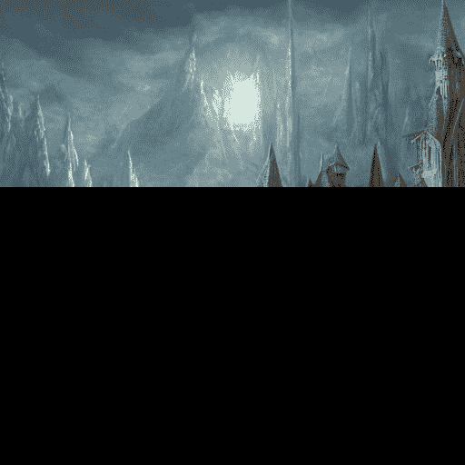

修复

### 修复到图像到图像

您还可以在另一个管道之前链接一个修复管道，如图像到图像或一个放大器，以提高质量。

从修复图像开始：

```py
import torch
from diffusers import AutoPipelineForInpainting, AutoPipelineForImage2Image
from diffusers.utils import load_image, make_image_grid

pipeline = AutoPipelineForInpainting.from_pretrained(
    "runwayml/stable-diffusion-inpainting", torch_dtype=torch.float16, variant="fp16"
)
pipeline.enable_model_cpu_offload()
# remove following line if xFormers is not installed or you have PyTorch 2.0 or higher installed
pipeline.enable_xformers_memory_efficient_attention()

# load base and mask image
init_image = load_image("https://huggingface.co/datasets/huggingface/documentation-images/resolve/main/diffusers/inpaint.png")
mask_image = load_image("https://huggingface.co/datasets/huggingface/documentation-images/resolve/main/diffusers/inpaint_mask.png")

prompt = "concept art digital painting of an elven castle, inspired by lord of the rings, highly detailed, 8k"
image_inpainting = pipeline(prompt=prompt, image=init_image, mask_image=mask_image).images[0]

# resize image to 1024x1024 for SDXL
image_inpainting = image_inpainting.resize((1024, 1024))
```

现在让我们将图像传递给另一个修复管道，使用 SDXL 的细化模型增强图像的细节和质量：

```py
pipeline = AutoPipelineForInpainting.from_pretrained(
    "stabilityai/stable-diffusion-xl-refiner-1.0", torch_dtype=torch.float16, variant="fp16"
)
pipeline.enable_model_cpu_offload()
# remove following line if xFormers is not installed or you have PyTorch 2.0 or higher installed
pipeline.enable_xformers_memory_efficient_attention()

image = pipeline(prompt=prompt, image=image_inpainting, mask_image=mask_image, output_type="latent").images[0]
```

在管道中指定`output_type="latent"`非常重要，以将所有输出保留在潜在空间中，避免不必要的解码-编码步骤。这仅在链接的管道使用相同的 VAE 时才有效。例如，在 Text-to-image-to-inpaint 部分中，Kandinsky 2.2 使用与稳定扩散模型不同的 VAE 类，因此不起作用。但是，如果您对两个管道都使用稳定扩散 v1.5，则可以将所有内容保留在潜在空间中，因为它们都使用 AutoencoderKL。

最后，您可以将此图像传递给图像到图像管道，以完成最后的润色。最好使用 from_pipe()方法来重用现有的管道组件，避免再次将所有管道组件加载到内存中。

```py
pipeline = AutoPipelineForImage2Image.from_pipe(pipeline)
# remove following line if xFormers is not installed or you have PyTorch 2.0 or higher installed
pipeline.enable_xformers_memory_efficient_attention()

image = pipeline(prompt=prompt, image=image).images[0]
make_image_grid([init_image, mask_image, image_inpainting, image], rows=2, cols=2)
```


初始图像


修复

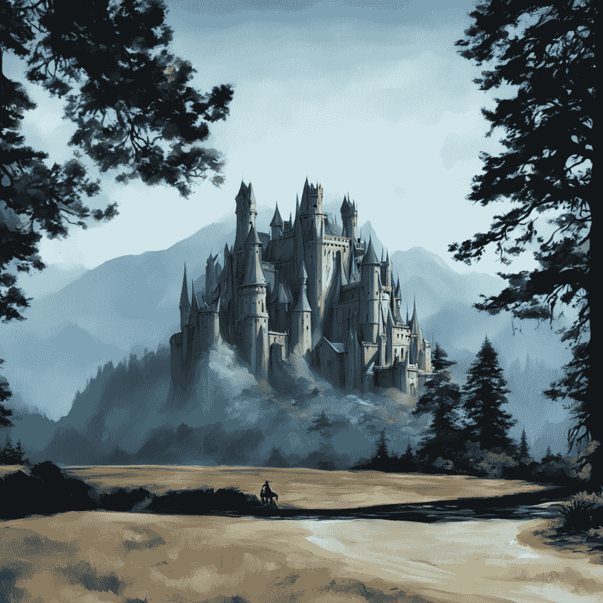

图像到图像

图像到图像和修复实际上是非常相似的任务。图像到图像生成一个类似于提供的现有图像的新图像。修复也是同样的操作，但它只转换由蒙版定义的图像区域，其余部分保持不变。您可以将修复视为进行特定更改的更精确工具，而图像到图像则具有进行更广泛更改的更广泛范围。

## 控制图像生成

让图像看起来完全符合您的要求是具有挑战性的，因为去噪过程是随机的。虽然您可以通过配置诸如`negative_prompt`之类的参数来控制生成的某些方面，但有更好更有效的方法来控制图像生成。

### 提示加权

提示加权提供了一种可量化的方式来调整提示中概念的表示。您可以使用它来增加或减少提示中每个概念的文本嵌入向量的大小，从而确定生成每个概念的数量。[Compel](https://github.com/damian0815/compel)库提供了一种直观的语法，用于调整提示权重并生成嵌入。了解如何在 Prompt weighting 指南中创建嵌入。

生成嵌入后，将它们传递给 AutoPipelineForInpainting 中的`prompt_embeds`（如果您使用负提示，则还有`negative_prompt_embeds`）参数。嵌入替换了`prompt`参数：

```py
import torch
from diffusers import AutoPipelineForInpainting
from diffusers.utils import make_image_grid

pipeline = AutoPipelineForInpainting.from_pretrained(
    "runwayml/stable-diffusion-inpainting", torch_dtype=torch.float16,
)
pipeline.enable_model_cpu_offload()
# remove following line if xFormers is not installed or you have PyTorch 2.0 or higher installed
pipeline.enable_xformers_memory_efficient_attention()

image = pipeline(prompt_embeds=prompt_embeds, # generated from Compel
    negative_prompt_embeds=negative_prompt_embeds, # generated from Compel
    image=init_image,
    mask_image=mask_image
).images[0]
make_image_grid([init_image, mask_image, image], rows=1, cols=3)
```

### ControlNet

ControlNet 模型与其他扩散模型一起使用，如稳定扩散，它们提供了一种更灵活和准确的方式来控制图像的生成方式。ControlNet 接受额外的条件图像输入，指导扩散模型保留其中的特征。

例如，让我们使用在修复图像上预训练的 ControlNet 对图像进行条件处理：

```py
import torch
import numpy as np
from diffusers import ControlNetModel, StableDiffusionControlNetInpaintPipeline
from diffusers.utils import load_image, make_image_grid

# load ControlNet
controlnet = ControlNetModel.from_pretrained("lllyasviel/control_v11p_sd15_inpaint", torch_dtype=torch.float16, variant="fp16")

# pass ControlNet to the pipeline
pipeline = StableDiffusionControlNetInpaintPipeline.from_pretrained(
    "runwayml/stable-diffusion-inpainting", controlnet=controlnet, torch_dtype=torch.float16, variant="fp16"
)
pipeline.enable_model_cpu_offload()
# remove following line if xFormers is not installed or you have PyTorch 2.0 or higher installed
pipeline.enable_xformers_memory_efficient_attention()

# load base and mask image
init_image = load_image("https://huggingface.co/datasets/huggingface/documentation-images/resolve/main/diffusers/inpaint.png")
mask_image = load_image("https://huggingface.co/datasets/huggingface/documentation-images/resolve/main/diffusers/inpaint_mask.png")

# prepare control image
def make_inpaint_condition(init_image, mask_image):
    init_image = np.array(init_image.convert("RGB")).astype(np.float32) / 255.0
    mask_image = np.array(mask_image.convert("L")).astype(np.float32) / 255.0

    assert init_image.shape[0:1] == mask_image.shape[0:1], "image and image_mask must have the same image size"
    init_image[mask_image > 0.5] = -1.0  # set as masked pixel
    init_image = np.expand_dims(init_image, 0).transpose(0, 3, 1, 2)
    init_image = torch.from_numpy(init_image)
    return init_image

control_image = make_inpaint_condition(init_image, mask_image)
```

现在从基础、蒙版和控制图像生成图像。您会注意到生成的图像中强烈保留了基础图像的特征。

```py
prompt = "concept art digital painting of an elven castle, inspired by lord of the rings, highly detailed, 8k"
image = pipeline(prompt=prompt, image=init_image, mask_image=mask_image, control_image=control_image).images[0]
make_image_grid([init_image, mask_image, PIL.Image.fromarray(np.uint8(control_image[0][0])).convert('RGB'), image], rows=2, cols=2)
```

你可以进一步将其与图像到图像管道链接起来，应用一个新的[风格](https://huggingface.co/nitrosocke/elden-ring-diffusion)：

```py
from diffusers import AutoPipelineForImage2Image

pipeline = AutoPipelineForImage2Image.from_pretrained(
    "nitrosocke/elden-ring-diffusion", torch_dtype=torch.float16,
)
pipeline.enable_model_cpu_offload()
# remove following line if xFormers is not installed or you have PyTorch 2.0 or higher installed
pipeline.enable_xformers_memory_efficient_attention()

prompt = "elden ring style castle" # include the token "elden ring style" in the prompt
negative_prompt = "bad architecture, deformed, disfigured, poor details"

image_elden_ring = pipeline(prompt, negative_prompt=negative_prompt, image=image).images[0]
make_image_grid([init_image, mask_image, image, image_elden_ring], rows=2, cols=2)
```


初始图像


ControlNet inpaint

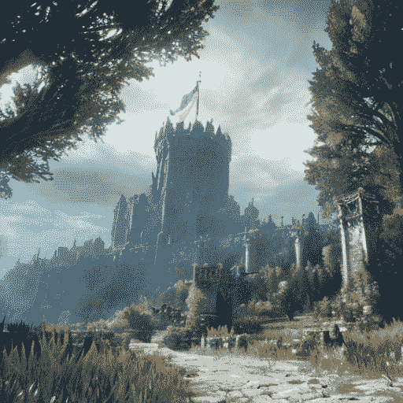

图像到图像

## 优化

运行扩散模型可能会很困难和缓慢，如果你的资源受限，但通过一些优化技巧，就不必如此。其中一个最大（也是最简单）的优化是切换到内存高效的注意力机制。如果你正在使用 PyTorch 2.0，缩放点积注意力会自动启用，你不需要做其他任何事情。对于非 PyTorch 2.0 用户，你可以安装并使用 xFormers 的内存高效注意力实现。这两个选项都可以减少内存使用量并加速推断。

你还可以将模型转移到 CPU 以节省更多内存：

```py
+ pipeline.enable_xformers_memory_efficient_attention()
+ pipeline.enable_model_cpu_offload()
```

为了进一步加快推断代码的速度，请使用`torch_compile`。你应该将`torch.compile`包装在管道中最密集的组件周围，通常是 UNet：

```py
pipeline.unet = torch.compile(pipeline.unet, mode="reduce-overhead", fullgraph=True)
```

在减少内存使用和 Torch 2.0 指南中了解更多。
