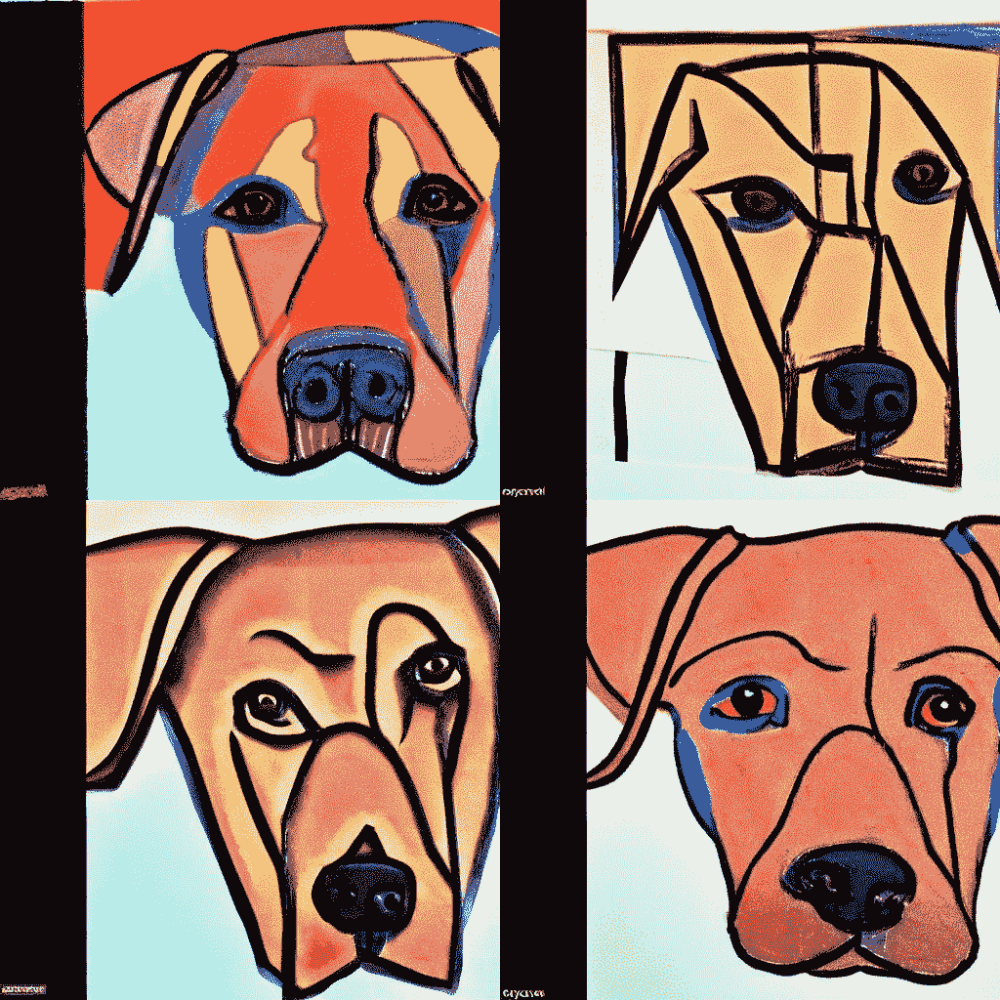

# 通过确定性生成提高图像质量

> 原始文本：[`huggingface.co/docs/diffusers/using-diffusers/reusing_seeds`](https://huggingface.co/docs/diffusers/using-diffusers/reusing_seeds)

提高生成图像质量的常见方法是使用*确定性批量生成*，生成一批图像并选择一张图像，在第二轮推理中使用更详细的提示来改进。关键是将[`torch.Generator`](https://pytorch.org/docs/stable/generated/torch.Generator.html#generator)的列表传递给流水线进行批量图像生成，并将每个`Generator`绑定到一个种子，以便您可以重复使用它来生成图像。

让我们以[`runwayml/stable-diffusion-v1-5`](https://huggingface.co/runwayml/stable-diffusion-v1-5)为例，并生成以下提示的几个版本：

```py
prompt = "Labrador in the style of Vermeer"
```

使用 DiffusionPipeline.from_pretrained()实例化一个流水线，并将其放置在 GPU 上（如果可用）：

```py
import torch
from diffusers import DiffusionPipeline
from diffusers.utils import make_image_grid

pipe = DiffusionPipeline.from_pretrained(
    "runwayml/stable-diffusion-v1-5", torch_dtype=torch.float16, use_safetensors=True
)
pipe = pipe.to("cuda")
```

现在，定义四个不同的`Generator`，并为每个`Generator`分配一个种子（`0`到`3`），以便您稍后可以为特定图像重复使用一个`Generator`：

```py
generator = [torch.Generator(device="cuda").manual_seed(i) for i in range(4)]
```

要创建一个批量种子，您应该使用一个列表推导式，该推导式遍历`range()`中指定的长度。这为批处理中的每个图像创建了一个唯一的`Generator`对象。如果您只将`Generator`乘以批量大小，这只会创建一个`Generator`对象，该对象按顺序用于批处理中的每个图像。

例如，如果您想使用相同的种子创建 4 张相同的图像：

```py
❌ [torch.Generator().manual_seed(seed)] * 4

✅ [torch.Generator().manual_seed(seed) for _ in range(4)]
```

生成图像并查看：

```py
images = pipe(prompt, generator=generator, num_images_per_prompt=4).images
make_image_grid(images, rows=2, cols=2)
```


在这个例子中，您将改进第一张图像 - 但实际上，您可以使用任何您想要的图像（甚至是具有双眼睛的图像！）。第一张图像使用了种子为`0`的`Generator`，因此您将在第二轮推理中重复使用该`Generator`来改进图像的质量。为了改进图像的质量，向提示添加一些额外的文本：

```py
prompt = [prompt + t for t in [", highly realistic", ", artsy", ", trending", ", colorful"]]
generator = [torch.Generator(device="cuda").manual_seed(0) for i in range(4)]
```

创建种子为`0`的四个生成器，并生成另一批图像，所有这些图像应该看起来像上一轮的第一张图像！

```py
images = pipe(prompt, generator=generator).images
make_image_grid(images, rows=2, cols=2)
```


