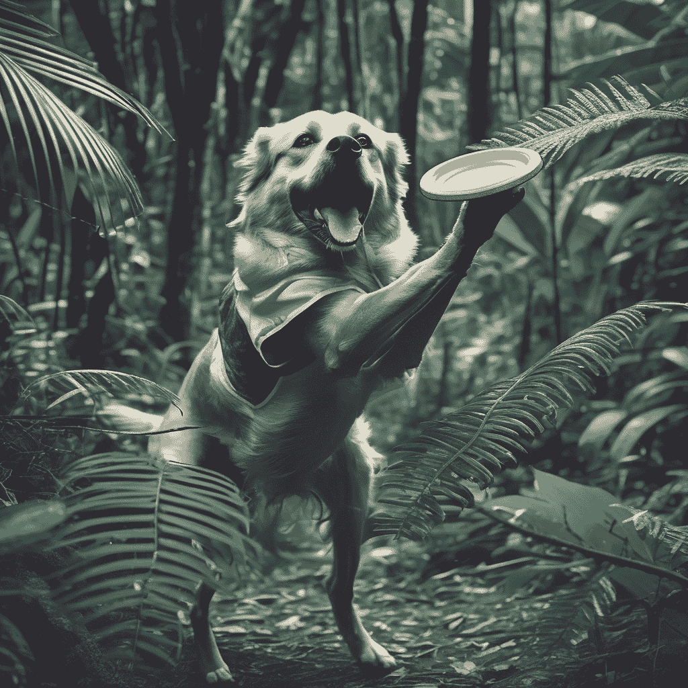
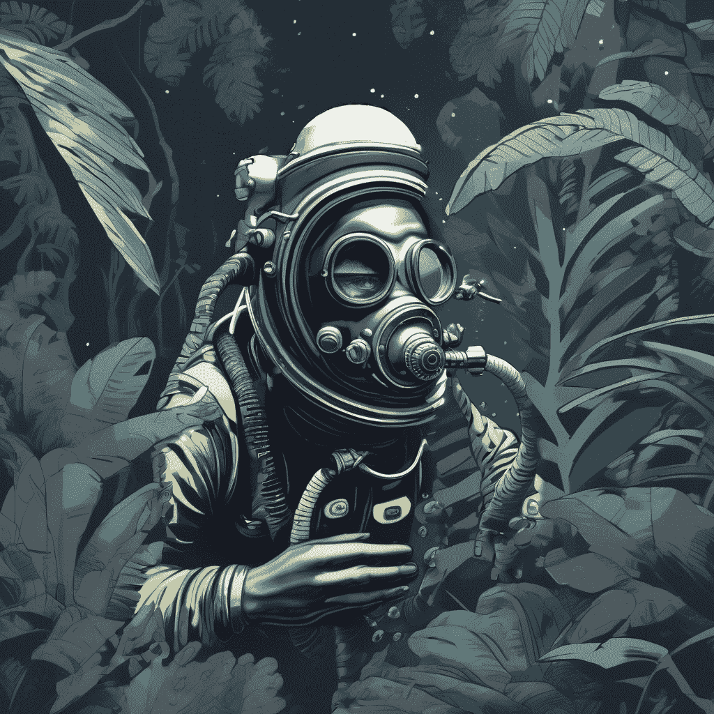
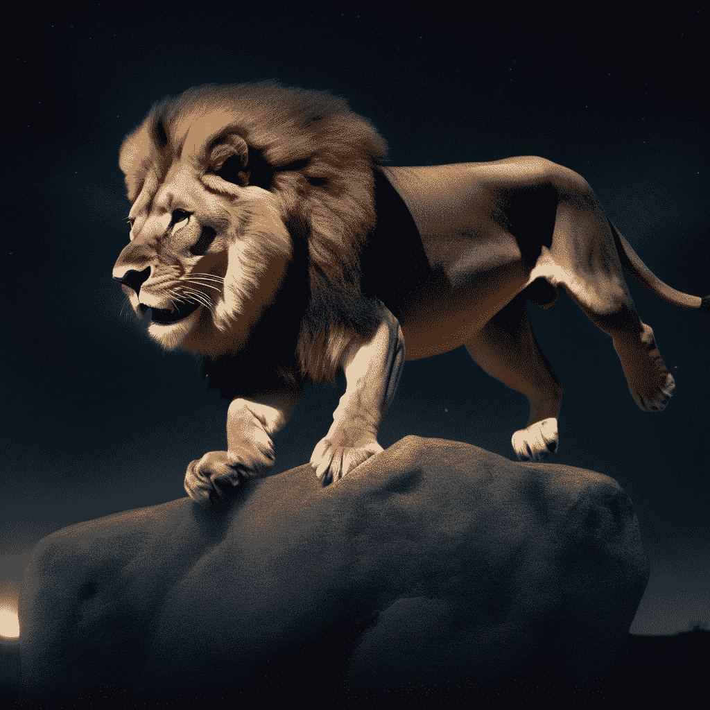
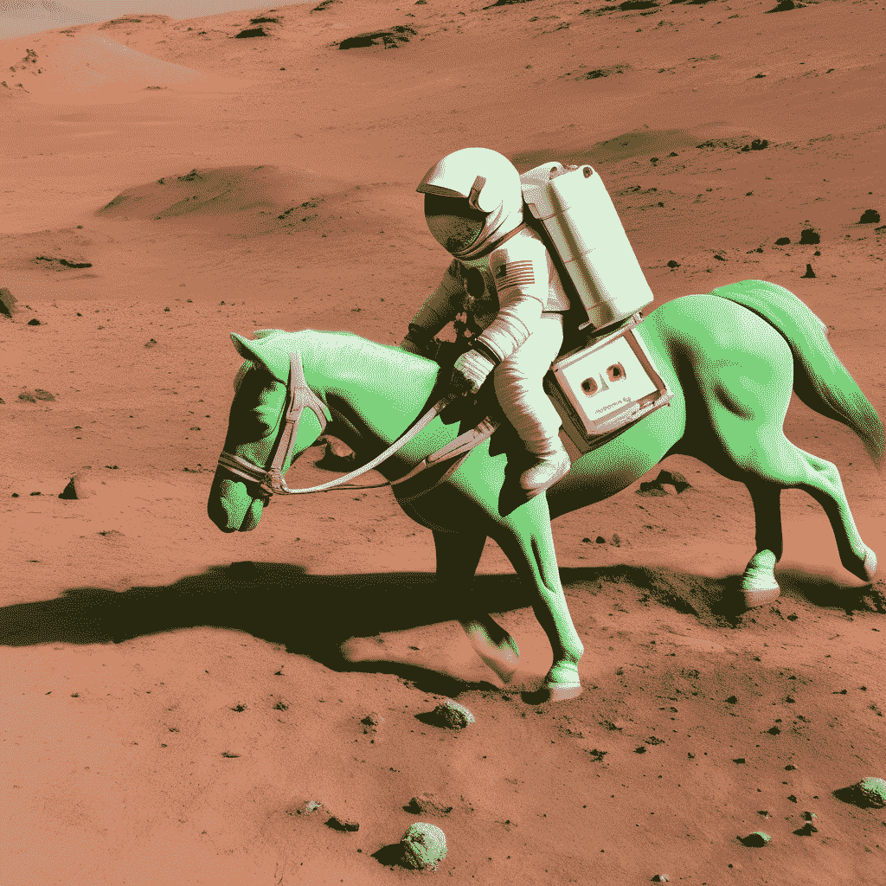
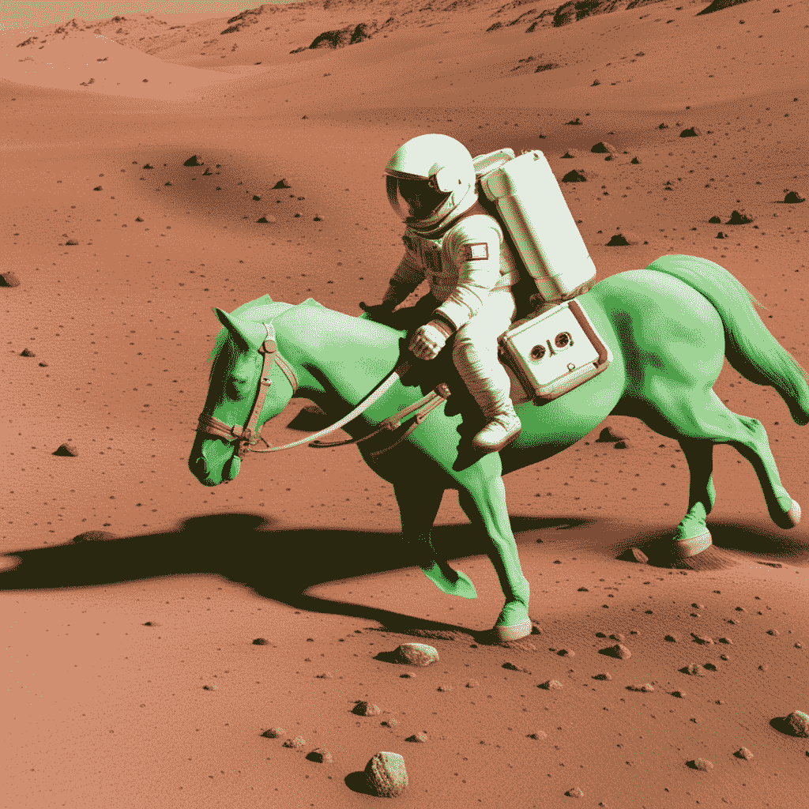
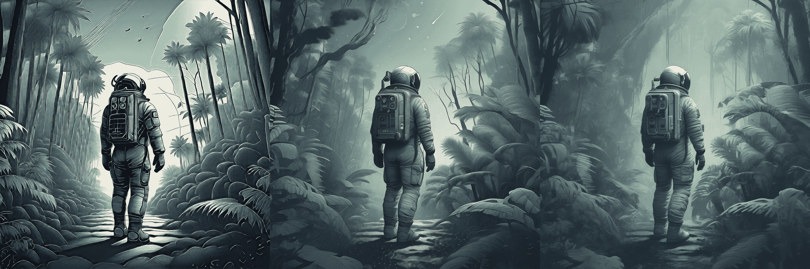
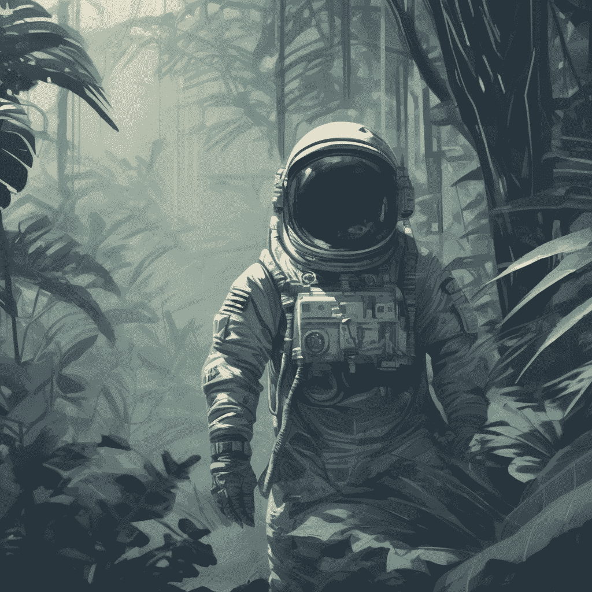
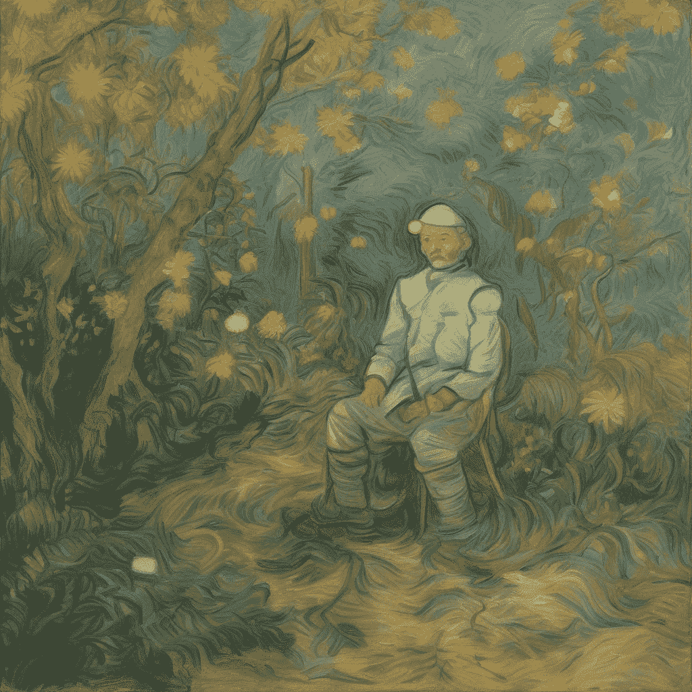

# 稳定扩散 XL

> 原始文本：[`huggingface.co/docs/diffusers/using-diffusers/sdxl`](https://huggingface.co/docs/diffusers/using-diffusers/sdxl)

[稳定扩散 XL](https://huggingface.co/papers/2307.01952)（SDXL）是一个强大的文本到图像生成模型，通过三种关键方式改进了先前的稳定扩散模型：

1.  UNet 是 3 倍大，SDXL 将第二个文本编码器（OpenCLIP ViT-bigG/14）与原始文本编码器结合起来，显著增加参数数量

1.  引入尺寸和裁剪条件，以保留训练数据不被丢弃，并更好地控制生成图像的裁剪方式

1.  引入了一个两阶段模型过程；*基础*模型（也可以作为独立模型运行）生成一个图像作为*精炼器*模型的输入，后者添加额外的高质量细节

本指南将向您展示如何使用 SDXL 进行文本到图像、图像到图像和修补。

在开始之前，请确保已安装以下库：

```py
# uncomment to install the necessary libraries in Colab
#!pip install -q diffusers transformers accelerate invisible-watermark>=0.2.0
```

我们建议安装[invisible-watermark](https://pypi.org/project/invisible-watermark/)库来帮助识别生成的图像。如果安装了 invisible-watermark 库，默认情况下会使用它。要禁用水印：

```py
pipeline = StableDiffusionXLPipeline.from_pretrained(..., add_watermarker=False)
```

## 加载模型检查点

模型权重可能存储在 Hub 或本地的单独子文件夹中，这种情况下，您应该使用 from_pretrained()方法：

```py
from diffusers import StableDiffusionXLPipeline, StableDiffusionXLImg2ImgPipeline
import torch

pipeline = StableDiffusionXLPipeline.from_pretrained(
    "stabilityai/stable-diffusion-xl-base-1.0", torch_dtype=torch.float16, variant="fp16", use_safetensors=True
).to("cuda")

refiner = StableDiffusionXLImg2ImgPipeline.from_pretrained(
    "stabilityai/stable-diffusion-xl-refiner-1.0", torch_dtype=torch.float16, use_safetensors=True, variant="fp16"
).to("cuda")
```

您还可以使用 from_single_file()方法来加载存储在单个文件格式（`.ckpt`或`.safetensors`）中的模型检查点，从 Hub 或本地：

```py
from diffusers import StableDiffusionXLPipeline, StableDiffusionXLImg2ImgPipeline
import torch

pipeline = StableDiffusionXLPipeline.from_single_file(
    "https://huggingface.co/stabilityai/stable-diffusion-xl-base-1.0/blob/main/sd_xl_base_1.0.safetensors", torch_dtype=torch.float16, variant="fp16", use_safetensors=True
).to("cuda")

refiner = StableDiffusionXLImg2ImgPipeline.from_single_file(
    "https://huggingface.co/stabilityai/stable-diffusion-xl-refiner-1.0/blob/main/sd_xl_refiner_1.0.safetensors", torch_dtype=torch.float16, use_safetensors=True, variant="fp16"
).to("cuda")
```

## 文本到图像

对于文本到图像，传递一个文本提示。默认情况下，SDXL 生成 1024x1024 图像以获得最佳结果。您可以尝试将`height`和`width`参数设置为 768x768 或 512x512，但低于 512x512 的尺寸不太可能有效。

```py
from diffusers import AutoPipelineForText2Image
import torch

pipeline_text2image = AutoPipelineForText2Image.from_pretrained(
    "stabilityai/stable-diffusion-xl-base-1.0", torch_dtype=torch.float16, variant="fp16", use_safetensors=True
).to("cuda")

prompt = "Astronaut in a jungle, cold color palette, muted colors, detailed, 8k"
image = pipeline_text2image(prompt=prompt).images[0]
image
```


## 图像到图像

对于图像到图像，SDXL 在 768x768 和 1024x1024 之间的图像尺寸上表现特别好。传递一个初始图像和一个文本提示来调整图像：

```py
from diffusers import AutoPipelineForImage2Image
from diffusers.utils import load_image, make_image_grid

# use from_pipe to avoid consuming additional memory when loading a checkpoint
pipeline = AutoPipelineForImage2Image.from_pipe(pipeline_text2image).to("cuda")

url = "https://huggingface.co/datasets/huggingface/documentation-images/resolve/main/diffusers/sdxl-text2img.png"
init_image = load_image(url)
prompt = "a dog catching a frisbee in the jungle"
image = pipeline(prompt, image=init_image, strength=0.8, guidance_scale=10.5).images[0]
make_image_grid([init_image, image], rows=1, cols=2)
```



## 修补

对于修补，您将需要原始图像和要替换原始图像中内容的蒙版。创建一个提示来描述您想用蒙版区域替换的内容。

```py
from diffusers import AutoPipelineForInpainting
from diffusers.utils import load_image, make_image_grid

# use from_pipe to avoid consuming additional memory when loading a checkpoint
pipeline = AutoPipelineForInpainting.from_pipe(pipeline_text2image).to("cuda")

img_url = "https://huggingface.co/datasets/huggingface/documentation-images/resolve/main/diffusers/sdxl-text2img.png"
mask_url = "https://huggingface.co/datasets/huggingface/documentation-images/resolve/main/diffusers/sdxl-inpaint-mask.png"

init_image = load_image(img_url)
mask_image = load_image(mask_url)

prompt = "A deep sea diver floating"
image = pipeline(prompt=prompt, image=init_image, mask_image=mask_image, strength=0.85, guidance_scale=12.5).images[0]
make_image_grid([init_image, mask_image, image], rows=1, cols=3)
```



## 提高图像质量

SDXL 包括一个[精炼器模型](https://huggingface.co/stabilityai/stable-diffusion-xl-refiner-1.0)，专门用于去噪低噪声阶段图像，以从基础模型生成更高质量的图像。有两种使用精炼器的方法：

1.  使用基础和精炼器模型一起生成一个精炼图像

1.  使用基础模型生成一个图像，然后使用精炼器模型为图像添加更多细节（这是 SDXL 最初训练的方式）

### 基础+精炼器模型

当您将基础模型和精炼器模型一起使用生成图像时，这被称为[*专家去噪器集合*](https://research.nvidia.com/labs/dir/eDiff-I/)。专家去噪器集合方法需要较少的整体去噪步骤，与将基础模型的输出传递给精炼器模型相比，运行速度应该更快。但是，您将无法检查基础模型的输出，因为它仍然包含大量噪音。

作为专家去噪器的集合，基础模型在高噪声扩散阶段充当专家，精炼器模型在低噪声扩散阶段充当专家。加载基础和精炼器模型：

```py
from diffusers import DiffusionPipeline
import torch

base = DiffusionPipeline.from_pretrained(
    "stabilityai/stable-diffusion-xl-base-1.0", torch_dtype=torch.float16, variant="fp16", use_safetensors=True
).to("cuda")

refiner = DiffusionPipeline.from_pretrained(
    "stabilityai/stable-diffusion-xl-refiner-1.0",
    text_encoder_2=base.text_encoder_2,
    vae=base.vae,
    torch_dtype=torch.float16,
    use_safetensors=True,
    variant="fp16",
).to("cuda")
```

要使用这种方法，您需要为每个模型定义通过各自阶段运行的时间步数。对于基础模型，这由[`denoising_end`](https://huggingface.co/docs/diffusers/main/en/api/pipelines/stable_diffusion/stable_diffusion_xl#diffusers.StableDiffusionXLPipeline.__call__.denoising_end)参数控制，对于精炼模型，由[`denoising_start`](https://huggingface.co/docs/diffusers/main/en/api/pipelines/stable_diffusion/stable_diffusion_xl#diffusers.StableDiffusionXLImg2ImgPipeline.__call__.denoising_start)参数控制。

`denoising_end`和`denoising_start`参数应该是 0 到 1 之间的浮点数。这些参数表示为离散时间步数的比例，由调度器定义。如果您还使用`strength`参数，它将被忽略，因为去噪步数由模型训练的离散时间步数和声明的分数截止确定。

让我们设置`denoising_end=0.8`，这样基础模型将执行前 80%的去噪**高噪声**时间步，并设置`denoising_start=0.8`，这样精炼模型将执行最后 20%的去噪**低噪声**时间步。基础模型的输出应该是**潜在**空间而不是 PIL 图像。

```py
prompt = "A majestic lion jumping from a big stone at night"

image = base(
    prompt=prompt,
    num_inference_steps=40,
    denoising_end=0.8,
    output_type="latent",
).images
image = refiner(
    prompt=prompt,
    num_inference_steps=40,
    denoising_start=0.8,
    image=image,
).images[0]
image
```



默认基础模型


专家去噪的集合

精炼模型也可以用于 StableDiffusionXLInpaintPipeline 中的修补：

```py
from diffusers import StableDiffusionXLInpaintPipeline
from diffusers.utils import load_image, make_image_grid
import torch

base = StableDiffusionXLInpaintPipeline.from_pretrained(
    "stabilityai/stable-diffusion-xl-base-1.0", torch_dtype=torch.float16, variant="fp16", use_safetensors=True
).to("cuda")

refiner = StableDiffusionXLInpaintPipeline.from_pretrained(
    "stabilityai/stable-diffusion-xl-refiner-1.0",
    text_encoder_2=base.text_encoder_2,
    vae=base.vae,
    torch_dtype=torch.float16,
    use_safetensors=True,
    variant="fp16",
).to("cuda")

img_url = "https://raw.githubusercontent.com/CompVis/latent-diffusion/main/data/inpainting_examples/overture-creations-5sI6fQgYIuo.png"
mask_url = "https://raw.githubusercontent.com/CompVis/latent-diffusion/main/data/inpainting_examples/overture-creations-5sI6fQgYIuo_mask.png"

init_image = load_image(img_url)
mask_image = load_image(mask_url)

prompt = "A majestic tiger sitting on a bench"
num_inference_steps = 75
high_noise_frac = 0.7

image = base(
    prompt=prompt,
    image=init_image,
    mask_image=mask_image,
    num_inference_steps=num_inference_steps,
    denoising_end=high_noise_frac,
    output_type="latent",
).images
image = refiner(
    prompt=prompt,
    image=image,
    mask_image=mask_image,
    num_inference_steps=num_inference_steps,
    denoising_start=high_noise_frac,
).images[0]
make_image_grid([init_image, mask_image, image.resize((512, 512))], rows=1, cols=3)
```

这个专家去噪方法的集合对所有可用的调度器都有效！

### 基础到精炼模型

通过在图像到图像设置中使用精炼模型向基础模型的完全去噪图像添加额外的高质量细节，SDXL 在图像质量上得到提升。

加载基础和精炼模型：

```py
from diffusers import DiffusionPipeline
import torch

base = DiffusionPipeline.from_pretrained(
    "stabilityai/stable-diffusion-xl-base-1.0", torch_dtype=torch.float16, variant="fp16", use_safetensors=True
).to("cuda")

refiner = DiffusionPipeline.from_pretrained(
    "stabilityai/stable-diffusion-xl-refiner-1.0",
    text_encoder_2=base.text_encoder_2,
    vae=base.vae,
    torch_dtype=torch.float16,
    use_safetensors=True,
    variant="fp16",
).to("cuda")
```

从基础模型生成图像，并将模型输出设置为**潜在**空间：

```py
prompt = "Astronaut in a jungle, cold color palette, muted colors, detailed, 8k"

image = base(prompt=prompt, output_type="latent").images[0]
```

将生成的图像传递给精炼模型：

```py
image = refiner(prompt=prompt, image=image[None, :]).images[0]
```



基础模型



基础模型 + 精炼模型

对于修补，加载基础和精炼模型在 StableDiffusionXLInpaintPipeline 中，删除`denoising_end`和`denoising_start`参数，并为精炼器选择较少的推理步骤。

## 微调节

SDXL 训练涉及几种额外的调节技术，被称为*微调节*。这些包括原始图像尺寸、目标图像尺寸和裁剪参数。这些微调节可以在推理时用于创建高质量、居中的图像。

由于无需分类器的指导，您可以使用微调节和负微调节参数。它们在 StableDiffusionXLPipeline、StableDiffusionXLImg2ImgPipeline、StableDiffusionXLInpaintPipeline 和 StableDiffusionXLControlNetPipeline 中都可用。

### 尺寸调节

有两种类型的尺寸调节：

+   [`original_size`](https://huggingface.co/docs/diffusers/main/en/api/pipelines/stable_diffusion/stable_diffusion_xl#diffusers.StableDiffusionXLPipeline.__call__.original_size) 条件来自训练批次中的放大图像（因为丢弃构成总训练数据近 40%的较小图像将是浪费的）。这样，SDXL 学习到放大伪影不应出现在高分辨率图像中。在推理过程中，您可以使用`original_size`指示原始图像分辨率。使用默认值`(1024, 1024)`会生成类似数据集中 1024x1024 图像的高质量图像。如果选择使用较低分辨率，如`(256, 256)`，模型仍会生成 1024x1024 图像，但它们看起来像数据集中的低分辨率图像（简单图案，模糊）。

+   [`target_size`](https://huggingface.co/docs/diffusers/main/en/api/pipelines/stable_diffusion/stable_diffusion_xl#diffusers.StableDiffusionXLPipeline.__call__.target_size) 条件来自对 SDXL 进行微调以支持不同的图像纵横比。在推理过程中，如果您使用默认值`(1024, 1024)`，您将获得一个类似于数据集中方形图像组合的图像。我们建议对`target_size`和`original_size`使用相同的值，但请随时尝试其他选项！

🤗 Diffusers 还允许您指定关于图像大小的负面条件，以使生成远离某些图像分辨率：

```py
from diffusers import StableDiffusionXLPipeline
import torch

pipe = StableDiffusionXLPipeline.from_pretrained(
    "stabilityai/stable-diffusion-xl-base-1.0", torch_dtype=torch.float16, variant="fp16", use_safetensors=True
).to("cuda")

prompt = "Astronaut in a jungle, cold color palette, muted colors, detailed, 8k"
image = pipe(
    prompt=prompt,
    negative_original_size=(512, 512),
    negative_target_size=(1024, 1024),
).images[0]
```



图像负面条件是(128, 128)、(256, 256)和(512, 512)的图像分辨率。

### 裁剪条件

以前的稳定扩散模型生成的图像有时可能看起来被裁剪了。这是因为在训练过程中实际上对图像进行了裁剪，以使批次中的所有图像具有相同的大小。通过在裁剪坐标上进行条件化，SDXL *学习*到没有裁剪 - 坐标`(0, 0)` - 通常与中心主题和完整面孔相关联（这是🤗 Diffusers 中的默认值）。如果要生成偏离中心的构图，可以尝试不同的坐标！

```py
from diffusers import StableDiffusionXLPipeline
import torch

pipeline = StableDiffusionXLPipeline.from_pretrained(
    "stabilityai/stable-diffusion-xl-base-1.0", torch_dtype=torch.float16, variant="fp16", use_safetensors=True
).to("cuda")

prompt = "Astronaut in a jungle, cold color palette, muted colors, detailed, 8k"
image = pipeline(prompt=prompt, crops_coords_top_left=(256, 0)).images[0]
image
```



您还可以指定负面裁剪坐标，以使生成远离某些裁剪参数：

```py
from diffusers import StableDiffusionXLPipeline
import torch

pipe = StableDiffusionXLPipeline.from_pretrained(
    "stabilityai/stable-diffusion-xl-base-1.0", torch_dtype=torch.float16, variant="fp16", use_safetensors=True
).to("cuda")

prompt = "Astronaut in a jungle, cold color palette, muted colors, detailed, 8k"
image = pipe(
    prompt=prompt,
    negative_original_size=(512, 512),
    negative_crops_coords_top_left=(0, 0),
    negative_target_size=(1024, 1024),
).images[0]
image
```

## 为每个文本编码器使用不同的提示

SDXL 使用两个文本编码器，因此可以向每个文本编码器传递不同的提示，这可以[提高质量](https://github.com/huggingface/diffusers/issues/4004#issuecomment-1627764201)。将您的原始提示传递给`prompt`，将第二个提示传递给`prompt_2`（如果您使用负面提示，请使用`negative_prompt`和`negative_prompt_2`）：

```py
from diffusers import StableDiffusionXLPipeline
import torch

pipeline = StableDiffusionXLPipeline.from_pretrained(
    "stabilityai/stable-diffusion-xl-base-1.0", torch_dtype=torch.float16, variant="fp16", use_safetensors=True
).to("cuda")

# prompt is passed to OAI CLIP-ViT/L-14
prompt = "Astronaut in a jungle, cold color palette, muted colors, detailed, 8k"
# prompt_2 is passed to OpenCLIP-ViT/bigG-14
prompt_2 = "Van Gogh painting"
image = pipeline(prompt=prompt, prompt_2=prompt_2).images[0]
image
```



双文本编码器还支持需要单独加载的文本反转嵌入，如 SDXL 文本反转部分所述。

## 优化

SDXL 是一个庞大的模型，您可能需要优化内存才能使其在您的硬件上运行。以下是一些节省内存并加快推理速度的提示。

1.  通过 enable_model_cpu_offload()将模型卸载到 CPU 以避免内存错误：

```py
- base.to("cuda")
- refiner.to("cuda")
+ base.enable_model_cpu_offload()
+ refiner.enable_model_cpu_offload()
```

1.  使用`torch.compile`可以提高约 20%的速度（您需要`torch>=2.0`）：

```py
+ base.unet = torch.compile(base.unet, mode="reduce-overhead", fullgraph=True)
+ refiner.unet = torch.compile(refiner.unet, mode="reduce-overhead", fullgraph=True)
```

1.  如果`torch<2.0`，请启用 xFormers 来运行 SDXL：

```py
+ base.enable_xformers_memory_efficient_attention()
+ refiner.enable_xformers_memory_efficient_attention()
```

## 其他资源

如果您对在 SDXL 中使用的 UNet2DConditionModel 的最小版本进行实验感兴趣，请查看在 PyTorch 中编写的并与🤗 Diffusers 直接兼容的[minSDXL](https://github.com/cloneofsimo/minSDXL)实现。
