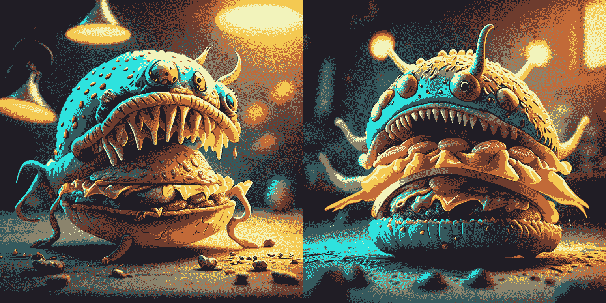
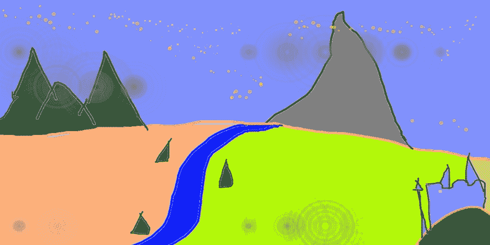
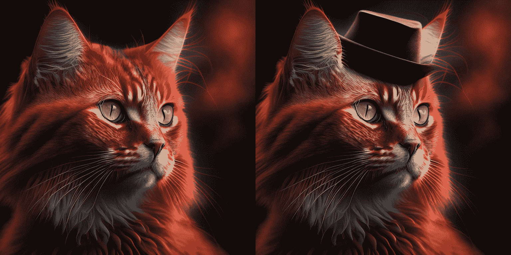
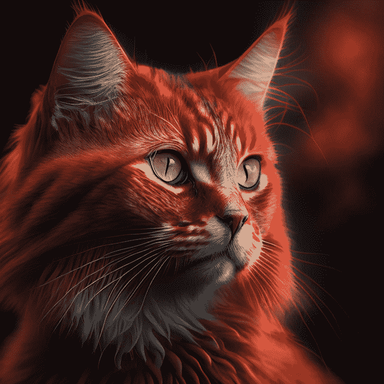
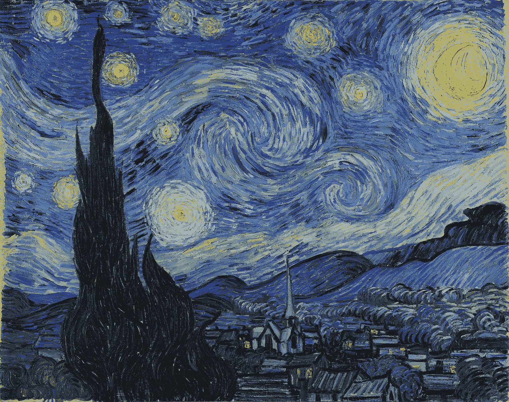
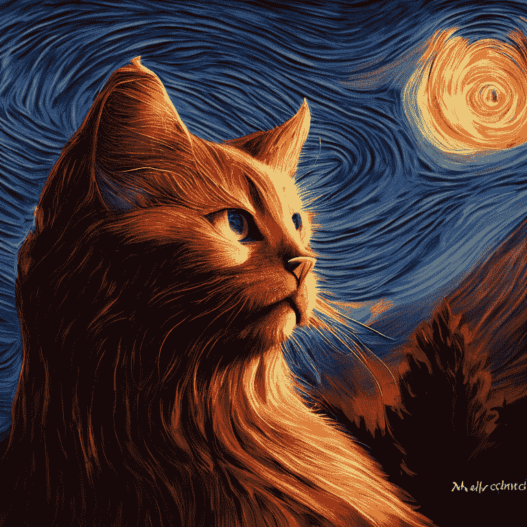
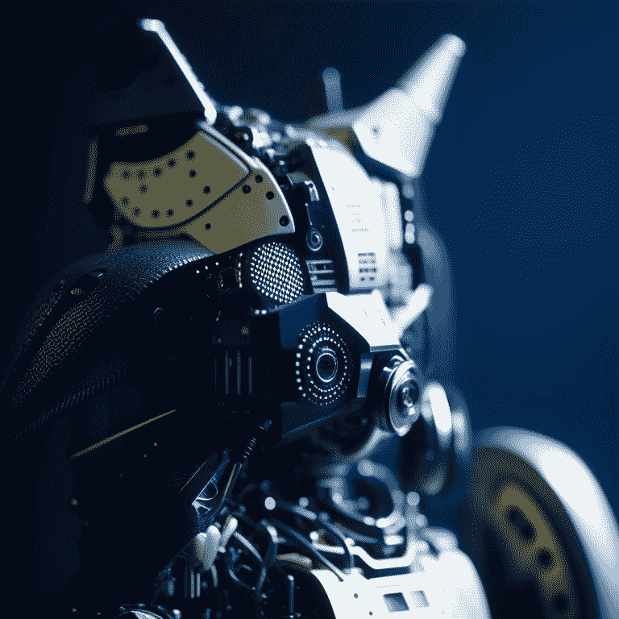
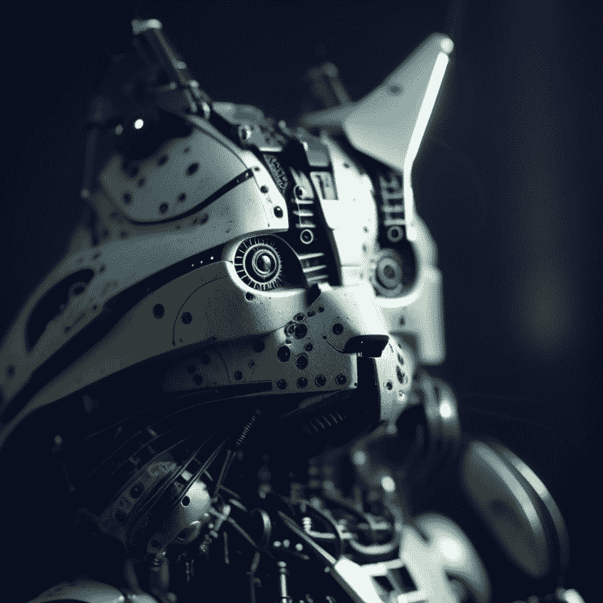

# 康定斯基

> 原文链接：[`huggingface.co/docs/diffusers/using-diffusers/kandinsky`](https://huggingface.co/docs/diffusers/using-diffusers/kandinsky)

康定斯基模型是一系列多语言文本到图像生成模型。康定斯基 2.0 模型使用两个多语言文本编码器，并将这些结果连接到 UNet 中。

康定斯基 2.1 改变了架构，包括一个图像先前模型（[`CLIP`](https://huggingface.co/docs/transformers/model_doc/clip)），用于生成文本和图像嵌入之间的映射。该映射提供更好的文本-图像对齐，并在训练期间与文本嵌入一起使用，从而产生更高质量的结果。最后，康定斯基 2.1 使用了一个[调制量化向量（MoVQ）](https://huggingface.co/papers/2209.09002)解码器，它添加了一个空间条件归一化层以增加照片逼真度，将潜在特征解码为图像。

康定斯基 2.2 通过用更大的 CLIP-ViT-G 模型替换图像先前模型的图像编码器来改进先前模型。图像先前模型还经过重新训练，用不同分辨率和长宽比的图像生成更高分辨率和不同尺寸的图像。

康定斯基 3 简化了架构，并摆脱了涉及先前模型和扩散模型的两阶段生成过程。相反，康定斯基 3 使用[Flan-UL2](https://huggingface.co/google/flan-ul2)来编码文本，一个带有[BigGan-deep](https://hf.co/papers/1809.11096)块的 UNet，以及[Sber-MoVQGAN](https://github.com/ai-forever/MoVQGAN)来将潜在特征解码为图像。通过使用更大的文本编码器和 UNet，主要实现了文本理解和生成图像质量的提高。

本指南将向您展示如何使用康定斯基模型进行文本到图像、图像到图像、修复、插值等操作。

在开始之前，请确保已安装以下库：

```py
# uncomment to install the necessary libraries in Colab
#!pip install -q diffusers transformers accelerate
```

康定斯基 2.1 和 2.2 的用法非常相似！唯一的区别是康定斯基 2.2 在解码潜在特征时不接受`prompt`作为输入。相反，康定斯基 2.2 在解码时只接受`image_embeds`。

康定斯基 3 具有更简洁的架构，不需要先前的模型。这意味着它的用法与其他扩散模型（如稳定扩散 XL）相同。

## 文本到图像

要使用康定斯基模型执行任何任务，您始终要先设置先前流程以对提示进行编码并生成图像嵌入。先前流程还会生成与负提示`""`对应的`negative_image_embeds`。为了获得更好的结果，您可以向先前流程传递实际的`negative_prompt`，但这会使先前流程的有效批量大小增加 2 倍。

康定斯基 2.1 康定斯基 2.2 康定斯基 3

```py
from diffusers import KandinskyPriorPipeline, KandinskyPipeline
import torch

prior_pipeline = KandinskyPriorPipeline.from_pretrained("kandinsky-community/kandinsky-2-1-prior", torch_dtype=torch.float16).to("cuda")
pipeline = KandinskyPipeline.from_pretrained("kandinsky-community/kandinsky-2-1", torch_dtype=torch.float16).to("cuda")

prompt = "A alien cheeseburger creature eating itself, claymation, cinematic, moody lighting"
negative_prompt = "low quality, bad quality" # optional to include a negative prompt, but results are usually better
image_embeds, negative_image_embeds = prior_pipeline(prompt, negative_prompt, guidance_scale=1.0).to_tuple()
```

现在将所有提示和嵌入传递给 KandinskyPipeline 以生成图像：

```py
image = pipeline(prompt, image_embeds=image_embeds, negative_prompt=negative_prompt, negative_image_embeds=negative_image_embeds, height=768, width=768).images[0]
image
```



🤗扩散器还提供了一个端到端的 API，其中包括 KandinskyCombinedPipeline 和 KandinskyV22CombinedPipeline，这意味着您不必单独加载先前的模型和文本到图像的流程。合并流程会自动加载先前模型和解码器。如果需要，您仍然可以通过`prior_guidance_scale`和`prior_num_inference_steps`参数为先前流程设置不同的值。

使用 AutoPipelineForText2Image 来自动调用底层的合并流程：

康定斯基 2.1 康定斯基 2.2

```py
from diffusers import AutoPipelineForText2Image
import torch

pipeline = AutoPipelineForText2Image.from_pretrained("kandinsky-community/kandinsky-2-1", torch_dtype=torch.float16)
pipeline.enable_model_cpu_offload()

prompt = "A alien cheeseburger creature eating itself, claymation, cinematic, moody lighting"
negative_prompt = "low quality, bad quality"

image = pipeline(prompt=prompt, negative_prompt=negative_prompt, prior_guidance_scale=1.0, guidance_scale=4.0, height=768, width=768).images[0]
image
```

## 图像到图像

对于图像到图像，将初始图像和文本提示传递给管道以对图像进行条件设置。首先加载先前管道：

Kandinsky 2.1Kandinsky 2.2Kandinsky 3

```py
import torch
from diffusers import KandinskyImg2ImgPipeline, KandinskyPriorPipeline

prior_pipeline = KandinskyPriorPipeline.from_pretrained("kandinsky-community/kandinsky-2-1-prior", torch_dtype=torch.float16, use_safetensors=True).to("cuda")
pipeline = KandinskyImg2ImgPipeline.from_pretrained("kandinsky-community/kandinsky-2-1", torch_dtype=torch.float16, use_safetensors=True).to("cuda")
```

下载一个图像进行条件设置：

```py
from diffusers.utils import load_image

# download image
url = "https://raw.githubusercontent.com/CompVis/stable-diffusion/main/assets/stable-samples/img2img/sketch-mountains-input.jpg"
original_image = load_image(url)
original_image = original_image.resize((768, 512))
```



使用先前管道生成`image_embeds`和`negative_image_embeds`：

```py
prompt = "A fantasy landscape, Cinematic lighting"
negative_prompt = "low quality, bad quality"

image_embeds, negative_image_embeds = prior_pipeline(prompt, negative_prompt).to_tuple()
```

现在将原始图像和所有提示和嵌入传递给管道以生成图像：

Kandinsky 2.1Kandinsky 2.2Kandinsky 3

```py
from diffusers.utils import make_image_grid

image = pipeline(prompt, negative_prompt=negative_prompt, image=original_image, image_embeds=image_embeds, negative_image_embeds=negative_image_embeds, height=768, width=768, strength=0.3).images[0]
make_image_grid([original_image.resize((512, 512)), image.resize((512, 512))], rows=1, cols=2)
```


🤗 Diffusers 还提供了端到端的 API，使用 KandinskyImg2ImgCombinedPipeline 和 KandinskyV22Img2ImgCombinedPipeline，这意味着您不必单独加载先前和图像到图像管道。组合管道会自动加载先前模型和解码器。如果需要，仍然可以通过`prior_guidance_scale`和`prior_num_inference_steps`参数为先前管道设置不同的值。

使用 AutoPipelineForImage2Image 来在内部自动调用组合管道：

Kandinsky 2.1Kandinsky 2.2

```py
from diffusers import AutoPipelineForImage2Image
from diffusers.utils import make_image_grid, load_image
import torch

pipeline = AutoPipelineForImage2Image.from_pretrained("kandinsky-community/kandinsky-2-1", torch_dtype=torch.float16, use_safetensors=True)
pipeline.enable_model_cpu_offload()

prompt = "A fantasy landscape, Cinematic lighting"
negative_prompt = "low quality, bad quality"

url = "https://raw.githubusercontent.com/CompVis/stable-diffusion/main/assets/stable-samples/img2img/sketch-mountains-input.jpg"
original_image = load_image(url)

original_image.thumbnail((768, 768))

image = pipeline(prompt=prompt, negative_prompt=negative_prompt, image=original_image, strength=0.3).images[0]
make_image_grid([original_image.resize((512, 512)), image.resize((512, 512))], rows=1, cols=2)
```

## 修复

⚠️ Kandinsky 模型现在使用⬜️ **白色像素**来代表遮罩区域，而不是黑色像素。如果您正在生产中使用 KandinskyInpaintPipeline，您需要将遮罩更改为使用白色像素：

```py
# For PIL input
import PIL.ImageOps
mask = PIL.ImageOps.invert(mask)

# For PyTorch and NumPy input
mask = 1 - mask
```

对于修复，您将需要原始图像、原始图像中要替换的区域的遮罩，以及要修复的内容的文本提示。加载先前管道：

Kandinsky 2.1Kandinsky 2.2

```py
from diffusers import KandinskyInpaintPipeline, KandinskyPriorPipeline
from diffusers.utils import load_image, make_image_grid
import torch
import numpy as np
from PIL import Image

prior_pipeline = KandinskyPriorPipeline.from_pretrained("kandinsky-community/kandinsky-2-1-prior", torch_dtype=torch.float16, use_safetensors=True).to("cuda")
pipeline = KandinskyInpaintPipeline.from_pretrained("kandinsky-community/kandinsky-2-1-inpaint", torch_dtype=torch.float16, use_safetensors=True).to("cuda")
```

加载初始图像并创建遮罩：

```py
init_image = load_image("https://huggingface.co/datasets/hf-internal-testing/diffusers-images/resolve/main/kandinsky/cat.png")
mask = np.zeros((768, 768), dtype=np.float32)
# mask area above cat's head
mask[:250, 250:-250] = 1
```

使用先前管道生成嵌入：

```py
prompt = "a hat"
prior_output = prior_pipeline(prompt)
```

现在将初始图像、遮罩、提示和嵌入传递给管道以生成图像：

Kandinsky 2.1Kandinsky 2.2

```py
output_image = pipeline(prompt, image=init_image, mask_image=mask, **prior_output, height=768, width=768, num_inference_steps=150).images[0]
mask = Image.fromarray((mask*255).astype('uint8'), 'L')
make_image_grid([init_image, mask, output_image], rows=1, cols=3)
```



您还可以使用端到端的 KandinskyInpaintCombinedPipeline 和 KandinskyV22InpaintCombinedPipeline 来在内部同时调用先前和解码器管道。使用 AutoPipelineForInpainting 来实现：

Kandinsky 2.1Kandinsky 2.2

```py
import torch
import numpy as np
from PIL import Image
from diffusers import AutoPipelineForInpainting
from diffusers.utils import load_image, make_image_grid

pipe = AutoPipelineForInpainting.from_pretrained("kandinsky-community/kandinsky-2-1-inpaint", torch_dtype=torch.float16)
pipe.enable_model_cpu_offload()

init_image = load_image("https://huggingface.co/datasets/hf-internal-testing/diffusers-images/resolve/main/kandinsky/cat.png")
mask = np.zeros((768, 768), dtype=np.float32)
# mask area above cat's head
mask[:250, 250:-250] = 1
prompt = "a hat"

output_image = pipe(prompt=prompt, image=init_image, mask_image=mask).images[0]
mask = Image.fromarray((mask*255).astype('uint8'), 'L')
make_image_grid([init_image, mask, output_image], rows=1, cols=3)
```

## 插值

插值允许您探索图像和文本嵌入之间的潜在空间，这是一种很酷的方式来查看先前模型的中间输出。加载先前管道和您想要插值的两个图像：

Kandinsky 2.1Kandinsky 2.2

```py
from diffusers import KandinskyPriorPipeline, KandinskyPipeline
from diffusers.utils import load_image, make_image_grid
import torch

prior_pipeline = KandinskyPriorPipeline.from_pretrained("kandinsky-community/kandinsky-2-1-prior", torch_dtype=torch.float16, use_safetensors=True).to("cuda")
img_1 = load_image("https://huggingface.co/datasets/hf-internal-testing/diffusers-images/resolve/main/kandinsky/cat.png")
img_2 = load_image("https://huggingface.co/datasets/hf-internal-testing/diffusers-images/resolve/main/kandinsky/starry_night.jpeg")
make_image_grid([img_1.resize((512,512)), img_2.resize((512,512))], rows=1, cols=2)
```



一只猫



梵高的《星夜》绘画

指定要插值的文本或图像，并为每个文本或图像设置权重。尝试不同的权重以查看它们如何影响插值！

```py
images_texts = ["a cat", img_1, img_2]
weights = [0.3, 0.3, 0.4]
```

调用`interpolate`函数生成嵌入，然后将其传递给管道生成图像：

Kandinsky 2.1Kandinsky 2.2

```py
# prompt can be left empty
prompt = ""
prior_out = prior_pipeline.interpolate(images_texts, weights)

pipeline = KandinskyPipeline.from_pretrained("kandinsky-community/kandinsky-2-1", torch_dtype=torch.float16, use_safetensors=True).to("cuda")

image = pipeline(prompt, **prior_out, height=768, width=768).images[0]
image
```



## ControlNet

⚠️ ControlNet 仅支持 Kandinsky 2.2！

ControlNet 使得可以使用额外的输入条件化大型预训练扩散模型，例如深度图或边缘检测。例如，您可以使用深度图对 Kandinsky 2.2 进行条件设置，以便模型理解并保留深度图像的结构。

让我们加载一张图像并提取其深度图：

```py
from diffusers.utils import load_image

img = load_image(
    "https://huggingface.co/datasets/hf-internal-testing/diffusers-images/resolve/main/kandinskyv22/cat.png"
).resize((768, 768))
img
```


然后，您可以使用🤗 Transformers 的`depth-estimation` [Pipeline](https://huggingface.co/docs/transformers/v4.37.2/en/main_classes/pipelines#transformers.Pipeline)处理图像并检索深度图：

```py
import torch
import numpy as np

from transformers import pipeline

def make_hint(image, depth_estimator):
    image = depth_estimator(image)["depth"]
    image = np.array(image)
    image = image[:, :, None]
    image = np.concatenate([image, image, image], axis=2)
    detected_map = torch.from_numpy(image).float() / 255.0
    hint = detected_map.permute(2, 0, 1)
    return hint

depth_estimator = pipeline("depth-estimation")
hint = make_hint(img, depth_estimator).unsqueeze(0).half().to("cuda")
```

### 文本到图像

加载先前的管道和 KandinskyV22ControlnetPipeline：

```py
from diffusers import KandinskyV22PriorPipeline, KandinskyV22ControlnetPipeline

prior_pipeline = KandinskyV22PriorPipeline.from_pretrained(
    "kandinsky-community/kandinsky-2-2-prior", torch_dtype=torch.float16, use_safetensors=True
).to("cuda")

pipeline = KandinskyV22ControlnetPipeline.from_pretrained(
    "kandinsky-community/kandinsky-2-2-controlnet-depth", torch_dtype=torch.float16
).to("cuda")
```

从提示和负提示生成图像嵌入：

```py
prompt = "A robot, 4k photo"
negative_prior_prompt = "lowres, text, error, cropped, worst quality, low quality, jpeg artifacts, ugly, duplicate, morbid, mutilated, out of frame, extra fingers, mutated hands, poorly drawn hands, poorly drawn face, mutation, deformed, blurry, dehydrated, bad anatomy, bad proportions, extra limbs, cloned face, disfigured, gross proportions, malformed limbs, missing arms, missing legs, extra arms, extra legs, fused fingers, too many fingers, long neck, username, watermark, signature"

generator = torch.Generator(device="cuda").manual_seed(43)

image_emb, zero_image_emb = prior_pipeline(
    prompt=prompt, negative_prompt=negative_prior_prompt, generator=generator
).to_tuple()
```

最后，将图像嵌入和深度图像传递给 KandinskyV22ControlnetPipeline 以生成图像：

```py
image = pipeline(image_embeds=image_emb, negative_image_embeds=zero_image_emb, hint=hint, num_inference_steps=50, generator=generator, height=768, width=768).images[0]
image
```



### 图像到图像

对于使用 ControlNet 的图像到图像，您需要使用：

+   KandinskyV22PriorEmb2EmbPipeline 从文本提示和图像生成图像嵌入

+   KandinskyV22ControlnetImg2ImgPipeline 从初始图像和图像嵌入生成图像

使用🤗 Transformers 的`depth-estimation` [Pipeline](https://huggingface.co/docs/transformers/v4.37.2/en/main_classes/pipelines#transformers.Pipeline)处理和提取猫的初始图像的深度图：

```py
import torch
import numpy as np

from diffusers import KandinskyV22PriorEmb2EmbPipeline, KandinskyV22ControlnetImg2ImgPipeline
from diffusers.utils import load_image
from transformers import pipeline

img = load_image(
    "https://huggingface.co/datasets/hf-internal-testing/diffusers-images/resolve/main/kandinskyv22/cat.png"
).resize((768, 768))

def make_hint(image, depth_estimator):
    image = depth_estimator(image)["depth"]
    image = np.array(image)
    image = image[:, :, None]
    image = np.concatenate([image, image, image], axis=2)
    detected_map = torch.from_numpy(image).float() / 255.0
    hint = detected_map.permute(2, 0, 1)
    return hint

depth_estimator = pipeline("depth-estimation")
hint = make_hint(img, depth_estimator).unsqueeze(0).half().to("cuda")
```

加载先前的管道和 KandinskyV22ControlnetImg2ImgPipeline：

```py
prior_pipeline = KandinskyV22PriorEmb2EmbPipeline.from_pretrained(
    "kandinsky-community/kandinsky-2-2-prior", torch_dtype=torch.float16, use_safetensors=True
).to("cuda")

pipeline = KandinskyV22ControlnetImg2ImgPipeline.from_pretrained(
    "kandinsky-community/kandinsky-2-2-controlnet-depth", torch_dtype=torch.float16
).to("cuda")
```

传递文本提示和初始图像到先前的管道以生成图像嵌入：

```py
prompt = "A robot, 4k photo"
negative_prior_prompt = "lowres, text, error, cropped, worst quality, low quality, jpeg artifacts, ugly, duplicate, morbid, mutilated, out of frame, extra fingers, mutated hands, poorly drawn hands, poorly drawn face, mutation, deformed, blurry, dehydrated, bad anatomy, bad proportions, extra limbs, cloned face, disfigured, gross proportions, malformed limbs, missing arms, missing legs, extra arms, extra legs, fused fingers, too many fingers, long neck, username, watermark, signature"

generator = torch.Generator(device="cuda").manual_seed(43)

img_emb = prior_pipeline(prompt=prompt, image=img, strength=0.85, generator=generator)
negative_emb = prior_pipeline(prompt=negative_prior_prompt, image=img, strength=1, generator=generator)
```

现在您可以运行 KandinskyV22ControlnetImg2ImgPipeline 从初始图像和图像嵌入生成图像：

```py
image = pipeline(image=img, strength=0.5, image_embeds=img_emb.image_embeds, negative_image_embeds=negative_emb.image_embeds, hint=hint, num_inference_steps=50, generator=generator, height=768, width=768).images[0]
make_image_grid([img.resize((512, 512)), image.resize((512, 512))], rows=1, cols=2)
```



## 优化

Kandinsky 是独特的，因为它需要一个先前的管道来生成映射，以及第二个管道来将潜在变量解码为图像。优化工作应该集中在第二个管道上，因为那里完成了大部分计算。以下是一些改进 Kandinsky 推理的提示。

1.  如果您使用的是 PyTorch < 2.0，请启用 xFormers：

```py
  from diffusers import DiffusionPipeline
  import torch

  pipe = DiffusionPipeline.from_pretrained("kandinsky-community/kandinsky-2-1", torch_dtype=torch.float16)
+ pipe.enable_xformers_memory_efficient_attention()
```

1.  如果您使用的是 PyTorch >= 2.0，请启用`torch.compile`以自动使用缩放点积注意力（SDPA）：

```py
  pipe.unet.to(memory_format=torch.channels_last)
+ pipe.unet = torch.compile(pipe.unet, mode="reduce-overhead", fullgraph=True)
```

这与显式设置注意力处理器为 AttnAddedKVProcessor2_0 相同：

```py
from diffusers.models.attention_processor import AttnAddedKVProcessor2_0

pipe.unet.set_attn_processor(AttnAddedKVProcessor2_0())
```

1.  使用 enable_model_cpu_offload()将模型卸载到 CPU 以避免内存不足错误：

```py
  from diffusers import DiffusionPipeline
  import torch

  pipe = DiffusionPipeline.from_pretrained("kandinsky-community/kandinsky-2-1", torch_dtype=torch.float16)
+ pipe.enable_model_cpu_offload()
```

1.  默认情况下，文本到图像管道使用 DDIMScheduler，但您可以将其替换为另一个调度程序，如 DDPMScheduler，以查看它如何影响推理速度和图像质量之间的权衡：

```py
from diffusers import DDPMScheduler
from diffusers import DiffusionPipeline

scheduler = DDPMScheduler.from_pretrained("kandinsky-community/kandinsky-2-1", subfolder="ddpm_scheduler")
pipe = DiffusionPipeline.from_pretrained("kandinsky-community/kandinsky-2-1", scheduler=scheduler, torch_dtype=torch.float16, use_safetensors=True).to("cuda")
```
