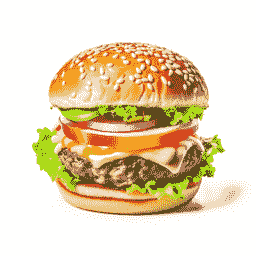
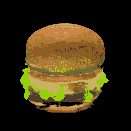

# Shap-E

> 原文链接：[`huggingface.co/docs/diffusers/using-diffusers/shap-e`](https://huggingface.co/docs/diffusers/using-diffusers/shap-e)

Shap-E 是用于生成 3D 资产的条件模型，可用于视频游戏开发、室内设计和建筑。它在大量 3D 资产数据集上进行训练，并进行后处理以渲染每个对象的更多视图，并生成 16K 而不是 4K 点云。Shap-E 模型经过两步训练：

1.  编码器接受点云和渲染视图的 3D 资产，并输出表示资产的隐式函数的参数

1.  扩散模型在编码器产生的潜在变量上进行训练，以生成神经辐射场（NeRFs）或带纹理的 3D 网格，使得更容易在下游应用中渲染和使用 3D 资产

本指南将向您展示如何使用 Shap-E 开始生成您自己的 3D 资产！

在开始之前，请确保已安装以下库：

```py
# uncomment to install the necessary libraries in Colab
#!pip install -q diffusers transformers accelerate trimesh
```

## 文本到 3D

要生成 3D 对象的 gif，请将文本提示传递给 ShapEPipeline。该管道生成一系列图像帧，用于创建 3D 对象。

```py
import torch
from diffusers import ShapEPipeline

device = torch.device("cuda" if torch.cuda.is_available() else "cpu")

pipe = ShapEPipeline.from_pretrained("openai/shap-e", torch_dtype=torch.float16, variant="fp16")
pipe = pipe.to(device)

guidance_scale = 15.0
prompt = ["A firecracker", "A birthday cupcake"]

images = pipe(
    prompt,
    guidance_scale=guidance_scale,
    num_inference_steps=64,
    frame_size=256,
).images
```

现在使用 export_to_gif()函数将图像帧列表转换为 3D 对象的 gif。

```py
from diffusers.utils import export_to_gif

export_to_gif(images[0], "firecracker_3d.gif")
export_to_gif(images[1], "cake_3d.gif")
```


提示 = "一个鞭炮"


提示 = "一个生日杯子"

## 图像到 3D

从另一幅图像生成 3D 对象，请使用 ShapEImg2ImgPipeline。您可以使用现有图像或生成全新的图像。让我们使用 Kandinsky 2.1 模型来生成一个新图像。

```py
from diffusers import DiffusionPipeline
import torch

prior_pipeline = DiffusionPipeline.from_pretrained("kandinsky-community/kandinsky-2-1-prior", torch_dtype=torch.float16, use_safetensors=True).to("cuda")
pipeline = DiffusionPipeline.from_pretrained("kandinsky-community/kandinsky-2-1", torch_dtype=torch.float16, use_safetensors=True).to("cuda")

prompt = "A cheeseburger, white background"

image_embeds, negative_image_embeds = prior_pipeline(prompt, guidance_scale=1.0).to_tuple()
image = pipeline(
    prompt,
    image_embeds=image_embeds,
    negative_image_embeds=negative_image_embeds,
).images[0]

image.save("burger.png")
```

将奶酪汉堡传递给 ShapEImg2ImgPipeline 以生成其的 3D 表示。

```py
from PIL import Image
from diffusers import ShapEImg2ImgPipeline
from diffusers.utils import export_to_gif

pipe = ShapEImg2ImgPipeline.from_pretrained("openai/shap-e-img2img", torch_dtype=torch.float16, variant="fp16").to("cuda")

guidance_scale = 3.0
image = Image.open("burger.png").resize((256, 256))

images = pipe(
    image,
    guidance_scale=guidance_scale,
    num_inference_steps=64,
    frame_size=256,
).images

gif_path = export_to_gif(images[0], "burger_3d.gif")
```



奶酪汉堡包



3D 奶酪汉堡包

## 生成网格

Shap-E 是一个灵活的模型，还可以生成纹理网格输出以供下游应用渲染。在此示例中，您将将输出转换为`glb`文件，因为🤗数据集库支持`glb`文件的网格可视化，可以由[数据集查看器](https://huggingface.co/docs/hub/datasets-viewer#dataset-preview)渲染。

您可以通过将`output_type`参数指定为`"mesh"`来为 ShapEPipeline 和 ShapEImg2ImgPipeline 生成网格输出：

```py
import torch
from diffusers import ShapEPipeline

device = torch.device("cuda" if torch.cuda.is_available() else "cpu")

pipe = ShapEPipeline.from_pretrained("openai/shap-e", torch_dtype=torch.float16, variant="fp16")
pipe = pipe.to(device)

guidance_scale = 15.0
prompt = "A birthday cupcake"

images = pipe(prompt, guidance_scale=guidance_scale, num_inference_steps=64, frame_size=256, output_type="mesh").images
```

使用`export_to_ply()`函数将网格输出保存为`ply`文件：

您还可以使用`export_to_obj()`函数将网格输出保存为`obj`文件。将网格输出保存为各种格式的能力使其在下游用途中更加灵活！

```py
from diffusers.utils import export_to_ply

ply_path = export_to_ply(images[0], "3d_cake.ply")
print(f"Saved to folder: {ply_path}")
```

然后，您可以使用 trimesh 库将`ply`文件转换为`glb`文件：

```py
import trimesh

mesh = trimesh.load("3d_cake.ply")
mesh_export = mesh.export("3d_cake.glb", file_type="glb")
```

默认情况下，网格输出是从底部视角聚焦的，但您可以通过应用旋转变换来更改默认视角：

```py
import trimesh
import numpy as np

mesh = trimesh.load("3d_cake.ply")
rot = trimesh.transformations.rotation_matrix(-np.pi / 2, [1, 0, 0])
mesh = mesh.apply_transform(rot)
mesh_export = mesh.export("3d_cake.glb", file_type="glb")
```

将网格文件上传到数据集存储库以使用数据集查看器进行可视化！


