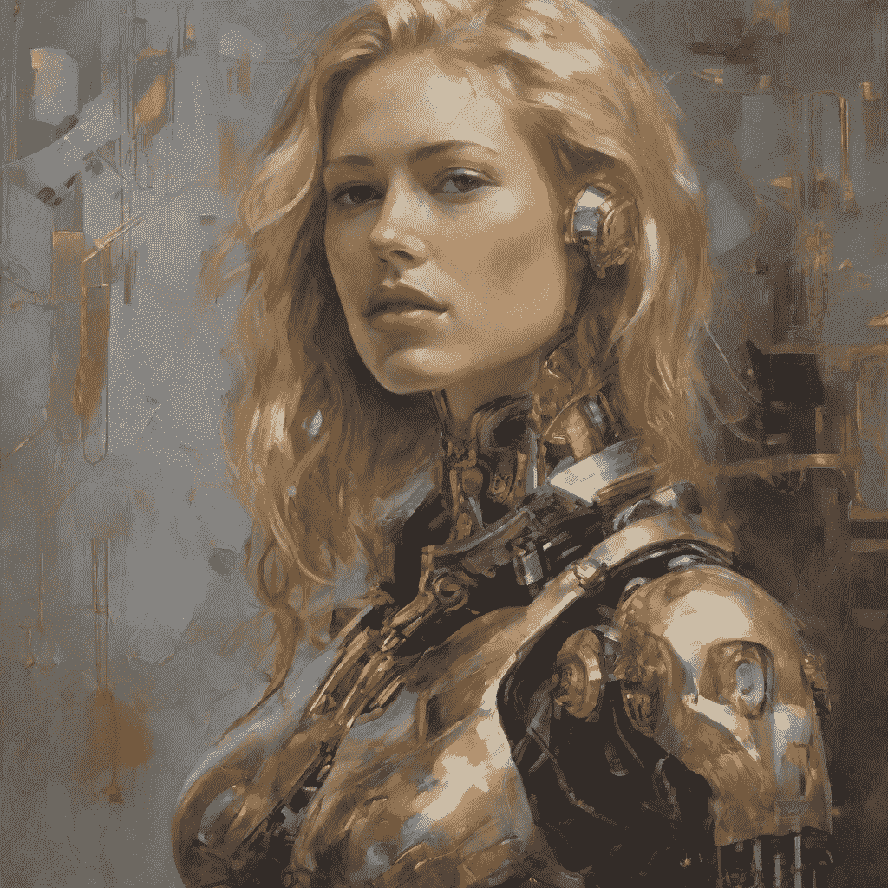
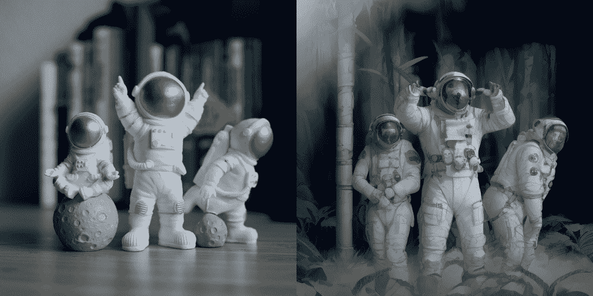
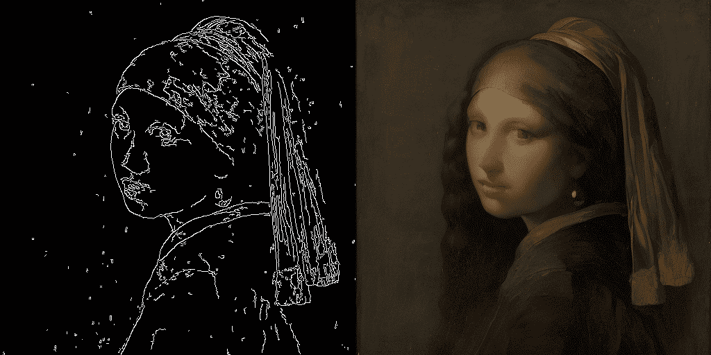
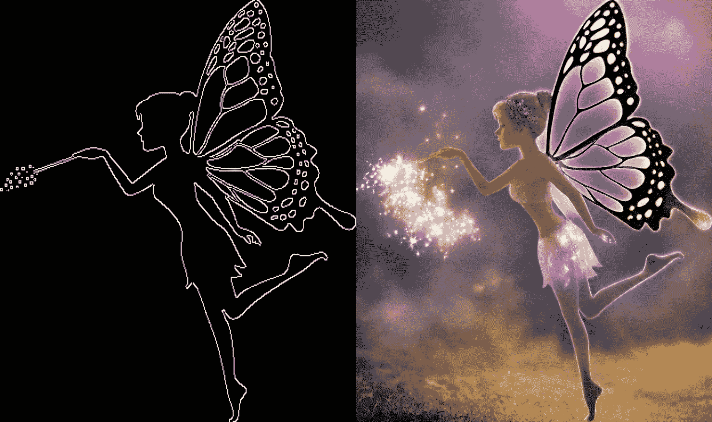

# 潜在一致性模型

> 原始文本：[`huggingface.co/docs/diffusers/using-diffusers/inference_with_lcm`](https://huggingface.co/docs/diffusers/using-diffusers/inference_with_lcm)

潜在一致性模型（LCM）使得在通常 2-4 步内生成高质量图像成为可能，从而可以在几乎实时的环境中使用扩散模型。

从[官方网站](https://latent-consistency-models.github.io/)：

> LCMs 可以从任何预训练的稳定扩散（SD）中精馏，在仅 4,000 个训练步骤（~32 A100 GPU 小时）内生成高质量的 768 x 768 分辨率图像，只需 2~4 步甚至一步，显著加速文本到图像的生成。我们使用 LCM 来在仅 4,000 个训练迭代中精馏 SD 的 Dreamshaper-V7 版本。

有关 LCMs 的更多技术概述，请参阅[论文](https://huggingface.co/papers/2310.04378)。

LCM 精馏模型可在[stable-diffusion-v1-5](https://huggingface.co/runwayml/stable-diffusion-v1-5)、[stable-diffusion-xl-base-1.0](https://huggingface.co/stabilityai/stable-diffusion-xl-base-1.0)和[SSD-1B](https://huggingface.co/segmind/SSD-1B)模型中找到。所有检查点都可以在这个[集合](https://huggingface.co/collections/latent-consistency/latent-consistency-models-weights-654ce61a95edd6dffccef6a8)中找到。

本指南展示了如何对 LCMs 进行推理

+   文本到图像

+   图像到图像

+   结合风格 LoRAs

+   ControlNet/T2I-Adapter

## 文本到图像

您将使用 StableDiffusionXLPipeline 管道与 LCMScheduler，然后加载 LCM-LoRA。与 LCM-LoRA 和调度器一起，管道实现了快速推理工作流程，克服了扩散模型缓慢的迭代性质。

```py
from diffusers import StableDiffusionXLPipeline, UNet2DConditionModel, LCMScheduler
import torch

unet = UNet2DConditionModel.from_pretrained(
    "latent-consistency/lcm-sdxl",
    torch_dtype=torch.float16,
    variant="fp16",
)
pipe = StableDiffusionXLPipeline.from_pretrained(
    "stabilityai/stable-diffusion-xl-base-1.0", unet=unet, torch_dtype=torch.float16, variant="fp16",
).to("cuda")
pipe.scheduler = LCMScheduler.from_config(pipe.scheduler.config)

prompt = "Self-portrait oil painting, a beautiful cyborg with golden hair, 8k"

generator = torch.manual_seed(0)
image = pipe(
    prompt=prompt, num_inference_steps=4, generator=generator, guidance_scale=8.0
).images[0]
```



请注意，我们仅使用 4 步生成，这远远少于通常用于标准 SDXL 的步骤。

需要记住的一些细节：

+   为了进行无分类器指导，通常在管道内将批处理大小加倍。然而，LCM 使用指导嵌入来应用指导，因此在这种情况下批处理大小不必加倍。这导致更快的推理时间，但负面提示对去噪过程没有任何影响。

+   UNet 是使用[3., 13.]指导范围进行训练的。因此，这是`guidance_scale`的理想范围。然而，在大多数情况下，使用值为 1.0 禁用`guidance_scale`也是有效的。

## 图像到图像

LCMs 也可以应用于图像到图像的任务。在本示例中，我们将使用[LCM_Dreamshaper_v7](https://huggingface.co/SimianLuo/LCM_Dreamshaper_v7)模型，但相同的步骤也可以应用于其他 LCM 模型。

```py
import torch
from diffusers import AutoPipelineForImage2Image, UNet2DConditionModel, LCMScheduler
from diffusers.utils import make_image_grid, load_image

unet = UNet2DConditionModel.from_pretrained(
    "SimianLuo/LCM_Dreamshaper_v7",
    subfolder="unet",
    torch_dtype=torch.float16,
)

pipe = AutoPipelineForImage2Image.from_pretrained(
    "Lykon/dreamshaper-7",
    unet=unet,
    torch_dtype=torch.float16,
    variant="fp16",
).to("cuda")
pipe.scheduler = LCMScheduler.from_config(pipe.scheduler.config)

# prepare image
url = "https://huggingface.co/datasets/huggingface/documentation-images/resolve/main/diffusers/img2img-init.png"
init_image = load_image(url)
prompt = "Astronauts in a jungle, cold color palette, muted colors, detailed, 8k"

# pass prompt and image to pipeline
generator = torch.manual_seed(0)
image = pipe(
    prompt,
    image=init_image,
    num_inference_steps=4,
    guidance_scale=7.5,
    strength=0.5,
    generator=generator
).images[0]
make_image_grid([init_image, image], rows=1, cols=2)
```



根据您的提示和提供的图像，您可以获得不同的结果。为了获得最佳结果，我们建议尝试不同的`num_inference_steps`、`strength`和`guidance_scale`参数值，并选择最佳值。

## 结合风格 LoRAs

LCMs 可以与其他风格化的 LoRAs 一起使用，以在很少的步骤（4-8）内生成风格化图像。在下面的示例中，我们将使用 papercut LoRA。

```py
from diffusers import StableDiffusionXLPipeline, UNet2DConditionModel, LCMScheduler
import torch

unet = UNet2DConditionModel.from_pretrained(
    "latent-consistency/lcm-sdxl",
    torch_dtype=torch.float16,
    variant="fp16",
)
pipe = StableDiffusionXLPipeline.from_pretrained(
    "stabilityai/stable-diffusion-xl-base-1.0", unet=unet, torch_dtype=torch.float16, variant="fp16",
).to("cuda")
pipe.scheduler = LCMScheduler.from_config(pipe.scheduler.config)

pipe.load_lora_weights("TheLastBen/Papercut_SDXL", weight_name="papercut.safetensors", adapter_name="papercut")

prompt = "papercut, a cute fox"

generator = torch.manual_seed(0)
image = pipe(
    prompt=prompt, num_inference_steps=4, generator=generator, guidance_scale=8.0
).images[0]
image
```


## ControlNet/T2I-Adapter

让我们看看如何使用 ControlNet/T2I-Adapter 和 LCM 进行推理。

### ControlNet

在本示例中，我们将使用带有 canny ControlNet 的[LCM_Dreamshaper_v7](https://huggingface.co/SimianLuo/LCM_Dreamshaper_v7)模型，但相同的步骤也可以应用于其他 LCM 模型。

```py
import torch
import cv2
import numpy as np
from PIL import Image

from diffusers import StableDiffusionControlNetPipeline, ControlNetModel, LCMScheduler
from diffusers.utils import load_image, make_image_grid

image = load_image(
    "https://hf.co/datasets/huggingface/documentation-images/resolve/main/diffusers/input_image_vermeer.png"
).resize((512, 512))

image = np.array(image)

low_threshold = 100
high_threshold = 200

image = cv2.Canny(image, low_threshold, high_threshold)
image = image[:, :, None]
image = np.concatenate([image, image, image], axis=2)
canny_image = Image.fromarray(image)

controlnet = ControlNetModel.from_pretrained("lllyasviel/sd-controlnet-canny", torch_dtype=torch.float16)
pipe = StableDiffusionControlNetPipeline.from_pretrained(
    "SimianLuo/LCM_Dreamshaper_v7",
    controlnet=controlnet,
    torch_dtype=torch.float16,
    safety_checker=None,
).to("cuda")

# set scheduler
pipe.scheduler = LCMScheduler.from_config(pipe.scheduler.config)

generator = torch.manual_seed(0)
image = pipe(
    "the mona lisa",
    image=canny_image,
    num_inference_steps=4,
    generator=generator,
).images[0]
make_image_grid([canny_image, image], rows=1, cols=2)
```



在这个例子中的推理参数可能不适用于所有例子，因此我们建议尝试不同的值来调整`num_inference_steps`、`guidance_scale`、`controlnet_conditioning_scale`和`cross_attention_kwargs`参数，并选择最佳值。

### T2I-适配器

这个例子展示了如何使用`lcm-sdxl`和 Canny T2I-适配器。

```py
import torch
import cv2
import numpy as np
from PIL import Image

from diffusers import StableDiffusionXLAdapterPipeline, UNet2DConditionModel, T2IAdapter, LCMScheduler
from diffusers.utils import load_image, make_image_grid

# Prepare image
# Detect the canny map in low resolution to avoid high-frequency details
image = load_image(
    "https://huggingface.co/Adapter/t2iadapter/resolve/main/figs_SDXLV1.0/org_canny.jpg"
).resize((384, 384))

image = np.array(image)

low_threshold = 100
high_threshold = 200

image = cv2.Canny(image, low_threshold, high_threshold)
image = image[:, :, None]
image = np.concatenate([image, image, image], axis=2)
canny_image = Image.fromarray(image).resize((1024, 1216))

# load adapter
adapter = T2IAdapter.from_pretrained("TencentARC/t2i-adapter-canny-sdxl-1.0", torch_dtype=torch.float16, varient="fp16").to("cuda")

unet = UNet2DConditionModel.from_pretrained(
    "latent-consistency/lcm-sdxl",
    torch_dtype=torch.float16,
    variant="fp16",
)
pipe = StableDiffusionXLAdapterPipeline.from_pretrained(
    "stabilityai/stable-diffusion-xl-base-1.0",
    unet=unet,
    adapter=adapter,
    torch_dtype=torch.float16,
    variant="fp16", 
).to("cuda")

pipe.scheduler = LCMScheduler.from_config(pipe.scheduler.config)

prompt = "Mystical fairy in real, magic, 4k picture, high quality"
negative_prompt = "extra digit, fewer digits, cropped, worst quality, low quality, glitch, deformed, mutated, ugly, disfigured"

generator = torch.manual_seed(0)
image = pipe(
    prompt=prompt,
    negative_prompt=negative_prompt,
    image=canny_image,
    num_inference_steps=4,
    guidance_scale=5,
    adapter_conditioning_scale=0.8, 
    adapter_conditioning_factor=1,
    generator=generator,
).images[0]
grid = make_image_grid([canny_image, image], rows=1, cols=2)
```


