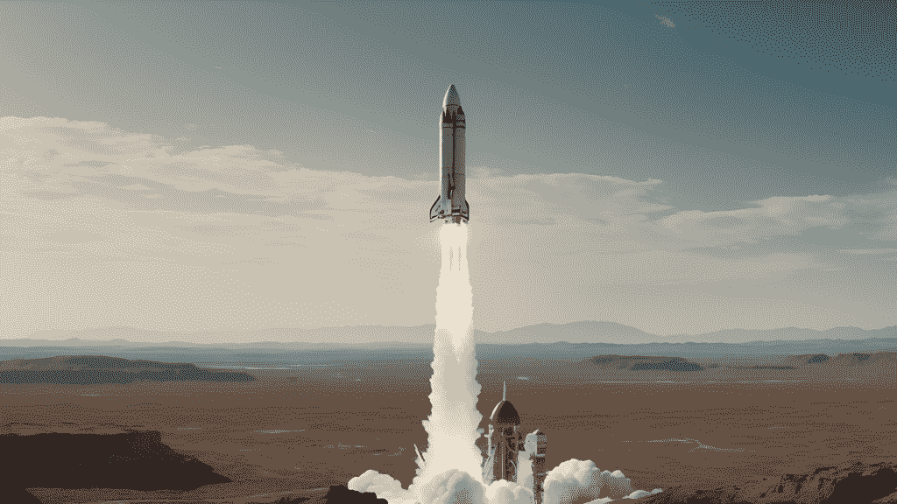
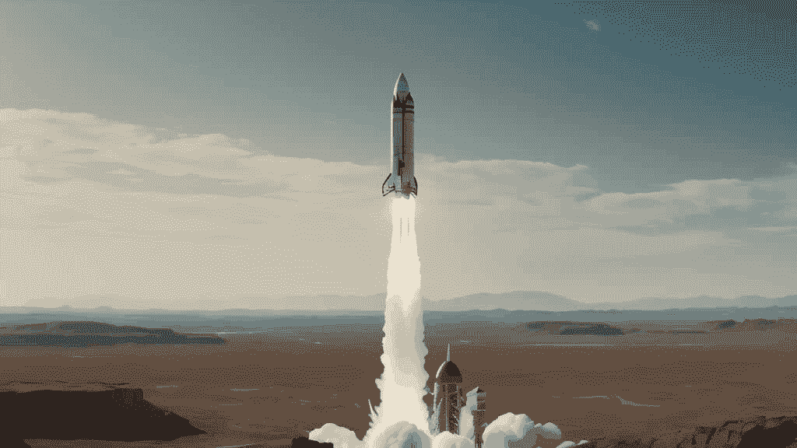
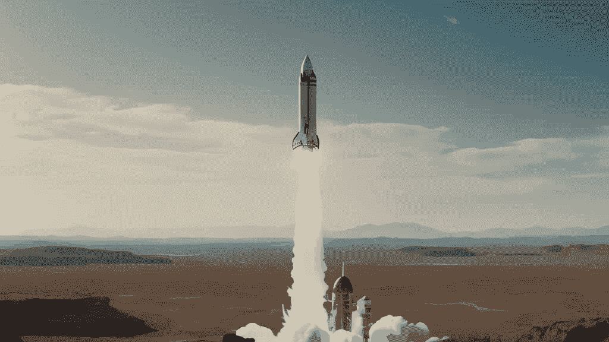

# 稳定视频扩散

> 原始文本：[`huggingface.co/docs/diffusers/using-diffusers/svd`](https://huggingface.co/docs/diffusers/using-diffusers/svd)

[稳定视频扩散（SVD）](https://huggingface.co/papers/2311.15127)是一个强大的图像到视频生成模型，可以生成基于输入图像的 2-4 秒高分辨率（576x1024）视频。

本指南将向您展示如何使用 SVD 从图像生成短视频。

在开始之前，请确保已安装以下库：

```py
!pip install -q -U diffusers transformers accelerate 
```

这个模型有两个变体，[SVD](https://huggingface.co/stabilityai/stable-video-diffusion-img2vid)和[SVD-XT](https://huggingface.co/stabilityai/stable-video-diffusion-img2vid-xt)。SVD 检查点经过训练，可以生成 14 帧，而 SVD-XT 检查点经过进一步微调，可以生成 25 帧。

本指南将使用 SVD-XT 检查点。

```py
import torch

from diffusers import StableVideoDiffusionPipeline
from diffusers.utils import load_image, export_to_video

pipe = StableVideoDiffusionPipeline.from_pretrained(
    "stabilityai/stable-video-diffusion-img2vid-xt", torch_dtype=torch.float16, variant="fp16"
)
pipe.enable_model_cpu_offload()

# Load the conditioning image
image = load_image("https://huggingface.co/datasets/huggingface/documentation-images/resolve/main/diffusers/svd/rocket.png")
image = image.resize((1024, 576))

generator = torch.manual_seed(42)
frames = pipe(image, decode_chunk_size=8, generator=generator).frames[0]

export_to_video(frames, "generated.mp4", fps=7)
```



"一枚火箭的源图像"



"从源图像生成的视频"

## torch.compile

通过编译 UNet，您可以获得 20-25%的加速，代价是略微增加内存。

```py
- pipe.enable_model_cpu_offload()
+ pipe.to("cuda")
+ pipe.unet = torch.compile(pipe.unet, mode="reduce-overhead", fullgraph=True)
```

## 减少内存使用

视频生成非常消耗内存，因为您基本上是一次生成`num_frames`，类似于具有高批量大小的文本到图像生成。为了减少内存需求，有多个选项可以在推理速度和较低内存需求之间进行权衡：

+   启用模型卸载：一旦不再需要管道的每个组件，就将其卸载到 CPU。

+   启用前馈分块：前馈层循环运行，而不是使用巨大的批量大小运行单个前馈。

+   减少`decode_chunk_size`：VAE 将帧解码为块，而不是一次解码所有帧。设置`decode_chunk_size=1`一次解码一帧，并使用最少的内存（我们建议根据您的 GPU 内存调整此值），但视频可能会有些闪烁。

```py
- pipe.enable_model_cpu_offload()
- frames = pipe(image, decode_chunk_size=8, generator=generator).frames[0]
+ pipe.enable_model_cpu_offload()
+ pipe.unet.enable_forward_chunking()
+ frames = pipe(image, decode_chunk_size=2, generator=generator, num_frames=25).frames[0]
```

将所有这些技巧结合在一起应该将内存需求降低到小于 8GB VRAM。

## 微调节

稳定扩散视频还接受微调节，除了调节图像之外，还允许更多控制生成的视频：

+   `fps`：生成视频的帧率。

+   `motion_bucket_id`：用于生成视频的运动桶 ID。这可以用于控制生成视频的运动。增加运动桶 ID 会增加生成视频的运动。

+   `noise_aug_strength`：添加到调节图像的噪声量。值越高，视频越不像调节图像。增加此值还会增加生成视频的运动。

例如，要生成具有更多运动的视频，请使用`motion_bucket_id`和`noise_aug_strength`微调参数：

```py
import torch

from diffusers import StableVideoDiffusionPipeline
from diffusers.utils import load_image, export_to_video

pipe = StableVideoDiffusionPipeline.from_pretrained(
  "stabilityai/stable-video-diffusion-img2vid-xt", torch_dtype=torch.float16, variant="fp16"
)
pipe.enable_model_cpu_offload()

# Load the conditioning image
image = load_image("https://huggingface.co/datasets/huggingface/documentation-images/resolve/main/diffusers/svd/rocket.png")
image = image.resize((1024, 576))

generator = torch.manual_seed(42)
frames = pipe(image, decode_chunk_size=8, generator=generator, motion_bucket_id=180, noise_aug_strength=0.1).frames[0]
export_to_video(frames, "generated.mp4", fps=7)
```


