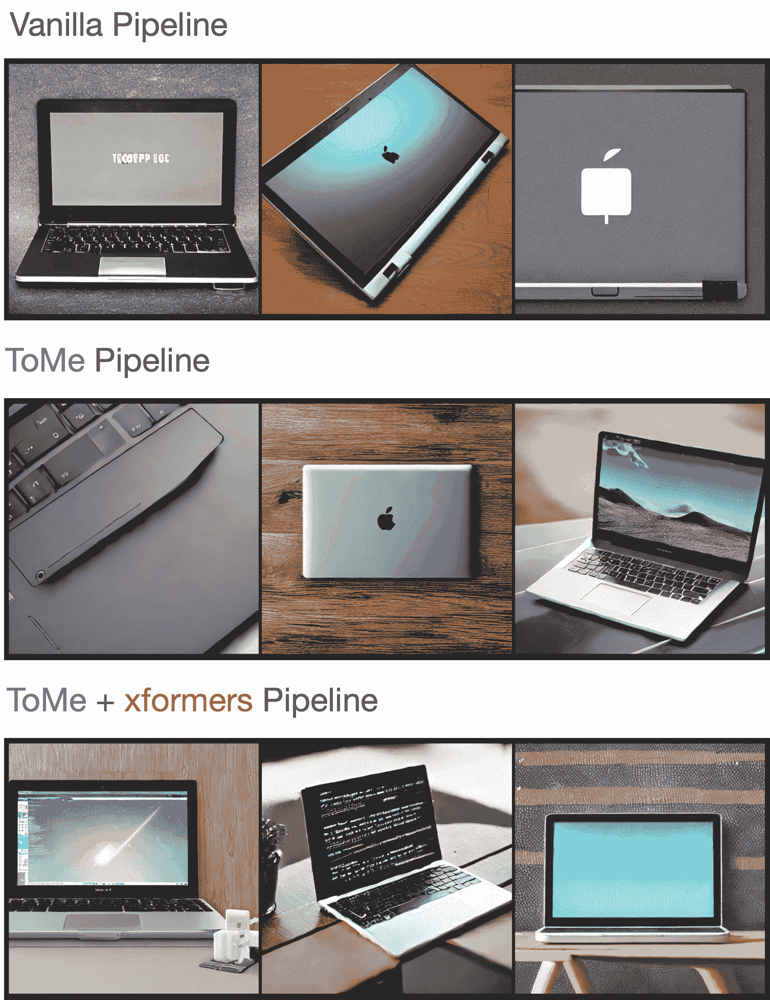

# 标记合并

> 原始文本：[`huggingface.co/docs/diffusers/optimization/tome`](https://huggingface.co/docs/diffusers/optimization/tome)

[标记合并](https://huggingface.co/papers/2303.17604)（ToMe）在基于 Transformer 的网络的前向传递中逐渐合并冗余标记/补丁，可以加速 StableDiffusionPipeline 的推理延迟。

从`pip`安装 ToMe：

```py
pip install tomesd
```

您可以使用[`tomesd`](https://github.com/dbolya/tomesd)库中的 ToMe，使用[`apply_patch`](https://github.com/dbolya/tomesd?tab=readme-ov-file#usage)函数：

```py
  from diffusers import StableDiffusionPipeline
  import torch
  import tomesd

  pipeline = StableDiffusionPipeline.from_pretrained(
        "runwayml/stable-diffusion-v1-5", torch_dtype=torch.float16, use_safetensors=True,
  ).to("cuda")
+ tomesd.apply_patch(pipeline, ratio=0.5)

  image = pipeline("a photo of an astronaut riding a horse on mars").images[0]
```

`apply_patch`函数公开了一些[参数](https://github.com/dbolya/tomesd#usage)，以帮助在管道推理速度和生成的标记质量之间取得平衡。最重要的参数是`ratio`，它控制在前向传递期间合并的标记数量。

正如在[论文](https://huggingface.co/papers/2303.17604)中所报道的，ToMe 可以在提升推理速度的同时极大地保留生成图像的质量。通过增加`ratio`，您可以进一步加快推理速度，但会以一定的图像质量降低为代价。

为了测试生成图像的质量，我们从[Parti Prompts](https://parti.research.google/)中抽取了一些提示，并使用以下设置对 StableDiffusionPipeline 进行推理：



我们没有注意到生成样本质量有明显下降，您可以在这个[WandB 报告](https://wandb.ai/sayakpaul/tomesd-results/runs/23j4bj3i?workspace=)中查看生成的样本。如果您有兴趣重现这个实验，请使用这个[脚本](https://gist.github.com/sayakpaul/8cac98d7f22399085a060992f411ecbd)。

## 基准测试

我们还对在几种图像分辨率下启用[xFormers](https://huggingface.co/docs/diffusers/optimization/xformers)的 StableDiffusionPipeline 上的`tomesd`的影响进行了基准测试。结果是从 A100 和 V100 GPU 在以下开发环境中获得的：

```py
- `diffusers` version: 0.15.1
- Python version: 3.8.16
- PyTorch version (GPU?): 1.13.1+cu116 (True)
- Huggingface_hub version: 0.13.2
- Transformers version: 4.27.2
- Accelerate version: 0.18.0
- xFormers version: 0.0.16
- tomesd version: 0.1.2
```

要重现这个基准测试，请随时使用这个[脚本](https://gist.github.com/sayakpaul/27aec6bca7eb7b0e0aa4112205850335)。结果以秒为单位报告，必要时我们会报告使用 ToMe 和 ToMe + xFormers 时相对于普通管道的加速百分比。

| **GPU** | **Resolution** | **Batch size** | **Vanilla** | **ToMe** | **ToMe + xFormers** |
| --- | --- | --- | --- | --- | --- |
| **A100** | 512 | 10 | 6.88 | 5.26 (+23.55%) | 4.69 (+31.83%) |
|  | 768 | 10 | OOM | 14.71 | 11 |
|  |  | 8 | OOM | 11.56 | 8.84 |
|  |  | 4 | OOM | 5.98 | 4.66 |
|  |  | 2 | 4.99 | 3.24 (+35.07%) | 2.1 (+37.88%) |
|  |  | 1 | 3.29 | 2.24 (+31.91%) | 2.03 (+38.3%) |
|  | 1024 | 10 | OOM | OOM | OOM |
|  |  | 8 | OOM | OOM | OOM |
|  |  | 4 | OOM | 12.51 | 9.09 |
|  |  | 2 | OOM | 6.52 | 4.96 |
|  |  | 1 | 6.4 | 3.61 (+43.59%) | 2.81 (+56.09%) |
| **V100** | 512 | 10 | OOM | 10.03 | 9.29 |
|  |  | 8 | OOM | 8.05 | 7.47 |
|  |  | 4 | 5.7 | 4.3 (+24.56%) | 3.98 (+30.18%) |
|  |  | 2 | 3.14 | 2.43 (+22.61%) | 2.27 (+27.71%) |
|  |  | 1 | 1.88 | 1.57 (+16.49%) | 1.57 (+16.49%) |
|  | 768 | 10 | OOM | OOM | 23.67 |
|  |  | 8 | OOM | OOM | 18.81 |
|  |  | 4 | OOM | 11.81 | 9.7 |
|  |  | 2 | OOM | 6.27 | 5.2 |
|  |  | 1 | 5.43 | 3.38 (+37.75%) | 2.82 (+48.07%) |
|  | 1024 | 10 | OOM | OOM | OOM |
|  |  | 8 | OOM | OOM | OOM |
|  |  | 4 | OOM | OOM | 19.35 |
|  |  | 2 | OOM | 13 | 10.78 |
|  |  | 1 | OOM | 6.66 | 5.54 |

如上表所示，`tomesd` 的加速效果在更大的图像分辨率下变得更加明显。有趣的是，使用 `tomesd`，可以在更高分辨率（如 1024x1024）上运行流水线。您可以通过 `torch.compile` 进一步加快推理速度。
