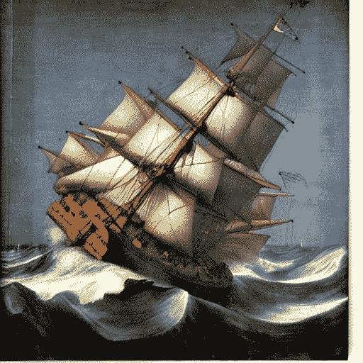

# ONNX Runtime

> 原始文本：[`huggingface.co/docs/diffusers/optimization/onnx`](https://huggingface.co/docs/diffusers/optimization/onnx)

🤗 [Optimum](https://github.com/huggingface/optimum)提供了与 ONNX Runtime 兼容的稳定扩散管道。您需要使用以下命令安装🤗 Optimum 以支持 ONNX Runtime：

```py
pip install -q optimum["onnxruntime"]
```

本指南将向您展示如何使用 ONNX Runtime 与稳定扩散和稳定扩散 XL（SDXL）管道。

## 稳定扩散

要加载并运行推理，请使用[ORTStableDiffusionPipeline](https://huggingface.co/docs/optimum/v1.16.2/en/onnxruntime/package_reference/modeling_ort#optimum.onnxruntime.ORTStableDiffusionPipeline)。如果您想加载 PyTorch 模型并将其即时转换为 ONNX 格式，请设置`export=True`：

```py
from optimum.onnxruntime import ORTStableDiffusionPipeline

model_id = "runwayml/stable-diffusion-v1-5"
pipeline = ORTStableDiffusionPipeline.from_pretrained(model_id, export=True)
prompt = "sailing ship in storm by Leonardo da Vinci"
image = pipeline(prompt).images[0]
pipeline.save_pretrained("./onnx-stable-diffusion-v1-5")
```

在批处理中生成多个提示似乎会占用太多内存。在我们研究此问题时，您可能需要逐个迭代而不是批处理。

将管道以离线 ONNX 格式导出，并稍后用于推理，请使用[`optimum-cli export`](https://huggingface.co/docs/optimum/main/en/exporters/onnx/usage_guides/export_a_model#exporting-a-model-to-onnx-using-the-cli)命令：

```py
optimum-cli export onnx --model runwayml/stable-diffusion-v1-5 sd_v15_onnx/
```

然后执行推理（您不必再次指定`export=True`）：

```py
from optimum.onnxruntime import ORTStableDiffusionPipeline

model_id = "sd_v15_onnx"
pipeline = ORTStableDiffusionPipeline.from_pretrained(model_id)
prompt = "sailing ship in storm by Leonardo da Vinci"
image = pipeline(prompt).images[0]
```



您可以在🤗 Optimum [文档](https://huggingface.co/docs/optimum/)中找到更多示例，并且支持文本到图像、图像到图像和修复的稳定扩散。

## 稳定扩散 XL

要加载并运行 SDXL 推理，请使用[ORTStableDiffusionXLPipeline](https://huggingface.co/docs/optimum/v1.16.2/en/onnxruntime/package_reference/modeling_ort#optimum.onnxruntime.ORTStableDiffusionXLPipeline)：

```py
from optimum.onnxruntime import ORTStableDiffusionXLPipeline

model_id = "stabilityai/stable-diffusion-xl-base-1.0"
pipeline = ORTStableDiffusionXLPipeline.from_pretrained(model_id)
prompt = "sailing ship in storm by Leonardo da Vinci"
image = pipeline(prompt).images[0]
```

要将管道以 ONNX 格式导出并稍后用于推理，请使用[`optimum-cli export`](https://huggingface.co/docs/optimum/main/en/exporters/onnx/usage_guides/export_a_model#exporting-a-model-to-onnx-using-the-cli)命令：

```py
optimum-cli export onnx --model stabilityai/stable-diffusion-xl-base-1.0 --task stable-diffusion-xl sd_xl_onnx/
```

支持文本到图像和图像到图像的 SDXL 格式。
