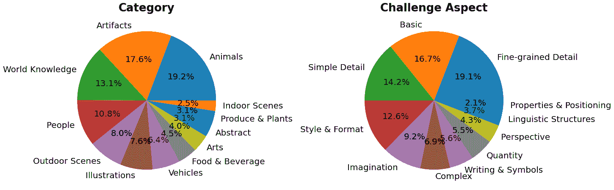
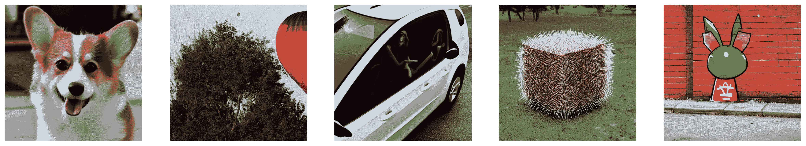
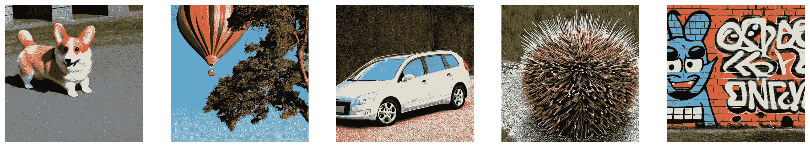
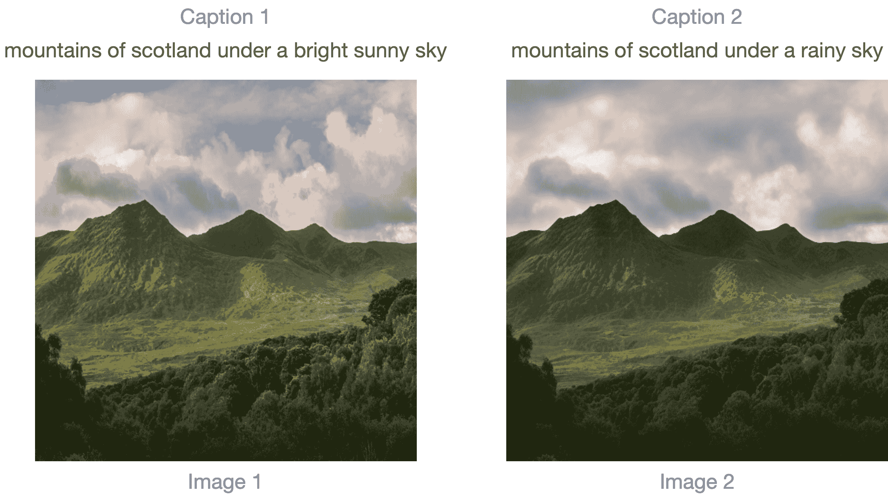
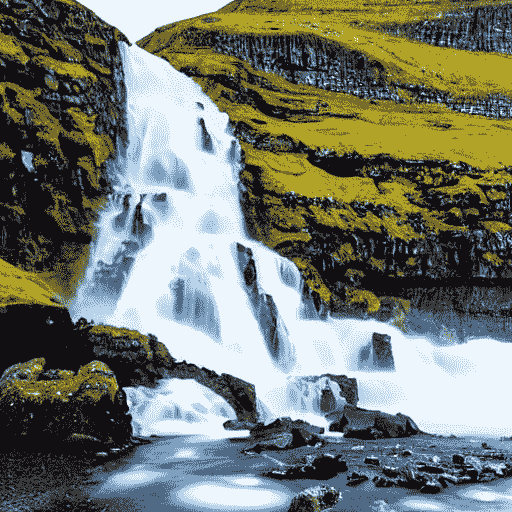
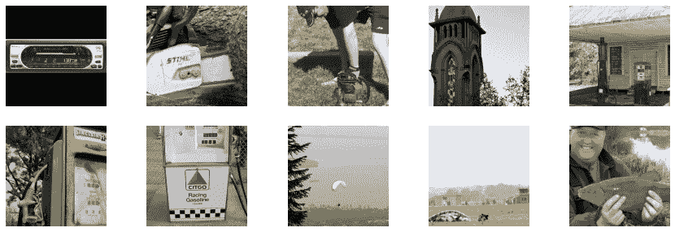
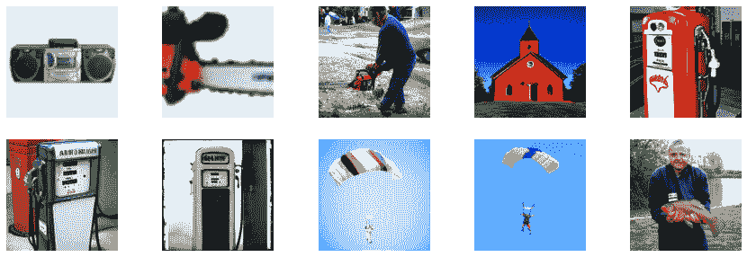

# 评估扩散模型

> 原始文本：[`huggingface.co/docs/diffusers/conceptual/evaluation`](https://huggingface.co/docs/diffusers/conceptual/evaluation)


对于像[Stable Diffusion](https://huggingface.co/docs/diffusers/stable_diffusion)这样的生成模型的评估是主观的。但作为从业者和研究人员，我们经常不得不在许多不同的可能性之间做出谨慎的选择。因此，在使用不同的生成模型（如 GAN、Diffusion 等）时，我们如何选择其中一个而不是另一个呢？

对这些模型的定性评估可能存在错误，并可能错误地影响决策。然而，定量指标不一定对应图像质量。因此，通常在选择一个模型而不是另一个时，定性和定量评估的结合提供了更强的信号。

在本文档中，我们提供了一个关于定性和定量方法评估扩散模型的非详尽概述。对于定量方法，我们特别关注如何将它们与`diffusers`一起实施。

本文档中显示的方法也可用于评估不同的[噪声调度器](https://huggingface.co/docs/diffusers/main/en/api/schedulers/overview)，同时保持基础生成模型不变。

## 场景

我们涵盖以下管道的扩散模型：

+   文本引导的图像生成（如[`StableDiffusionPipeline`](https://huggingface.co/docs/diffusers/main/en/api/pipelines/stable_diffusion/text2img)）。

+   文本引导的图像生成，另外还依赖于输入图像（例如[`StableDiffusionImg2ImgPipeline`](https://huggingface.co/docs/diffusers/main/en/api/pipelines/stable_diffusion/img2img)和[`StableDiffusionInstructPix2PixPipeline`](https://huggingface.co/docs/diffusers/main/en/api/pipelines/pix2pix)）。

+   类别条件的图像生成模型（如[`DiTPipeline`](https://huggingface.co/docs/diffusers/main/en/api/pipelines/dit)）。

## 定性评估

定性评估通常涉及对生成的图像进行人类评估。质量通过诸如组成性、图像文本对齐和空间关系等方面来衡量。常见提示为主观指标提供了一定程度的统一性。DrawBench 和 PartiPrompts 是用于定性基准测试的提示数据集。DrawBench 和 PartiPrompts 分别由[Imagen](https://imagen.research.google/)和[Parti](https://parti.research.google/)引入。

来自[官方 Parti 网站](https://parti.research.google/)：

> PartiPrompts（P2）是我们作为这项工作的一部分发布的一组超过 1600 个英文提示。P2 可用于衡量模型在各种类别和挑战方面的能力。



PartiPrompts 具有以下列：

+   提示

+   提示的类别（如“抽象”，“世界知识”等）

+   反映难度的挑战（如“基本”，“复杂”，“写作与符号”等）

这些基准允许对不同图像生成模型进行并排人类评估。

为此，🧨 Diffusers 团队构建了**Open Parti Prompts**，这是一个基于 Parti Prompts 的社区驱动的定性基准，用于比较最先进的开源扩散模型：

+   [打开 Parti Prompts 游戏](https://huggingface.co/spaces/OpenGenAI/open-parti-prompts)：展示 10 个 parti 提示，用户选择最适合提示的图像。

+   [打开 Parti Prompts 排行榜](https://huggingface.co/spaces/OpenGenAI/parti-prompts-leaderboard)：将当前最佳的开源扩散模型进行比较。

为了手动比较图像，让我们看看如何在几个 PartiPrompts 上使用`diffusers`。

下面我们展示了在不同挑战中抽样的一些提示：基本、复杂、语言结构、想象力和书写与符号。在这里，我们使用 PartiPrompts 作为一个[数据集](https://huggingface.co/datasets/nateraw/parti-prompts)。

```py
from datasets import load_dataset

# prompts = load_dataset("nateraw/parti-prompts", split="train")
# prompts = prompts.shuffle()
# sample_prompts = [prompts[i]["Prompt"] for i in range(5)]

# Fixing these sample prompts in the interest of reproducibility.
sample_prompts = [
    "a corgi",
    "a hot air balloon with a yin-yang symbol, with the moon visible in the daytime sky",
    "a car with no windows",
    "a cube made of porcupine",
    'The saying "BE EXCELLENT TO EACH OTHER" written on a red brick wall with a graffiti image of a green alien wearing a tuxedo. A yellow fire hydrant is on a sidewalk in the foreground.',
]
```

现在我们可以使用这些提示来使用 Stable Diffusion（[v1-4 检查点](https://huggingface.co/CompVis/stable-diffusion-v1-4)）生成一些图像：

```py
import torch

seed = 0
generator = torch.manual_seed(seed)

images = sd_pipeline(sample_prompts, num_images_per_prompt=1, generator=generator).images
```



我们还可以相应地设置`num_images_per_prompt`以比较相同提示的不同图像。使用不同检查点（[v1-5](https://huggingface.co/runwayml/stable-diffusion-v1-5)）运行相同的管道，产生：



一旦使用多个模型（正在评估中）从所有提示生成了几幅图像，这些结果将呈现给人类评估者进行评分。有关 DrawBench 和 PartiPrompts 基准的更多详细信息，请参考它们各自的论文。

在模型训练时查看一些推理样本是有用的，以衡量训练进度。在我们的[训练脚本](https://github.com/huggingface/diffusers/tree/main/examples/)中，我们支持这种实用程序，并额外支持记录到 TensorBoard 和 Weights & Biases。

## 定量评估

在本节中，我们将指导您如何使用以下内容评估三种不同的扩散管道：

+   CLIP 分数

+   CLIP 方向相似性

+   FID

### 文本引导的图像生成

[CLIP 分数](https://arxiv.org/abs/2104.08718)衡量了图像-标题对的兼容性。更高的 CLIP 分数意味着更高的兼容性🔼。CLIP 分数是对定性概念“兼容性”的定量测量。图像-标题对的兼容性也可以被视为图像和标题之间的语义相似性。发现 CLIP 分数与人类判断具有很高的相关性。

让我们首先加载一个 StableDiffusionPipeline：

```py
from diffusers import StableDiffusionPipeline
import torch

model_ckpt = "CompVis/stable-diffusion-v1-4"
sd_pipeline = StableDiffusionPipeline.from_pretrained(model_ckpt, torch_dtype=torch.float16).to("cuda")
```

使用多个提示生成一些图像：

```py
prompts = [
    "a photo of an astronaut riding a horse on mars",
    "A high tech solarpunk utopia in the Amazon rainforest",
    "A pikachu fine dining with a view to the Eiffel Tower",
    "A mecha robot in a favela in expressionist style",
    "an insect robot preparing a delicious meal",
    "A small cabin on top of a snowy mountain in the style of Disney, artstation",
]

images = sd_pipeline(prompts, num_images_per_prompt=1, output_type="np").images

print(images.shape)
# (6, 512, 512, 3)
```

然后，我们计算 CLIP 分数。

```py
from torchmetrics.functional.multimodal import clip_score
from functools import partial

clip_score_fn = partial(clip_score, model_name_or_path="openai/clip-vit-base-patch16")

def calculate_clip_score(images, prompts):
    images_int = (images * 255).astype("uint8")
    clip_score = clip_score_fn(torch.from_numpy(images_int).permute(0, 3, 1, 2), prompts).detach()
    return round(float(clip_score), 4)

sd_clip_score = calculate_clip_score(images, prompts)
print(f"CLIP score: {sd_clip_score}")
# CLIP score: 35.7038
```

在上面的例子中，我们为每个提示生成了一幅图像。如果我们为每个提示生成多幅图像，我们将不得不从每个提示生成的图像中取平均分数。

现在，如果我们想要比较两个与 StableDiffusionPipeline 兼容的检查点，我们应该在调用管道时传递一个生成器。首先，我们使用[v1-4 Stable Diffusion 检查点](https://huggingface.co/CompVis/stable-diffusion-v1-4)生成图像：

```py
seed = 0
generator = torch.manual_seed(seed)

images = sd_pipeline(prompts, num_images_per_prompt=1, generator=generator, output_type="np").images
```

然后我们加载[v1-5 检查点](https://huggingface.co/runwayml/stable-diffusion-v1-5)来生成图像：

```py
model_ckpt_1_5 = "runwayml/stable-diffusion-v1-5"
sd_pipeline_1_5 = StableDiffusionPipeline.from_pretrained(model_ckpt_1_5, torch_dtype=weight_dtype).to(device)

images_1_5 = sd_pipeline_1_5(prompts, num_images_per_prompt=1, generator=generator, output_type="np").images
```

最后，我们比较它们的 CLIP 分数：

```py
sd_clip_score_1_4 = calculate_clip_score(images, prompts)
print(f"CLIP Score with v-1-4: {sd_clip_score_1_4}")
# CLIP Score with v-1-4: 34.9102

sd_clip_score_1_5 = calculate_clip_score(images_1_5, prompts)
print(f"CLIP Score with v-1-5: {sd_clip_score_1_5}")
# CLIP Score with v-1-5: 36.2137
```

似乎[v1-5](https://huggingface.co/runwayml/stable-diffusion-v1-5)检查点的性能优于其前身。然而，请注意，我们用于计算 CLIP 分数的提示数量相当低。为了进行更实际的评估，这个数字应该更高，并且提示应该更加多样化。

从构造上看，这个分数存在一些限制。训练数据集中的标题是从网络上爬取的，并从互联网上与图像相关联的`alt`和类似标签中提取的。它们不一定代表人类用来描述图像的方式。因此，我们必须在这里“设计”一些提示。

### 图像条件的文本到图像生成

在这种情况下，我们将生成管道与输入图像以及文本提示一起进行条件化。让我们以 StableDiffusionInstructPix2PixPipeline 为例。它将编辑指令作为输入提示，并输入要编辑的图像。

这里是一个例子：


评估这样一个模型的一种策略是测量两个图像之间的变化的一致性（在[CLIP](https://huggingface.co/docs/transformers/model_doc/clip)空间中）与两个图像标题之间的变化之间的一致性（如[CLIP 引导的图像生成领域自适应](https://arxiv.org/abs/2108.00946)所示）。这被称为“**CLIP 方向相似性**”。

+   标题 1 对应于要编辑的输入图像（图像 1）。

+   标题 2 对应于编辑后的图像（图像 2）。它应该反映编辑指令。

以下是一个图解概述：



我们准备了一个小型数据集来实现这个指标。让我们首先加载数据集。

```py
from datasets import load_dataset

dataset = load_dataset("sayakpaul/instructpix2pix-demo", split="train")
dataset.features
```

```py
{'input': Value(dtype='string', id=None),
 'edit': Value(dtype='string', id=None),
 'output': Value(dtype='string', id=None),
 'image': Image(decode=True, id=None)}
```

这里有：

+   `input` 是与 `image` 对应的标题。

+   `edit` 表示编辑指令。

+   `output` 表示反映 `edit` 指令的修改后标题。

让我们看一个示例。

```py
idx = 0
print(f"Original caption: {dataset[idx]['input']}")
print(f"Edit instruction: {dataset[idx]['edit']}")
print(f"Modified caption: {dataset[idx]['output']}")
```

```py
Original caption: 2\. FAROE ISLANDS: An archipelago of 18 mountainous isles in the North Atlantic Ocean between Norway and Iceland, the Faroe Islands has 'everything you could hope for', according to Big 7 Travel. It boasts 'crystal clear waterfalls, rocky cliffs that seem to jut out of nowhere and velvety green hills'
Edit instruction: make the isles all white marble
Modified caption: 2\. WHITE MARBLE ISLANDS: An archipelago of 18 mountainous white marble isles in the North Atlantic Ocean between Norway and Iceland, the White Marble Islands has 'everything you could hope for', according to Big 7 Travel. It boasts 'crystal clear waterfalls, rocky cliffs that seem to jut out of nowhere and velvety green hills'
```

这里是图片：

```py
dataset[idx]["image"]
```



我们将首先使用编辑指令编辑数据集的图像，并计算方向相似性。

让我们首先加载 StableDiffusionInstructPix2PixPipeline：

```py
from diffusers import StableDiffusionInstructPix2PixPipeline

instruct_pix2pix_pipeline = StableDiffusionInstructPix2PixPipeline.from_pretrained(
    "timbrooks/instruct-pix2pix", torch_dtype=torch.float16
).to(device)
```

现在，我们进行编辑：

```py
import numpy as np

def edit_image(input_image, instruction):
    image = instruct_pix2pix_pipeline(
        instruction,
        image=input_image,
        output_type="np",
        generator=generator,
    ).images[0]
    return image

input_images = []
original_captions = []
modified_captions = []
edited_images = []

for idx in range(len(dataset)):
    input_image = dataset[idx]["image"]
    edit_instruction = dataset[idx]["edit"]
    edited_image = edit_image(input_image, edit_instruction)

    input_images.append(np.array(input_image))
    original_captions.append(dataset[idx]["input"])
    modified_captions.append(dataset[idx]["output"])
    edited_images.append(edited_image)
```

为了测量方向相似性，我们首先加载 CLIP 的图像和文本编码器：

```py
from transformers import (
    CLIPTokenizer,
    CLIPTextModelWithProjection,
    CLIPVisionModelWithProjection,
    CLIPImageProcessor,
)

clip_id = "openai/clip-vit-large-patch14"
tokenizer = CLIPTokenizer.from_pretrained(clip_id)
text_encoder = CLIPTextModelWithProjection.from_pretrained(clip_id).to(device)
image_processor = CLIPImageProcessor.from_pretrained(clip_id)
image_encoder = CLIPVisionModelWithProjection.from_pretrained(clip_id).to(device)
```

请注意，我们正在使用特定的 CLIP 检查点，即 `openai/clip-vit-large-patch14`。这是因为 Stable Diffusion 的预训练是使用这个 CLIP 变体进行的。有关更多详细信息，请参阅[文档](https://huggingface.co/docs/transformers/model_doc/clip)。

接下来，我们准备一个 PyTorch `nn.Module` 来计算方向相似性：

```py
import torch.nn as nn
import torch.nn.functional as F

class DirectionalSimilarity(nn.Module):
    def __init__(self, tokenizer, text_encoder, image_processor, image_encoder):
        super().__init__()
        self.tokenizer = tokenizer
        self.text_encoder = text_encoder
        self.image_processor = image_processor
        self.image_encoder = image_encoder

    def preprocess_image(self, image):
        image = self.image_processor(image, return_tensors="pt")["pixel_values"]
        return {"pixel_values": image.to(device)}

    def tokenize_text(self, text):
        inputs = self.tokenizer(
            text,
            max_length=self.tokenizer.model_max_length,
            padding="max_length",
            truncation=True,
            return_tensors="pt",
        )
        return {"input_ids": inputs.input_ids.to(device)}

    def encode_image(self, image):
        preprocessed_image = self.preprocess_image(image)
        image_features = self.image_encoder(**preprocessed_image).image_embeds
        image_features = image_features / image_features.norm(dim=1, keepdim=True)
        return image_features

    def encode_text(self, text):
        tokenized_text = self.tokenize_text(text)
        text_features = self.text_encoder(**tokenized_text).text_embeds
        text_features = text_features / text_features.norm(dim=1, keepdim=True)
        return text_features

    def compute_directional_similarity(self, img_feat_one, img_feat_two, text_feat_one, text_feat_two):
        sim_direction = F.cosine_similarity(img_feat_two - img_feat_one, text_feat_two - text_feat_one)
        return sim_direction

    def forward(self, image_one, image_two, caption_one, caption_two):
        img_feat_one = self.encode_image(image_one)
        img_feat_two = self.encode_image(image_two)
        text_feat_one = self.encode_text(caption_one)
        text_feat_two = self.encode_text(caption_two)
        directional_similarity = self.compute_directional_similarity(
            img_feat_one, img_feat_two, text_feat_one, text_feat_two
        )
        return directional_similarity
```

现在让我们使用 `DirectionalSimilarity`。

```py
dir_similarity = DirectionalSimilarity(tokenizer, text_encoder, image_processor, image_encoder)
scores = []

for i in range(len(input_images)):
    original_image = input_images[i]
    original_caption = original_captions[i]
    edited_image = edited_images[i]
    modified_caption = modified_captions[i]

    similarity_score = dir_similarity(original_image, edited_image, original_caption, modified_caption)
    scores.append(float(similarity_score.detach().cpu()))

print(f"CLIP directional similarity: {np.mean(scores)}")
# CLIP directional similarity: 0.0797976553440094
```

与 CLIP 分数类似，CLIP 方向相似性越高，效果越好。

应该注意的是 `StableDiffusionInstructPix2PixPipeline` 公开了两个参数，即 `image_guidance_scale` 和 `guidance_scale`，让您控制最终编辑图像的质量。我们鼓励您尝试这两个参数，并查看对方向相似性的影响。

我们可以扩展这个指标的思想，来衡量原始图像和编辑版本有多相似。为此，我们只需执行 `F.cosine_similarity(img_feat_two, img_feat_one)`。对于这种类型的编辑，我们仍然希望尽可能保留图像的主要语义，即高相似性分数。

我们可以使用这些指标来评估类似的流水线，比如[`StableDiffusionPix2PixZeroPipeline`](https://huggingface.co/docs/diffusers/main/en/api/pipelines/pix2pix_zero#diffusers.StableDiffusionPix2PixZeroPipeline)。

CLIP 分数和 CLIP 方向相似性都依赖于 CLIP 模型，这可能会使评估产生偏见。

***当评估的模型在大型图像字幕数据集上进行了预训练（例如[LAION-5B 数据集](https://laion.ai/blog/laion-5b/)）时，扩展诸如 IS、FID（稍后讨论）或 KID 等指标可能会很困难。***这是因为这些指标的基础是 InceptionNet（在 ImageNet-1k 数据集上进行了预训练）用于提取中间图像特征。Stable Diffusion 的预训练数据集可能与 InceptionNet 的预训练数据集有限的重叠，因此在这里不是进行特征提取的好选择。

***使用上述指标有助于评估类别条件的模型。例如，[DiT](https://huggingface.co/docs/diffusers/main/en/api/pipelines/dit)。它是在 ImageNet-1k 类别上进行条件预训练的。***

### 类别条件的图像生成

类别条件生成模型通常是在类别标记的数据集上预训练的，例如[ImageNet-1k](https://huggingface.co/datasets/imagenet-1k)。用于评估这些模型的流行指标包括 Fréchet Inception Distance（FID）、Kernel Inception Distance（KID）和 Inception Score（IS）。在本文档中，我们专注于 FID（[Heusel 等人](https://arxiv.org/abs/1706.08500)）。我们展示了如何使用[`DiTPipeline`](https://huggingface.co/docs/diffusers/api/pipelines/dit)来计算它，该工具在底层使用[DiT 模型](https://arxiv.org/abs/2212.09748)。

FID 旨在衡量两组图像数据集之间的相似性。根据[这个资源](https://mmgeneration.readthedocs.io/en/latest/quick_run.html#fid)：

> Fréchet Inception Distance 是衡量两组图像数据集之间相似性的指标。它被证明与人类对视觉质量的判断相关，并且最常用于评估生成对抗网络样本的质量。FID 通过计算适应于 Inception 网络特征表示的两个高斯分布之间的 Fréchet 距离来计算。

这两个数据集本质上是真实图像数据集和假图像数据集（在我们的情况下生成的图像）。FID 通常是使用两个大型数据集来计算的。但是，在本文档中，我们将使用两个小型数据集。

让我们首先从 ImageNet-1k 训练集中下载一些图像：

```py
from zipfile import ZipFile
import requests

def download(url, local_filepath):
    r = requests.get(url)
    with open(local_filepath, "wb") as f:
        f.write(r.content)
    return local_filepath

dummy_dataset_url = "https://hf.co/datasets/sayakpaul/sample-datasets/resolve/main/sample-imagenet-images.zip"
local_filepath = download(dummy_dataset_url, dummy_dataset_url.split("/")[-1])

with ZipFile(local_filepath, "r") as zipper:
    zipper.extractall(".")
```

```py
from PIL import Image
import os

dataset_path = "sample-imagenet-images"
image_paths = sorted([os.path.join(dataset_path, x) for x in os.listdir(dataset_path)])

real_images = [np.array(Image.open(path).convert("RGB")) for path in image_paths]
```

这些是来自以下 ImageNet-1k 类别的 10 张图像：“卡带播放器”、“链锯”（x2）、“教堂”、“加油泵”（x3）、“降落伞”（x2）和“鲑鱼”。



*真实图像。*

现在图像已加载，让我们对它们进行一些轻量级预处理，以便用于 FID 计算。

```py
from torchvision.transforms import functional as F

def preprocess_image(image):
    image = torch.tensor(image).unsqueeze(0)
    image = image.permute(0, 3, 1, 2) / 255.0
    return F.center_crop(image, (256, 256))

real_images = torch.cat([preprocess_image(image) for image in real_images])
print(real_images.shape)
# torch.Size([10, 3, 256, 256])
```

现在我们加载[`DiTPipeline`](https://huggingface.co/docs/diffusers/api/pipelines/dit)来生成基于上述类别的图像。

```py
from diffusers import DiTPipeline, DPMSolverMultistepScheduler

dit_pipeline = DiTPipeline.from_pretrained("facebook/DiT-XL-2-256", torch_dtype=torch.float16)
dit_pipeline.scheduler = DPMSolverMultistepScheduler.from_config(dit_pipeline.scheduler.config)
dit_pipeline = dit_pipeline.to("cuda")

words = [
    "cassette player",
    "chainsaw",
    "chainsaw",
    "church",
    "gas pump",
    "gas pump",
    "gas pump",
    "parachute",
    "parachute",
    "tench",
]

class_ids = dit_pipeline.get_label_ids(words)
output = dit_pipeline(class_labels=class_ids, generator=generator, output_type="np")

fake_images = output.images
fake_images = torch.tensor(fake_images)
fake_images = fake_images.permute(0, 3, 1, 2)
print(fake_images.shape)
# torch.Size([10, 3, 256, 256])
```

现在，我们可以使用[`torchmetrics`](https://torchmetrics.readthedocs.io/)来计算 FID。

```py
from torchmetrics.image.fid import FrechetInceptionDistance

fid = FrechetInceptionDistance(normalize=True)
fid.update(real_images, real=True)
fid.update(fake_images, real=False)

print(f"FID: {float(fid.compute())}")
# FID: 177.7147216796875
```

FID 值越低，效果越好。这里有几个因素可能会影响 FID：

+   图像数量（真实和假的）

+   扩散过程中引入的随机性

+   扩散过程中的推理步骤数量

+   扩散过程中使用的调度程序

对于最后两点，因此最好的做法是在不同的种子和推理步骤上运行评估，然后报告平均结果。

FID 的结果往往很脆弱，因为它取决于许多因素：

+   在计算过程中使用的特定 Inception 模型。

+   计算的实现准确性。

+   图像格式（如果我们从 PNG 开始与从 JPG 开始不同）。

牢记这一点，FID 在比较相似的运行时通常最有用，但要复现论文结果很难，除非作者仔细披露 FID 测量代码。

这些要点也适用于其他相关指标，如 KID 和 IS。

作为最后一步，让我们直观地检查一下`fake_images`。



*假图像。*
