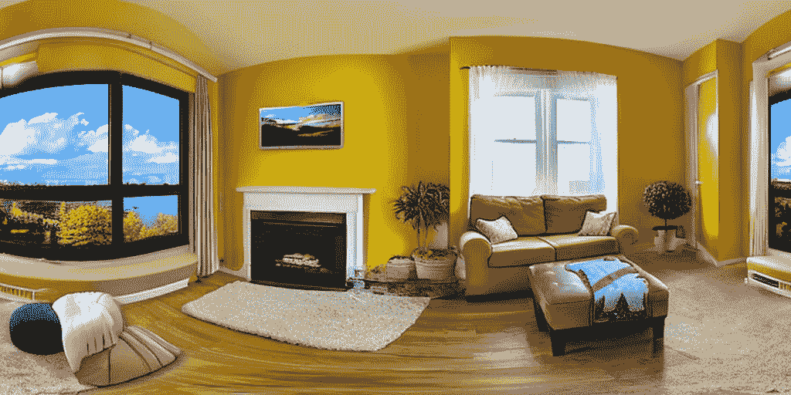

# MultiDiffusion

> 原文：[`huggingface.co/docs/diffusers/api/pipelines/panorama`](https://huggingface.co/docs/diffusers/api/pipelines/panorama)

[MultiDiffusion: 融合扩散路径以控制图像生成](https://huggingface.co/papers/2302.08113) 由 Omer Bar-Tal、Lior Yariv、Yaron Lipman 和 Tali Dekel 撰写。

论文摘要如下：

*最近在扩散模型中的文本到图像生成方面取得了重大进展，展示了图像质量的变革能力。然而，生成图像的用户可控性和快速适应新任务仍然是一个开放性挑战，目前主要通过昂贵和长时间的重新训练和微调或针对特定图像生成任务的临时适应来解决。在这项工作中，我们提出了 MultiDiffusion，这是一个统一的框架，利用预训练的文本到图像扩散模型实现多功能和可控的图像生成，无需进一步训练或微调。我们的方法的核心是一种新的生成过程，基于一个优化任务，将多个扩散生成过程与一组共享的参数或约束绑定在一起。我们展示了 MultiDiffusion 可以轻松应用于生成符合用户提供的控制要求的高质量和多样化图像，例如所需的宽高比（例如全景图像）和空间引导信号，从紧密的分割掩模到边界框。*

您可以在[项目页面](https://multidiffusion.github.io/)、[原始代码库](https://github.com/omerbt/MultiDiffusion)和[演示](https://huggingface.co/spaces/weizmannscience/MultiDiffusion)中找到有关 MultiDiffusion 的额外信息。

## 提示

在调用 StableDiffusionPanoramaPipeline 时，可以指定`view_batch_size`参数为 > 1。对于一些性能较高的 GPU，这可以加快生成过程并增加 VRAM 使用率。

要生成类似全景的图像，请确保相应传递宽度参数。我们推荐使用默认值为 2048 的宽度值。

在处理全景图像时，应用循环填充以确保没有拼接伪影，以确保从图像的最右侧到最左侧的无缝过渡。通过启用循环填充（设置`circular_padding=True`），该操作在图像的最右点之后应用额外的裁剪，使模型能够“看到”从最右侧到最左侧的过渡。这有助于在 360 度意义上保持视觉一致性，并创建一个可以使用 360 度全景查看器查看的适当“全景”。在 Stable Diffusion 中解码潜在变量时，应用循环填充以确保解码的潜在变量在 RGB 空间中匹配。

例如，没有循环填充时，存在拼接伪影（默认）：

但是通过循环填充，右侧和左侧部分匹配（`circular_padding=True`）：

请务必查看调度程序指南，以了解如何探索调度程序速度和质量之间的权衡，并查看跨管道重用组件部分，以了解如何有效地将相同组件加载到多个管道中。

## StableDiffusionPanoramaPipeline

### `class diffusers.StableDiffusionPanoramaPipeline`

[<来源>](https://github.com/huggingface/diffusers/blob/v0.26.3/src/diffusers/pipelines/stable_diffusion_panorama/pipeline_stable_diffusion_panorama.py#L62)

```py
( vae: AutoencoderKL text_encoder: CLIPTextModel tokenizer: CLIPTokenizer unet: UNet2DConditionModel scheduler: DDIMScheduler safety_checker: StableDiffusionSafetyChecker feature_extractor: CLIPImageProcessor image_encoder: Optional = None requires_safety_checker: bool = True )
```

参数

+   `vae` (AutoencoderKL) — 变分自动编码器（VAE）模型，用于对图像进行编码和解码以及从潜在表示中。

+   `text_encoder`（[CLIPTextModel](https://huggingface.co/docs/transformers/v4.37.2/en/model_doc/clip#transformers.CLIPTextModel)）— 冻结的文本编码器（[clip-vit-large-patch14](https://huggingface.co/openai/clip-vit-large-patch14)）。

+   `tokenizer`（[CLIPTokenizer](https://huggingface.co/docs/transformers/v4.37.2/en/model_doc/clip#transformers.CLIPTokenizer)）— 用于对文本进行标记化的`CLIPTokenizer`。

+   `unet`（UNet2DConditionModel）— 用于去噪编码图像潜在特征的`UNet2DConditionModel`。

+   `scheduler`（SchedulerMixin）— 与`unet`结合使用的调度器，用于去噪编码图像潜在特征。可以是 DDIMScheduler、LMSDiscreteScheduler 或 PNDMScheduler 之一。

+   `safety_checker`（`StableDiffusionSafetyChecker`）— 用于估计生成的图像是否可能被认为具有冒犯性或有害的分类模块。请参考[model card](https://huggingface.co/runwayml/stable-diffusion-v1-5)以获取有关模型潜在危害的更多详细信息。

+   `feature_extractor`（[CLIPImageProcessor](https://huggingface.co/docs/transformers/v4.37.2/en/model_doc/clip#transformers.CLIPImageProcessor)）— 用于从生成的图像中提取特征的`CLIPImageProcessor`；作为输入传递给`safety_checker`。

使用 MultiDiffusion 进行文本到图像生成的流水线。

该模型继承自 DiffusionPipeline。查看超类文档以获取所有流水线实现的通用方法（下载、保存、在特定设备上运行等）。

该流水线还继承了以下加载方法：

+   load_textual_inversion() 用于加载文本反演嵌入

+   load_lora_weights() 用于加载 LoRA 权重

+   save_lora_weights() 用于保存 LoRA 权重

+   load_ip_adapter() 用于加载 IP 适配器

#### `__call__`

[< source >](https://github.com/huggingface/diffusers/blob/v0.26.3/src/diffusers/pipelines/stable_diffusion_panorama/pipeline_stable_diffusion_panorama.py#L577)

```py
( prompt: Union = None height: Optional = 512 width: Optional = 2048 num_inference_steps: int = 50 guidance_scale: float = 7.5 view_batch_size: int = 1 negative_prompt: Union = None num_images_per_prompt: Optional = 1 eta: float = 0.0 generator: Union = None latents: Optional = None prompt_embeds: Optional = None negative_prompt_embeds: Optional = None ip_adapter_image: Union = None output_type: Optional = 'pil' return_dict: bool = True callback: Optional = None callback_steps: Optional = 1 cross_attention_kwargs: Optional = None circular_padding: bool = False clip_skip: Optional = None ) → export const metadata = 'undefined';StableDiffusionPipelineOutput or tuple
```

参数

+   `prompt`（`str`或`List[str]`，*可选*）— 用于引导图像生成的提示或提示。如果未定义，则需要传递`prompt_embeds`。

+   `height`（`int`，*可选*，默认为 512）— 生成图像的像素高度。

+   `width`（`int`，*可选*，默认为 2048）— 生成图像的像素宽度。宽度保持较高，因为该流水线应该生成类似全景的图像。

+   `num_inference_steps`（`int`，*可选*，默认为 50）— 去噪步骤的数量。更多的去噪步骤通常会导致更高质量的图像，但会降低推理速度。

+   `guidance_scale`（`float`，*可选*，默认为 7.5）— 更高的引导比例值鼓励模型生成与文本`prompt`密切相关的图像，但会降低图像质量。当`guidance_scale > 1`时启用引导比例。

+   `view_batch_size`（`int`，*可选*，默认为 1）— 用于去噪分割视图的批处理大小。对于一些性能较高的 GPU，更高的视图批处理大小可以加快生成速度并增加 VRAM 的使用量。

+   `negative_prompt` (`str` 或 `List[str]`, *optional*) — 指导图像生成中不包括的提示或提示。如果未定义，则需要传递`negative_prompt_embeds`。在不使用指导（`guidance_scale < 1`）时忽略。

+   `num_images_per_prompt` (`int`, *optional*, defaults to 1) — 每个提示生成的图像数量。

+   `eta` (`float`, *optional*, defaults to 0.0) — 对应于[DDIM](https://arxiv.org/abs/2010.02502)论文中的参数 eta (η)。仅适用于 DDIMScheduler，在其他调度器中被忽略。

+   `generator` (`torch.Generator` 或 `List[torch.Generator]`, *optional*) — 用于使生成过程确定性的[`torch.Generator`](https://pytorch.org/docs/stable/generated/torch.Generator.html)。

+   `latents` (`torch.FloatTensor`, *optional*) — 从高斯分布中采样的预生成的嘈杂潜变量，用作图像生成的输入。可用于使用不同提示调整相同生成。如果未提供，则通过使用提供的随机`generator`进行采样生成潜变量张量。

+   `prompt_embeds` (`torch.FloatTensor`, *optional*) — 预生成的文本嵌入。可用于轻松调整文本输入（提示加权）。如果未提供，则从`prompt`输入参数生成文本嵌入。

+   `negative_prompt_embeds` (`torch.FloatTensor`, *optional*) — 预生成的负文本嵌入。可用于轻松调整文本输入（提示加权）。如果未提供，则从`negative_prompt`输入参数生成`negative_prompt_embeds`。ip_adapter_image — (`PipelineImageInput`, *optional*): 可选的图像输入，用于与 IP 适配器一起使用。

+   `output_type` (`str`, *optional*, defaults to `"pil"`) — 生成图像的输出格式。选择`PIL.Image`或`np.array`之间的一个。

+   `return_dict` (`bool`, *optional*, defaults to `True`) — 是否返回一个 StableDiffusionPipelineOutput 而不是一个普通的元组。

+   `callback` (`Callable`, *optional*) — 推理过程中每`callback_steps`步调用的函数。该函数接受以下参数：`callback(step: int, timestep: int, latents: torch.FloatTensor)`。

+   `callback_steps` (`int`, *optional*, defaults to 1) — 调用`callback`函数的频率。如果未指定，将在每一步调用回调函数。

+   `cross_attention_kwargs` (`dict`, *optional*) — 如果指定，将传递给`AttentionProcessor`的 kwargs 字典，如在[diffusers.models.attention_processor](https://github.com/huggingface/diffusers/blob/main/src/diffusers/models/attention_processor.py)中的`self.processor`下定义的。

+   `circular_padding` (`bool`, *optional*, defaults to `False`) — 如果设置为`True`，则应用圆形填充以确保没有拼接伪影。圆形填充允许模型无缝地从图像的最右侧部分过渡到最左侧部分，从而在 360 度意义上保持一致性。

+   `clip_skip` (`int`, *optional*) — 在计算提示嵌入时要从 CLIP 跳过的层数。值为 1 表示将使用预最终层的输出来计算提示嵌入。

返回

StableDiffusionPipelineOutput 或 `tuple`

如果 `return_dict` 为 `True`，则返回 StableDiffusionPipelineOutput，否则返回一个 `tuple`，其中第一个元素是生成的图像列表，第二个元素是一个包含相应生成图像是否包含“不安全内容”（nsfw）的 `bool` 列表。

用于生成的管道的调用函数。

示例：

```py
>>> import torch
>>> from diffusers import StableDiffusionPanoramaPipeline, DDIMScheduler

>>> model_ckpt = "stabilityai/stable-diffusion-2-base"
>>> scheduler = DDIMScheduler.from_pretrained(model_ckpt, subfolder="scheduler")
>>> pipe = StableDiffusionPanoramaPipeline.from_pretrained(
...     model_ckpt, scheduler=scheduler, torch_dtype=torch.float16
... )

>>> pipe = pipe.to("cuda")

>>> prompt = "a photo of the dolomites"
>>> image = pipe(prompt).images[0]
```

#### `disable_vae_slicing`

[< source >](https://github.com/huggingface/diffusers/blob/v0.26.3/src/diffusers/pipelines/stable_diffusion_panorama/pipeline_stable_diffusion_panorama.py#L152)

```py
( )
```

禁用切片 VAE 解码。如果之前启用了 `enable_vae_slicing`，则此方法将返回到一步计算解码。

#### `enable_vae_slicing`

[< source >](https://github.com/huggingface/diffusers/blob/v0.26.3/src/diffusers/pipelines/stable_diffusion_panorama/pipeline_stable_diffusion_panorama.py#L144)

```py
( )
```

启用切片 VAE 解码。启用此选项时，VAE 将将输入张量分割成片段，以便在几个步骤中计算解码。这对于节省一些内存并允许更大的批量大小很有用。

#### `encode_prompt`

[< source >](https://github.com/huggingface/diffusers/blob/v0.26.3/src/diffusers/pipelines/stable_diffusion_panorama/pipeline_stable_diffusion_panorama.py#L193)

```py
( prompt device num_images_per_prompt do_classifier_free_guidance negative_prompt = None prompt_embeds: Optional = None negative_prompt_embeds: Optional = None lora_scale: Optional = None clip_skip: Optional = None )
```

参数

+   `prompt` (`str` or `List[str]`, *optional*) — 要编码的提示设备 — (`torch.device`): torch 设备

+   `num_images_per_prompt` (`int`) — 每个提示应生成的图像数量

+   `do_classifier_free_guidance` (`bool`) — 是否使用分类器自由指导

+   `negative_prompt` (`str` or `List[str]`, *optional*) — 不指导图像生成的提示或提示。如果未定义，则必须传递 `negative_prompt_embeds`。在不使用指导时忽略（即，如果 `guidance_scale` 小于 `1`，则忽略）。

+   `prompt_embeds` (`torch.FloatTensor`, *optional*) — 预生成的文本嵌入。可用于轻松调整文本输入，*例如* 提示加权。如果未提供，文本嵌入将从 `prompt` 输入参数生成。

+   `negative_prompt_embeds` (`torch.FloatTensor`, *optional*) — 预生成的负文本嵌入。可用于轻松调整文本输入，*例如* 提示加权。如果未提供，将从 `negative_prompt` 输入参数生成负提示嵌入。

+   `lora_scale` (`float`, *optional*) — 如果加载了 LoRA 层，则将应用于文本编码器的所有 LoRA 层的 LoRA 比例。

+   `clip_skip` (`int`, *optional*) — 在计算提示嵌入时要从 CLIP 跳过的层数。值为 1 表示将使用前一层的输出来计算提示嵌入。

将提示编码为文本编码器隐藏状态。

## StableDiffusionPipelineOutput

### `class diffusers.pipelines.stable_diffusion.StableDiffusionPipelineOutput`

[< source >](https://github.com/huggingface/diffusers/blob/v0.26.3/src/diffusers/pipelines/stable_diffusion/pipeline_output.py#L10)

```py
( images: Union nsfw_content_detected: Optional )
```

参数

+   `images` (`List[PIL.Image.Image]` or `np.ndarray`) — 长度为 `batch_size` 的去噪 PIL 图像列表或形状为 `(batch_size, height, width, num_channels)` 的 NumPy 数组。

+   `nsfw_content_detected` (`List[bool]`) — 列表指示相应生成的图像是否包含“不安全内容”（nsfw）或 `None` 如果无法执行安全检查。

稳定扩散管道的输出类。
