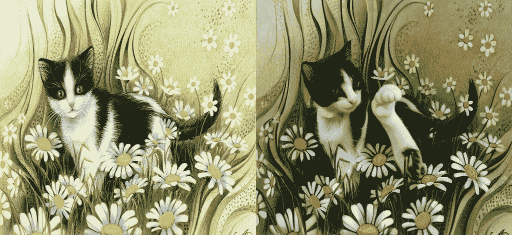
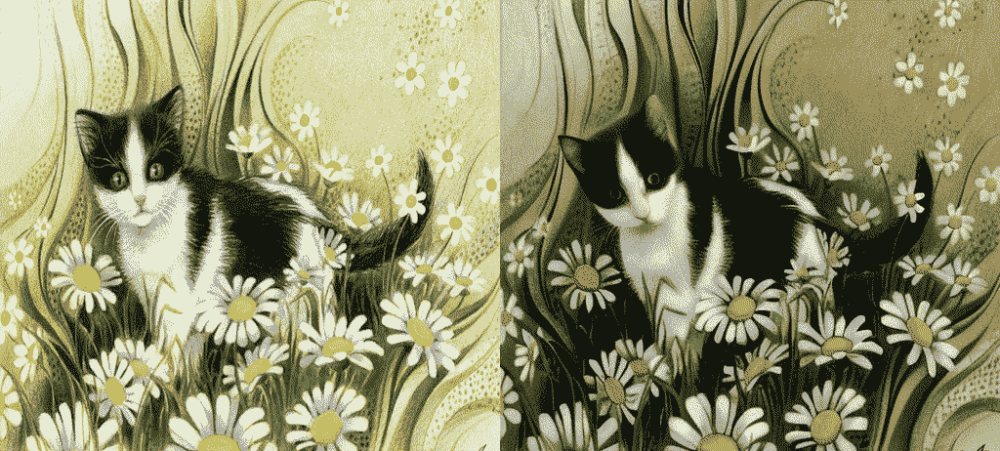

# 使用 PIA 进行图像到视频生成（个性化图像动画）

> 原始文本：[`huggingface.co/docs/diffusers/api/pipelines/pia`](https://huggingface.co/docs/diffusers/api/pipelines/pia)

## 概述

[PIA：通过文本到图像模型中的即插即用模块个性化图像动画](https://arxiv.org/abs/2312.13964) 作者：Yiming Zhang, Zhening Xing, Yanhong Zeng, Youqing Fang, Kai Chen

个性化文本到图像（T2I）模型的最新进展已经彻底改变了内容创作，使非专家能够以独特风格生成令人惊叹的图像。虽然有所希望，但是通过文本向这些个性化图像添加逼真的动作在保留独特风格、高保真细节和通过文本实现动作可控性方面面临着重大挑战。在本文中，我们提出了 PIA，一种个性化图像动画生成器，擅长与条件图像对齐，通过文本实现动作可控性，并且与各种个性化 T2I 模型兼容而无需特定调整。为了实现这些目标，PIA 基于一个基础 T2I 模型构建了经过良好训练的时间对齐层，允许将任何个性化 T2I 模型无缝转换为图像动画模型。PIA 的一个关键组件是引入条件模块，该模块利用条件帧和帧间亲和性作为输入，通过亲和性提示指导个别帧在潜在空间中进行外观信息传递，从而减轻了外观相关图像对齐的挑战，并允许更加专注于与动作相关的指导对齐。

[项目页面](https://pi-animator.github.io/)

## 可用的流水线

| 流水线 | 任务 | 演示 |
| --- | --- | :-: |
| [PIAPipeline](https://github.com/huggingface/diffusers/blob/main/src/diffusers/pipelines/pia/pipeline_pia.py) | *使用 PIA 进行图像到视频生成* |  |

## 可用的检查点

PIA 的 Motion Adapter 检查点可以在[OpenMMLab org](https://huggingface.co/openmmlab/PIA-condition-adapter)下找到。这些检查点旨在与基于 Stable Diffusion 1.5 的任何模型一起使用。

## 使用示例

PIA 可以与 MotionAdapter 检查点和 Stable Diffusion 1.5 模型检查点一起使用。MotionAdapter 是一组负责在图像帧之间添加连贯动作的运动模块。这些模块应用于 Stable Diffusion UNet 中的 Resnet 和 Attention 块之后。除了运动模块，PIA 还将 SD 1.5 UNet 模型的输入卷积层替换为一个 9 通道输入卷积层。

以下示例演示了如何使用 PIA 从单个图像生成视频。

```py
import torch
from diffusers import (
    EulerDiscreteScheduler,
    MotionAdapter,
    PIAPipeline,
)
from diffusers.utils import export_to_gif, load_image

adapter = MotionAdapter.from_pretrained("openmmlab/PIA-condition-adapter")
pipe = PIAPipeline.from_pretrained("SG161222/Realistic_Vision_V6.0_B1_noVAE", motion_adapter=adapter, torch_dtype=torch.float16)

pipe.scheduler = EulerDiscreteScheduler.from_config(pipe.scheduler.config)
pipe.enable_model_cpu_offload()
pipe.enable_vae_slicing()

image = load_image(
    "https://huggingface.co/datasets/hf-internal-testing/diffusers-images/resolve/main/pix2pix/cat_6.png?download=true"
)
image = image.resize((512, 512))
prompt = "cat in a field"
negative_prompt = "wrong white balance, dark, sketches,worst quality,low quality"

generator = torch.Generator("cpu").manual_seed(0)
output = pipe(image=image, prompt=prompt, generator=generator)
frames = output.frames[0]
export_to_gif(frames, "pia-animation.gif")
```

以下是一些示例输出：

| 杰作，最佳质量，日落。  |
| --- |

如果您计划使用可以剪辑样本的调度程序，请确保在调度程序中设置`clip_sample=False`以禁用它，因为这也可能对生成的样本产生不利影响。此外，PIA 的检查点可能对调度程序的 beta 调度敏感。我们建议将其设置为`linear`。

## 使用 FreeInit

[FreeInit：填补视频扩散模型中的初始化差距](https://arxiv.org/abs/2312.07537) 作者：Tianxing Wu, Chenyang Si, Yuming Jiang, Ziqi Huang, Ziwei Liu。

FreeInit 是一种有效的方法，可以在不进行任何额外训练的情况下改善使用视频扩散模型生成的视频的时间一致性和整体质量。它可以在推理时无缝应用于 PIA、AnimateDiff、ModelScope、VideoCrafter 和其他各种视频生成模型，并通过迭代地优化潜在初始化噪声来工作。更多细节可以在论文中找到。

以下示例演示了使用 FreeInit 的方法。

```py
import torch
from diffusers import (
    DDIMScheduler,
    MotionAdapter,
    PIAPipeline,
)
from diffusers.utils import export_to_gif, load_image

adapter = MotionAdapter.from_pretrained("openmmlab/PIA-condition-adapter")
pipe = PIAPipeline.from_pretrained("SG161222/Realistic_Vision_V6.0_B1_noVAE", motion_adapter=adapter)

# enable FreeInit
# Refer to the enable_free_init documentation for a full list of configurable parameters
pipe.enable_free_init(method="butterworth", use_fast_sampling=True)

# Memory saving options
pipe.enable_model_cpu_offload()
pipe.enable_vae_slicing()

pipe.scheduler = DDIMScheduler.from_config(pipe.scheduler.config)
image = load_image(
    "https://huggingface.co/datasets/hf-internal-testing/diffusers-images/resolve/main/pix2pix/cat_6.png?download=true"
)
image = image.resize((512, 512))
prompt = "cat in a hat"
negative_prompt = "wrong white balance, dark, sketches,worst quality,low quality"

generator = torch.Generator("cpu").manual_seed(0)

output = pipe(image=image, prompt=prompt, generator=generator)
frames = output.frames[0]
export_to_gif(frames, "pia-freeinit-animation.gif")
```

| 杰作，最佳质量，日落。  |
| --- |

FreeInit 并不是真正免费的 - 改进的质量是以额外计算为代价的。它需要根据启用时设置的`num_iters`参数进行几次额外采样。将`use_fast_sampling`参数设置为`True`可以提高整体性能（以降低质量为代价，与`use_fast_sampling=False`相比仍然比普通视频生成模型有更好的结果）。

## PIAPipeline

### `class diffusers.PIAPipeline`

[<来源>](https://github.com/huggingface/diffusers/blob/v0.26.3/src/diffusers/pipelines/pia/pipeline_pia.py#L212)

```py
( vae: AutoencoderKL text_encoder: CLIPTextModel tokenizer: CLIPTokenizer unet: Union scheduler: Union motion_adapter: Optional = None feature_extractor: CLIPImageProcessor = None image_encoder: CLIPVisionModelWithProjection = None )
```

参数

+   `vae` (AutoencoderKL) — 变分自动编码器（VAE）模型，用于对图像进行编码和解码到和从潜在表示中。

+   `text_encoder` (`CLIPTextModel`) — 冻结的文本编码器（[clip-vit-large-patch14](https://huggingface.co/openai/clip-vit-large-patch14)）。

+   `tokenizer` (`CLIPTokenizer`) — 用于对文本进行标记化的[CLIPTokenizer](https://huggingface.co/docs/transformers/v4.37.2/en/model_doc/clip#transformers.CLIPTokenizer)。

+   `unet` (UNet2DConditionModel) — 用于创建 UNetMotionModel 以去噪编码视频潜在的 UNet2DConditionModel。

+   `motion_adapter` (`MotionAdapter`) — 与`unet`结合使用的`MotionAdapter`，用于去噪编码视频潜在。

+   `scheduler` (SchedulerMixin) — 与`unet`结合使用的调度器，用于去噪编码图像潜在。可以是 DDIMScheduler、LMSDiscreteScheduler 或 PNDMScheduler 之一。

用于文本到视频生成的管道。

这个模型继承自 DiffusionPipeline。检查超类文档以获取为所有管道实现的通用方法（下载、保存、在特定设备上运行等）。

该管道还继承了以下加载方法：

+   用于加载文本反演嵌入的 load_textual_inversion()

+   用于加载 LoRA 权重的 load_lora_weights()

+   用于保存 LoRA 权重的 save_lora_weights()

+   用于加载 IP 适配器的 load_ip_adapter()

#### `__call__`

[<来源>](https://github.com/huggingface/diffusers/blob/v0.26.3/src/diffusers/pipelines/pia/pipeline_pia.py#L948)

```py
( image: Union prompt: Union = None strength: float = 1.0 num_frames: Optional = 16 height: Optional = None width: Optional = None num_inference_steps: int = 50 guidance_scale: float = 7.5 negative_prompt: Union = None num_videos_per_prompt: Optional = 1 eta: float = 0.0 generator: Union = None latents: Optional = None prompt_embeds: Optional = None negative_prompt_embeds: Optional = None ip_adapter_image: Union = None motion_scale: int = 0 output_type: Optional = 'pil' return_dict: bool = True cross_attention_kwargs: Optional = None clip_skip: Optional = None callback_on_step_end: Optional = None callback_on_step_end_tensor_inputs: List = ['latents'] ) → export const metadata = 'undefined';TextToVideoSDPipelineOutput or tuple
```

参数

+   `image` (`PipelineImageInput`) — 用于视频生成的输入图像。

+   `prompt` (`str` or `List[str]`, *可选*) — 用于指导图像生成的提示或提示。如果未定义，则需要传递`prompt_embeds`。

+   `strength` (`float`, *可选*, 默认为 1.0) — 表示转换参考`image`的程度。必须在 0 和 1 之间。

+   `height` (`int`, *可选*, 默认为 `self.unet.config.sample_size * self.vae_scale_factor`) — 生成视频的像素高度。

+   `width` (`int`, *可选*, 默认为 `self.unet.config.sample_size * self.vae_scale_factor`) — 生成视频的像素宽度。

+   `num_frames` (`int`, *可选*, 默认为 16) — 生成的视频帧数。默认为 16 帧，每秒 8 帧，相当于 2 秒的视频。

+   `num_inference_steps` (`int`, *可选*, 默认为 50) — 降噪步骤的数量。更多的降噪步骤通常会导致更高质量的视频，但会降低推理速度。

+   `guidance_scale` (`float`, *可选*, 默认为 7.5) — 更高的引导比例值鼓励模型生成与文本`prompt`密切相关的图像，但会降低图像质量。当`guidance_scale > 1`时启用引导比例。

+   `negative_prompt` (`str`或`List[str]`, *可选*) — 指导图像生成中不包括的提示或提示。如果未定义，则需要传递`negative_prompt_embeds`。在不使用引导时（`guidance_scale < 1`）将被忽略。

+   `eta` (`float`, *可选*, 默认为 0.0) — 对应于[DDIM](https://arxiv.org/abs/2010.02502)论文中的参数 eta（η）。仅适用于 DDIMScheduler，在其他调度程序中将被忽略。

+   `generator` (`torch.Generator`或`List[torch.Generator]`, *可选*) — 用于使生成过程确定性的[`torch.Generator`](https://pytorch.org/docs/stable/generated/torch.Generator.html)。

+   `latents` (`torch.FloatTensor`, *可选*) — 从高斯分布中采样的预生成的嘈杂潜在变量，用作视频生成的输入。可以用来调整相同生成与不同提示。如果未提供，则通过使用提供的随机`generator`进行采样生成潜在变量张量，潜在变量应具有形状`(batch_size, num_channel, num_frames, height, width)`。

+   `prompt_embeds` (`torch.FloatTensor`, *可选*) — 预生成的文本嵌入。可用于轻松调整文本输入（提示加权）。如果未提供，则从`prompt`输入参数生成文本嵌入。

+   `negative_prompt_embeds` (`torch.FloatTensor`, *可选*) — 预生成的负文本嵌入。可用于轻松调整文本输入（提示加权）。如果未提供，则从`negative_prompt`输入参数生成`negative_prompt_embeds`。ip_adapter_image — (`PipelineImageInput`, *可选*): 用于与 IP 适配器一起使用的可选图像输入。motion_scale — (`int`, *可选*, 默认为 0): 控制添加到图像中的运动量和类型的参数。增加值会增加运动量，而特定范围的值控制添加的运动类型。必须在 0 和 8 之间。设置在 0-2 之间只增加运动量。设置在 3-5 之间创建循环运动。设置在 6-8 之间执行带有图像风格转移的运动。

+   `output_type` (`str`, *可选*, 默认为`"pil"`) — 生成视频的输出格式。选择`torch.FloatTensor`、`PIL.Image`或`np.array`之间的选项。

+   `return_dict` (`bool`, *可选*, 默认为`True`) — 是否返回 TextToVideoSDPipelineOutput 而不是普通元组。

+   `cross_attention_kwargs` (`dict`, *可选*) — 如果指定，则将传递给[`AttentionProcessor`](https://github.com/huggingface/diffusers/blob/main/src/diffusers/models/attention_processor.py)中定义的`self.processor`的 kwargs 字典。

+   `clip_skip` (`int`, *可选*) — 在计算提示嵌入时要从 CLIP 中跳过的层数。值为 1 意味着将使用预终层的输出来计算提示嵌入。

+   `callback_on_step_end` (`Callable`, *可选*) — 在推理过程中每个降噪步骤结束时调用的函数。该函数将使用以下参数调用：`callback_on_step_end(self: DiffusionPipeline, step: int, timestep: int, callback_kwargs: Dict)`。`callback_kwargs`将包括由`callback_on_step_end_tensor_inputs`指定的所有张量的列表。

+   `callback_on_step_end_tensor_inputs` (`List`, *可选*) — `callback_on_step_end`函数的张量输入列表。列表中指定的张量将作为`callback_kwargs`参数传递。您只能包含在管道类的`._callback_tensor_inputs`属性中列出的变量。

返回值

TextToVideoSDPipelineOutput 或`tuple`

如果`return_dict`为`True`，则返回 TextToVideoSDPipelineOutput，否则返回一个`tuple`，其中第一个元素是生成的帧的列表。

用于生成的管道的调用函数。

示例：

```py
>>> import torch
>>> from diffusers import (
...     EulerDiscreteScheduler,
...     MotionAdapter,
...     PIAPipeline,
... )
>>> from diffusers.utils import export_to_gif, load_image
>>> adapter = MotionAdapter.from_pretrained("../checkpoints/pia-diffusers")
>>> pipe = PIAPipeline.from_pretrained("SG161222/Realistic_Vision_V6.0_B1_noVAE", motion_adapter=adapter)
>>> pipe.scheduler = EulerDiscreteScheduler.from_config(pipe.scheduler.config)
>>> image = load_image(
...     "https://huggingface.co/datasets/hf-internal-testing/diffusers-images/resolve/main/pix2pix/cat_6.png?download=true"
... )
>>> image = image.resize((512, 512))
>>> prompt = "cat in a hat"
>>> negative_prompt = "wrong white balance, dark, sketches,worst quality,low quality, deformed, distorted, disfigured, bad eyes, wrong lips,weird mouth, bad teeth, mutated hands and fingers, bad anatomy,wrong anatomy, amputation, extra limb, missing limb, floating,limbs, disconnected limbs, mutation, ugly, disgusting, bad_pictures, negative_hand-neg"
>>> generator = torch.Generator("cpu").manual_seed(0)
>>> output = pipe(image=image, prompt=prompt, negative_prompt=negative_prompt, generator=generator)
>>> frames = output.frames[0]
>>> export_to_gif(frames, "pia-animation.gif")
```

#### `disable_free_init`

[<来源>](https://github.com/huggingface/diffusers/blob/v0.26.3/src/diffusers/pipelines/pia/pipeline_pia.py#L620)

```py
( )
```

如果启用，则禁用 FreeInit 机制。

#### `disable_freeu`

[<来源>](https://github.com/huggingface/diffusers/blob/v0.26.3/src/diffusers/pipelines/pia/pipeline_pia.py#L568)

```py
( )
```

如果启用，则禁用 FreeU 机制。

#### `disable_vae_slicing`

[<来源>](https://github.com/huggingface/diffusers/blob/v0.26.3/src/diffusers/pipelines/pia/pipeline_pia.py#L520)

```py
( )
```

禁用切片的 VAE 解码。如果之前启用了`enable_vae_slicing`，则此方法将返回到一步计算解码。

#### `disable_vae_tiling`

[<来源>](https://github.com/huggingface/diffusers/blob/v0.26.3/src/diffusers/pipelines/pia/pipeline_pia.py#L537)

```py
( )
```

禁用平铺的 VAE 解码。如果之前启用了`enable_vae_tiling`，则此方法将返回到一步计算解码。

#### `enable_free_init`

[<来源>](https://github.com/huggingface/diffusers/blob/v0.26.3/src/diffusers/pipelines/pia/pipeline_pia.py#L576)

```py
( num_iters: int = 3 use_fast_sampling: bool = False method: str = 'butterworth' order: int = 4 spatial_stop_frequency: float = 0.25 temporal_stop_frequency: float = 0.25 generator: Optional = None )
```

参数

+   `num_iters` (`int`, *可选*，默认为`3`) — FreeInit 噪声重新初始化迭代次数。

+   `use_fast_sampling` (`bool`, *可选*，默认为`False`) — 是否加快采样过程以降低可能的质量。如果设置为`True`，则启用“粗到细采样”策略，如论文中所述。

+   `method` (`str`, *可选*，默认为`butterworth`) — 必须是`butterworth`、`ideal`或`gaussian`中的一个，用作 FreeInit 低通滤波器的滤波方法。

+   `order` (`int`, *可选*，默认为`4`) — `butterworth`方法中使用的滤波器的阶数。较大的值导致`ideal`方法行为，而较小的值导致`gaussian`方法行为。

+   `spatial_stop_frequency` (`float`, *可选*，默认为`0.25`) — 空间维度的归一化停止频率。必须介于 0 到 1 之间。在原始实现中称为`d_s`。

+   `temporal_stop_frequency` (`float`, *可选*，默认为`0.25`) — 时间维度的归一化停止频率。必须介于 0 到 1 之间。在原始实现中称为`d_t`。

+   `generator` (`torch.Generator`, *可选*，默认为`0.25`) — 用于使 FreeInit 生成确定性的[`torch.Generator`](https://pytorch.org/docs/stable/generated/torch.Generator.html)。

启用 FreeInit 机制，如[`arxiv.org/abs/2312.07537`](https://arxiv.org/abs/2312.07537)。

此实现已经从[官方存储库](https://github.com/TianxingWu/FreeInit)进行了调整。

#### `enable_freeu`

[<来源>](https://github.com/huggingface/diffusers/blob/v0.26.3/src/diffusers/pipelines/pia/pipeline_pia.py#L545)

```py
( s1: float s2: float b1: float b2: float )
```

参数

+   `s1` (`float`) — 第 1 阶段的缩放因子，用于减弱跳过特征的贡献。这样做是为了减轻增强去噪过程中的“过度平滑效果”。

+   `s2` (`float`) — 第 2 阶段的缩放因子，用于减弱跳过特征的贡献。这样做是为了减轻增强去噪过程中的“过度平滑效果”。

+   `b1` (`float`) — 第 1 阶段的缩放因子，用于放大骨干特征的贡献。

+   `b2` (`float`) — 第 2 阶段的缩放因子，用于放大骨干特征的贡献。

启用 FreeU 机制，如[`arxiv.org/abs/2309.11497`](https://arxiv.org/abs/2309.11497)中所述。

缩放因子后缀表示它们被应用的阶段。

请参考[官方存储库](https://github.com/ChenyangSi/FreeU)，了解已知适用于不同管道（如 Stable Diffusion v1、v2 和 Stable Diffusion XL）的值组合。

#### `enable_vae_slicing`

[<来源>](https://github.com/huggingface/diffusers/blob/v0.26.3/src/diffusers/pipelines/pia/pipeline_pia.py#L512)

```py
( )
```

启用切片的 VAE 解码。启用此选项时，VAE 将将输入张量分割成片段，以便在几个步骤中计算解码。这对于节省一些内存并允许更大的批量大小非常有用。

#### `enable_vae_tiling`

[<来源>](https://github.com/huggingface/diffusers/blob/v0.26.3/src/diffusers/pipelines/pia/pipeline_pia.py#L528)

```py
( )
```

启用平铺的 VAE 解码。启用此选项时，VAE 将将输入张量分割成瓦片，以便在几个步骤中计算解码和编码。这对于节省大量内存并允许处理更大的图像非常有用。

#### `encode_prompt`

[<来源>](https://github.com/huggingface/diffusers/blob/v0.26.3/src/diffusers/pipelines/pia/pipeline_pia.py#L281)

```py
( prompt device num_images_per_prompt do_classifier_free_guidance negative_prompt = None prompt_embeds: Optional = None negative_prompt_embeds: Optional = None lora_scale: Optional = None clip_skip: Optional = None )
```

参数

+   `prompt` (`str` 或 `List[str]`, *可选*) — 要编码的提示设备 — (`torch.device`): torch 设备

+   `num_images_per_prompt` (`int`) — 每个提示应生成的图像数量

+   `do_classifier_free_guidance` (`bool`) — 是否使用分类器自由引导或不使用

+   `negative_prompt` (`str` 或 `List[str]`, *可选*) — 不用于引导图像生成的提示或提示。如果未定义，则必须传递`negative_prompt_embeds`。如果不使用引导（即如果`guidance_scale`小于`1`，则忽略）。

+   `prompt_embeds` (`torch.FloatTensor`, *可选*) — 预生成的文本嵌入。可用于轻松调整文本输入，例如提示加权。如果未提供，将从`prompt`输入参数生成文本嵌入。

+   `negative_prompt_embeds` (`torch.FloatTensor`, *可选*) — 预生成的负文本嵌入。可用于轻松调整文本输入，例如提示加权。如果未提供，将从`negative_prompt`输入参数生成 negative_prompt_embeds。

+   `lora_scale` (`float`, *可选*) — 如果加载了 LoRA 层，则将应用于文本编码器的所有 LoRA 层的 LoRA 比例。

+   `clip_skip` (`int`, *可选*) — 在计算提示嵌入时要从 CLIP 跳过的层数。值为 1 意味着将使用前一层的输出来计算提示嵌入。

将提示编码为文本编码器隐藏状态。

+   启用自由 u

+   禁用自由 u

+   启用自由初始化

+   禁用自由初始化

+   启用 VAE 切片

+   禁用 VAE 切片

+   启用 VAE 平铺

+   禁用 VAE 平铺

## PIAPipelineOutput

### `class diffusers.pipelines.pia.PIAPipelineOutput`

[<来源>](https://github.com/huggingface/diffusers/blob/v0.26.3/src/diffusers/pipelines/pia/pipeline_pia.py#L197)

```py
( frames: Union )
```

参数

+   `frames` (`torch.Tensor`, `np.ndarray`, 或 List[PIL.Image.Image]) —

+   长度为`batch_size`的`Nested`列表，其中包含长度为`num_frames`的去噪 PIL 图像序列， —

+   形状为`(batch_size, num_frames, channels, height, width)`的`NumPy`数组 —

+   形状为`(batch_size, num_frames, channels, height, width)`的`Torch`张量。 —

PIAPipeline 的输出类。
