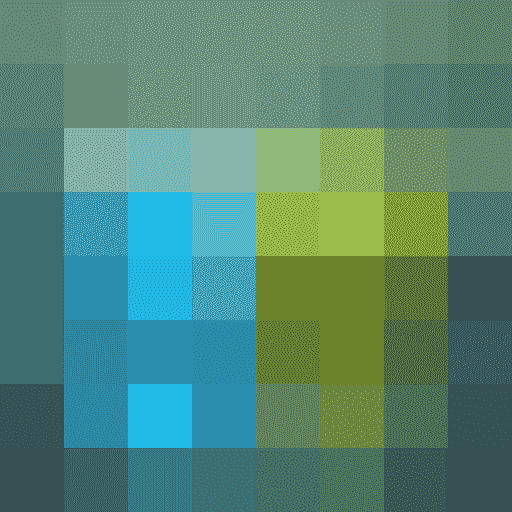

# 使用适配器调节的文本到图像生成

> 原文链接：[`huggingface.co/docs/diffusers/api/pipelines/stable_diffusion/adapter`](https://huggingface.co/docs/diffusers/api/pipelines/stable_diffusion/adapter)

## 概述

[T2I-Adapter：学习适配器以挖掘文本到图像扩散模型的更可控能力](https://arxiv.org/abs/2302.08453) 作者：Chong Mou，Xintao Wang，Liangbin Xie，Jian Zhang，Zhongang Qi，Ying Shan，Xiaohu Qie。

使用预训练模型，我们可以提供控制图像（例如深度图）来控制稳定扩散文本到图像生成，使其遵循深度图的结构并填充细节。

该论文的摘要如下：

*大规模文本到图像（T2I）模型的惊人生成能力展示了学习复杂结构和有意义语义的强大力量。然而，仅依赖文本提示无法充分利用模型隐式学习的知识，特别是在需要灵活和准确控制（例如颜色和结构）时。在本文中，我们旨在“挖掘”T2I 模型隐式学习的能力，然后明确地使用它们来更加精细地控制生成。具体来说，我们提出学习简单轻量级的 T2I-Adapter，将 T2I 模型内部知识与外部控制信号对齐，同时冻结原始大型 T2I 模型。通过这种方式，我们可以根据不同条件训练各种适配器，实现生成结果颜色和结构的丰富控制和编辑效果。此外，所提出的 T2I-Adapter 具有实用价值的吸引人特性，如可组合性和泛化能力。大量实验证明我们的 T2I-Adapter 具有有前途的生成质量和广泛的应用。*

这个模型是由社区贡献者[HimariO](https://github.com/HimariO) ❤️ 贡献的。

## 可用流水线：

| 流水线 | 任务 | 演示 |
| --- | --- | :-: |
| [StableDiffusionAdapterPipeline](https://github.com/huggingface/diffusers/blob/main/src/diffusers/pipelines/t2i_adapter/pipeline_stable_diffusion_adapter.py) | *使用 T2I-Adapter 进行文本到图像生成* | - |
| [StableDiffusionXLAdapterPipeline](https://github.com/huggingface/diffusers/blob/main/src/diffusers/pipelines/t2i_adapter/pipeline_stable_diffusion_xl_adapter.py) | *在 StableDiffusion-XL 上使用 T2I-Adapter 进行文本到图像生成* | - |

## 使用 StableDiffusion-1.4/1.5 基础模型的使用示例

接下来我们给出一个简单的例子，展示如何使用基于 StableDiffusion-1.4/1.5 的*T2I-Adapter*检查点进行推断。所有适配器使用相同的流水线。

1.  首先将图像转换为适当的*控制图像*格式。

1.  *控制图像*和*prompt*被传递给 StableDiffusionAdapterPipeline。

让我们看一个简单的例子，使用[Color Adapter](https://huggingface.co/TencentARC/t2iadapter_color_sd14v1)。

```py
from diffusers.utils import load_image, make_image_grid

image = load_image("https://huggingface.co/datasets/diffusers/docs-images/resolve/main/t2i-adapter/color_ref.png")
```


然后我们可以通过简单地将其调整为 8x8 像素的调色板，然后将其缩放回原始大小来创建我们的调色板。

```py
from PIL import Image

color_palette = image.resize((8, 8))
color_palette = color_palette.resize((512, 512), resample=Image.Resampling.NEAREST)
```

让我们看看处理后的图像。



接下来，创建适配器流水线

```py
import torch
from diffusers import StableDiffusionAdapterPipeline, T2IAdapter

adapter = T2IAdapter.from_pretrained("TencentARC/t2iadapter_color_sd14v1", torch_dtype=torch.float16)
pipe = StableDiffusionAdapterPipeline.from_pretrained(
    "CompVis/stable-diffusion-v1-4",
    adapter=adapter,
    torch_dtype=torch.float16,
)
pipe.to("cuda")
```

最后，将提示和控制图像传递给流水线

```py
# fix the random seed, so you will get the same result as the example
generator = torch.Generator("cuda").manual_seed(7)

out_image = pipe(
    "At night, glowing cubes in front of the beach",
    image=color_palette,
    generator=generator,
).images[0]
make_image_grid([image, color_palette, out_image], rows=1, cols=3)
```


## 使用 StableDiffusion-XL 基础模型的使用示例

接下来我们给出一个简单的例子，展示如何使用基于 StableDiffusion-XL 的* T2I-Adapter *检查点进行推断。所有适配器使用相同的流水线。

1.  首先将图像下载到适当的*控制图像*格式中。

1.  *控制图像* 和 *提示* 被传递给 StableDiffusionXLAdapterPipeline。

让我们看一个简单的例子，使用 [Sketch Adapter](https://huggingface.co/Adapter/t2iadapter/tree/main/sketch_sdxl_1.0)。

```py
from diffusers.utils import load_image, make_image_grid

sketch_image = load_image("https://huggingface.co/Adapter/t2iadapter/resolve/main/sketch.png").convert("L")
```


然后，创建适配器管道

```py
import torch
from diffusers import (
    T2IAdapter,
    StableDiffusionXLAdapterPipeline,
    DDPMScheduler
)

model_id = "stabilityai/stable-diffusion-xl-base-1.0"
adapter = T2IAdapter.from_pretrained("Adapter/t2iadapter", subfolder="sketch_sdxl_1.0", torch_dtype=torch.float16, adapter_type="full_adapter_xl")
scheduler = DDPMScheduler.from_pretrained(model_id, subfolder="scheduler")

pipe = StableDiffusionXLAdapterPipeline.from_pretrained(
    model_id, adapter=adapter, safety_checker=None, torch_dtype=torch.float16, variant="fp16", scheduler=scheduler
)

pipe.to("cuda")
```

最后，将提示和控制图像传递给管道

```py
# fix the random seed, so you will get the same result as the example
generator = torch.Generator().manual_seed(42)

sketch_image_out = pipe(
    prompt="a photo of a dog in real world, high quality",
    negative_prompt="extra digit, fewer digits, cropped, worst quality, low quality",
    image=sketch_image,
    generator=generator,
    guidance_scale=7.5
).images[0]
make_image_grid([sketch_image, sketch_image_out], rows=1, cols=2)
```


## 可用的检查点

非扩散检查点可以在[TencentARC/T2I-Adapter](https://huggingface.co/TencentARC/T2I-Adapter/tree/main/models)下找到。

### 具有稳定扩散 1.4 的 T2I-Adapter

| 模型名称 | 控制图像概述 | 控制图像示例 | 生成的图像示例 |
| --- | --- | --- | --- |
| [TencentARC/t2iadapter_color_sd14v1](https://huggingface.co/TencentARC/t2iadapter_color_sd14v1) *使用空间色彩调色板训练* | 一个带有 8x8 色彩调色板的图像。 |  |  |
| [TencentARC/t2iadapter_canny_sd14v1](https://huggingface.co/TencentARC/t2iadapter_canny_sd14v1) *使用 canny 边缘检测训练* | 黑色背景上带有白色边缘的单色图像。 |  |  |
| [TencentARC/t2iadapter_sketch_sd14v1](https://huggingface.co/TencentARC/t2iadapter_sketch_sd14v1) *使用[PidiNet](https://github.com/zhuoinoulu/pidinet)边缘检测训练* | 在黑色背景上带有白色轮廓的手绘单色图像。 |  |  |
| [TencentARC/t2iadapter_depth_sd14v1](https://huggingface.co/TencentARC/t2iadapter_depth_sd14v1) *使用 Midas 深度估计训练* | 灰度图像，黑色代表深区域，白色代表浅区域。 |  |  |
| [TencentARC/t2iadapter_openpose_sd14v1](https://huggingface.co/TencentARC/t2iadapter_openpose_sd14v1) *使用 OpenPose 骨骼图像训练* | 一个 [OpenPose 骨骼](https://github.com/CMU-Perceptual-Computing-Lab/openpose) 图像。 |  |  |
| [TencentARC/t2iadapter_keypose_sd14v1](https://huggingface.co/TencentARC/t2iadapter_keypose_sd14v1) *使用 mmpose 骨架图像训练* | 一个[mmpose 骨架](https://github.com/open-mmlab/mmpose)图像。 |  |  |
| [TencentARC/t2iadapter_seg_sd14v1](https://huggingface.co/TencentARC/t2iadapter_seg_sd14v1) *使用语义分割训练* | 一个[自定义](https://github.com/TencentARC/T2I-Adapter/discussions/25)分割协议图像。 |  |  |
| [TencentARC/t2iadapter_canny_sd15v2](https://huggingface.co/TencentARC/t2iadapter_canny_sd15v2) |  |  |  |
| [TencentARC/t2iadapter_depth_sd15v2](https://huggingface.co/TencentARC/t2iadapter_depth_sd15v2) |  |  |  |
| [TencentARC/t2iadapter_sketch_sd15v2](https://huggingface.co/TencentARC/t2iadapter_sketch_sd15v2) |  |  |  |
| [TencentARC/t2iadapter_zoedepth_sd15v1](https://huggingface.co/TencentARC/t2iadapter_zoedepth_sd15v1) |  |  |  |
| [Adapter/t2iadapter, subfolder=‘sketch_sdxl_1.0’](https://huggingface.co/Adapter/t2iadapter/tree/main/sketch_sdxl_1.0) |  |  |  |
| [Adapter/t2iadapter, subfolder=‘canny_sdxl_1.0’](https://huggingface.co/Adapter/t2iadapter/tree/main/canny_sdxl_1.0) |  |  |  |
| [Adapter/t2iadapter, subfolder=‘openpose_sdxl_1.0’](https://huggingface.co/Adapter/t2iadapter/tree/main/openpose_sdxl_1.0) |  |  |  |

## 组合多个适配器

`MultiAdapter`可用于同时应用多个调节。

这里我们使用关键姿势适配器来表示角色姿势，使用深度适配器来创建场景。

```py
from diffusers.utils import load_image, make_image_grid

cond_keypose = load_image(
    "https://huggingface.co/datasets/diffusers/docs-images/resolve/main/t2i-adapter/keypose_sample_input.png"
)
cond_depth = load_image(
    "https://huggingface.co/datasets/diffusers/docs-images/resolve/main/t2i-adapter/depth_sample_input.png"
)
cond = [cond_keypose, cond_depth]

prompt = ["A man walking in an office room with a nice view"]
```

两个控制图像如下所示：

 

`MultiAdapter`结合了关键姿势和深度适配器。

`adapter_conditioning_scale`平衡不同适配器的相对影响。

```py
import torch
from diffusers import StableDiffusionAdapterPipeline, MultiAdapter, T2IAdapter

adapters = MultiAdapter(
    [
        T2IAdapter.from_pretrained("TencentARC/t2iadapter_keypose_sd14v1"),
        T2IAdapter.from_pretrained("TencentARC/t2iadapter_depth_sd14v1"),
    ]
)
adapters = adapters.to(torch.float16)

pipe = StableDiffusionAdapterPipeline.from_pretrained(
    "CompVis/stable-diffusion-v1-4",
    torch_dtype=torch.float16,
    adapter=adapters,
).to("cuda")

image = pipe(prompt, cond, adapter_conditioning_scale=[0.8, 0.8]).images[0]
make_image_grid([cond_keypose, cond_depth, image], rows=1, cols=3)
```


## T2I-Adapter vs ControlNet

T2I-Adapter 类似于[ControlNet](https://huggingface.co/docs/diffusers/main/en/api/pipelines/controlnet)。T2I-Adapter 使用一个较小的辅助网络，仅在整个扩散过程中运行一次。然而，T2I-Adapter 的性能略逊于 ControlNet。

## 稳定扩散适配器管道

### `class diffusers.StableDiffusionAdapterPipeline`

[< source >](https://github.com/huggingface/diffusers/blob/v0.26.3/src/diffusers/pipelines/t2i_adapter/pipeline_stable_diffusion_adapter.py#L166)

```py
( vae: AutoencoderKL text_encoder: CLIPTextModel tokenizer: CLIPTokenizer unet: UNet2DConditionModel adapter: Union scheduler: KarrasDiffusionSchedulers safety_checker: StableDiffusionSafetyChecker feature_extractor: CLIPFeatureExtractor requires_safety_checker: bool = True )
```

参数

+   `adapter`（`T2IAdapter`或`MultiAdapter`或`List[T2IAdapter]`） - 在去噪过程中为 unet 提供额外的调节。如果将多个 Adapter 设置为列表，则每个 Adapter 的输出将相加以创建一个组合的额外调节。

+   `adapter_weights`（`List[float]`，*可选*，默认为 None） - 代表将乘以每个适配器输出的权重的浮点数列表，然后将它们相加。

+   `vae`（AutoencoderKL 的文本部分，具体是[clip-vit-large-patch14](https://huggingface.co/openai/clip-vit-large-patch14)变体。

+   `tokenizer` (`CLIPTokenizer`) — [CLIPTokenizer](https://huggingface.co/docs/transformers/v4.21.0/en/model_doc/clip#transformers.CLIPTokenizer)类的分词器。

+   `unet` (UNet2DConditionModel) — 用于去噪编码图像潜变量的条件 U-Net 架构。

+   `scheduler` (SchedulerMixin) — 用于与 `unet` 结合使用的调度器，以去噪编码图像潜变量。可以是 DDIMScheduler、LMSDiscreteScheduler 或 PNDMScheduler 之一。

+   `safety_checker` (`StableDiffusionSafetyChecker`) — 用于估计生成图像是否可能被视为具有攻击性或有害的分类模块。请参考[model card](https://huggingface.co/runwayml/stable-diffusion-v1-5)获取详细信息。

+   `feature_extractor` (`CLIPFeatureExtractor`) — 从生成的图像中提取特征以用作 `safety_checker` 的输入的模型。

使用稳定扩散增强的文本到图像生成管道，配备了 T2I-Adapter [`arxiv.org/abs/2302.08453`](https://arxiv.org/abs/2302.08453)

该模型继承自 DiffusionPipeline。查看超类文档以了解库为所有管道实现的通用方法（如下载或保存、在特定设备上运行等）。

#### `__call__`

[< source >](https://github.com/huggingface/diffusers/blob/v0.26.3/src/diffusers/pipelines/t2i_adapter/pipeline_stable_diffusion_adapter.py#L699)

```py
( prompt: Union = None image: Union = None height: Optional = None width: Optional = None num_inference_steps: int = 50 timesteps: List = None guidance_scale: float = 7.5 negative_prompt: Union = None num_images_per_prompt: Optional = 1 eta: float = 0.0 generator: Union = None latents: Optional = None prompt_embeds: Optional = None negative_prompt_embeds: Optional = None output_type: Optional = 'pil' return_dict: bool = True callback: Optional = None callback_steps: int = 1 cross_attention_kwargs: Optional = None adapter_conditioning_scale: Union = 1.0 clip_skip: Optional = None ) → export const metadata = 'undefined';~pipelines.stable_diffusion.StableDiffusionAdapterPipelineOutput or tuple
```

参数

+   `prompt` (`str` 或 `List[str]`, *optional*) — 用于引导图像生成的提示。如果未定义，则必须传递 `prompt_embeds`。

+   `image` (`torch.FloatTensor`, `PIL.Image.Image`, `List[torch.FloatTensor]` 或 `List[PIL.Image.Image]` 或 `List[List[PIL.Image.Image]]`) — 适配器输入条件。适配器使用此输入条件生成对 Unet 的引导。如果类型指定为 `Torch.FloatTensor`，则按原样传递给适配器。`PIL.Image.Image` 也可以作为图像接受。控制图像会自动调整大小以适应输出图像。

+   `height` (`int`, *optional*, defaults to self.unet.config.sample_size * self.vae_scale_factor) — 生成图像的像素高度。

+   `width` (`int`, *optional*, defaults to self.unet.config.sample_size * self.vae_scale_factor) — 生成图像的像素宽度。

+   `num_inference_steps` (`int`, *optional*, defaults to 50) — 降噪步骤的数量。更多的降噪步骤通常会导致更高质量的图像，但会降低推理速度。

+   `timesteps` (`List[int]`, *optional*) — 用于支持在其 `set_timesteps` 方法中具有 `timesteps` 参数的调度器进行去噪过程的自定义时间步。如果未定义，则将使用传递 `num_inference_steps` 时的默认行为。必须按降序排列。

+   `guidance_scale` (`float`, *optional*, defaults to 7.5) — 在[无分类器扩散引导](https://arxiv.org/abs/2207.12598)中定义的引导比例。`guidance_scale` 定义为[Imagen Paper](https://arxiv.org/pdf/2205.11487.pdf)中方程式 2 的 `w`。通过设置 `guidance_scale > 1` 来启用引导比例。更高的引导比例鼓励生成与文本 `prompt` 密切相关的图像，通常以降低图像质量为代价。

+   `negative_prompt` (`str` or `List[str]`, *optional*) — 不指导图像生成的提示或提示。如果未定义，则必须传递 `negative_prompt_embeds`。而不是。如果未定义，则必须传递 `negative_prompt_embeds`。而不是。在不使用指导时被忽略（即，如果 `guidance_scale` 小于 `1`，则被忽略）。

+   `num_images_per_prompt` (`int`, *optional*, defaults to 1) — 每个提示生成的图像数量。

+   `eta` (`float`, *optional*, defaults to 0.0) — 对应于 DDIM 论文中的参数 eta (η)：[`arxiv.org/abs/2010.02502`](https://arxiv.org/abs/2010.02502)。仅适用于 schedulers.DDIMScheduler，对其他情况将被忽略。

+   `generator` (`torch.Generator` or `List[torch.Generator]`, *optional*) — 一个或多个 [torch 生成器](https://pytorch.org/docs/stable/generated/torch.Generator.html)，用于使生成过程确定性。

+   `latents` (`torch.FloatTensor`, *optional*) — 预生成的嘈杂潜变量，从高斯分布中采样，用作图像生成的输入。可用于使用不同提示调整相同生成。如果未提供，将使用提供的随机 `generator` 进行采样生成潜变量张量。

+   `prompt_embeds` (`torch.FloatTensor`, *optional*) — 预生成的文本嵌入。可用于轻松调整文本输入，例如提示加权。如果未提供，文本嵌入将从 `prompt` 输入参数生成。

+   `negative_prompt_embeds` (`torch.FloatTensor`, *optional*) — 预生成的负文本嵌入。可用于轻松调整文本输入，例如提示加权。如果未提供，将从 `negative_prompt` 输入参数生成负文本嵌入。

+   `output_type` (`str`, *optional*, defaults to `"pil"`) — 生成图像的输出格式。选择在 [PIL](https://pillow.readthedocs.io/en/stable/) 之间：`PIL.Image.Image` 或 `np.array`。

+   `return_dict` (`bool`, *optional*, defaults to `True`) — 是否返回 `~pipelines.stable_diffusion.StableDiffusionAdapterPipelineOutput` 而不是普通的元组。

+   `callback` (`Callable`, *optional*) — 一个函数，在推断过程中每 `callback_steps` 步调用一次。该函数将使用以下参数调用：`callback(step: int, timestep: int, latents: torch.FloatTensor)`。

+   `callback_steps` (`int`, *optional*, defaults to 1) — `callback` 函数将被调用的频率。如果未指定，回调将在每一步调用。

+   `cross_attention_kwargs` (`dict`, *optional*) — 一个 kwargs 字典，如果指定，将传递给 `AttnProcessor`，如在 [diffusers.models.attention_processor](https://github.com/huggingface/diffusers/blob/main/src/diffusers/models/attention_processor.py) 中的 `self.processor` 中定义的那样。

+   `adapter_conditioning_scale` (`float` or `List[float]`, *optional*, defaults to 1.0) — 适配器的输出在添加到原始 unet 中的残差之前将乘以 `adapter_conditioning_scale`。如果在初始化中指定了多个适配器，可以将相应的比例设置为列表。

+   `clip_skip` (`int`, *optional*) — 在计算提示嵌入时要从 CLIP 跳过的层数。值为 1 表示将使用预终层的输出来计算提示嵌入。

返回

`~pipelines.stable_diffusion.StableDiffusionAdapterPipelineOutput` 或 `tuple`

如果 `return_dict` 为 True，则为 `~pipelines.stable_diffusion.StableDiffusionAdapterPipelineOutput`，否则为元组。当返回元组时，第一个元素是生成的图像列表，第二个元素是一个列表，其中包含表示相应生成图像是否可能代表“不适宜工作”（nsfw）内容的 `bool`，根据 `safety_checker`。

调用管道生成时调用的函数。

示例：

```py
>>> from PIL import Image
>>> from diffusers.utils import load_image
>>> import torch
>>> from diffusers import StableDiffusionAdapterPipeline, T2IAdapter

>>> image = load_image(
...     "https://huggingface.co/datasets/diffusers/docs-images/resolve/main/t2i-adapter/color_ref.png"
... )

>>> color_palette = image.resize((8, 8))
>>> color_palette = color_palette.resize((512, 512), resample=Image.Resampling.NEAREST)

>>> adapter = T2IAdapter.from_pretrained("TencentARC/t2iadapter_color_sd14v1", torch_dtype=torch.float16)
>>> pipe = StableDiffusionAdapterPipeline.from_pretrained(
...     "CompVis/stable-diffusion-v1-4",
...     adapter=adapter,
...     torch_dtype=torch.float16,
... )

>>> pipe.to("cuda")

>>> out_image = pipe(
...     "At night, glowing cubes in front of the beach",
...     image=color_palette,
... ).images[0]
```

#### `enable_attention_slicing`

[<来源>](https://github.com/huggingface/diffusers/blob/v0.26.3/src/diffusers/pipelines/pipeline_utils.py#L2063)

```py
( slice_size: Union = 'auto' )
```

参数

+   `slice_size`（`str`或`int`，*可选*，默认为`"auto"`）— 当为`"auto"`时，将输入减半到注意力头部，因此注意力将分两步计算。如果为`"max"`，将通过一次只运行一个切片来节省最大内存量。如果提供了一个数字，则使用`attention_head_dim // slice_size`个切片。在这种情况下，`attention_head_dim`必须是`slice_size`的倍数。

启用切片注意力计算。当启用此选项时，注意力模块将输入张量分割成多个切片，以便在几个步骤中计算注意力。对于多个注意力头，计算将按顺序在每个头上执行。这对于节省一些内存以换取一点速度降低是有用的。

⚠️ 如果您已经在使用 PyTorch 2.0 或 xFormers 中的`scaled_dot_product_attention`（SDPA），请不要启用注意力切片。这些注意力计算已经非常内存高效，因此您不需要启用此功能。如果您在 SDPA 或 xFormers 中启用了注意力切片，可能会导致严重的减速！

示例：

```py
>>> import torch
>>> from diffusers import StableDiffusionPipeline

>>> pipe = StableDiffusionPipeline.from_pretrained(
...     "runwayml/stable-diffusion-v1-5",
...     torch_dtype=torch.float16,
...     use_safetensors=True,
... )

>>> prompt = "a photo of an astronaut riding a horse on mars"
>>> pipe.enable_attention_slicing()
>>> image = pipe(prompt).images[0]
```

#### `disable_attention_slicing`

[<来源>](https://github.com/huggingface/diffusers/blob/v0.26.3/src/diffusers/pipelines/pipeline_utils.py#L2103)

```py
( )
```

禁用切片注意力计算。如果之前调用了`enable_attention_slicing`，则注意力将一次计算。

#### `enable_vae_slicing`

[<来源>](https://github.com/huggingface/diffusers/blob/v0.26.3/src/diffusers/pipelines/t2i_adapter/pipeline_stable_diffusion_adapter.py#L252)

```py
( )
```

启用切片 VAE 解码。当启用此选项时，VAE 将把输入张量分割成多个切片，以便在几个步骤中计算解码。这对于节省一些内存并允许更大的批量大小是有用的。

#### `disable_vae_slicing`

[<来源>](https://github.com/huggingface/diffusers/blob/v0.26.3/src/diffusers/pipelines/t2i_adapter/pipeline_stable_diffusion_adapter.py#L260)

```py
( )
```

禁用切片 VAE 解码。如果之前启用了`enable_vae_slicing`，则此方法将回到一步计算解码。

#### `enable_xformers_memory_efficient_attention`

[<来源>](https://github.com/huggingface/diffusers/blob/v0.26.3/src/diffusers/pipelines/pipeline_utils.py#L2002)

```py
( attention_op: Optional = None )
```

参数

+   `attention_op`（`Callable`，*可选*）— 用作 xFormers 的[`memory_efficient_attention()`](https://facebookresearch.github.io/xformers/components/ops.html#xformers.ops.memory_efficient_attention)函数的`op`参数的默认`None`操作符的覆盖。

启用[xFormers](https://facebookresearch.github.io/xformers/)中的内存高效注意力。当启用此选项时，您应该观察到较低的 GPU 内存使用量，并且在推断期间可能会加速。训练期间的加速不被保证。

⚠️ 当内存高效注意力和切片注意力都启用时，内存高效注意力优先。

示例：

```py
>>> import torch
>>> from diffusers import DiffusionPipeline
>>> from xformers.ops import MemoryEfficientAttentionFlashAttentionOp

>>> pipe = DiffusionPipeline.from_pretrained("stabilityai/stable-diffusion-2-1", torch_dtype=torch.float16)
>>> pipe = pipe.to("cuda")
>>> pipe.enable_xformers_memory_efficient_attention(attention_op=MemoryEfficientAttentionFlashAttentionOp)
>>> # Workaround for not accepting attention shape using VAE for Flash Attention
>>> pipe.vae.enable_xformers_memory_efficient_attention(attention_op=None)
```

#### `disable_xformers_memory_efficient_attention`

[<来源>](https://github.com/huggingface/diffusers/blob/v0.26.3/src/diffusers/pipelines/pipeline_utils.py#L2037)

```py
( )
```

禁用[xFormers](https://facebookresearch.github.io/xformers/)中的内存高效注意力。

#### `disable_freeu`

[<来源>](https://github.com/huggingface/diffusers/blob/v0.26.3/src/diffusers/pipelines/t2i_adapter/pipeline_stable_diffusion_adapter.py#L655)

```py
( )
```

禁用 FreeU 机制（如果已启用）。

#### `enable_freeu`

[<来源>](https://github.com/huggingface/diffusers/blob/v0.26.3/src/diffusers/pipelines/t2i_adapter/pipeline_stable_diffusion_adapter.py#L632)

```py
( s1: float s2: float b1: float b2: float )
```

参数

+   `s1`（`float`）— 用于减弱跳过特征的贡献的阶段 1 的缩放因子。这样做是为了减轻增强去噪过程中的“过度平滑效应”。

+   `s2`（`float`）— 用于减弱跳过特征的贡献的阶段 2 的缩放因子。这样做是为了减轻增强去噪过程中的“过度平滑效应”。

+   `b1`（`float`）—用于放大骨干特征贡献的第 1 阶段的缩放因子。

+   `b2`（`float`）—用于放大骨干特征贡献的第 2 阶段的缩放因子。

启用 FreeU 机制，如[`arxiv.org/abs/2309.11497`](https://arxiv.org/abs/2309.11497)。

缩放因子后缀表示它们被应用的阶段。

请参考[官方存储库](https://github.com/ChenyangSi/FreeU)以获取已知适用于不同管道（如 Stable Diffusion v1、v2 和 Stable Diffusion XL）的值组合。

#### `encode_prompt`

[<来源>](https://github.com/huggingface/diffusers/blob/v0.26.3/src/diffusers/pipelines/t2i_adapter/pipeline_stable_diffusion_adapter.py#L301)

```py
( prompt device num_images_per_prompt do_classifier_free_guidance negative_prompt = None prompt_embeds: Optional = None negative_prompt_embeds: Optional = None lora_scale: Optional = None clip_skip: Optional = None )
```

参数

+   `prompt`（`str`或`List[str]`，*可选*）—要编码的提示设备—（`torch.device`）：torch 设备

+   `num_images_per_prompt`（`int`）—应为每个提示生成的图像数量

+   `do_classifier_free_guidance`（`bool`）—是否使用分类器自由指导

+   `negative_prompt`（`str`或`List[str]`，*可选*）—不指导图像生成的提示或提示。如果未定义，则必须传递`negative_prompt_embeds`。不使用指导时忽略（即，如果`guidance_scale`小于`1`，则忽略）。

+   `prompt_embeds`（`torch.FloatTensor`，*可选*）—预生成的文本嵌入。可用于轻松调整文本输入，*例如*提示加权。如果未提供，文本嵌入将从`prompt`输入参数生成。

+   `negative_prompt_embeds`（`torch.FloatTensor`，*可选*）—预生成的负文本嵌入。可用于轻松调整文本输入，*例如*提示加权。如果未提供，将从`negative_prompt`输入参数生成 negative_prompt_embeds。

+   `lora_scale`（`float`，*可选*）—将应用于文本编码器的所有 LoRA 层的 LoRA 比例。

+   `clip_skip`（`int`，*可选*）—在计算提示嵌入时要跳过的层数。值为 1 表示将使用前一层的输出来计算提示嵌入。

将提示编码为文本编码器隐藏状态。

#### `get_guidance_scale_embedding`

[<来源>](https://github.com/huggingface/diffusers/blob/v0.26.3/src/diffusers/pipelines/t2i_adapter/pipeline_stable_diffusion_adapter.py#L660)

```py
( w embedding_dim = 512 dtype = torch.float32 ) → export const metadata = 'undefined';torch.FloatTensor
```

参数

+   `timesteps`（`torch.Tensor`）—在这些时间步生成嵌入向量

+   `embedding_dim`（`int`，*可选*，默认为 512）—要生成的嵌入的维度 dtype—生成的嵌入的数据类型

返回

`torch.FloatTensor`

形状为`(len(timesteps), embedding_dim)`的嵌入向量

参见[`github.com/google-research/vdm/blob/dc27b98a554f65cdc654b800da5aa1846545d41b/model_vdm.py#L298`](https://github.com/google-research/vdm/blob/dc27b98a554f65cdc654b800da5aa1846545d41b/model_vdm.py#L298)

## StableDiffusionXLAdapterPipeline

### `class diffusers.StableDiffusionXLAdapterPipeline`

[<来源>](https://github.com/huggingface/diffusers/blob/v0.26.3/src/diffusers/pipelines/t2i_adapter/pipeline_stable_diffusion_xl_adapter.py#L182)

```py
( vae: AutoencoderKL text_encoder: CLIPTextModel text_encoder_2: CLIPTextModelWithProjection tokenizer: CLIPTokenizer tokenizer_2: CLIPTokenizer unet: UNet2DConditionModel adapter: Union scheduler: KarrasDiffusionSchedulers force_zeros_for_empty_prompt: bool = True feature_extractor: CLIPImageProcessor = None image_encoder: CLIPVisionModelWithProjection = None )
```

参数

+   `adapter`（`T2IAdapter`或`MultiAdapter`或`List[T2IAdapter]`）—在去噪过程中为 unet 提供额外的调节。如果将多个 Adapter 设置为列表，则每个 Adapter 的输出将相加以创建一个组合的额外调节。

+   `adapter_weights`（`List[float]`，*可选*，默认为 None）—表示将乘以每个适配器输出的权重的浮点数列表。

+   `vae`（AutoencoderKL）—变分自动编码器（VAE）模型，用于将图像编码和解码为潜在表示。

+   `text_encoder` (`CLIPTextModel`) — 冻结的文本编码器。Stable Diffusion 使用[CLIP](https://huggingface.co/docs/transformers/model_doc/clip#transformers.CLIPTextModel)的文本部分，具体来说是[clip-vit-large-patch14](https://huggingface.co/openai/clip-vit-large-patch14)变体。

+   `tokenizer` (`CLIPTokenizer`) — 类[CLIPTokenizer](https://huggingface.co/docs/transformers/v4.21.0/en/model_doc/clip#transformers.CLIPTokenizer)的分词器。

+   `unet` (UNet2DConditionModel) — 用于去噪编码图像潜在特征的条件 U-Net 架构。

+   `scheduler` (SchedulerMixin) — 与`unet`结合使用的调度器，用于去噪编码图像潜在特征。可以是 DDIMScheduler、LMSDiscreteScheduler 或 PNDMScheduler 之一。

+   `safety_checker` (`StableDiffusionSafetyChecker`) — 用于估计生成的图像是否可能被视为具有冒犯性或有害的分类模块。请参考[model card](https://huggingface.co/runwayml/stable-diffusion-v1-5)获取详细信息。

+   `feature_extractor` (`CLIPFeatureExtractor`) — 从生成的图像中提取特征以用作`safety_checker`的输入的模型。

使用 Stable Diffusion 增强的 T2I-Adapter 进行文本到图像生成的管道[`arxiv.org/abs/2302.08453`](https://arxiv.org/abs/2302.08453)

此模型继承自 DiffusionPipeline。查看超类文档以获取库为所有管道实现的通用方法（例如下载或保存，运行在特定设备上等）。

该管道还继承以下加载方法：

+   使用 load_textual_inversion()加载文本反转嵌入

+   from_single_file()用于加载`.ckpt`文件

+   load_lora_weights()用于加载 LoRA 权重

+   `save_lora_weights()`用于保存 LoRA 权重

+   load_ip_adapter()用于加载 IP 适配器

#### `__call__`

[< source >](https://github.com/huggingface/diffusers/blob/v0.26.3/src/diffusers/pipelines/t2i_adapter/pipeline_stable_diffusion_xl_adapter.py#L846)

```py
( prompt: Union = None prompt_2: Union = None image: Union = None height: Optional = None width: Optional = None num_inference_steps: int = 50 timesteps: List = None denoising_end: Optional = None guidance_scale: float = 5.0 negative_prompt: Union = None negative_prompt_2: Union = None num_images_per_prompt: Optional = 1 eta: float = 0.0 generator: Union = None latents: Optional = None prompt_embeds: Optional = None negative_prompt_embeds: Optional = None pooled_prompt_embeds: Optional = None negative_pooled_prompt_embeds: Optional = None ip_adapter_image: Union = None output_type: Optional = 'pil' return_dict: bool = True callback: Optional = None callback_steps: int = 1 cross_attention_kwargs: Optional = None guidance_rescale: float = 0.0 original_size: Optional = None crops_coords_top_left: Tuple = (0, 0) target_size: Optional = None negative_original_size: Optional = None negative_crops_coords_top_left: Tuple = (0, 0) negative_target_size: Optional = None adapter_conditioning_scale: Union = 1.0 adapter_conditioning_factor: float = 1.0 clip_skip: Optional = None ) → export const metadata = 'undefined';~pipelines.stable_diffusion.StableDiffusionAdapterPipelineOutput or tuple
```

参数

+   `prompt` (`str` 或 `List[str]`, *可选*) — 用于引导图像生成的提示。如果未定义，则必须传递`prompt_embeds`。

+   `prompt_2` (`str` 或 `List[str]`, *可选*) — 要发送到`tokenizer_2`和`text_encoder_2`的提示。如果未定义，`prompt`将在两个文本编码器中使用

+   `image` (`torch.FloatTensor`, `PIL.Image.Image`, `List[torch.FloatTensor]` 或 `List[PIL.Image.Image]` 或 `List[List[PIL.Image.Image]]`) — 适配器的输入条件。适配器使用此输入条件生成 Unet 的指导。如果类型指定为`Torch.FloatTensor`，则按原样传递给适配器。PIL.Image.Image`也可以作为图像接受。控制图像会自动调整大小以适应输出图像。

+   `height` (`int`, *optional*, 默认为 self.unet.config.sample_size * self.vae_scale_factor) — 生成图像的像素高度。低于 512 像素的任何值都不适用于[stabilityai/stable-diffusion-xl-base-1.0](https://huggingface.co/stabilityai/stable-diffusion-xl-base-1.0)和未经专门调整以适应低分辨率的检查点。

+   `width` (`int`, *optional*, 默认为 self.unet.config.sample_size * self.vae_scale_factor) — 生成图像的像素宽度。低于 512 像素的任何值都不适用于[stabilityai/stable-diffusion-xl-base-1.0](https://huggingface.co/stabilityai/stable-diffusion-xl-base-1.0)和未经专门调整以适应低分辨率的检查点。

+   `num_inference_steps` (`int`, *optional*, 默认为 50) — 去噪步骤的数量。更多的去噪步骤通常会导致更高质量的图像，但会降低推理速度。

+   `timesteps` (`List[int]`, *optional*) — 用于具有在其`set_timesteps`方法中支持`timesteps`参数的调度器的去噪过程的自定义时间步。如果未定义，则将使用`num_inference_steps`传递时的默认行为。必须按降序排列。

+   `denoising_end` (`float`, *optional*) — 当指定时，确定在意图提前终止之前完成的总去噪过程的分数（介于 0.0 和 1.0 之间）。因此，返回的样本仍将保留由调度器选择的离散时间步确定的大量噪声。当此流水线形成“去噪器混合”多流水线设置的一部分时，应理想地利用`denoising_end`参数，如[`Refining the Image Output`](https://huggingface.co/docs/diffusers/api/pipelines/stable_diffusion/stable_diffusion_xl#refining-the-image-output)中所详细阐述。

+   `guidance_scale` (`float`, *optional*, 默认值为 5.0) — 在[Classifier-Free Diffusion Guidance](https://arxiv.org/abs/2207.12598)中定义的指导比例。`guidance_scale`被定义为[Imagen Paper](https://arxiv.org/pdf/2205.11487.pdf)中方程式 2 中的`w`。通过设置`guidance_scale > 1`来启用指导比例。更高的指导比例鼓励生成与文本`prompt`密切相关的图像，通常以降低图像质量为代价。

+   `negative_prompt` (`str`或`List[str]`, *optional*) — 不指导图像生成的提示或提示。如果未定义，则必须传递`negative_prompt_embeds`。当不使用指导时（即，如果`guidance_scale`小于`1`，则会被忽略）。

+   `negative_prompt_2` (`str`或`List[str]`, *optional*) — 不指导图像生成的提示或提示，将发送到`tokenizer_2`和`text_encoder_2`。如果未定义，则在两个文本编码器中使用`negative_prompt`。

+   `num_images_per_prompt` (`int`, *optional*, 默认为 1) — 每个提示生成的图像数量。

+   `eta` (`float`, *optional*, 默认为 0.0) — 对应于 DDIM 论文中的参数 eta（η）：[`arxiv.org/abs/2010.02502`](https://arxiv.org/abs/2010.02502)。仅适用于 schedulers.DDIMScheduler，对其他调度器将被忽略。

+   `generator` (`torch.Generator`或`List[torch.Generator]`, *optional*) — 一个或多个[torch 生成器](https://pytorch.org/docs/stable/generated/torch.Generator.html)，用于使生成过程确定性。

+   `latents` (`torch.FloatTensor`, *optional*) — 预先生成的噪声潜变量，从高斯分布中采样，用作图像生成的输入。可用于使用不同提示微调相同的生成过程。如果未提供，将通过使用提供的随机`generator`进行采样生成潜变量张量。

+   `prompt_embeds` (`torch.FloatTensor`, *optional*) — 预生成的文本嵌入。可用于轻松调整文本输入，例如提示加权。如果未提供，将从`prompt`输入参数生成文本嵌入。

+   `negative_prompt_embeds` (`torch.FloatTensor`, *optional*) — 预生成的负文本嵌入。可用于轻松调整文本输入，例如提示加权。如果未提供，将从`negative_prompt`输入参数生成负文本嵌入。

+   `pooled_prompt_embeds` (`torch.FloatTensor`, *optional*) — 预生成的汇总文本嵌入。可用于轻松调整文本输入，例如提示加权。如果未提供，将从`prompt`输入参数生成汇总文本嵌入。

+   `negative_pooled_prompt_embeds` (`torch.FloatTensor`, *optional*) — 预生成的负汇总文本嵌入。可用于轻松调整文本输入，例如提示加权。如果未提供，将从`negative_prompt`输入参数生成负汇总文本嵌入。ip_adapter_image — (`PipelineImageInput`, *optional*): 可选的图像输入，用于与 IP 适配器一起使用。

+   `output_type` (`str`, *optional*, 默认为`"pil"`) — 生成图像的输出格式。可选择[PIL](https://pillow.readthedocs.io/en/stable/)：`PIL.Image.Image`或`np.array`。

+   `return_dict` (`bool`, *optional*, 默认为`True`) — 是否返回`~pipelines.stable_diffusion_xl.StableDiffusionAdapterPipelineOutput`而不是普通元组。

+   `callback` (`Callable`, *optional*) — 在推断过程中每`callback_steps`步调用的函数。该函数将使用以下参数调用：`callback(step: int, timestep: int, latents: torch.FloatTensor)`。

+   `callback_steps` (`int`, *optional*, 默认为 1) — `callback`函数将被调用的频率。如果未指定，将在每一步调用回调。

+   `cross_attention_kwargs` (`dict`, *optional*) — 如果指定，将传递给`AttentionProcessor`的 kwargs 字典，如[diffusers.models.attention_processor](https://github.com/huggingface/diffusers/blob/main/src/diffusers/models/attention_processor.py)中的`self.processor`中定义的那样。

+   `guidance_rescale` (`float`, *optional*, 默认为 0.0) — [Common Diffusion Noise Schedules and Sample Steps are Flawed](https://arxiv.org/pdf/2305.08891.pdf)提出的指导重缩放因子。`guidance_scale`在[Common Diffusion Noise Schedules and Sample Steps are Flawed](https://arxiv.org/pdf/2305.08891.pdf)的方程式 16 中定义。指导重缩放因子应在使用零终端 SNR 时修复过曝光问题。

+   `original_size` (`Tuple[int]`, *optional*, 默认为(1024, 1024)) — 如果`original_size`与`target_size`不同，图像将呈现为缩小或放大。如果未指定，`original_size`默认为`(height, width)`。作为 SDXL 微调节的一部分，如[`huggingface.co/papers/2307.01952`](https://huggingface.co/papers/2307.01952)第 2.2 节中所述。

+   `crops_coords_top_left` (`Tuple[int]`, *optional*, 默认为(0, 0)) — `crops_coords_top_left`可用于生成一个看起来被从位置`crops_coords_top_left`向下“裁剪”的图像。通常通过将`crops_coords_top_left`设置为(0, 0)来实现有利的、居中的图像。作为 SDXL 微调节的一部分，如[`huggingface.co/papers/2307.01952`](https://huggingface.co/papers/2307.01952)第 2.2 节中所述。

+   `target_size` (`Tuple[int]`, *optional*, 默认为(1024, 1024)) — 对于大多数情况，`target_size`应设置为生成图像的期望高度和宽度。如果未指定，将默认为`(height, width)`。作为 SDXL 微调节的一部分，如[`huggingface.co/papers/2307.01952`](https://huggingface.co/papers/2307.01952)第 2.2 节中所述。

+   `negative_original_size` (`Tuple[int]`, *optional*, 默认为 (1024, 1024)) — 根据特定图像分辨率对生成过程进行负面条件。作为 SDXL 的微调节的一部分，详见 [`huggingface.co/papers/2307.01952`](https://huggingface.co/papers/2307.01952) 的第 2.2 节。更多信息，请参考此问题线程：[`github.com/huggingface/diffusers/issues/4208`](https://github.com/huggingface/diffusers/issues/4208)。

+   `negative_crops_coords_top_left` (`Tuple[int]`, *optional*, 默认为 (0, 0)) — 根据特定裁剪坐标对生成过程进行负面条件。作为 SDXL 的微调节的一部分，详见 [`huggingface.co/papers/2307.01952`](https://huggingface.co/papers/2307.01952) 的第 2.2 节。更多信息，请参考此问题线程：[`github.com/huggingface/diffusers/issues/4208`](https://github.com/huggingface/diffusers/issues/4208)。

+   `negative_target_size` (`Tuple[int]`, *optional*, 默认为 (1024, 1024)) — 根据目标图像分辨率对生成过程进行负面条件。对于大多数情况，它应该与 `target_size` 相同。作为 SDXL 的微调节的一部分，详见 [`huggingface.co/papers/2307.01952`](https://huggingface.co/papers/2307.01952) 的第 2.2 节。更多信息，请参考此问题线程：[`github.com/huggingface/diffusers/issues/4208`](https://github.com/huggingface/diffusers/issues/4208)。

+   `adapter_conditioning_scale` (`float` 或 `List[float]`, *optional*, 默认为 1.0) — 在将适配器的输出添加到原始 unet 中的残差之前，将适配器的输出乘以 `adapter_conditioning_scale`。如果在初始化中指定了多个适配器，可以将相应的比例设置为列表。

+   `adapter_conditioning_factor` (`float`, *optional*, 默认为 1.0) — 适配器应该应用的时间步长的比例。如果 `adapter_conditioning_factor` 为 `0.0`，则根本不应用适配器。如果 `adapter_conditioning_factor` 为 `1.0`，则适配器应用于所有时间步长。如果 `adapter_conditioning_factor` 为 `0.5`，则适配器应用于一半的时间步长。

+   `clip_skip` (`int`, *optional*) — 在计算提示嵌入时要从 CLIP 中跳过的层数。值为 1 意味着将使用前一层的输出来计算提示嵌入。

返回

`~pipelines.stable_diffusion.StableDiffusionAdapterPipelineOutput` 或 `tuple`

如果 `return_dict` 为 True，则返回 `~pipelines.stable_diffusion.StableDiffusionAdapterPipelineOutput`，否则返回一个 `tuple`。当返回一个元组时，第一个元素是包含生成图像的列表。

调用生成管道时调用的函数。

示例：

```py
>>> import torch
>>> from diffusers import T2IAdapter, StableDiffusionXLAdapterPipeline, DDPMScheduler
>>> from diffusers.utils import load_image

>>> sketch_image = load_image("https://huggingface.co/Adapter/t2iadapter/resolve/main/sketch.png").convert("L")

>>> model_id = "stabilityai/stable-diffusion-xl-base-1.0"

>>> adapter = T2IAdapter.from_pretrained(
...     "Adapter/t2iadapter",
...     subfolder="sketch_sdxl_1.0",
...     torch_dtype=torch.float16,
...     adapter_type="full_adapter_xl",
... )
>>> scheduler = DDPMScheduler.from_pretrained(model_id, subfolder="scheduler")

>>> pipe = StableDiffusionXLAdapterPipeline.from_pretrained(
...     model_id, adapter=adapter, torch_dtype=torch.float16, variant="fp16", scheduler=scheduler
... ).to("cuda")

>>> generator = torch.manual_seed(42)
>>> sketch_image_out = pipe(
...     prompt="a photo of a dog in real world, high quality",
...     negative_prompt="extra digit, fewer digits, cropped, worst quality, low quality",
...     image=sketch_image,
...     generator=generator,
...     guidance_scale=7.5,
... ).images[0]
```

#### `enable_attention_slicing`

[< source >](https://github.com/huggingface/diffusers/blob/v0.26.3/src/diffusers/pipelines/pipeline_utils.py#L2063)

```py
( slice_size: Union = 'auto' )
```

参数

+   `slice_size` (`str` 或 `int`, *optional*, 默认为 `"auto"`) — 当为 `"auto"` 时，将输入减半给注意力头，因此注意力将在两个步骤中计算。如果为 `"max"`，通过一次只运行一个切片来保存最大内存量。如果提供一个数字，则使用尽可能多的切片，即 `attention_head_dim // slice_size`。在这种情况下，`attention_head_dim` 必须是 `slice_size` 的倍数。

启用切片注意力计算。当启用此选项时，注意力模块将输入张量分割成片段，以便在多个步骤中计算注意力。对于多个注意力头，计算将按顺序在每个头上执行。这对于节省一些内存以换取一点速度降低是有用的。

⚠️ 如果您已经在使用 PyTorch 2.0 或 xFormers 中的 `scaled_dot_product_attention` (SDPA)，请不要启用注意力切片。这些注意力计算已经非常高效，因此您不需要启用此功能。如果您在使用 SDPA 或 xFormers 启用了注意力切片，可能会导致严重的减速！

示例：

```py
>>> import torch
>>> from diffusers import StableDiffusionPipeline

>>> pipe = StableDiffusionPipeline.from_pretrained(
...     "runwayml/stable-diffusion-v1-5",
...     torch_dtype=torch.float16,
...     use_safetensors=True,
... )

>>> prompt = "a photo of an astronaut riding a horse on mars"
>>> pipe.enable_attention_slicing()
>>> image = pipe(prompt).images[0]
```

#### `disable_attention_slicing`

[<来源>](https://github.com/huggingface/diffusers/blob/v0.26.3/src/diffusers/pipelines/pipeline_utils.py#L2103)

```py
( )
```

禁用切片注意力计算。如果之前调用了`enable_attention_slicing`，则注意力将在一步中计算。

#### `enable_vae_slicing`

[<来源>](https://github.com/huggingface/diffusers/blob/v0.26.3/src/diffusers/pipelines/t2i_adapter/pipeline_stable_diffusion_xl_adapter.py#L274)

```py
( )
```

启用切片的 VAE 解码。当启用此选项时，VAE 将将输入张量分割成多个片段以在几个步骤中计算解码。这对于节省一些内存并允许更大的批量大小很有用。

#### `disable_vae_slicing`

[<来源>](https://github.com/huggingface/diffusers/blob/v0.26.3/src/diffusers/pipelines/t2i_adapter/pipeline_stable_diffusion_xl_adapter.py#L282)

```py
( )
```

禁用切片的 VAE 解码。如果之前启用了`enable_vae_slicing`，则此方法将返回到一步计算解码。

#### `enable_xformers_memory_efficient_attention`

[<来源>](https://github.com/huggingface/diffusers/blob/v0.26.3/src/diffusers/pipelines/pipeline_utils.py#L2002)

```py
( attention_op: Optional = None )
```

参数

+   `attention_op` (`Callable`, *可选*) — 用作`xFormers`的[`memory_efficient_attention()`](https://facebookresearch.github.io/xformers/components/ops.html#xformers.ops.memory_efficient_attention)函数的`op`参数的默认`None`操作符。

启用来自[xFormers](https://facebookresearch.github.io/xformers/)的内存高效注意力。当启用此选项时，您应该观察到较低的 GPU 内存使用量和推理期间的潜在加速。训练期间的加速不被保证。

⚠️ 当内存高效注意力和切片注意力都启用时，内存高效注意力优先。

示例：

```py
>>> import torch
>>> from diffusers import DiffusionPipeline
>>> from xformers.ops import MemoryEfficientAttentionFlashAttentionOp

>>> pipe = DiffusionPipeline.from_pretrained("stabilityai/stable-diffusion-2-1", torch_dtype=torch.float16)
>>> pipe = pipe.to("cuda")
>>> pipe.enable_xformers_memory_efficient_attention(attention_op=MemoryEfficientAttentionFlashAttentionOp)
>>> # Workaround for not accepting attention shape using VAE for Flash Attention
>>> pipe.vae.enable_xformers_memory_efficient_attention(attention_op=None)
```

#### `disable_xformers_memory_efficient_attention`

[<来源>](https://github.com/huggingface/diffusers/blob/v0.26.3/src/diffusers/pipelines/pipeline_utils.py#L2037)

```py
( )
```

从[xFormers](https://facebookresearch.github.io/xformers/)禁用内存高效注意力。

#### `disable_freeu`

[<来源>](https://github.com/huggingface/diffusers/blob/v0.26.3/src/diffusers/pipelines/t2i_adapter/pipeline_stable_diffusion_xl_adapter.py#L802)

```py
( )
```

如果启用了 FreeU 机制，则禁用它。

#### `disable_vae_tiling`

[<来源>](https://github.com/huggingface/diffusers/blob/v0.26.3/src/diffusers/pipelines/t2i_adapter/pipeline_stable_diffusion_xl_adapter.py#L299)

```py
( )
```

禁用平铺的 VAE 解码。如果之前启用了`enable_vae_tiling`，则此方法将返回到一步计算解码。

#### `enable_freeu`

[<来源>](https://github.com/huggingface/diffusers/blob/v0.26.3/src/diffusers/pipelines/t2i_adapter/pipeline_stable_diffusion_xl_adapter.py#L779)

```py
( s1: float s2: float b1: float b2: float )
```

参数

+   `s1` (`float`) — 阶段 1 的缩放因子，用于减弱跳过特征的贡献。这样做是为了减轻增强去噪过程中的“过度平滑效应”。

+   `s2` (`float`) — 阶段 2 的缩放因子，用于减弱跳过特征的贡献。这样做是为了减轻增强去噪过程中的“过度平滑效应”。

+   `b1` (`float`) — 阶段 1 的缩放因子，用于放大主干特征的贡献。

+   `b2` (`float`) — 阶段 2 的缩放因子，用于放大主干特征的贡献。

启用 FreeU 机制，如[`arxiv.org/abs/2309.11497`](https://arxiv.org/abs/2309.11497)中所述。

缩放因子后缀表示它们被应用的阶段。

请参考[官方存储库](https://github.com/ChenyangSi/FreeU)，了解已知适用于不同管道（如 Stable Diffusion v1、v2 和 Stable Diffusion XL）的值组合。

#### `enable_vae_tiling`

[<来源>](https://github.com/huggingface/diffusers/blob/v0.26.3/src/diffusers/pipelines/t2i_adapter/pipeline_stable_diffusion_xl_adapter.py#L290)

```py
( )
```

启用平铺式 VAE 解码。启用此选项时，VAE 将将输入张量分割成多个瓦片，以便在几个步骤中计算解码和编码。这对于节省大量内存并允许处理更大的图像非常有用。

#### `encode_prompt`

[<来源>](https://github.com/huggingface/diffusers/blob/v0.26.3/src/diffusers/pipelines/t2i_adapter/pipeline_stable_diffusion_xl_adapter.py#L307)

```py
( prompt: str prompt_2: Optional = None device: Optional = None num_images_per_prompt: int = 1 do_classifier_free_guidance: bool = True negative_prompt: Optional = None negative_prompt_2: Optional = None prompt_embeds: Optional = None negative_prompt_embeds: Optional = None pooled_prompt_embeds: Optional = None negative_pooled_prompt_embeds: Optional = None lora_scale: Optional = None clip_skip: Optional = None )
```

参数

+   `prompt` (`str` 或 `List[str]`, *可选*) — 要编码的提示

+   `prompt_2` (`str` 或 `List[str]`, *可选*) — 发送到 `tokenizer_2` 和 `text_encoder_2` 的提示或提示。如果未定义，则在两个文本编码器设备中使用 `prompt` — (`torch.device`): torch 设备

+   `num_images_per_prompt` (`int`) — 每个提示应生成的图像数量

+   `do_classifier_free_guidance` (`bool`) — 是否使用无分类器指导

+   `negative_prompt` (`str` 或 `List[str]`, *可选*) — 不指导图像生成的提示或提示。如果未定义，则必须传递 `negative_prompt_embeds`。如果不使用指导（即，如果 `guidance_scale` 小于 `1`，则忽略）时将被忽略。

+   `negative_prompt_2` (`str` 或 `List[str]`, *可选*) — 不指导图像生成的提示或提示，发送到 `tokenizer_2` 和 `text_encoder_2`。如果未定义，则在两个文本编码器中使用 `negative_prompt`

+   `prompt_embeds` (`torch.FloatTensor`, *可选*) — 预生成的文本嵌入。可用于轻松调整文本输入，*例如* 提示加权。如果未提供，将从 `prompt` 输入参数生成文本嵌入。

+   `negative_prompt_embeds` (`torch.FloatTensor`, *可选*) — 预生成的负文本嵌入。可用于轻松调整文本输入，*例如* 提示加权。如果未提供，将从 `negative_prompt` 输入参数生成 negative_prompt_embeds。

+   `pooled_prompt_embeds` (`torch.FloatTensor`, *可选*) — 预生成的池化文本嵌入。可用于轻松调整文本输入，*例如* 提示加权。如果未提供，将从 `prompt` 输入参数生成池化文本嵌入。

+   `negative_pooled_prompt_embeds` (`torch.FloatTensor`, *可选*) — 预生成的负池化文本嵌入。可用于轻松调整文本输入，*例如* 提示加权。如果未提供，将从 `negative_prompt` 输入参数生成池化的 negative_prompt_embeds。

+   `lora_scale` (`float`, *可选*) — 如果加载了 LoRA 层，则将应用于文本编码器的所有 LoRA 层的 lora 比例。

+   `clip_skip` (`int`, *可选*) — 在计算提示嵌入时要从 CLIP 跳过的层数。值为 1 表示将使用前一层的输出来计算提示嵌入。

将提示编码为文本编码器隐藏状态。

#### `get_guidance_scale_embedding`

[<来源>](https://github.com/huggingface/diffusers/blob/v0.26.3/src/diffusers/pipelines/t2i_adapter/pipeline_stable_diffusion_xl_adapter.py#L807)

```py
( w embedding_dim = 512 dtype = torch.float32 ) → export const metadata = 'undefined';torch.FloatTensor
```

参数

+   `timesteps` (`torch.Tensor`) — 在这些时间步生成嵌入向量

+   `embedding_dim` (`int`, *可选*, 默认为 512) — 要生成的嵌入的维度 dtype — 生成的嵌入的数据类型

返回

`torch.FloatTensor`

形状为 `(len(timesteps), embedding_dim)` 的嵌入向量

参见 [`github.com/google-research/vdm/blob/dc27b98a554f65cdc654b800da5aa1846545d41b/model_vdm.py#L298`](https://github.com/google-research/vdm/blob/dc27b98a554f65cdc654b800da5aa1846545d41b/model_vdm.py#L298)
