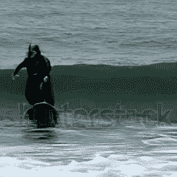

# 文本到视频

> 原文链接：[`huggingface.co/docs/diffusers/api/pipelines/text_to_video`](https://huggingface.co/docs/diffusers/api/pipelines/text_to_video)

🧪 这个流程仅用于研究目的。

[ModelScope 文本到视频技术报告](https://arxiv.org/abs/2308.06571)由王久牛、袁航杰、陈大有、张颖雅、王翔、张世伟撰写。

论文摘要如下：

*本文介绍了 ModelScopeT2V，这是一个从文本到图像合成模型（即稳定扩散）发展而来的文本到视频合成模型。ModelScopeT2V 结合了时空块，以确保一致的帧生成和平滑的运动过渡。该模型可以适应训练和推断过程中不同的帧数，适用于图像文本和视频文本数据集。ModelScopeT2V 汇集了三个组件（即 VQGAN、文本编码器和去噪 UNet），总共包含 17 亿个参数，其中 5 亿个参数专门用于时间能力。该模型在三个评估指标上表现优异。代码和在线演示可在[`modelscope.cn/models/damo/text-to-video-synthesis/summary`](https://modelscope.cn/models/damo/text-to-video-synthesis/summary)找到。*

您可以在[项目页面](https://modelscope.cn/models/damo/text-to-video-synthesis/summary)、[原始代码库](https://github.com/modelscope/modelscope/)和[演示](https://huggingface.co/spaces/damo-vilab/modelscope-text-to-video-synthesis)中找到有关文本到视频的其他信息。官方检查点可以在[damo-vilab](https://huggingface.co/damo-vilab)和[cerspense](https://huggingface.co/cerspense)找到。

## 使用示例

### text-to-video-ms-1.7b

让我们从生成默认长度为 16 帧（8 fps 下的 2 秒）的短视频开始：

```py
import torch
from diffusers import DiffusionPipeline
from diffusers.utils import export_to_video

pipe = DiffusionPipeline.from_pretrained("damo-vilab/text-to-video-ms-1.7b", torch_dtype=torch.float16, variant="fp16")
pipe = pipe.to("cuda")

prompt = "Spiderman is surfing"
video_frames = pipe(prompt).frames
video_path = export_to_video(video_frames)
video_path
```

Diffusers 支持不同的优化技术，以改善流程的延迟和内存占用。由于视频通常比图像更占用内存，我们可以启用 CPU 卸载和 VAE 切片来控制内存占用。

让我们在同一台 GPU 上使用 CPU 卸载和 VAE 切片生成 8 秒（64 帧）的视频：

```py
import torch
from diffusers import DiffusionPipeline
from diffusers.utils import export_to_video

pipe = DiffusionPipeline.from_pretrained("damo-vilab/text-to-video-ms-1.7b", torch_dtype=torch.float16, variant="fp16")
pipe.enable_model_cpu_offload()

# memory optimization
pipe.enable_vae_slicing()

prompt = "Darth Vader surfing a wave"
video_frames = pipe(prompt, num_frames=64).frames
video_path = export_to_video(video_frames)
video_path
```

使用 PyTorch 2.0，“fp16”精度和上述技术生成 64 个视频帧仅需要**7 GB 的 GPU 内存**。

我们也可以轻松地使用不同的调度器，使用与稳定扩散相同的方法：

```py
import torch
from diffusers import DiffusionPipeline, DPMSolverMultistepScheduler
from diffusers.utils import export_to_video

pipe = DiffusionPipeline.from_pretrained("damo-vilab/text-to-video-ms-1.7b", torch_dtype=torch.float16, variant="fp16")
pipe.scheduler = DPMSolverMultistepScheduler.from_config(pipe.scheduler.config)
pipe.enable_model_cpu_offload()

prompt = "Spiderman is surfing"
video_frames = pipe(prompt, num_inference_steps=25).frames
video_path = export_to_video(video_frames)
video_path
```

以下是一些示例输出：

| 一名宇航员骑马。 | 达斯维达在波浪中冲浪。 |
| --- | --- |

### cerspense/zeroscope_v2_576w 和 cerspense/zeroscope_v2_XL

Zeroscope 是无水印模型，已经在特定尺寸（如`576x320`和`1024x576`）上进行了训练。首先应使用较低分辨率检查点[`cerspense/zeroscope_v2_576w`](https://huggingface.co/cerspense/zeroscope_v2_576w)和 TextToVideoSDPipeline 生成视频，然后可以使用 VideoToVideoSDPipeline 和[`cerspense/zeroscope_v2_XL`](https://huggingface.co/cerspense/zeroscope_v2_XL)进行放大。

```py
import torch
from diffusers import DiffusionPipeline, DPMSolverMultistepScheduler
from diffusers.utils import export_to_video
from PIL import Image

pipe = DiffusionPipeline.from_pretrained("cerspense/zeroscope_v2_576w", torch_dtype=torch.float16)
pipe.enable_model_cpu_offload()

# memory optimization
pipe.unet.enable_forward_chunking(chunk_size=1, dim=1)
pipe.enable_vae_slicing()

prompt = "Darth Vader surfing a wave"
video_frames = pipe(prompt, num_frames=24).frames
video_path = export_to_video(video_frames)
video_path
```

现在视频可以进行放大：

```py
pipe = DiffusionPipeline.from_pretrained("cerspense/zeroscope_v2_XL", torch_dtype=torch.float16)
pipe.scheduler = DPMSolverMultistepScheduler.from_config(pipe.scheduler.config)
pipe.enable_model_cpu_offload()

# memory optimization
pipe.unet.enable_forward_chunking(chunk_size=1, dim=1)
pipe.enable_vae_slicing()

video = [Image.fromarray(frame).resize((1024, 576)) for frame in video_frames]

video_frames = pipe(prompt, video=video, strength=0.6).frames
video_path = export_to_video(video_frames)
video_path
```

以下是一些示例输出：

| 达斯维达在波浪中冲浪。 |
| --- |

确保查看调度器指南以了解如何探索调度器速度和质量之间的权衡，并查看在流程之间重用组件部分，以了解如何有效地将相同组件加载到多个流程中。

## TextToVideoSDPipeline

### `class diffusers.TextToVideoSDPipeline`

[<来源>](https://github.com/huggingface/diffusers/blob/v0.26.3/src/diffusers/pipelines/text_to_video_synthesis/pipeline_text_to_video_synth.py#L84)

```py
( vae: AutoencoderKL text_encoder: CLIPTextModel tokenizer: CLIPTokenizer unet: UNet3DConditionModel scheduler: KarrasDiffusionSchedulers )
```

参数

+   `vae` (AutoencoderKL) — 变分自动编码器（VAE）模型，用于将图像编码和解码为潜在表示。

+   `text_encoder` (`CLIPTextModel`) — 冻结的文本编码器（[clip-vit-large-patch14](https://huggingface.co/openai/clip-vit-large-patch14)）。

+   `tokenizer` (`CLIPTokenizer`) — 用于对文本进行标记化的[CLIPTokenizer](https://huggingface.co/docs/transformers/v4.37.2/en/model_doc/clip#transformers.CLIPTokenizer)。

+   `unet` (UNet3DConditionModel) — 用于去噪编码视频潜在表示的 UNet3DConditionModel。

+   `scheduler` (SchedulerMixin) — 与`unet`结合使用的调度器，用于去噪编码图像潜在表示。可以是 DDIMScheduler、LMSDiscreteScheduler 或 PNDMScheduler 之一。

文本到视频生成的管道。

这个模型继承自 DiffusionPipeline。查看超类文档以了解为所有管道实现的通用方法（下载、保存、在特定设备上运行等）。

该管道还继承了以下加载方法：

+   load_textual_inversion() 用于加载文本反演嵌入

+   load_lora_weights() 用于加载 LoRA 权重

+   save_lora_weights() 用于保存 LoRA 权重

#### `__call__`

[<来源>](https://github.com/huggingface/diffusers/blob/v0.26.3/src/diffusers/pipelines/text_to_video_synthesis/pipeline_text_to_video_synth.py#L527)

```py
( prompt: Union = None height: Optional = None width: Optional = None num_frames: int = 16 num_inference_steps: int = 50 guidance_scale: float = 9.0 negative_prompt: Union = None eta: float = 0.0 generator: Union = None latents: Optional = None prompt_embeds: Optional = None negative_prompt_embeds: Optional = None output_type: Optional = 'np' return_dict: bool = True callback: Optional = None callback_steps: int = 1 cross_attention_kwargs: Optional = None clip_skip: Optional = None ) → export const metadata = 'undefined';TextToVideoSDPipelineOutput or tuple
```

参数

+   `prompt` (`str` 或 `List[str]`, *可选*) — 用于指导图像生成的提示或提示。如果未定义，则需要传递`prompt_embeds`。

+   `height` (`int`, *可选*, 默认为`self.unet.config.sample_size * self.vae_scale_factor`) — 生成视频的像素高度。

+   `width` (`int`, *可选*, 默认为`self.unet.config.sample_size * self.vae_scale_factor`) — 生成视频的像素宽度。

+   `num_frames` (`int`, *可选*, 默认为 16) — 生成的视频帧数。默认为 16 帧，每秒 8 帧，相当于 2 秒的视频。

+   `num_inference_steps` (`int`, *可选*, 默认为 50) — 去噪步骤的数量。更多的去噪步骤通常会导致更高质量的视频，但会降低推理速度。

+   `guidance_scale` (`float`, *可选*, 默认为 7.5) — 更高的引导比例值鼓励模型生成与文本`prompt`紧密相关的图像，但会降低图像质量。当`guidance_scale > 1`时启用引导比例。

+   `negative_prompt` (`str` 或 `List[str]`, *可选*) — 用于指导图像生成中不包含的提示或提示。如果未定义，则需要传递`negative_prompt_embeds`。当不使用引导时（`guidance_scale < 1`）将被忽略。

+   `num_images_per_prompt` (`int`, *可选*, 默认为 1) — 每个提示生成的图像数量。

+   `eta` (`float`, *可选*，默认为 0.0) — 对应于[DDIM](https://arxiv.org/abs/2010.02502)论文中的参数 eta (η)。仅适用于 DDIMScheduler，在其他调度程序中将被忽略。

+   `generator` (`torch.Generator`或`List[torch.Generator]`, *可选*) — 用于使生成过程确定性的[`torch.Generator`](https://pytorch.org/docs/stable/generated/torch.Generator.html)。

+   `latents` (`torch.FloatTensor`, *可选*) — 从高斯分布中采样的预生成噪声潜变量，用作视频生成的输入。可用于使用不同提示微调相同生成。如果未提供，则通过使用提供的随机`generator`进行采样生成潜变量张量。潜变量应该具有形状`(batch_size, num_channel, num_frames, height, width)`。

+   `prompt_embeds` (`torch.FloatTensor`, *可选*) — 预生成的文本嵌入。可用于轻松微调文本输入（提示加权）。如果未提供，文本嵌入将从`prompt`输入参数生成。

+   `negative_prompt_embeds` (`torch.FloatTensor`, *可选*) — 预生成的负文本嵌入。可用于轻松微调文本输入（提示加权）。如果未提供，`negative_prompt_embeds`将从`negative_prompt`输入参数生成。

+   `output_type` (`str`, *可选*，默认为`"np"`) — 生成视频的输出格式。选择`torch.FloatTensor`或`np.array`之间。

+   `return_dict` (`bool`, *可选*，默认为`True`) — 是否返回 TextToVideoSDPipelineOutput 而不是普通的 tuple。

+   `callback` (`Callable`, *可选*) — 在推断过程中每`callback_steps`步调用的函数。该函数将使用以下参数调用：`callback(step: int, timestep: int, latents: torch.FloatTensor)`。

+   `callback_steps` (`int`, *可选*，默认为 1) — 调用`callback`函数的频率。如果未指定，则在每一步调用回调函数。

+   `cross_attention_kwargs` (`dict`, *可选*) — 如果指定，将传递给`AttentionProcessor`的 kwargs 字典，如[`self.processor`](https://github.com/huggingface/diffusers/blob/main/src/diffusers/models/attention_processor.py)中定义的。

+   `clip_skip` (`int`, *可选*) — 在计算提示嵌入时要从 CLIP 跳过的层数。值为 1 意味着将使用预最终层的输出来计算提示嵌入。

返回

TextToVideoSDPipelineOutput 或 `tuple`

如果`return_dict`为`True`，则返回 TextToVideoSDPipelineOutput，否则返回一个`tuple`，其中第一个元素是生成帧的列表。

用于生成的管道的调用函数。

示例：

```py
>>> import torch
>>> from diffusers import TextToVideoSDPipeline
>>> from diffusers.utils import export_to_video

>>> pipe = TextToVideoSDPipeline.from_pretrained(
...     "damo-vilab/text-to-video-ms-1.7b", torch_dtype=torch.float16, variant="fp16"
... )
>>> pipe.enable_model_cpu_offload()

>>> prompt = "Spiderman is surfing"
>>> video_frames = pipe(prompt).frames
>>> video_path = export_to_video(video_frames)
>>> video_path
```

#### `disable_freeu`

[<来源>](https://github.com/huggingface/diffusers/blob/v0.26.3/src/diffusers/pipelines/text_to_video_synthesis/pipeline_text_to_video_synth.py#L523)

```py
( )
```

如果启用，则禁用 FreeU 机制。

#### `disable_vae_slicing`

[<来源>](https://github.com/huggingface/diffusers/blob/v0.26.3/src/diffusers/pipelines/text_to_video_synthesis/pipeline_text_to_video_synth.py#L141)

```py
( )
```

禁用切片的 VAE 解码。如果之前启用了`enable_vae_slicing`，则此方法将返回到一步计算解码。

#### `disable_vae_tiling`

[<来源>](https://github.com/huggingface/diffusers/blob/v0.26.3/src/diffusers/pipelines/text_to_video_synthesis/pipeline_text_to_video_synth.py#L158)

```py
( )
```

禁用平铺式 VAE 解码。如果之前启用了`enable_vae_tiling`，则此方法将返回到一步计算解码。

#### `enable_freeu`

[<来源>](https://github.com/huggingface/diffusers/blob/v0.26.3/src/diffusers/pipelines/text_to_video_synthesis/pipeline_text_to_video_synth.py#L500)

```py
( s1: float s2: float b1: float b2: float )
```

参数

+   `s1` (`float`) — 第 1 阶段的缩放因子，用于减弱跳过特征的贡献。这样做是为了减轻增强去噪过程中的“过度平滑效应”。

+   `s2` (`float`) — 第 2 阶段的缩放因子，用于减弱跳过特征的贡献。这样做是为了减轻增强去噪过程中的“过度平滑效应”。

+   `b1` (`float`) — 第 1 阶段的缩放因子，用于放大骨干特征的贡献。

+   `b2` (`float`) — 第 2 阶段的缩放因子，用于放大骨干特征的贡献。

启用 FreeU 机制，如[`arxiv.org/abs/2309.11497`](https://arxiv.org/abs/2309.11497)。

缩放因子后缀表示它们被应用的阶段。

请参考[官方存储库](https://github.com/ChenyangSi/FreeU)，了解已知适用于不同管道（如 Stable Diffusion v1、v2 和 Stable Diffusion XL）的值组合。

#### `enable_vae_slicing`

[<来源>](https://github.com/huggingface/diffusers/blob/v0.26.3/src/diffusers/pipelines/text_to_video_synthesis/pipeline_text_to_video_synth.py#L133)

```py
( )
```

启用切片式 VAE 解码。启用此选项时，VAE 将将输入张量分割成片段，以便在几个步骤中计算解码。这对于节省一些内存并允许更大的批量大小非常有用。

#### `enable_vae_tiling`

[<来源>](https://github.com/huggingface/diffusers/blob/v0.26.3/src/diffusers/pipelines/text_to_video_synthesis/pipeline_text_to_video_synth.py#L149)

```py
( )
```

启用平铺式 VAE 解码。启用此选项时，VAE 将将输入张量分割成多个瓦片，以便在几个步骤中计算解码和编码。这对于节省大量内存并允许处理更大的图像非常有用。

#### `encode_prompt`

[<来源>](https://github.com/huggingface/diffusers/blob/v0.26.3/src/diffusers/pipelines/text_to_video_synthesis/pipeline_text_to_video_synth.py#L199)

```py
( prompt device num_images_per_prompt do_classifier_free_guidance negative_prompt = None prompt_embeds: Optional = None negative_prompt_embeds: Optional = None lora_scale: Optional = None clip_skip: Optional = None )
```

参数

+   `prompt` (`str` 或 `List[str]`, *可选*) — 要编码的提示 设备 — (`torch.device`): torch 设备

+   `num_images_per_prompt` (`int`) — 每个提示应生成的图像数量

+   `do_classifier_free_guidance` (`bool`) — 是否使用分类器自由指导

+   `negative_prompt` (`str` 或 `List[str]`, *可选*) — 不用来指导图像生成的提示。如果未定义，则必须传递`negative_prompt_embeds`。在不使用指导时被忽略（即如果`guidance_scale`小于`1`，则被忽略）。

+   `prompt_embeds` (`torch.FloatTensor`, *可选*) — 预生成的文本嵌入。可用于轻松调整文本输入，例如提示加权。如果未提供，将从`prompt`输入参数生成文本嵌入。

+   `negative_prompt_embeds` (`torch.FloatTensor`, *可选*) — 预生成的负文本嵌入。可用于轻松调整文本输入，例如提示加权。如果未提供，将从`negative_prompt`输入参数生成`negative_prompt_embeds`。

+   `lora_scale` (`float`, *可选*) — 如果加载了 LoRA 层，则将应用于文本编码器的所有 LoRA 层的 LoRA 比例。

+   `clip_skip` (`int`, *可选*) — 从 CLIP 中跳过的层数，用于计算提示嵌入。值为 1 意味着将使用预最终层的输出来计算提示嵌入。

将提示编码为文本编码器隐藏状态。

## VideoToVideoSDPipeline

### `class diffusers.VideoToVideoSDPipeline`

[<来源>](https://github.com/huggingface/diffusers/blob/v0.26.3/src/diffusers/pipelines/text_to_video_synthesis/pipeline_text_to_video_synth_img2img.py#L160)

```py
( vae: AutoencoderKL text_encoder: CLIPTextModel tokenizer: CLIPTokenizer unet: UNet3DConditionModel scheduler: KarrasDiffusionSchedulers )
```

参数

+   `vae`（AutoencoderKL）— 变分自动编码器（VAE）模型，用于将视频编码和解码为潜在表示。

+   `text_encoder`（`CLIPTextModel`）— 冻结的文本编码器（[clip-vit-large-patch14](https://huggingface.co/openai/clip-vit-large-patch14)）。

+   `tokenizer`（`CLIPTokenizer`）— 用于对文本进行标记化的[CLIPTokenizer](https://huggingface.co/docs/transformers/v4.37.2/en/model_doc/clip#transformers.CLIPTokenizer)。

+   `unet`（UNet3DConditionModel）— 用于去噪编码视频潜在特征的 UNet3DConditionModel。

+   `scheduler`（SchedulerMixin）— 用于与`unet`结合使用以去噪编码图像潜在特征的调度器。可以是 DDIMScheduler、LMSDiscreteScheduler 或 PNDMScheduler 之一。

用于文本引导的视频到视频生成的流水线。

该模型继承自 DiffusionPipeline。查看超类文档以获取所有流水线实现的通用方法（下载、保存、在特定设备上运行等）。

该流水线还继承了以下加载方法：

+   load_textual_inversion() 用于加载文本反演嵌入

+   load_lora_weights() 用于加载 LoRA 权重

+   save_lora_weights() 用于保存 LoRA 权重

#### `__call__`

[<来源>](https://github.com/huggingface/diffusers/blob/v0.26.3/src/diffusers/pipelines/text_to_video_synthesis/pipeline_text_to_video_synth_img2img.py#L632)

```py
( prompt: Union = None video: Union = None strength: float = 0.6 num_inference_steps: int = 50 guidance_scale: float = 15.0 negative_prompt: Union = None eta: float = 0.0 generator: Union = None latents: Optional = None prompt_embeds: Optional = None negative_prompt_embeds: Optional = None output_type: Optional = 'np' return_dict: bool = True callback: Optional = None callback_steps: int = 1 cross_attention_kwargs: Optional = None clip_skip: Optional = None ) → export const metadata = 'undefined';TextToVideoSDPipelineOutput or tuple
```

参数

+   `prompt`（`str`或`List[str]`，*可选*）— 用于指导图像生成的提示或提示。如果未定义，则需要传递`prompt_embeds`。

+   `video`（`List[np.ndarray]`或`torch.FloatTensor`）— `video`帧或表示视频批次的张量，用作过程的起点。还可以接受视频潜在特征作为`image`，如果直接传递潜在特征，则不会再次编码。

+   `strength`（`float`，*可选*，默认为 0.8）— 表示转换参考`video`的程度。必须介于 0 和 1 之间。`video`用作起点，添加的噪音越多，`strength`越大。去噪步骤的数量取决于最初添加的噪音量。当`strength`为 1 时，添加的噪音最大，去噪过程将运行指定的`num_inference_steps`的全部迭代次数。值为 1 基本上忽略`video`。

+   `num_inference_steps`（`int`，*可选*，默认为 50）— 去噪步骤的数量。更多的去噪步骤通常会导致更高质量的视频，但会降低推理速度。

+   `guidance_scale`（`float`，*可选*，默认为 7.5）— 更高的指导比例值鼓励模型生成与文本`prompt`紧密相关的图像，但会降低图像质量。当`guidance_scale > 1`时启用指导比例。

+   `negative_prompt`（`str`或`List[str]`，*可选*）— 用于指导在视频生成中不包括的提示或提示。如果未定义，则需要传递`negative_prompt_embeds`。在不使用指导时被忽略（`guidance_scale < 1`）。

+   `eta` (`float`, *可选*, 默认为 0.0) — 对应于[DDIM](https://arxiv.org/abs/2010.02502)论文中的参数 eta (η)。仅适用于 DDIMScheduler，在其他调度程序中将被忽略。

+   `generator` (`torch.Generator` 或 `List[torch.Generator]`, *可选*) — 一个[`torch.Generator`](https://pytorch.org/docs/stable/generated/torch.Generator.html)，用于使生成过程确定性。

+   `latents` (`torch.FloatTensor`, *可选*) — 从高斯分布中采样的预生成噪声潜变量，用作视频生成的输入。可用于使用不同提示微调相同生成。如果未提供，则通过使用提供的随机`generator`进行采样生成潜变量张量。潜变量应该具有形状`(batch_size, num_channel, num_frames, height, width)`。

+   `prompt_embeds` (`torch.FloatTensor`, *可选*) — 预生成的文本嵌入。可用于轻松微调文本输入（提示加权）。如果未提供，文本嵌入将从`prompt`输入参数生成。

+   `negative_prompt_embeds` (`torch.FloatTensor`, *可选*) — 预生成的负文本嵌入。可用于轻松微调文本输入（提示加权）。如果未提供，`negative_prompt_embeds`将从`negative_prompt`输入参数生成。

+   `output_type` (`str`, *可选*, 默认为`"np"`) — 生成视频的输出格式。选择`torch.FloatTensor`或`np.array`之间。

+   `return_dict` (`bool`, *可选*, 默认为`True`) — 是否返回 TextToVideoSDPipelineOutput 而不是普通的 tuple。

+   `callback` (`Callable`, *可选*) — 一个在推断过程中每`callback_steps`步调用的函数。该函数接受以下参数：`callback(step: int, timestep: int, latents: torch.FloatTensor)`。

+   `callback_steps` (`int`, *可选*, 默认为 1) — 调用`callback`函数的频率。如果未指定，将在每一步调用回调。

+   `cross_attention_kwargs` (`dict`, *可选*) — 一个 kwargs 字典，如果指定了，将传递给[`self.processor`](https://github.com/huggingface/diffusers/blob/main/src/diffusers/models/attention_processor.py)中定义的`AttentionProcessor`。

+   `clip_skip` (`int`, *可选*) — 在计算提示嵌入时要跳过的 CLIP 层数。值为 1 表示将使用预终层的输出来计算提示嵌入。

返回

TextToVideoSDPipelineOutput 或`tuple`

如果`return_dict`为`True`，将返回 TextToVideoSDPipelineOutput，否则将返回一个`tuple`，其中第一个元素是生成的帧的列表。

用于生成的管道的调用函数。

示例：

```py
>>> import torch
>>> from diffusers import DiffusionPipeline, DPMSolverMultistepScheduler
>>> from diffusers.utils import export_to_video

>>> pipe = DiffusionPipeline.from_pretrained("cerspense/zeroscope_v2_576w", torch_dtype=torch.float16)
>>> pipe.scheduler = DPMSolverMultistepScheduler.from_config(pipe.scheduler.config)
>>> pipe.to("cuda")

>>> prompt = "spiderman running in the desert"
>>> video_frames = pipe(prompt, num_inference_steps=40, height=320, width=576, num_frames=24).frames
>>> # safe low-res video
>>> video_path = export_to_video(video_frames, output_video_path="./video_576_spiderman.mp4")

>>> # let's offload the text-to-image model
>>> pipe.to("cpu")

>>> # and load the image-to-image model
>>> pipe = DiffusionPipeline.from_pretrained(
...     "cerspense/zeroscope_v2_XL", torch_dtype=torch.float16, revision="refs/pr/15"
... )
>>> pipe.scheduler = DPMSolverMultistepScheduler.from_config(pipe.scheduler.config)
>>> pipe.enable_model_cpu_offload()

>>> # The VAE consumes A LOT of memory, let's make sure we run it in sliced mode
>>> pipe.vae.enable_slicing()

>>> # now let's upscale it
>>> video = [Image.fromarray(frame).resize((1024, 576)) for frame in video_frames]

>>> # and denoise it
>>> video_frames = pipe(prompt, video=video, strength=0.6).frames
>>> video_path = export_to_video(video_frames, output_video_path="./video_1024_spiderman.mp4")
>>> video_path
```

#### `disable_freeu`

[<来源>](https://github.com/huggingface/diffusers/blob/v0.26.3/src/diffusers/pipelines/text_to_video_synthesis/pipeline_text_to_video_synth_img2img.py#L628)

```py
( )
```

如果启用，将禁用 FreeU 机制。

#### `disable_vae_slicing`

[<来源>](https://github.com/huggingface/diffusers/blob/v0.26.3/src/diffusers/pipelines/text_to_video_synthesis/pipeline_text_to_video_synth_img2img.py#L217)

```py
( )
```

禁用切片 VAE 解码。如果之前启用了`enable_vae_slicing`，则此方法将返回到一步计算解码。

#### `disable_vae_tiling`

[<来源>](https://github.com/huggingface/diffusers/blob/v0.26.3/src/diffusers/pipelines/text_to_video_synthesis/pipeline_text_to_video_synth_img2img.py#L234)

```py
( )
```

禁用平铺 VAE 解码。如果之前启用了`enable_vae_tiling`，则此方法将返回到一步计算解码。

#### `enable_freeu`

[< source >](https://github.com/huggingface/diffusers/blob/v0.26.3/src/diffusers/pipelines/text_to_video_synthesis/pipeline_text_to_video_synth_img2img.py#L605)

```py
( s1: float s2: float b1: float b2: float )
```

参数

+   `s1` (`float`) — 用于减弱跳过特征贡献的第 1 阶段的缩放因子。这样做是为了在增强去噪过程中减轻“过度平滑效应”。

+   `s2` (`float`) — 用于减弱跳过特征贡献的第 2 阶段的缩放因子。这样做是为了在增强去噪过程中减轻“过度平滑效应”。

+   `b1` (`float`) — 用于放大第 1 阶段的骨干特征贡献的缩放因子。

+   `b2` (`float`) — 用于放大第 2 阶段的骨干特征贡献的缩放因子。

启用 FreeU 机制，如[`arxiv.org/abs/2309.11497`](https://arxiv.org/abs/2309.11497)。

缩放因子后缀表示应用它们的阶段。

请参考[官方存储库](https://github.com/ChenyangSi/FreeU)以获取已知适用于不同管道（如 Stable Diffusion v1、v2 和 Stable Diffusion XL）的值组合。

#### `enable_vae_slicing`

[< source >](https://github.com/huggingface/diffusers/blob/v0.26.3/src/diffusers/pipelines/text_to_video_synthesis/pipeline_text_to_video_synth_img2img.py#L209)

```py
( )
```

启用切片 VAE 解码。当启用此选项时，VAE 将将输入张量切片以便在几个步骤中计算解码。这对于节省一些内存并允许更大的批量大小非常有用。

#### `enable_vae_tiling`

[< source >](https://github.com/huggingface/diffusers/blob/v0.26.3/src/diffusers/pipelines/text_to_video_synthesis/pipeline_text_to_video_synth_img2img.py#L225)

```py
( )
```

启用平铺 VAE 解码。当启用此选项时，VAE 将将输入张量分割成多个瓦片，以便在几个步骤中计算解码和编码。这对于节省大量内存并允许处理更大的图像非常有用。

#### `encode_prompt`

[< source >](https://github.com/huggingface/diffusers/blob/v0.26.3/src/diffusers/pipelines/text_to_video_synthesis/pipeline_text_to_video_synth_img2img.py#L275)

```py
( prompt device num_images_per_prompt do_classifier_free_guidance negative_prompt = None prompt_embeds: Optional = None negative_prompt_embeds: Optional = None lora_scale: Optional = None clip_skip: Optional = None )
```

参数

+   `prompt` (`str` or `List[str]`, *optional*) — 要编码的提示设备 — (`torch.device`): torch 设备

+   `num_images_per_prompt` (`int`) — 应该为每个提示生成的图像数量

+   `do_classifier_free_guidance` (`bool`) — 是否使用分类器自由指导

+   `negative_prompt` (`str` or `List[str]`, *optional*) — 不用于指导图像生成的提示或提示。如果未定义，则必须传递`negative_prompt_embeds`。如果不使用指导（即，如果`guidance_scale`小于`1`，则忽略）。

+   `prompt_embeds` (`torch.FloatTensor`, *optional*) — 预生成的文本嵌入。可用于轻松调整文本输入，例如提示加权。如果未提供，文本嵌入将从`prompt`输入参数生成。

+   `negative_prompt_embeds` (`torch.FloatTensor`, *optional*) — 预生成的负文本嵌入。可用于轻松调整文本输入，例如提示加权。如果未提供，将从`negative_prompt`输入参数生成 negative_prompt_embeds。

+   `lora_scale` (`float`, *optional*) — 如果加载了 LoRA 层，则将应用于文本编码器的所有 LoRA 层的 LoRA 比例。

+   `clip_skip` (`int`, *optional*) — 从 CLIP 中跳过的层数。值为 1 表示将使用预最终层的输出来计算提示嵌入。

将提示编码为文本编码器隐藏状态。

## TextToVideoSDPipelineOutput

### `class diffusers.pipelines.text_to_video_synthesis.TextToVideoSDPipelineOutput`

[<来源>](https://github.com/huggingface/diffusers/blob/v0.26.3/src/diffusers/pipelines/text_to_video_synthesis/pipeline_output.py#L12)

```py
( frames: Union )
```

参数

+   `frames` (`List[np.ndarray]` 或 `torch.FloatTensor`) — 一系列去噪帧（基本上是图像），作为形状为`(height, width, num_channels)`的 NumPy 数组或`torch`张量。列表的长度表示视频长度（帧数）。

用于文本到视频流水线的输出类。
