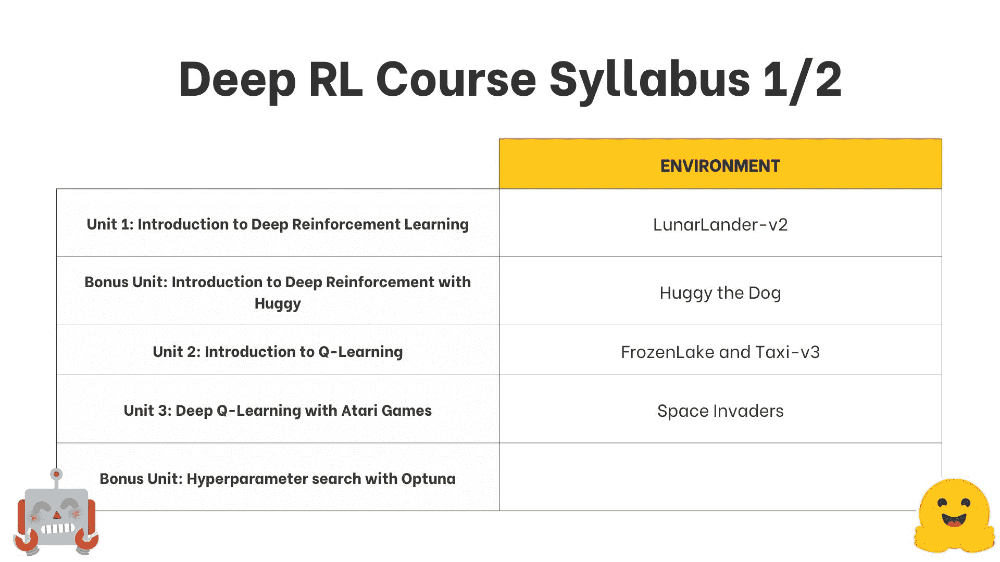
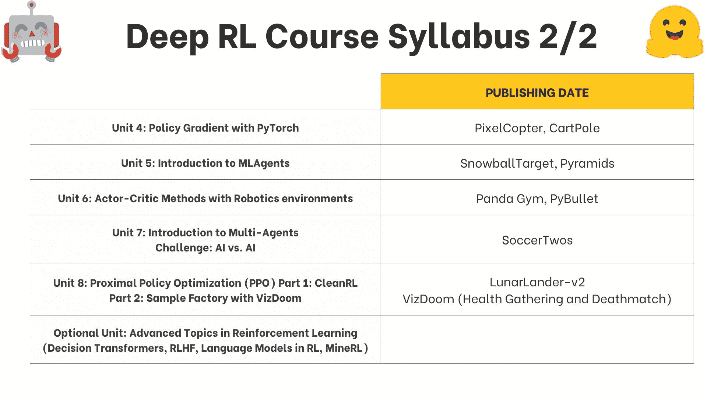
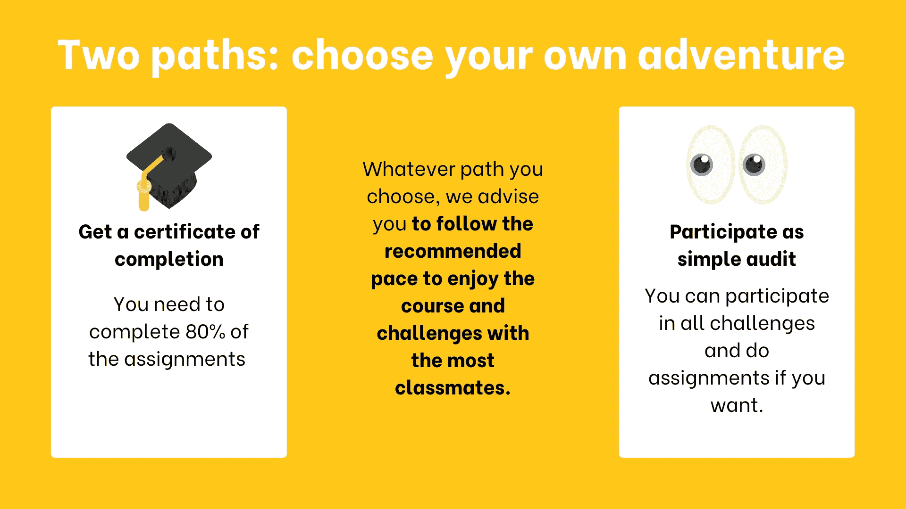
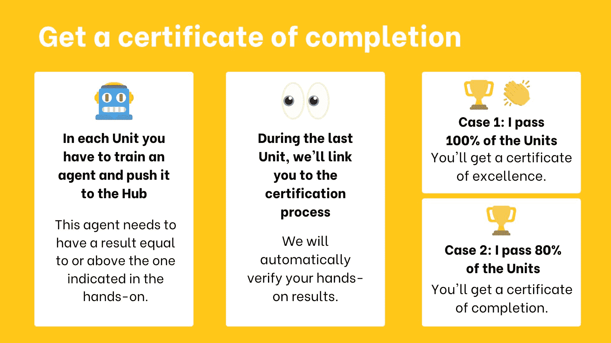
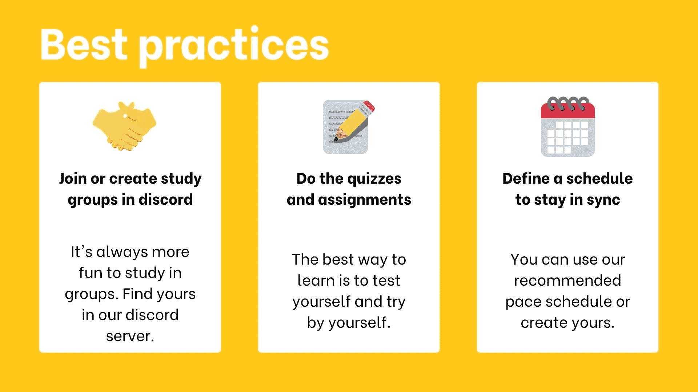
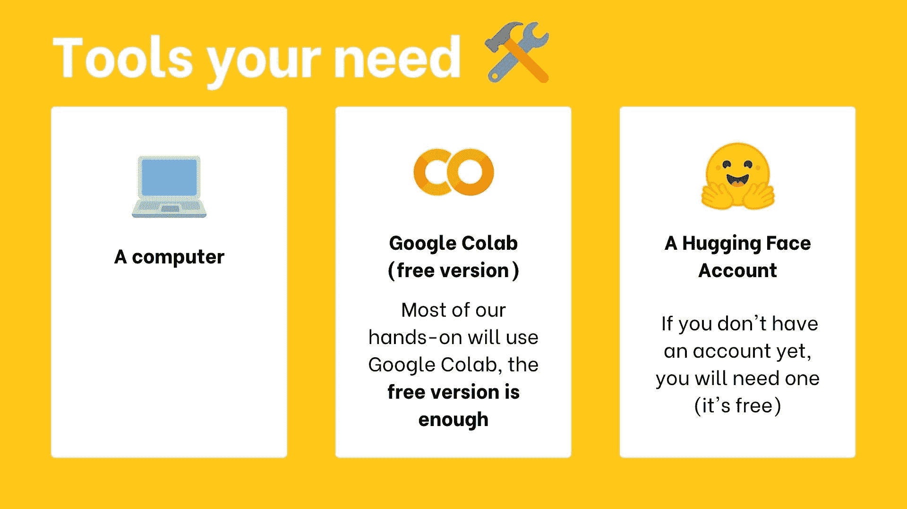
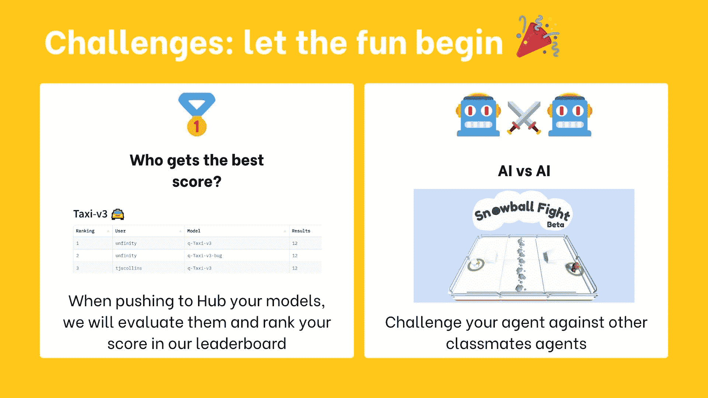

# 欢迎来到🤗深度强化学习课程

> 原文：[`huggingface.co/learn/deep-rl-course/unit0/introduction`](https://huggingface.co/learn/deep-rl-course/unit0/introduction)

、[RL Baselines3 Zoo](https://github.com/DLR-RM/rl-baselines3-zoo)、[Sample Factory](https://samplefactory.dev/)和[CleanRL](https://github.com/vwxyzjn/cleanrl)。

+   🤖 在独特环境中训练代理人，如[SnowballFight](https://huggingface.co/spaces/ThomasSimonini/SnowballFight)、[Huggy the Doggo 🐶](https://huggingface.co/spaces/ThomasSimonini/Huggy)、[VizDoom (Doom)](https://vizdoom.cs.put.edu.pl/)以及经典环境，如[Space Invaders](https://gymnasium.farama.org/environments/atari/space_invaders/)、[PyBullet](https://pybullet.org/wordpress/)等。

+   💾 通过一行代码将你的训练代理人分享到 Hub，并从社区下载强大的代理人。

+   🏆 参加挑战，你将评估你的代理人与其他团队的对抗。你还将有机会与你训练的代理人对战。

+   🎓 通过完成 80%的作业获得完成证书。

等等！

在这门课程结束时，你将从基础到最先进的方法建立起坚实的基础。

不要忘记**[注册课程](http://eepurl.com/ic5ZUD)**（我们正在收集你的电子邮件，以便能够在每个单元发布时发送链接并提供关于挑战和更新的信息）。

点击这里进行**注册**（http://eepurl.com/ic5ZUD）

## 这门课程是什么样子的？

这门课程由以下组成：

+   *理论部分*：在这里你将学习一个概念的理论。

+   *实践操作*：在这里你将学习使用著名的深度强化学习库，在独特环境中训练你的代理人。如果你更喜欢视频格式学习，这些实践操作将是**Google Colab 笔记本和配套教程视频**！

+   *挑战*：你将让你的代理人参加不同挑战与其他代理人竞争。还将有[排行榜](https://huggingface.co/spaces/huggingface-projects/Deep-Reinforcement-Learning-Leaderboard)供你比较代理人的表现。

## 课程大纲是什么？

这是课程的大纲：

 

## 两条路径：选择你自己的冒险。

你可以选择跟随这门课程的两种方式之一：

+   *获得完成证书*：你需要完成 80%的作业。

+   *获得荣誉证书*：你需要完成 100%的作业。

+   *作为简单的审计*：如果你愿意，你可以参加所有挑战并完成作业。

没有截止日期，课程是自主学习的。两条路径都是完全免费的。无论你选择哪条路径，我们建议你按照推荐的步伐来享受课程和与同学们一起面对挑战。

您不需要告诉我们您选择了哪条路径。**如果您完成了 80%以上的作业，您将获得证书。**

## 认证流程

认证流程是**完全免费**的：

+   *获得完成证书*：您需要完成 80%的作业。

+   *获得优秀证书*：您需要完成 100%的作业。

再次强调，由于课程是自主学习的，**没有截止日期**。但我们建议**遵循推荐的进度部分**。

## 如何充分利用课程？

为了充分利用课程，我们有一些建议：

1.  [加入 Discord 的学习小组](https://discord.gg/ydHrjt3WP5)：小组学习总是更容易。为此，您需要加入我们的 Discord 服务器。如果您对 Discord 还不熟悉，不用担心！我们有一些工具可以帮助您了解它。

1.  **做测验和作业**：学习的最佳方式是实践和测试自己。

1.  **制定一个时间表以保持同步**：您可以使用我们推荐的进度时间表或创建自己的时间表。

## 我需要哪些工具？

您只需要 3 样东西：

+   *一台带有互联网连接的电脑*。

+   *Google Colab（免费版本）*：我们的大部分实践将使用 Google Colab，**免费版本足够了。**

+   *Hugging Face 账户*：用于推送和加载模型。如果您还没有账户，可以在**[这里](https://hf.co/join)**创建一个（免费）。

## 推荐的进度是什么？

这门课程的每一章都设计为**在 1 周内完成，每周工作时间约为 3-4 小时**。但是，您可以花费尽可能多的时间来完成课程。如果您想深入研究某个主题，我们将提供额外的资源来帮助您实现这一目标。

## 我们是谁

关于作者：

+   [Thomas Simonini](https://twitter.com/ThomasSimonini)是 Hugging Face 🤗的开发者倡导者，专门从事深度强化学习。他于 2018 年创立了深度强化学习课程，成为深度强化学习中最受欢迎的课程之一。

关于团队：

+   [Omar Sanseviero](https://twitter.com/osanseviero)是 Hugging Face 的机器学习工程师，他在机器学习、社区和开源的交叉领域工作。以前，Omar 曾在 Google 的 Assistant 和 TensorFlow Graphics 团队担任软件工程师。他来自秘鲁，喜欢羊驼🦙。

+   [Sayak Paul](https://twitter.com/RisingSayak)是 Hugging Face 的开发者倡导工程师。他对表示学习领域（自我监督、半监督、模型稳健性）感兴趣。他喜欢观看犯罪和动作惊悚片🔪。

## 这门课程中的挑战是什么？

在这门课程的新版本中，您有两种类型的挑战：

+   [排行榜](https://huggingface.co/spaces/huggingface-projects/Deep-Reinforcement-Learning-Leaderboard)可以比较您的代理的表现与其他同学的表现。

+   [AI 对 AI 挑战](https://huggingface.co/learn/deep-rl-course/unit7/introduction?fw=pt)：您可以训练您的代理并与其他同学的代理竞争。

## 我发现了一个错误，或者我想改进课程

欢迎贡献 🤗

+   如果您*在笔记本中发现了一个错误 🐛*，请[提出问题](https://github.com/huggingface/deep-rl-class/issues)并**描述问题**。

+   如果您*想改进课程*，您可以[提出拉取请求。](https://github.com/huggingface/deep-rl-class/pulls)

## 我还有问题

请在我们的[discord 服务器#rl-discussions](https://discord.gg/ydHrjt3WP5)中提出您的问题。
