# 强化学习框架

> [`huggingface.co/learn/deep-rl-course/unit1/rl-framework`](https://huggingface.co/learn/deep-rl-course/unit1/rl-framework)

## RL 过程

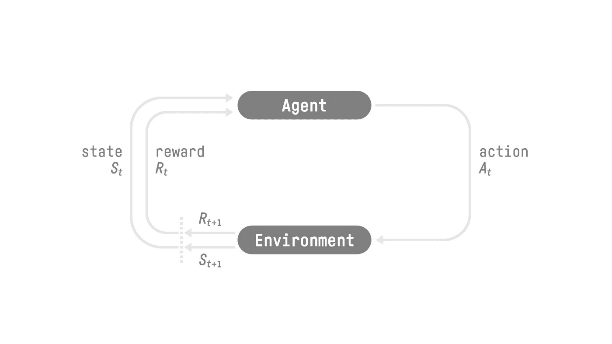

RL 过程：一个状态、动作、奖励和下一个状态的循环

来源：[强化学习：一种介绍，Richard Sutton 和 Andrew G. Barto](http://incompleteideas.net/book/RLbook2020.pdf)

为了理解 RL 过程，让我们想象一个学习玩平台游戏的 Agent：

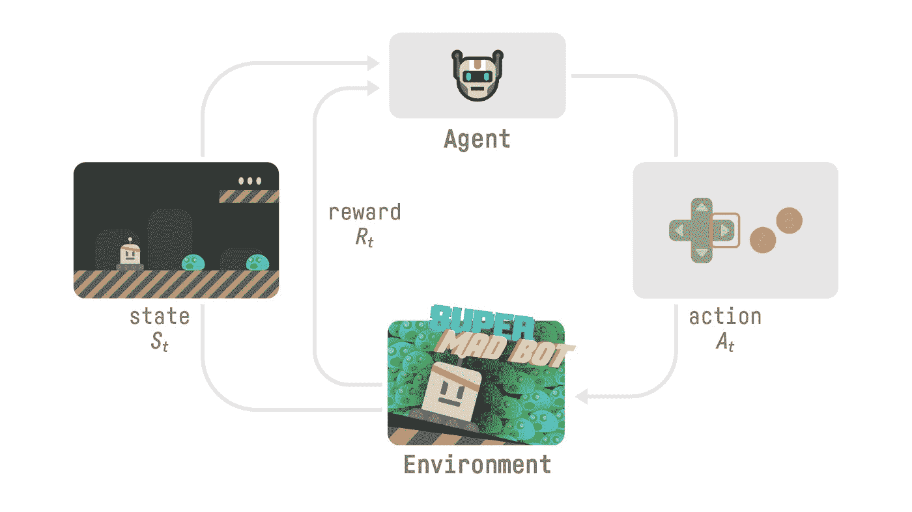

+   我们的 Agent 从**环境**接收**状态<math><semantics><mrow><msub><mi>S</mi><mn>0</mn></msub></mrow><annotation encoding="application/x-tex">S_0</annotation></semantics></math>S0** — 我们接收游戏的第一帧（环境）。

+   基于那个**状态<math><semantics><mrow><msub><mi>S</mi><mn>0</mn></msub></mrow><annotation encoding="application/x-tex">S_0</annotation></semantics></math>S0**，Agent 采取**动作<math><semantics><mrow><msub><mi>A</mi><mn>0</mn></msub></mrow><annotation encoding="application/x-tex">A_0</annotation></semantics></math>A0** — 我们的 Agent 将向右移动。

+   环境进入一个**新的**状态<math><semantics><mrow><msub><mi>S</mi><mn>1</mn></msub></mrow><annotation encoding="application/x-tex">S_1</annotation></semantics></math>S1** — 新的帧。

+   环境给 Agent 一些**奖励<math><semantics><mrow><msub><mi>R</mi><mn>1</mn></msub></mrow><annotation encoding="application/x-tex">R_1</annotation></semantics></math>R1** — 我们还活着（正面奖励+1）。

这个 RL 循环输出一系列**状态、动作、奖励和下一个状态。**

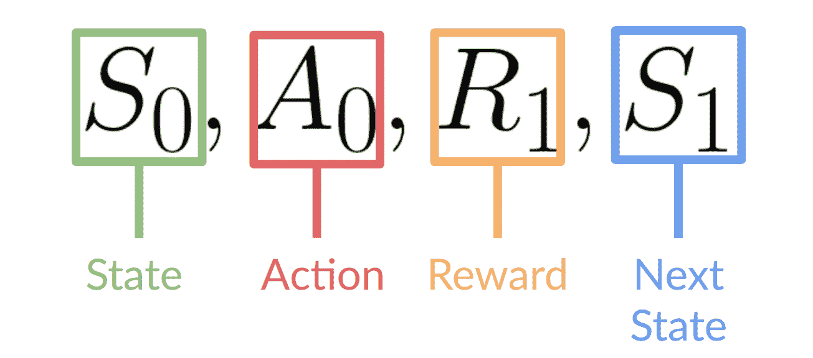

Agent 的目标是*最大化*其累积奖励，**称为预期回报。**

## 奖励假设：强化学习的核心思想

⇒ 为什么 Agent 的目标是最大化预期回报？

因为 RL 基于**奖励假设**，即所有目标都可以描述为**最大化预期回报**（预期累积奖励）。

这就是为什么在强化学习中，**为了有最佳行为**，我们的目标是学会采取能够**最大化预期累积奖励**的行动。

## 马尔可夫性质

在论文中，你会看到 RL 过程被称为**马尔可夫决策过程**（MDP）。

我们将在接下来的单元再次讨论马尔可夫性质。但是如果你今天需要记住一些关于它的东西，那就是：马尔可夫性质意味着我们的 Agent 只需要**当前状态来决定**采取什么行动，而**不需要所有之前状态和行动的历史**。

## 观察/状态空间

观察/状态是**Agent 从环境中获取的信息**。在视频游戏中，它可以是一帧（一张截图）。在交易 Agent 的情况下，它可以是某只股票的价值等。

然而，需要区分*观察*和*状态*：

+   *状态 s*：是**世界状态的完整描述**（没有隐藏信息）。在完全观察的环境中。

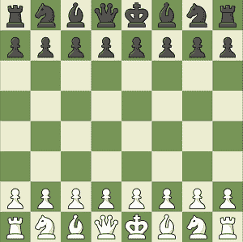

在国际象棋游戏中，我们从环境中接收一个状态，因为我们可以访问整个棋盘信息。

在国际象棋游戏中，我们可以访问整个棋盘信息，因此我们从环境中接收一个状态。换句话说，环境是完全观察的。

+   *观察 o*：是**状态的部分描述**。在部分观察的环境中。

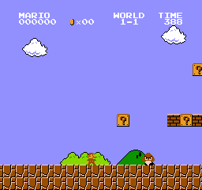

在超级马里奥兄弟中，我们只能看到靠近玩家的部分关卡，因此我们接收一个观察。

在超级马里奥兄弟中，我们只能看到靠近玩家的部分关卡，因此我们接收一个观察。

在超级马里奥兄弟中，我们处于部分观察环境中。我们收到一个观察**因为我们只看到关卡的一部分。**

在本课程中，我们使用术语“状态”来表示状态和观察，但在实现中我们会做出区分。

总结一下：

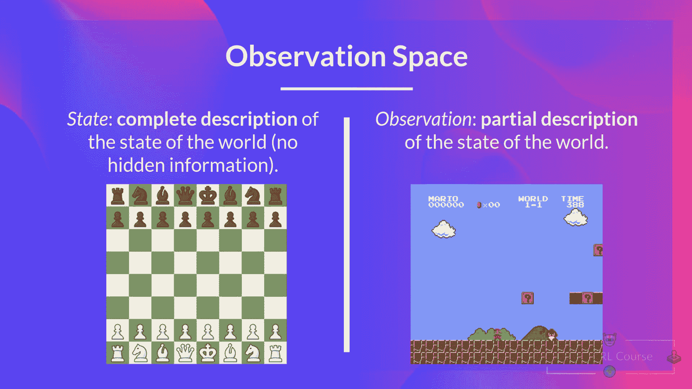

## 动作空间

动作空间是环境中**所有可能动作的集合。**

动作可以来自*离散*或*连续空间*：

+   *离散空间*：可能动作的数量是**有限**的。

在超级马里奥兄弟中，我们只有 4 种可能的动作：左、右、上（跳跃）和下（蹲下）。

同样，在超级马里奥兄弟中，我们只有有限的动作集，因为我们只有 4 个方向。

+   *连续空间*：可能动作的数量是**无限**的。

自动驾驶汽车代理有无限数量的可能动作，因为它可以左转 20°，21.1°，21.2°，按喇叭，右转 20°...

总结一下：

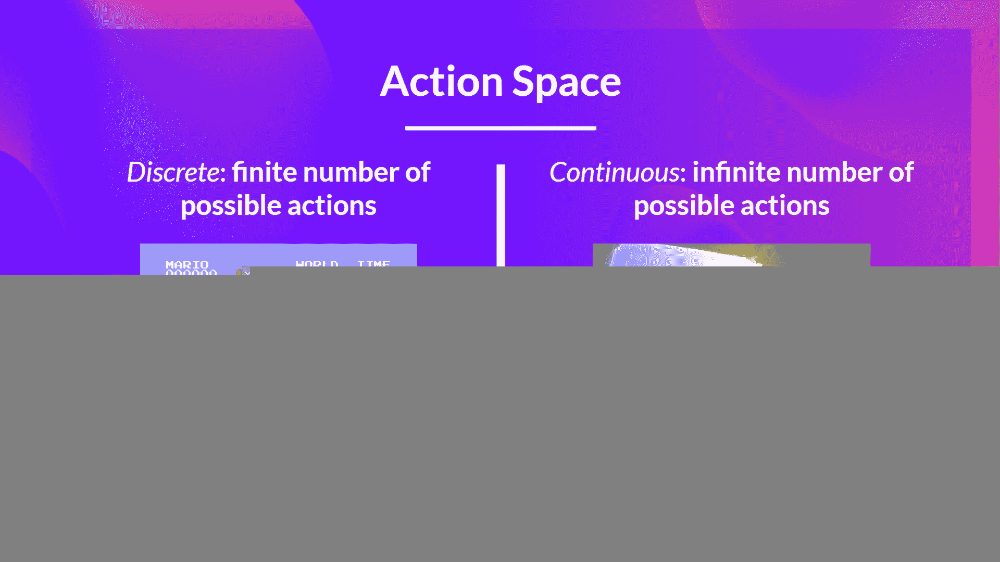

考虑这些信息是至关重要的，因为在未来选择 RL 算法时会**具有重要性。**

## 奖励和折扣

奖励在 RL 中是至关重要的，因为它是**代理的唯一反馈**。通过它，我们的代理知道**采取的行动是好是坏。**

在每个时间步骤**t**处的累积奖励可以写成：

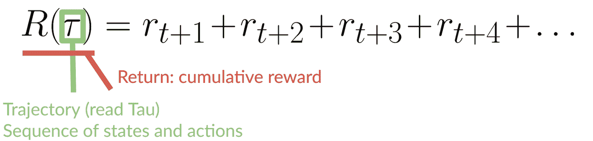

累积奖励等于序列中所有奖励的总和。

这等同于：

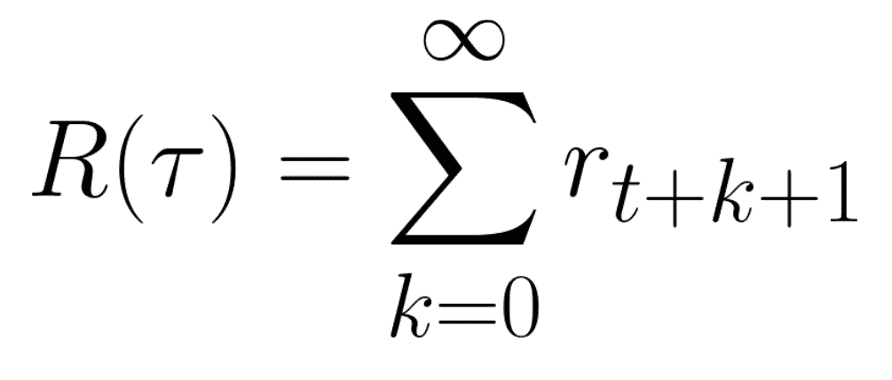

累积奖励 = rt+1 (rt+k+1 = rt+0+1 = rt+1)+ rt+2 (rt+k+1 = rt+1+1 = rt+2) + ...

然而，在现实中，**我们不能简单地这样相加。** 较早出现的奖励（在游戏开始时）**更有可能发生**，因为它们比长期未来奖励更可预测。

假设你的代理是这只小老鼠，每次步长可以移动一个方块，而你的对手是猫（也可以移动）。老鼠的目标是**在被猫吃掉之前尽可能多地吃到奶酪。**

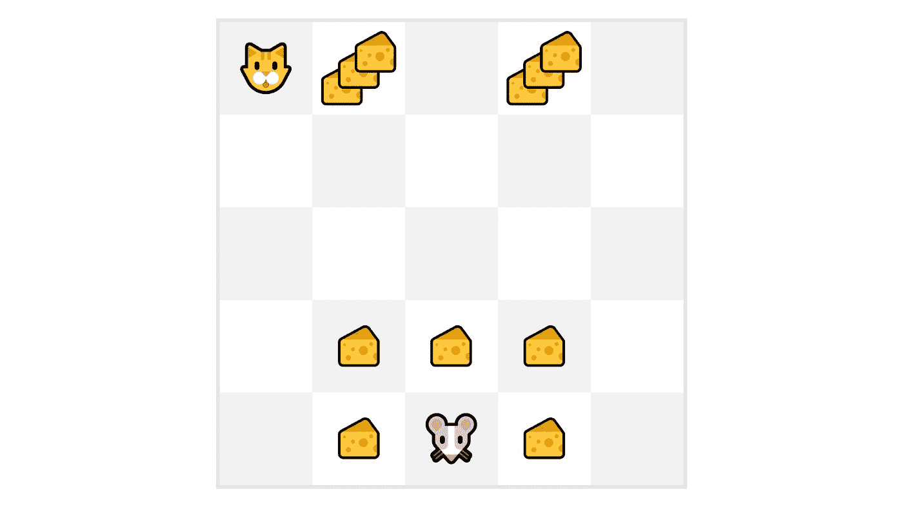

正如我们在图表中看到的，**吃掉我们附近的奶酪比吃掉靠近猫的奶酪更有可能**（我们离猫越近，越危险）。

因此，**即使猫附近的奖励更大（更多奶酪），也会更折扣**，因为我们并不确定我们能否吃到它。

为了折扣奖励，我们按照以下方式进行：

1.  我们定义了一个称为伽玛的折扣率。**它必须介于 0 和 1 之间。** 大多数情况下介于**0.95 和 0.99**之间。

+   伽玛越大，折扣越小。这意味着我们的代理**更关心长期奖励。**

+   另一方面，伽玛越小，折扣越大。这意味着我们的**代理更关心短期奖励（最近的奶酪）。**

2. 然后，每个奖励将按时间步长的伽玛指数进行折扣。随着时间步长的增加，猫离我们越来越近，**因此未来奖励发生的可能性越来越小。**

我们折扣后的预期累积奖励是：

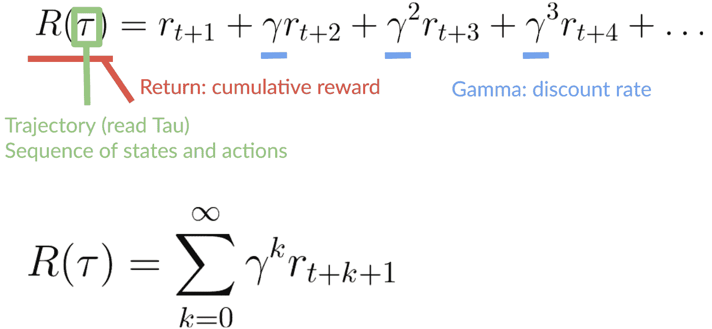
