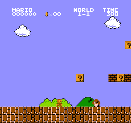
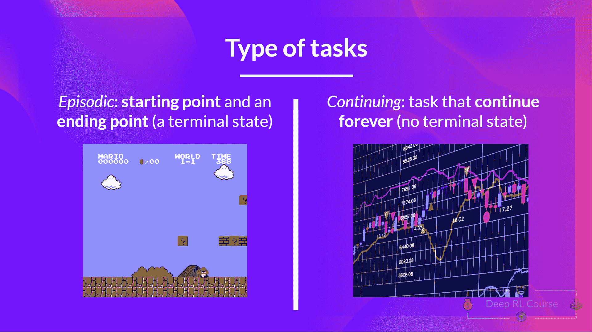

# 任务类型

> 原文链接：[`huggingface.co/learn/deep-rl-course/unit1/tasks`](https://huggingface.co/learn/deep-rl-course/unit1/tasks)

任务是强化学习问题的一个**实例**。我们可以有两种类型的任务：**情节性**和**持续性**。

## 情节性任务

在这种情况下，我们有一个起始点和一个结束点（**终止状态**）。这创建了一个情节：一系列状态、行动、奖励和新状态。

例如，想想超级马里奥兄弟：一个情节从新的马里奥关卡开始，直到**你被杀死或到达关卡的结尾为止。**

开始一个新的情节。

## 继续任务

这些是永远持续的任务（**没有终止状态**）。在这种情况下，代理必须**学会如何选择最佳行动，并同时与环境互动。**

例如，一个进行自动股票交易的代理。对于这个任务，没有起始点和终止状态。**代理会一直运行，直到我们决定停止它。**

回顾一下：

