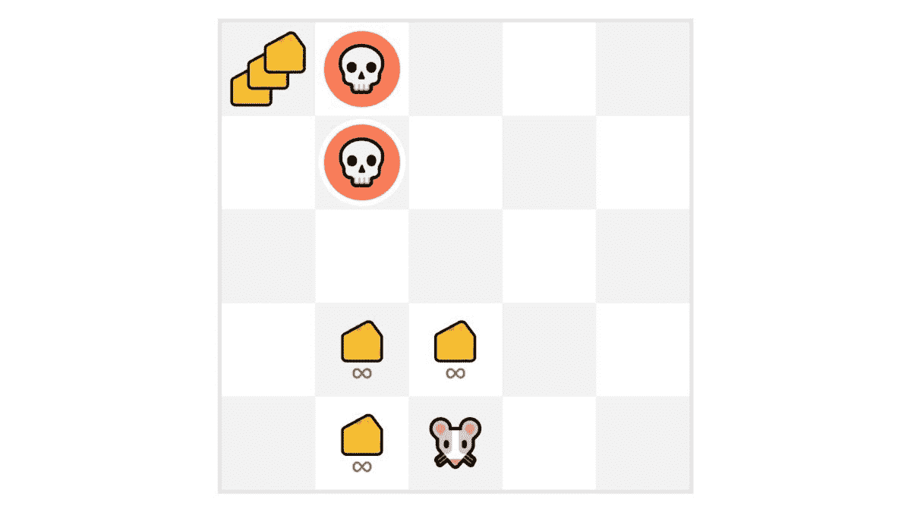
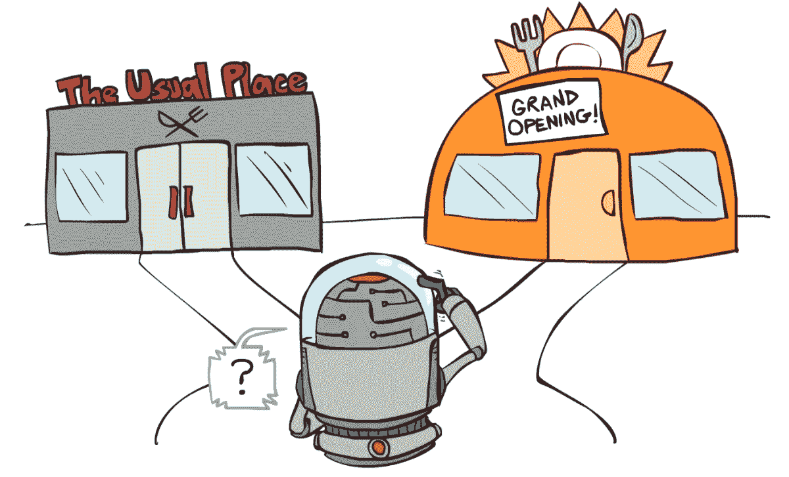
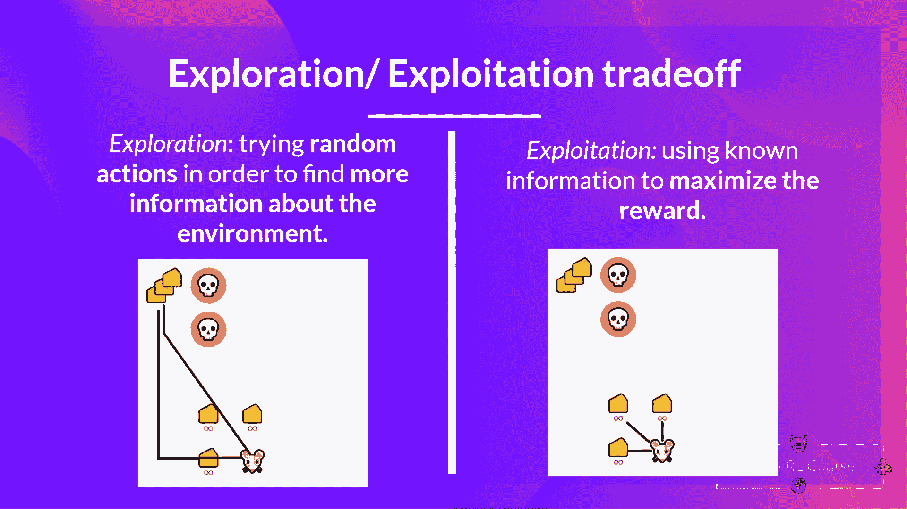

# 探索/剥削权衡

> 原文：[`huggingface.co/learn/deep-rl-course/unit1/exp-exp-tradeoff`](https://huggingface.co/learn/deep-rl-course/unit1/exp-exp-tradeoff)

最后，在看不同解决强化学习问题的方法之前，我们必须涵盖一个非常重要的主题：*探索/剥削权衡。*

+   *探索*是通过尝试随机行动来探索环境，以便**了解更多关于环境的信息。**

+   *剥削*是**利用已知信息来最大化奖励。**

记住，我们的 RL 代理的目标是最大化预期的累积奖励。然而，**我们可能会陷入一个常见的陷阱**。

让我们举个例子：

在这个游戏中，我们的老鼠可以有**无限数量的小奶酪**（每个+1）。但在迷宫的顶部，有一大笔奶酪（+1000）。

然而，如果我们只关注剥削，我们的代理永远不会达到巨大的奶酪总量。相反，它只会剥削**最近的奖励来源**，即使这个来源很小（剥削）。

但是如果我们的代理稍微探索一下，它可以**发现巨大的奖励**（一堆大奶酪）。

这就是我们所说的探索/剥削权衡。我们需要平衡我们**探索环境的程度**和我们**利用我们对环境的了解的程度。**

因此，我们必须**制定一个规则来处理这种权衡**。我们将在未来的单元中看到处理它的不同方法。

如果仍然感到困惑，**想想一个真实的问题：选择餐馆：**

来源：[伯克利人工智能课程](https://inst.eecs.berkeley.edu/~cs188/sp20/assets/lecture/lec15_6up.pdf)

+   *剥削*：你每天去同一个你知道好的餐馆，**冒着错过另一个更好的餐馆的风险。**

+   *探索*：尝试你以前从未去过的餐馆，冒着有不好的经历的风险**但可能会有一个奇妙的经历的机会。**

回顾一下：

