# 解决强化学习问题的两种主要方法

> 原文链接：[`huggingface.co/learn/deep-rl-course/unit1/two-methods`](https://huggingface.co/learn/deep-rl-course/unit1/two-methods)

现在我们已经学习了 RL 框架，我们如何解决 RL 问题？

换句话说，我们如何构建一个能够**选择最大化预期累积奖励的动作**的 RL 代理程序？

## 策略π：代理程序的大脑

策略**π**是我们代理程序的**大脑**，它是告诉我们在给定状态下应该采取什么**动作的函数**。因此，它**定义了代理程序在特定时间的行为**。

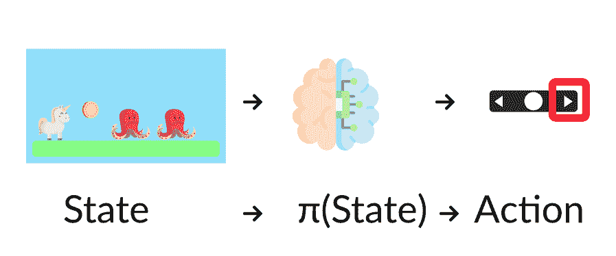

将策略视为我们代理程序的大脑，这个函数将告诉我们在给定状态下应该采取的动作

这个策略**是我们想要学习的函数**，我们的目标是找到最优策略π*，当代理程序根据它行动时**最大化预期回报**的策略。我们通过训练找到这个π*。

有两种方法来训练我们的代理程序找到这个最优策略π*：

+   **基于策略的方法**，通过教导代理程序学习在当前状态下应该采取哪个动作。

+   间接地，**教导代理程序学习哪个状态更有价值**，然后采取**导致更有价值状态的动作**：基于值的方法。

## 基于策略的方法

在基于策略的方法中，**我们直接学习一个策略函数**。

这个函数将为每个状态定义一个映射到最佳对应动作的映射。或者，它可以定义**在该状态时可能动作集合的概率分布**。

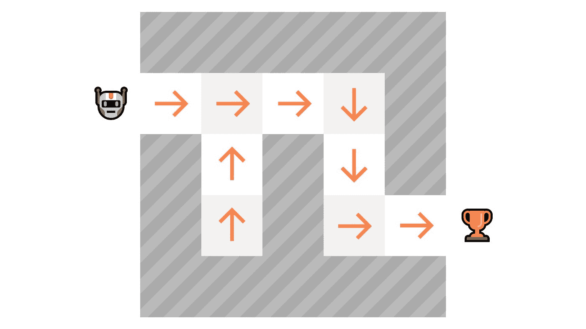

正如我们在这里看到的，策略（确定性）**直接指示每一步应该采取的动作**。

我们有两种类型的策略：

+   *确定性*：在给定状态下，策略**总是返回相同的动作**。

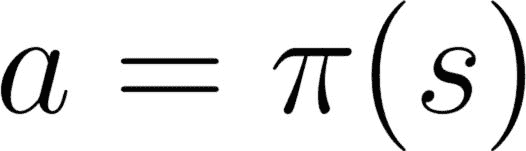

动作 = 策略(状态)

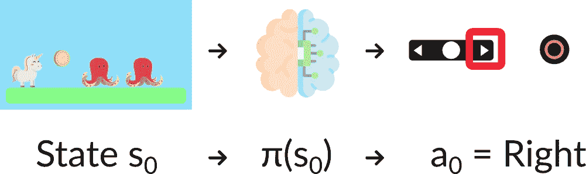

+   *随机*：输出**动作的概率分布**。

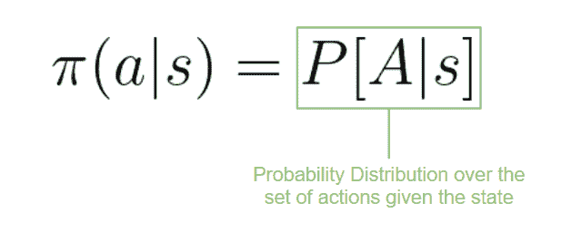

策略(动作 | 状态) = 给定当前状态时动作集合的概率分布

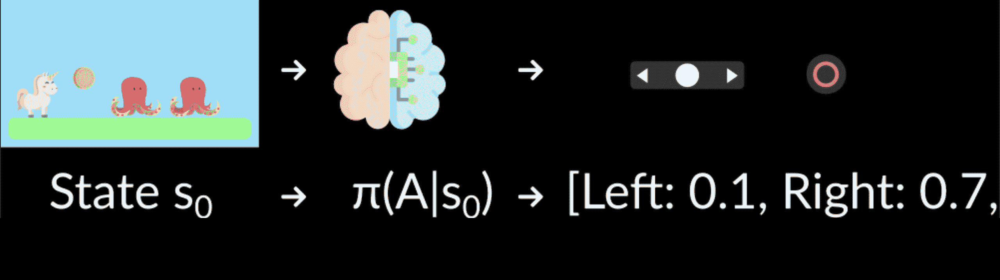

给定一个初始状态，我们的随机策略将输出该状态可能动作的概率分布。

如果我们回顾一下：

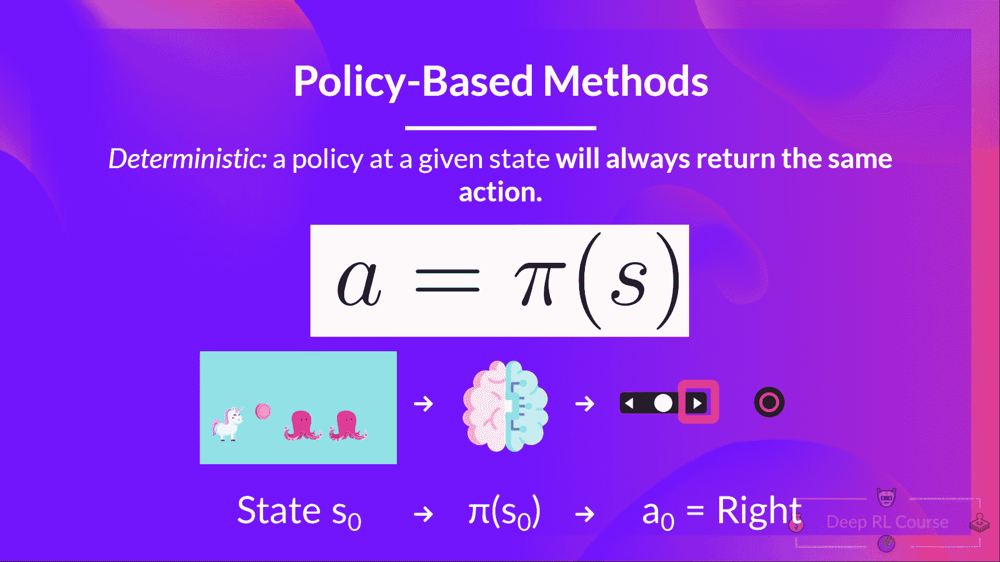 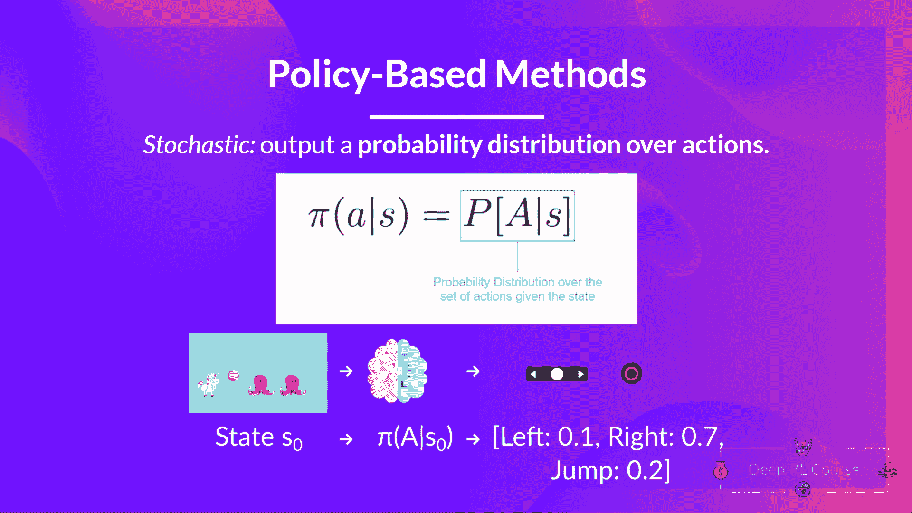

## 基于值的方法

在基于值的方法中，**我们不是学习一个策略函数，而是学习一个值函数**，它将一个状态映射到**在该状态时的预期值**。

一个状态的值是**代理程序在该状态开始，然后根据我们的策略行动时可以获得的预期折扣回报**。

“根据我们的策略行动”只是意味着我们的策略是**“去到具有最高价值的状态”。**

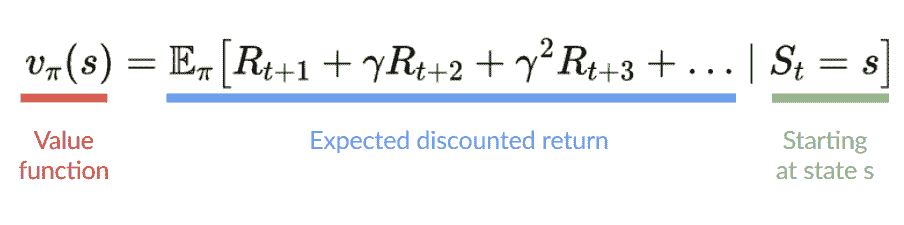

在这里我们看到我们的值函数**为每个可能的状态定义了值**。

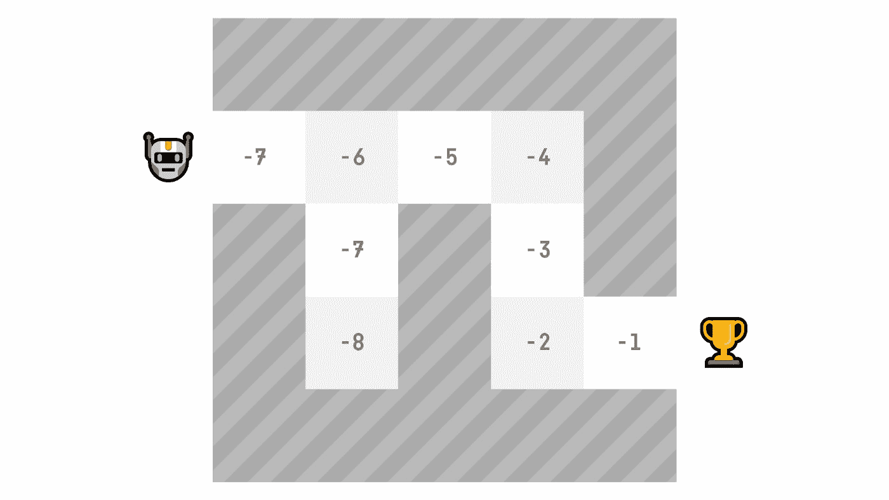

由于我们的值函数，在每一步，我们的策略将选择值函数定义的最大值的状态：-7，然后-6，然后-5（以此类推）以达到目标。

由于我们的值函数，在每一步，我们的策略将选择值函数定义的最大值的状态：-7，然后-6，然后-5（以此类推）以达到目标。

如果我们回顾一下：

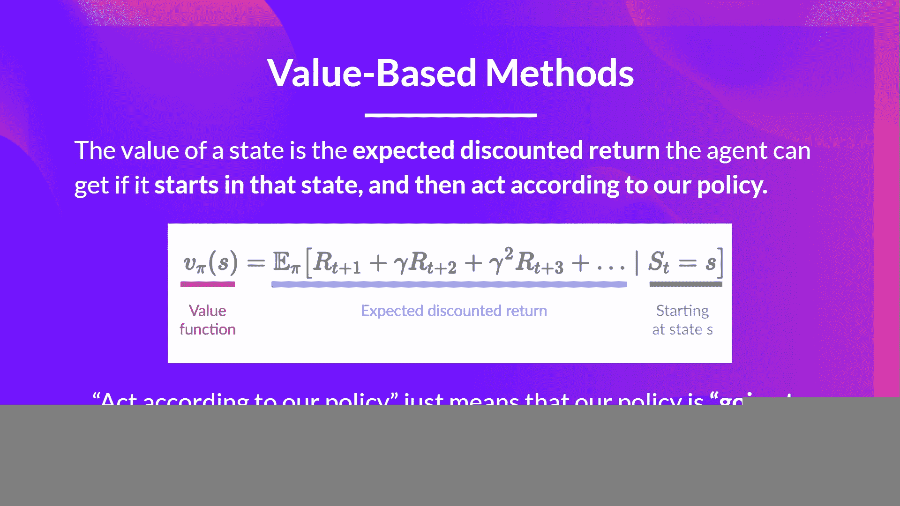 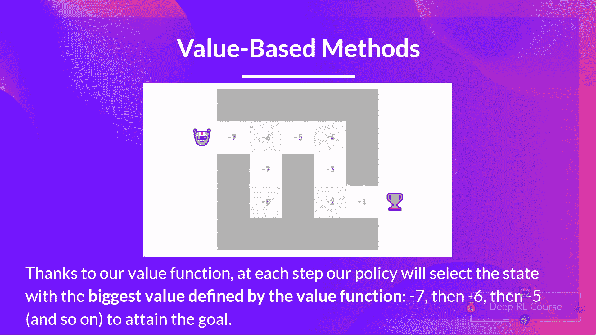
