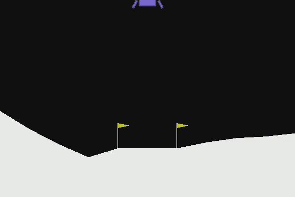
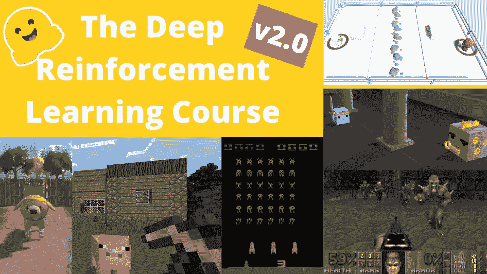
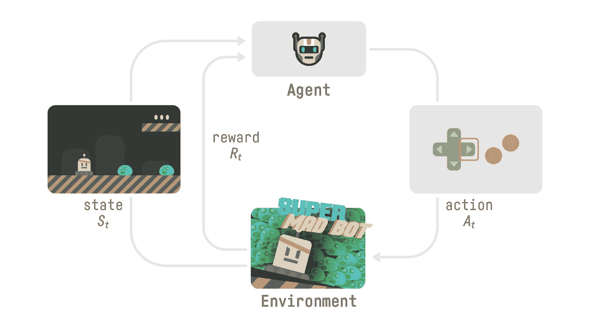
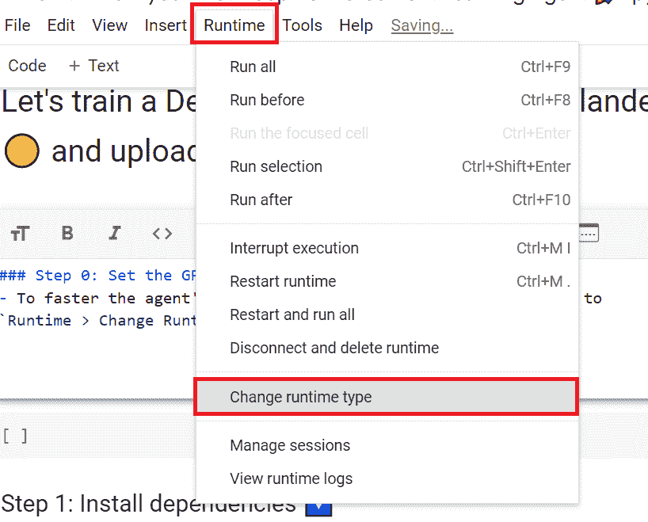
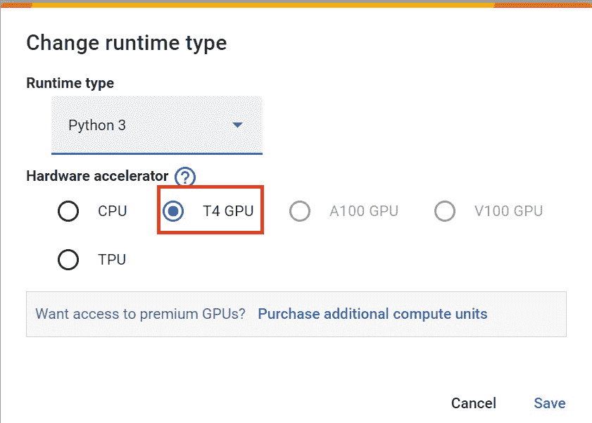
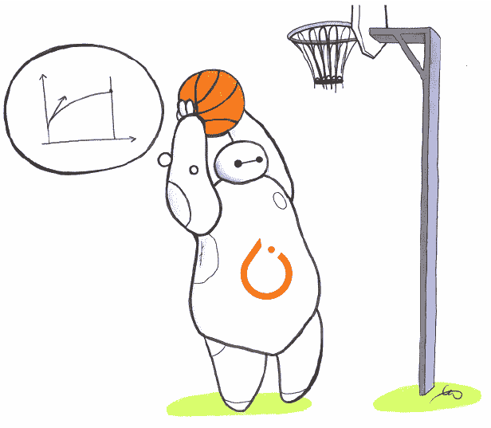
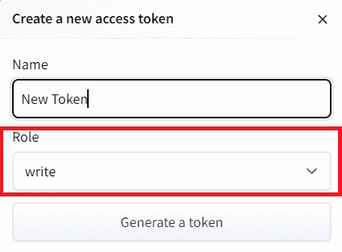
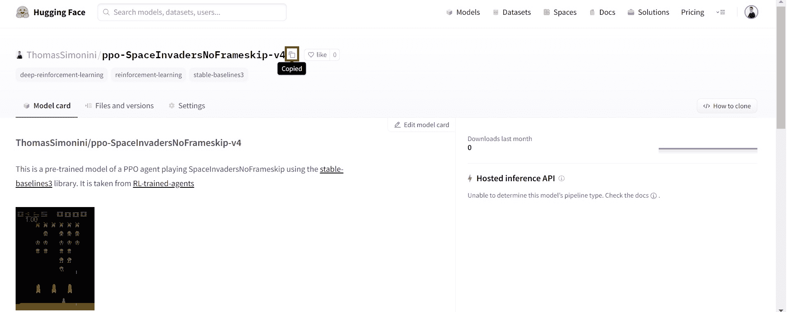
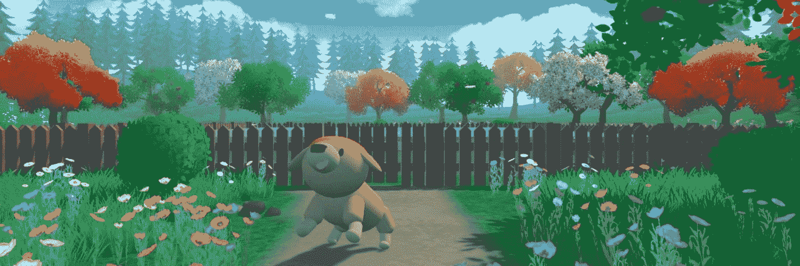

# 训练你的第一个深度强化学习代理🤖

> 原文链接：[`huggingface.co/learn/deep-rl-course/unit1/hands-on`](https://huggingface.co/learn/deep-rl-course/unit1/hands-on)

 

现在你已经学习了强化学习的基础知识，你可以开始训练你的第一个代理，并通过 Hub 与社区分享🔥：一个月球着陆器代理，将学会正确着陆在月球上🌕



最后，你将**上传这个训练好的代理到 Hugging Face Hub 🤗，这是一个免费、开放的平台，人们可以在这里分享机器学习模型、数据集和演示。**

感谢我们的[排行榜](https://huggingface.co/spaces/huggingface-projects/Deep-Reinforcement-Learning-Leaderboard)，你将能够与其他同学比较你的结果，并交流最佳实践，以提高你的代理分数。谁将赢得 Unit 1 的挑战🏆？

为了验证这个[认证流程](https://huggingface.co/deep-rl-course/en/unit0/introduction#certification-process)的实践性，你需要将训练好的模型推送到 Hub，并**获得>=200 的结果**。

要找到你的结果，去[排行榜](https://huggingface.co/spaces/huggingface-projects/Deep-Reinforcement-Learning-Leaderboard)找到你的模型，**结果=平均奖励-奖励的标准差**

**如果找不到你的模型，请转到页面底部并点击刷新按钮。**

有关认证流程的更多信息，请查看此部分👉[`huggingface.co/deep-rl-course/en/unit0/introduction#certification-process`](https://huggingface.co/deep-rl-course/en/unit0/introduction#certification-process)

你可以在这里检查你的进度👉[`huggingface.co/spaces/ThomasSimonini/Check-my-progress-Deep-RL-Course`](https://huggingface.co/spaces/ThomasSimonini/Check-my-progress-Deep-RL-Course)

让我们开始吧！🚀

**要开始实践，请点击“在 Colab 中打开”按钮**👇：


我们强烈建议学生使用 Google Colab 进行实践练习，而不是在个人电脑上运行。

通过使用 Google Colab，**你可以专注于学习和实验，而不必担心设置环境的技术细节**。

# Unit 1：训练你的第一个深度强化学习代理🤖


在这个笔记本中，你将训练你的**第一个深度强化学习代理**，一个月球着陆器代理，将学会**在月球上正确着陆🌕**。使用[Stable-Baselines3](https://stable-baselines3.readthedocs.io/en/master/)这个深度强化学习库，与社区分享，并尝试不同的配置

### 环境🎮

+   [LunarLander-v2](https://gymnasium.farama.org/environments/box2d/lunar_lander/)

### 使用的库📚

+   [Stable-Baselines3](https://stable-baselines3.readthedocs.io/en/master/)

我们不断努力改进我们的教程，所以**如果你在这个笔记本中发现了一些问题**，请在 Github Repo 上[提出问题](https://github.com/huggingface/deep-rl-class/issues)。

## 本笔记本的目标🏆

在笔记本的结尾，你将：

+   能够使用**Gymnasium**，这是一个环境库。

+   能够使用**Stable-Baselines3**，这是一个深度强化学习库。

+   能够**将训练好的代理推送到 Hub**，并附上一个漂亮的视频回放和一个评估分数🔥。

## 这个笔记本来自深度强化学习课程



在这门免费课程中，您将：

+   📖 理论和实践上学习深度强化学习。

+   🧑‍💻 学习使用著名的深度 RL 库，如 Stable Baselines3、RL Baselines3 Zoo、CleanRL 和 Sample Factory 2.0。

+   🤖 在独特环境中**训练代理**

+   🎓 通过完成 80%的作业**获得完成证书**。

以及更多！

查看📚课程大纲👉[`simoninithomas.github.io/deep-rl-course`](https://simoninithomas.github.io/deep-rl-course)

不要忘记**[注册课程](http://eepurl.com/ic5ZUD)**（我们正在收集您的电子邮件以便**在每个单元发布时向您发送链接并提供有关挑战和更新的信息）**。

保持联系并提问的最佳方式是**加入我们的 discord 服务器**与社区和我们交流👉🏻[`discord.gg/ydHrjt3WP5`](https://discord.gg/ydHrjt3WP5)

## 先决条件🏗️

在深入笔记本之前，您需要：

🔲📝 通过[阅读第 0 单元](https://huggingface.co/deep-rl-course/unit0/introduction) **获取有关课程的所有信息并帮助您入门**🤗

🔲📚 通过[阅读第 1 单元](https://huggingface.co/deep-rl-course/unit1/introduction) **了解强化学习基础**（MC、TD、奖励假设...）。

## 深度强化学习的小结📚



让我们简要回顾一下我们在第一个单元学到的内容：

+   强化学习是一种**从行动中学习的计算方法**。我们构建一个代理，通过**通过试错与环境互动**并接收奖励（负面或正面）作为反馈来学习。

+   任何 RL 代理的目标是**最大化其预期累积奖励**（也称为预期回报），因为 RL 基于*奖励假设*，即所有目标都可以描述为最大化预期累积奖励。

+   RL 过程是一个**输出状态、动作、奖励和下一个状态序列的循环**。

+   为了计算预期累积奖励（预期回报），**我们折扣奖励**：越早获得的奖励（在游戏开始时）更有可能发生，因为它们比长期未来奖励更可预测。

+   要解决 RL 问题，您希望**找到一个最优策略**；策略是您的 AI 的“大脑”，将告诉我们在给定状态下应该采取什么行动。最佳策略是使您的行动最大化预期回报的策略。

有**两种**方法可以找到您的最优策略：

+   通过**直接训练您的策略**：基于策略的方法。

+   通过**训练一个值函数**告诉我们代理在每个状态将获得的预期回报，并使用此函数定义我们的策略：基于价值的方法。

+   最后，我们谈到了深度 RL，因为**我们引入了深度神经网络来估计要采取的行动（基于策略）或估计状态的价值（基于价值），因此得名“深度”。**

# 让我们训练我们的第一个深度强化学习代理并将其上传到 Hub🚀

## 获得证书🎓

为了验证这一点，进行[认证流程](https://huggingface.co/deep-rl-course/en/unit0/introduction#certification-process)，您需要将训练好的模型推送到 Hub 并**获得>=200 的结果**。

要找到您的结果，请转到[排行榜](https://huggingface.co/spaces/huggingface-projects/Deep-Reinforcement-Learning-Leaderboard)并找到您的模型，**结果=平均奖励-奖励的标准差**

有关认证流程的更多信息，请查看此部分👉[`huggingface.co/deep-rl-course/en/unit0/introduction#certification-process`](https://huggingface.co/deep-rl-course/en/unit0/introduction#certification-process)

## 设置 GPU💪

+   为了**加速代理的训练，我们将使用 GPU**。要做到这一点，转到`运行时 > 更改运行时类型`



+   硬件加速器 > GPU



## 安装依赖并创建虚拟屏幕🔽

第一步是安装依赖项，我们将安装多个。

+   `gymnasium[box2d]`：包含 LunarLander-v2 环境🌛

+   `stable-baselines3[extra]`：深度强化学习库。

+   `huggingface_sb3`：用于 Stable-baselines3 加载和上传模型的额外代码来自 Hugging Face 🤗 Hub。

为了简化事情，我们创建了一个脚本来安装所有这些依赖项。

```py
apt install swig cmake
```

```py
pip install -r https://raw.githubusercontent.com/huggingface/deep-rl-class/main/notebooks/unit1/requirements-unit1.txt
```

在笔记本中，我们需要生成一个重播视频。为此，在 colab 中，**我们需要有一个虚拟屏幕来渲染环境**（从而记录帧）。

因此，接下来的单元格将安装虚拟屏幕库并创建和运行虚拟屏幕🖥

```py
sudo apt-get update
apt install python-opengl
apt install ffmpeg
apt install xvfb
pip3 install pyvirtualdisplay
```

为了确保新安装的库被使用，**有时需要重新启动笔记本运行时**。下一个单元格将强制**运行时崩溃，因此您需要重新连接并从这里开始运行代码**。通过这个技巧，**我们将能够运行我们的虚拟屏幕**。

```py
import os

os.kill(os.getpid(), 9)
```

```py
# Virtual display
from pyvirtualdisplay import Display

virtual_display = Display(visible=0, size=(1400, 900))
virtual_display.start()
```

## 导入包📦

我们导入的另一个库是 huggingface_hub **以便能够从 hub 上传和下载训练好的模型**。

Hugging Face Hub 🤗 作为一个中心地方，任何人都可以分享和探索模型和数据集。它具有版本控制、指标、可视化和其他功能，让您可以轻松与他人合作。

您可以在这里看到所有可用的深度强化学习模型👉[`huggingface.co/models?pipeline_tag=reinforcement-learning&sort=downloads`](https://huggingface.co/models?pipeline_tag=reinforcement-learning&sort=downloads)

```py
import gymnasium

from huggingface_sb3 import load_from_hub, package_to_hub
from huggingface_hub import (
    notebook_login,
)  # To log to our Hugging Face account to be able to upload models to the Hub.

from stable_baselines3 import PPO
from stable_baselines3.common.env_util import make_vec_env
from stable_baselines3.common.evaluation import evaluate_policy
from stable_baselines3.common.monitor import Monitor
```

## 了解 Gymnasium 及其工作原理🤖

🏋 包含我们环境的库称为 Gymnasium。**在深度强化学习中，您将经常使用 Gymnasium。**

Gymnasium 是由 Farama Foundation 维护的 Gym 库的**新版本**（https://farama.org/）。

Gymnasium 库提供两个东西：

+   一个允许您**创建 RL 环境**的接口。

+   一组环境（gym-control、atari、box2D...）。

让我们看一个例子，但首先让我们回顾一下 RL 循环。

![RL 过程

在每一步：

+   我们的代理从**环境**接收一个**状态（S0）**——我们接收到游戏的第一帧（环境）。

+   基于那个**状态（S0）**，代理采取一个**动作（A0）**——我们的代理将向右移动。

+   环境转换到一个**新的状态（S1）**——新的帧。

+   环境给代理一些**奖励（R1）**——我们还没有死亡*(正奖励 +1)*。

使用 Gymnasium：

1️⃣ 我们使用 `gymnasium.make()` 创建我们的环境

2️⃣ 我们使用 `observation = env.reset()` 将环境重置为初始状态

在每一步：

3️⃣ 使用我们的模型获取一个动作（在我们的示例中我们执行一个随机动作）

4️⃣ 使用 `env.step(action)`，我们在环境中执行此动作并获取

+   `observation`：新状态（st+1）

+   `reward`：执行动作后我们获得的奖励

+   `terminated`：指示剧集是否终止（代理到达终止状态）

+   `truncated`：在这个新版本中引入，它指示一个时间限制或者如果代理超出环境的边界。

+   `info`：提供额外信息的字典（取决于环境）。

有关更多解释，请查看此链接👉[`gymnasium.farama.org/api/env/#gymnasium.Env.step`](https://gymnasium.farama.org/api/env/#gymnasium.Env.step)

如果剧集终止：

+   我们使用 `observation = env.reset()` 将环境重置为初始状态

**让我们看一个例子！** 确保阅读代码

```py
import gymnasium as gym

# First, we create our environment called LunarLander-v2
env = gym.make("LunarLander-v2")

# Then we reset this environment
observation, info = env.reset()

for _ in range(20):
    # Take a random action
    action = env.action_space.sample()
    print("Action taken:", action)

    # Do this action in the environment and get
    # next_state, reward, terminated, truncated and info
    observation, reward, terminated, truncated, info = env.step(action)

    # If the game is terminated (in our case we land, crashed) or truncated (timeout)
    if terminated or truncated:
        # Reset the environment
        print("Environment is reset")
        observation, info = env.reset()

env.close()
```

## 创建 LunarLander 环境🌛并了解其工作原理

### 环境🎮

在这个第一个教程中，我们将训练我们的代理，一个[月球着陆器](https://gymnasium.farama.org/environments/box2d/lunar_lander/)，**正确着陆在月球上**。为了做到这一点，代理需要学会**调整其速度和位置（水平、垂直和角度）以正确着陆**。

* * *

💡 当您开始使用一个环境时，一个好习惯是检查其文档

👉 [`gymnasium.farama.org/environments/box2d/lunar_lander/`](https://gymnasium.farama.org/environments/box2d/lunar_lander/)

* * *

让我们看看环境是什么样子的：

```py
# We create our environment with gym.make("<name_of_the_environment>")
env = gym.make("LunarLander-v2")
env.reset()
print("_____OBSERVATION SPACE_____ \n")
print("Observation Space Shape", env.observation_space.shape)
print("Sample observation", env.observation_space.sample())  # Get a random observation
```

我们看到`观察空间形状（8，）`，观察是一个大小为 8 的向量，其中每个值包含有关着陆器的不同信息：

+   水平着陆垫坐标（x）

+   垂直着陆垫坐标（y）

+   水平速度（x）

+   垂直速度（y）

+   角度

+   角速度

+   如果左腿接触点接触到地面（布尔值）

+   如果右腿接触点接触到地面（布尔值）

```py
print("\n _____ACTION SPACE_____ \n")
print("Action Space Shape", env.action_space.n)
print("Action Space Sample", env.action_space.sample())  # Take a random action
```

动作空间（代理可以采取的可能动作集）是离散的，有 4 个可用动作🎮：

+   动作 0：不执行任何操作，

+   动作 1：启动左定向引擎，

+   动作 2：启动主引擎，

+   动作 3：启动右定向引擎。

奖励函数（在每个时间步骤给出奖励的函数）💰：

每一步之后都会获得奖励。一集的总奖励是**该集中所有步骤的奖励之和**。

每一步的奖励：

+   当着陆器接近/远离着陆垫时，增加/减少。

+   当着陆器移动得更慢/更快时，增加/减少。

+   当着陆器倾斜时（非水平角度），减少。

+   每个接触地面的腿增加 10 分。

+   当侧向引擎启动时，每帧减少 0.03 点。

+   当主引擎启动时，每帧减少 0.3 点。

每一集会因坠毁或安全着陆而获得额外的-100 或+100 分奖励。

一集被认为是一个解决方案，如果得分至少为 200 分。

#### 矢量化环境

+   我们创建了一个矢量化环境（一种将多个独立环境堆叠到单个环境中的方法）包含 16 个环境，这样，**我们在训练过程中将有更多不同的体验**。

```py
# Create the environment
env = make_vec_env("LunarLander-v2", n_envs=16)
```

## 创建模型🤖

+   我们已经研究了我们的环境并理解了问题：**通过控制左、右和主定向引擎，能够将月球着陆器正确着陆到着陆垫上**。现在让我们构建我们将用来解决这个问题的算法 🚀。

+   为了做到这一点，我们将使用我们的第一个深度强化学习库，[稳定基线 3（SB3）](https://stable-baselines3.readthedocs.io/en/master/)。

+   SB3 是 PyTorch 中**可靠的强化学习算法实现集合**。

* * *

💡 当使用新库时，一个好习惯是首先深入研究文档：[`stable-baselines3.readthedocs.io/en/master/`](https://stable-baselines3.readthedocs.io/en/master/)，然后尝试一些教程。

* * *



为了解决这个问题，我们将使用 SB3 **PPO**。[PPO（即 Proximal Policy Optimization）是一种最先进的深度强化学习算法，您将在本课程中学习到](https://stable-baselines3.readthedocs.io/en/master/modules/ppo.html#example%5D)。

PPO 是以下内容的组合：

+   *基于价值的强化学习方法*：学习一个动作-价值函数，该函数将告诉我们**在给定状态和动作的情况下采取的最有价值的动作**。

+   *基于策略的强化学习方法*：学习一个将**为我们提供动作的概率分布**的策略。

稳定基线 3 很容易设置：

1️⃣ 您**创建您的环境**（在我们的案例中已经完成）

2️⃣ 您定义您想要使用的**模型并实例化此模型** `model = PPO("MlpPolicy")`

3️⃣ 您**训练代理**使用 `model.learn` 并定义训练步数

```py
# Create environment
env = gym.make('LunarLander-v2')

# Instantiate the agent
model = PPO('MlpPolicy', env, verbose=1)
# Train the agent
model.learn(total_timesteps=int(2e5))
```

```py
# TODO: Define a PPO MlpPolicy architecture
# We use MultiLayerPerceptron (MLPPolicy) because the input is a vector,
# if we had frames as input we would use CnnPolicy
model =
```

#### 解决方案

```py
# SOLUTION
# We added some parameters to accelerate the training
model = PPO(
    policy="MlpPolicy",
    env=env,
    n_steps=1024,
    batch_size=64,
    n_epochs=4,
    gamma=0.999,
    gae_lambda=0.98,
    ent_coef=0.01,
    verbose=1,
)
```

## 训练 PPO 代理 🏃

+   让我们为我们的代理训练 1,000,000 个时间步，不要忘记在 Colab 上使用 GPU。这将大约需要~20 分钟，但如果您只想尝试一下，您可以使用更少的时间步数。

+   在训练期间，休息一下，您值得拥有 🤗

```py
# TODO: Train it for 1,000,000 timesteps

# TODO: Specify file name for model and save the model to file
model_name = "ppo-LunarLander-v2"
```

#### 解决方案

```py
# SOLUTION
# Train it for 1,000,000 timesteps
model.learn(total_timesteps=1000000)
# Save the model
model_name = "ppo-LunarLander-v2"
model.save(model_name)
```

## 评估代理 📈

+   记得将环境包装在[监视器](https://stable-baselines3.readthedocs.io/en/master/common/monitor.html)中。

+   现在我们的月球着陆器代理已经训练好了 🚀，我们需要**检查其性能**。

+   Stable-Baselines3 提供了一个方法来做到这一点：`evaluate_policy`。

+   要填写该部分，您需要[查看文档](https://stable-baselines3.readthedocs.io/en/master/guide/examples.html#basic-usage-training-saving-loading)

+   在下一步中，我们将看到**如何自动评估和分享您的代理以参加排行榜比赛，但现在让我们自己来做**

💡 当您评估您的代理时，您不应该使用训练环境，而是创建一个评估环境。

```py
# TODO: Evaluate the agent
# Create a new environment for evaluation
eval_env =

# Evaluate the model with 10 evaluation episodes and deterministic=True
mean_reward, std_reward = 

# Print the results
```

#### 解决方案

```py
# @title
eval_env = Monitor(gym.make("LunarLander-v2"))
mean_reward, std_reward = evaluate_policy(model, eval_env, n_eval_episodes=10, deterministic=True)
print(f"mean_reward={mean_reward:.2f} +/- {std_reward}")
```

+   在我的情况下，训练 1 百万步后，我得到的平均奖励是`200.20 +/- 20.80`，这意味着我们的月球着陆器代理已经准备好在月球上着陆 🌛🥳。

## 在 Hub 上发布我们训练好的模型 🔥

现在我们看到在训练后取得了良好的结果，我们可以用一行代码将我们训练好的模型发布到 hub 🤗。

📚 库的文档 👉 [`github.com/huggingface/huggingface_sb3/tree/main#hugging-face—x-stable-baselines3-v20`](https://github.com/huggingface/huggingface_sb3/tree/main#hugging-face--x-stable-baselines3-v20)

这是一个模型卡的示例（带有太空侵略者）：

通过使用`package_to_hub` **您可以评估、记录回放、生成代理的模型卡并将其推送到 hub**。

这样：

+   您可以**展示我们的工作** 🔥

+   您可以**可视化您的代理进行游戏** 👀

+   您可以**与社区分享其他人可以使用的代理** 💾

+   您可以**访问排行榜 🏆 查看您的代理相对于同学表现如何** 👉 [`huggingface.co/spaces/huggingface-projects/Deep-Reinforcement-Learning-Leaderboard`](https://huggingface.co/spaces/huggingface-projects/Deep-Reinforcement-Learning-Leaderboard)

为了能够与社区分享您的模型，还有三个步骤要遵循：

1️⃣ (如果还没有) 在 Hugging Face 上创建一个帐户 ➡ [`huggingface.co/join`](https://huggingface.co/join)

2️⃣ 登录，然后，您需要从 Hugging Face 网站存储您的身份验证令牌。

+   创建一个新的令牌([`huggingface.co/settings/tokens`](https://huggingface.co/settings/tokens)) **具有写入权限**



+   复制令牌

+   运行下面的单元格并粘贴令牌

```py
notebook_login()
!git config --global credential.helper store
```

如果您不想使用 Google Colab 或 Jupyter Notebook，您需要使用这个命令：`huggingface-cli login`

3️⃣ 现在我们准备使用`package_to_hub()`函数将我们训练好的代理推送到🤗 Hub 🔥

让我们填写`package_to_hub`函数：

+   `model`：我们训练好的模型。

+   `model_name`：我们在`model_save`中定义的训练模型的名称

+   `model_architecture`：我们使用的模型架构，在我们的案例中是 PPO

+   `env_id`：环境的名称，在我们的案例中是`LunarLander-v2`

+   `eval_env`：在 eval_env 中定义的评估环境

+   `repo_id`：将要创建/更新的 Hugging Face Hub 存储库的名称`(repo_id = {username}/{repo_name})`

💡 **一个好的名称是`{username}/{model_architecture}-{env_id}`**

+   `commit_message`：提交的消息

```py
import gymnasium as gym
from stable_baselines3.common.vec_env import DummyVecEnv
from stable_baselines3.common.env_util import make_vec_env

from huggingface_sb3 import package_to_hub

## TODO: Define a repo_id
## repo_id is the id of the model repository from the Hugging Face Hub (repo_id = {organization}/{repo_name} for instance ThomasSimonini/ppo-LunarLander-v2
repo_id = 

# TODO: Define the name of the environment
env_id = 

# Create the evaluation env and set the render_mode="rgb_array"
eval_env = DummyVecEnv([lambda: gym.make(env_id, render_mode="rgb_array")])

# TODO: Define the model architecture we used
model_architecture = ""

## TODO: Define the commit message
commit_message = ""

# method save, evaluate, generate a model card and record a replay video of your agent before pushing the repo to the hub
package_to_hub(model=model, # Our trained model
               model_name=model_name, # The name of our trained model 
               model_architecture=model_architecture, # The model architecture we used: in our case PPO
               env_id=env_id, # Name of the environment
               eval_env=eval_env, # Evaluation Environment
               repo_id=repo_id, # id of the model repository from the Hugging Face Hub (repo_id = {organization}/{repo_name} for instance ThomasSimonini/ppo-LunarLander-v2
               commit_message=commit_message)
```

#### 解决方案

```py
import gymnasium as gym

from stable_baselines3 import PPO
from stable_baselines3.common.vec_env import DummyVecEnv
from stable_baselines3.common.env_util import make_vec_env

from huggingface_sb3 import package_to_hub

# PLACE the variables you've just defined two cells above
# Define the name of the environment
env_id = "LunarLander-v2"

# TODO: Define the model architecture we used
model_architecture = "PPO"

## Define a repo_id
## repo_id is the id of the model repository from the Hugging Face Hub (repo_id = {organization}/{repo_name} for instance ThomasSimonini/ppo-LunarLander-v2
## CHANGE WITH YOUR REPO ID
repo_id = "ThomasSimonini/ppo-LunarLander-v2"  # Change with your repo id, you can't push with mine 😄

## Define the commit message
commit_message = "Upload PPO LunarLander-v2 trained agent"

# Create the evaluation env and set the render_mode="rgb_array"
eval_env = DummyVecEnv([lambda: Monitor(gym.make(env_id, render_mode="rgb_array"))])

# PLACE the package_to_hub function you've just filled here
package_to_hub(
    model=model,  # Our trained model
    model_name=model_name,  # The name of our trained model
    model_architecture=model_architecture,  # The model architecture we used: in our case PPO
    env_id=env_id,  # Name of the environment
    eval_env=eval_env,  # Evaluation Environment
    repo_id=repo_id,  # id of the model repository from the Hugging Face Hub (repo_id = {organization}/{repo_name} for instance ThomasSimonini/ppo-LunarLander-v2
    commit_message=commit_message,
)
```

恭喜 🥳 您刚刚训练并上传了您的第一个深度强化学习代理。上面的脚本应该显示了一个指向模型存储库的链接，例如[`huggingface.co/osanseviero/test_sb3`](https://huggingface.co/osanseviero/test_sb3)。当您访问此链接时，您可以：

+   在右侧查看代理的视频预览。

+   点击“文件和版本”以查看存储库中的所有文件。

+   点击“在 stable-baselines3 中使用”以获取显示如何加载模型的代码片段。

+   一个模型卡片（`README.md`文件），其中描述了模型

在幕后，Hub 使用基于 git 的存储库（如果你不知道 git 是什么，不用担心），这意味着你可以在实验和改进代理时更新模型的新版本。

使用排行榜比较你的 LunarLander-v2 的结果与你的同学🏆👉[`huggingface.co/spaces/huggingface-projects/Deep-Reinforcement-Learning-Leaderboard`](https://huggingface.co/spaces/huggingface-projects/Deep-Reinforcement-Learning-Leaderboard)

## 从 Hub 加载保存的 LunarLander 模型🤗

感谢[ironbar](https://github.com/ironbar)的贡献。

从 Hub 加载保存的模型非常容易。

你可以去[`huggingface.co/models?library=stable-baselines3`](https://huggingface.co/models?library=stable-baselines3)查看所有 Stable-baselines3 保存模型的列表。

1.  选择一个并复制其 repo_id



1.  然后我们只需要使用 load_from_hub：

+   repo_id

+   文件名：存储库中保存的模型及其扩展名（*.zip）

因为我从 Hub 下载的模型是使用 Gym（Gymnasium 的前身）训练的，所以我们需要安装 shimmy，这是一个 API 转换工具，将帮助我们正确运行环境。

Shimmy 文档：[`github.com/Farama-Foundation/Shimmy`](https://github.com/Farama-Foundation/Shimmy)

```py
!pip install shimmy
```

```py
from huggingface_sb3 import load_from_hub

repo_id = "Classroom-workshop/assignment2-omar"  # The repo_id
filename = "ppo-LunarLander-v2.zip"  # The model filename.zip

# When the model was trained on Python 3.8 the pickle protocol is 5
# But Python 3.6, 3.7 use protocol 4
# In order to get compatibility we need to:
# 1\. Install pickle5 (we done it at the beginning of the colab)
# 2\. Create a custom empty object we pass as parameter to PPO.load()
custom_objects = {
    "learning_rate": 0.0,
    "lr_schedule": lambda _: 0.0,
    "clip_range": lambda _: 0.0,
}

checkpoint = load_from_hub(repo_id, filename)
model = PPO.load(checkpoint, custom_objects=custom_objects, print_system_info=True)
```

让我们评估这个代理：

```py
# @title
eval_env = Monitor(gym.make("LunarLander-v2"))
mean_reward, std_reward = evaluate_policy(model, eval_env, n_eval_episodes=10, deterministic=True)
print(f"mean_reward={mean_reward:.2f} +/- {std_reward}")
```

## 一些额外的挑战🏆

学习的最佳方式**是自己尝试**！正如你所看到的，当前的代理表现不佳。作为第一个建议，你可以训练更多步骤。通过 100 万步，我们看到了一些很好的结果！

在[排行榜](https://huggingface.co/spaces/huggingface-projects/Deep-Reinforcement-Learning-Leaderboard)中，你会找到你的代理。你能达到榜首吗？

以下是一些实现的想法：

+   训练更多步骤

+   尝试不同的`PPO`超参数。你可以在[`stable-baselines3.readthedocs.io/en/master/modules/ppo.html#parameters`](https://stable-baselines3.readthedocs.io/en/master/modules/ppo.html#parameters)看到它们。

+   查看[Stable-Baselines3 文档](https://stable-baselines3.readthedocs.io/en/master/modules/dqn.html)，尝试另一个模型，如 DQN。

+   **将你的新训练模型推送到 Hub** 🔥

**使用[排行榜](https://huggingface.co/spaces/huggingface-projects/Deep-Reinforcement-Learning-Leaderboard)与你的同学比较你的 LunarLander-v2 的结果** 🏆

对你来说，登月太无聊了吗？尝试**改变环境**，为什么不使用 MountainCar-v0，CartPole-v1 或 CarRacing-v0？查看它们的工作方式[使用 gym 文档](https://www.gymlibrary.dev/)并享受乐趣🎉。

* * *

恭喜你完成了这一章！这是最大的一章，**包含了很多信息。**

如果你仍然感到困惑，这些元素对我和所有学习 RL 的人来说都是正常的！

在继续之前花时间真正**掌握材料并尝试额外的挑战**。掌握这些元素并建立坚实的基础是很重要的。

在课程中，我们将更深入地探讨这些概念，但**最好现在就对它们有一个良好的理解，然后再深入下一章节。**

下次，在奖励单元 1 中，你将训练 Huggy the Dog 去接棍子。



## 继续学习，保持棒棒的🤗
