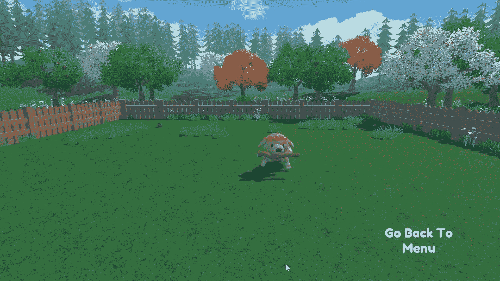

# 结论

> 原文链接：[`huggingface.co/learn/deep-rl-course/unit1/conclusion`](https://huggingface.co/learn/deep-rl-course/unit1/conclusion)

祝贺您完成了这个单元！**那是最大的一个**，包含了很多信息。祝贺您完成了教程。您刚刚训练了您的第一个 Deep RL 代理并与社区分享了！🥳

如果您仍然对其中一些元素感到困惑，那是**正常的**。这对我和所有学习 RL 的人都是一样的。

在继续之前，**花时间真正掌握材料**是很重要的。在进入有趣的部分之前，掌握这些元素并建立坚实的基础是很重要的。

当然，在课程中，我们将再次使用和解释这些术语，但最好在进入下一个单元之前理解它们。

在下一个（奖励）单元中，我们将通过**训练 Huggy the Dog 去捡棍子**来巩固我们刚学到的知识。

接下来你就可以和他一起玩🤗。

最后，我们很乐意**听听您对课程的看法以及我们如何改进**。如果您有反馈意见，那么请👉[填写此表格](https://forms.gle/BzKXWzLAGZESGNaE9)

### 继续学习，保持精彩🤗
