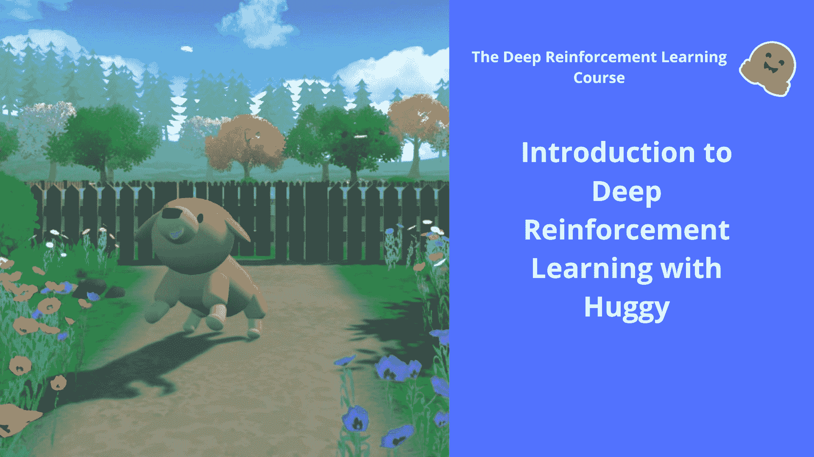
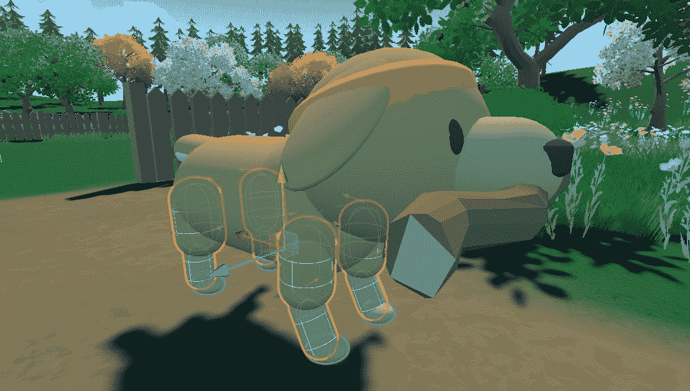
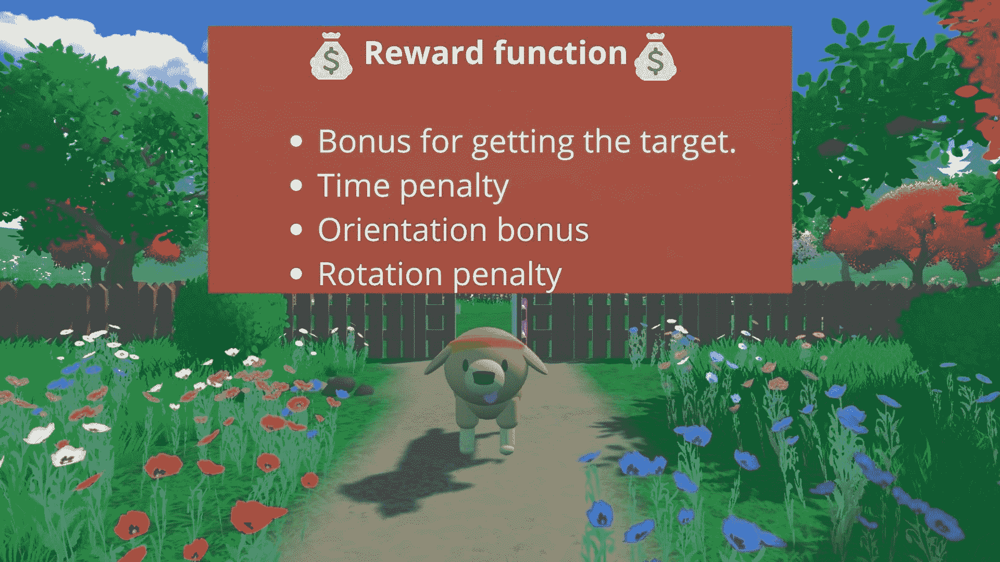
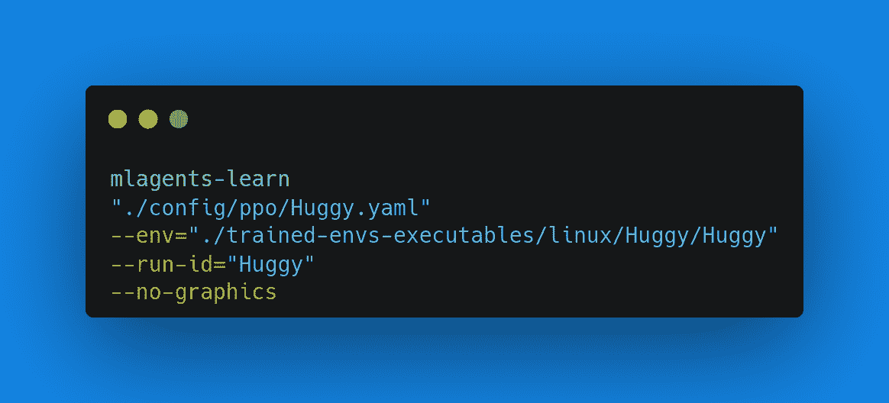
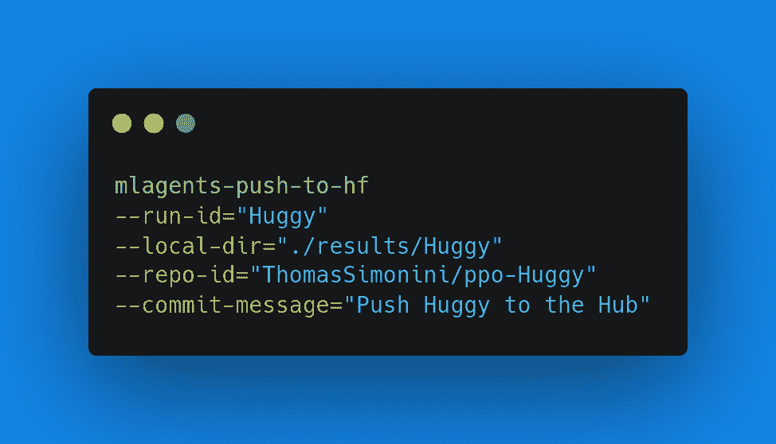
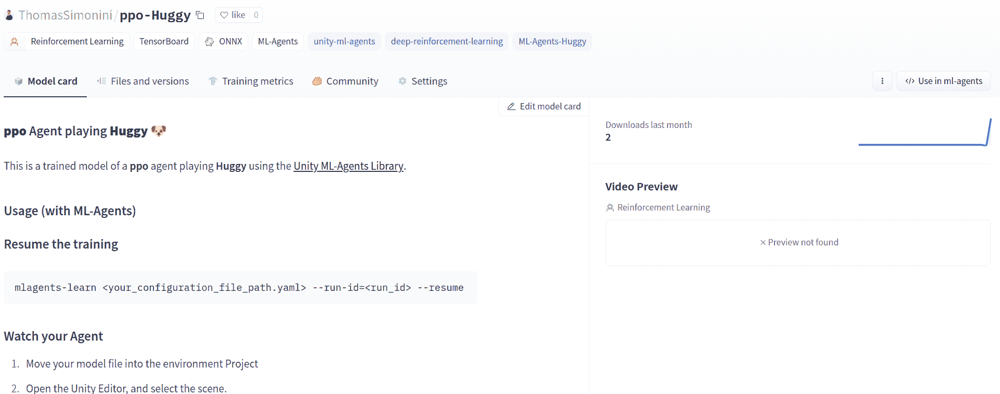
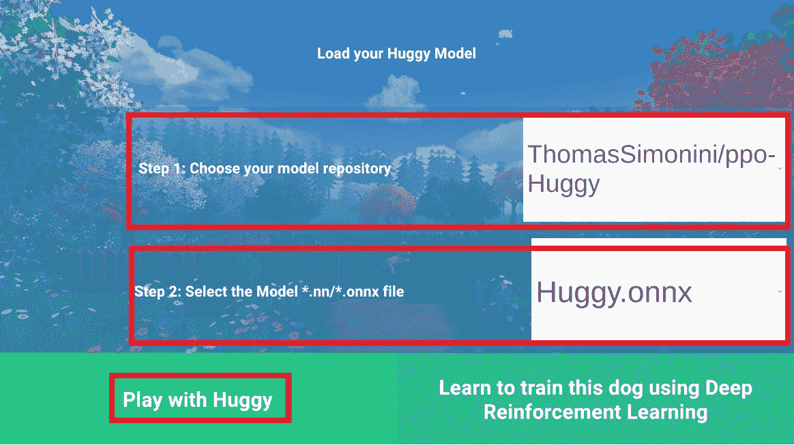

# 让我们训练和玩 Huggy 🐶

> 原始文本：[`huggingface.co/learn/deep-rl-course/unitbonus1/train`](https://huggingface.co/learn/deep-rl-course/unitbonus1/train)

 

我们强烈建议学生使用 Google Colab 进行实践练习，而不是在个人计算机上运行它们。

通过使用 Google Colab，**您可以专注于学习和实验，而不必担心设置环境的技术细节**。

## 让我们训练 Huggy 🐶

**要开始训练 Huggy，请点击在 Colab 中打开按钮**👇：




在这个笔记本中，我们将通过**教 Huggy 狗拿棍子，然后直接在浏览器中玩**来强化我们在第一单元学到的知识


### 环境 🎮

+   Huggy the Dog，由[Thomas Simonini](https://twitter.com/ThomasSimonini)创建的环境，基于[Puppo The Corgi](https://blog.unity.com/technology/puppo-the-corgi-cuteness-overload-with-the-unity-ml-agents-toolkit)

### 使用的库 📚

+   [MLAgents](https://github.com/Unity-Technologies/ml-agents)

我们不断努力改进我们的教程，所以**如果您在这个笔记本中发现一些问题**，请[在 Github Repo 上提出问题](https://github.com/huggingface/deep-rl-class/issues)。

## 本笔记本的目标 🏆

在笔记本的结尾，您将：

+   了解用于训练 Huggy 的**状态空间、动作空间和奖励函数**。

+   **训练您自己的 Huggy** 去拿棍子。

+   能够**直接在浏览器中与您训练过的 Huggy 一起玩**。

## 先决条件🏗️

在深入笔记本之前，您需要：

🔲 📚 **通过完成第 1 单元来理解强化学习的基础**（MC，TD，奖励假设...）

🔲 📚 **通过完成 Bonus Unit 1 来阅读 Huggy 的介绍**

## 设置 GPU💪

+   为了**加速代理的训练，我们将使用 GPU**。要做到这一点，请转到`运行时 > 更改运行时类型`


+   `硬件加速器 > GPU`


## 克隆存储库并安装依赖项🔽

+   我们需要克隆包含 ML-Agents 的存储库。

```py
# Clone the repository (can take 3min)
git clone --depth 1 https://github.com/Unity-Technologies/ml-agents
```

```py
# Go inside the repository and install the package (can take 3min)
%cd ml-agents
pip3 install -e ./ml-agents-envs
pip3 install -e ./ml-agents
```

## 下载并将环境 zip 文件移动到./trained-envs-executables/linux/

+   我们的环境可执行文件在一个 zip 文件中。

+   我们需要下载它并将其放置在`./trained-envs-executables/linux/`中

```py
mkdir ./trained-envs-executables
mkdir ./trained-envs-executables/linux
```

我们使用`wget`从[`github.com/huggingface/Huggy`](https://github.com/huggingface/Huggy)下载了文件 Huggy.zip

```py
wget "https://github.com/huggingface/Huggy/raw/main/Huggy.zip" -O ./trained-envs-executables/linux/Huggy.zip
```

```py
%%capture
unzip -d ./trained-envs-executables/linux/ ./trained-envs-executables/linux/Huggy.zip
```

确保您的文件可以访问

```py
chmod -R 755 ./trained-envs-executables/linux/Huggy
```

## 让我们回顾一下这个环境是如何工作的

### 状态空间：Huggy 感知到的内容。

Huggy 不“看到”他的环境。相反，我们为他提供有关环境的信息：

+   目标（棍子）位置

+   他自己和目标之间的相对位置

+   他的腿的方向。

鉴于所有这些信息，Huggy**可以决定下一步采取哪些行动来实现他的目标**。


### 动作空间：Huggy 可以执行的动作



**关节驱动 Huggy 的腿**。这意味着为了到达目标，Huggy 需要**学会正确旋转他每条腿的关节马达，以便他可以移动**。

### 奖励函数

奖励函数设计成**Huggy 将实现他的目标**：拿到棍子。

请记住，强化学习的基础之一是*奖励假设*：目标可以描述为**最大化预期的累积奖励**。

在这里，我们的目标是让 Huggy**朝着棍子走，但不要转得太多**。因此，我们的奖励函数必须体现这一目标。

我们的奖励函数：



+   *方向奖励*：我们**奖励他靠近目标**。

+   *时间惩罚*：在每个动作中给予的固定时间惩罚，**强迫他尽快到达棍子**。

+   *旋转惩罚*：如果**他转得太多并且转得太快**，我们会惩罚 Huggy。

+   *达到目标奖励*：我们奖励 Huggy**达到目标**。

## 检查 Huggy 配置文件

+   在 ML-Agents 中，您可以在 config.yaml 文件中定义**训练超参数。**

+   在本笔记本的范围内，我们不打算修改超参数，但如果您想尝试作为实验，Unity 提供了非常[好的文档，在这里解释每一个](https://github.com/Unity-Technologies/ml-agents/blob/main/docs/Training-Configuration-File.md)。

+   我们需要为 Huggy 创建一个配置文件。

+   转到`/content/ml-agents/config/ppo`

+   创建一个名为`Huggy.yaml`的新文件

+   复制并粘贴下面的内容🔽

```py
behaviors:
  Huggy:
    trainer_type: ppo
    hyperparameters:
      batch_size: 2048
      buffer_size: 20480
      learning_rate: 0.0003
      beta: 0.005
      epsilon: 0.2
      lambd: 0.95
      num_epoch: 3
      learning_rate_schedule: linear
    network_settings:
      normalize: true
      hidden_units: 512
      num_layers: 3
      vis_encode_type: simple
    reward_signals:
      extrinsic:
        gamma: 0.995
        strength: 1.0
    checkpoint_interval: 200000
    keep_checkpoints: 15
    max_steps: 2e6
    time_horizon: 1000
    summary_freq: 50000
```

+   不要忘记保存文件！

+   **如果您想修改超参数**，在 Google Colab 笔记本中，您可以单击此处打开 config.yaml 文件：`/content/ml-agents/config/ppo/Huggy.yaml`

我们现在准备好训练我们的 agent🔥。

## 训练我们的 agent

要训练我们的 agent，我们只需要**启动 mlagents-learn 并选择包含环境的可执行文件。**



使用 ML Agents，我们运行一个训练脚本。我们定义了四个参数：

1.  `mlagents-learn <config>`：超参数配置文件的路径。

1.  `--env`：环境可执行文件的位置。

1.  `--run-id`：您要为训练运行 ID 指定的名称。

1.  `--no-graphics`：在训练期间不启动可视化。

训练模型并使用`--resume`标志继续训练以防中断。

> 第一次使用`--resume`时会失败，请尝试再次运行该块以绕过错误。

训练将花费 30 到 45 分钟，取决于您的机器（不要忘记**设置 GPU**），去喝杯☕️，您值得拥有🤗。

```py
mlagents-learn ./config/ppo/Huggy.yaml --env=./trained-envs-executables/linux/Huggy/Huggy --run-id="Huggy" --no-graphics
```

## 将代理推送到🤗 Hub

+   现在我们已经训练了我们的 agent，我们**准备将其推送到 Hub，以便在浏览器上与 Huggy 一起玩🔥。**

为了能够与社区分享您的模型，还有三个步骤要遵循：

1️⃣（如果尚未完成）创建一个 HF 帐户➡[`huggingface.co/join`](https://huggingface.co/join)

2️⃣ 登录，然后从 Hugging Face 网站获取您的令牌。

+   创建一个新的令牌（[`huggingface.co/settings/tokens`](https://huggingface.co/settings/tokens)）**具有写入权限**


+   复制令牌

+   运行下面的单元格并粘贴令牌

```py
from huggingface_hub import notebook_login

notebook_login()
```

如果您不想使用 Google Colab 或 Jupyter Notebook，您需要使用此命令：`huggingface-cli login`

然后，我们只需要运行`mlagents-push-to-hf`。



我们定义了 4 个参数：

1.  `--run-id`：训练运行 ID 的名称。

1.  `--local-dir`：代理保存的位置，是 results/<run_id 名称>，所以在我的情况下是 results/First Training。

1.  `--repo-id`：您要创建或更新的 Hugging Face repo 的名称。它始终是<您的 Hugging Face 用户名>/<repo 名称>如果 repo 不存在，**将自动创建**

1.  `--commit-message`：由于 HF repos 是 git 存储库，您需要提供提交消息。

```py
mlagents-push-to-hf --run-id="HuggyTraining" --local-dir="./results/Huggy" --repo-id="ThomasSimonini/ppo-Huggy" --commit-message="Huggy"
```

如果一切正常，您应该在过程结束时看到这个（但是网址不同😆）：

```py
Your model is pushed to the hub. You can view your model here: https://huggingface.co/ThomasSimonini/ppo-Huggy
```

这是你的模型存储库的链接。存储库包含一个模型卡，解释如何使用模型，你的 Tensorboard 日志和配置文件。**最棒的是它是一个 git 存储库，这意味着你可以有不同的提交，用新的推送更新你的存储库，打开 Pull Requests 等。**



但现在最好的部分来了：**能够在线与 Huggy 玩耍👀。**

## 和你的 Huggy 🐕一起玩

这一步是最简单的：

+   在浏览器中打开 Huggy 游戏：[`huggingface.co/spaces/ThomasSimonini/Huggy`](https://huggingface.co/spaces/ThomasSimonini/Huggy)

+   点击 Play with my Huggy model



1.  在第 1 步，选择你的模型存储库，即模型 ID（在我的情况下是 ThomasSimonini/ppo-Huggy）。

1.  在第 2 步，**选择你想要重播的模型**：

+   我有多个，因为我们每 500000 个时间步保存一个模型。

+   但是因为我想要最新的那个，我选择了 `Huggy.onnx`

👉 **尝试使用不同的模型步骤来查看代理的改进。**

恭喜你完成了这个奖励单元！

现在你可以坐下来享受和你的 Huggy 🐶玩耍了。而且**不要忘记通过与朋友分享 Huggy 来传递爱 🤗**。如果你在社交媒体上分享了关于它的内容，**请标记我们 @huggingface 和我 @simoninithomas**


## 继续学习，保持棒棒的 🤗
