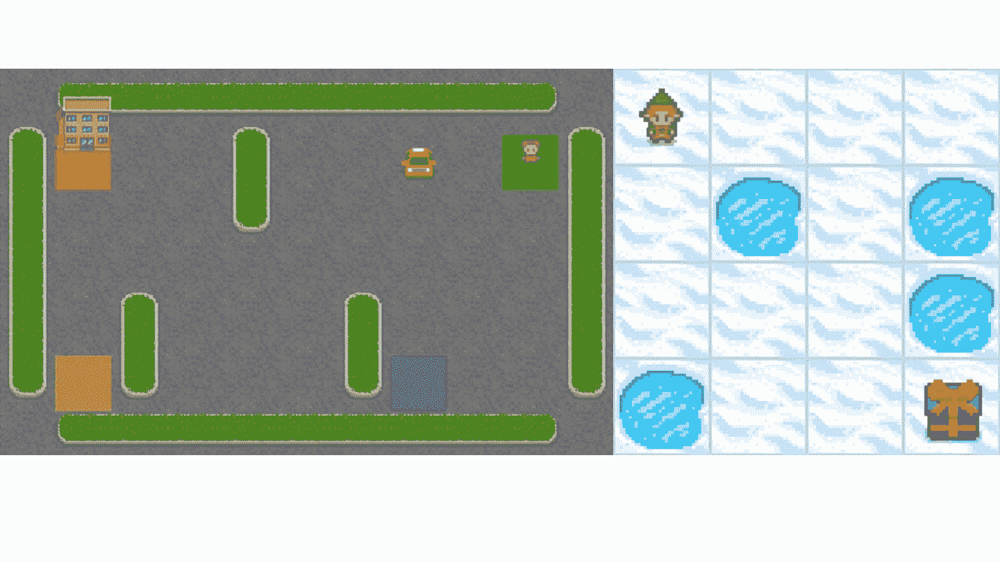

# Q-Learning 简介

> 原文链接：[`huggingface.co/learn/deep-rl-course/unit2/introduction`](https://huggingface.co/learn/deep-rl-course/unit2/introduction)

在本课程的第一个单元中，我们学习了强化学习（RL）、RL 过程以及解决 RL 问题的不同方法。我们还**训练了我们的第一个代理并将其上传到 Hugging Face Hub。**

在本单元中，我们将**深入研究强化学习方法之一：基于价值的方法**，并学习我们的第一个 RL 算法：**Q-Learning**。

我们还将**从头开始实现我们的第一个 RL 代理**，一个 Q-Learning 代理，并将在两个环境中对其进行训练：

1.  Frozen-Lake-v1（非滑动版本）：我们的代理需要**从起始状态（S）到目标状态（G）**，只能在冰冻瓷砖（F）上行走，并避开洞（H）。

1.  自主出租车：我们的代理需要**学会导航**城市，将乘客从 A 点运送到 B 点。

具体来说，我们将：

+   了解**基于价值的方法**。

+   学习**蒙特卡洛和时序差分学习之间的区别**。

+   研究并实现**我们的第一个 RL 算法**：Q-Learning。

如果您想要能够使用深度 Q-Learning 进行工作，这个单元是**基础性的**：这是第一个在 Atari 游戏中玩耍并在其中一些游戏中击败人类水平（打砖块，太空入侵者等）的深度 RL 算法。

那么让我们开始吧！🚀
