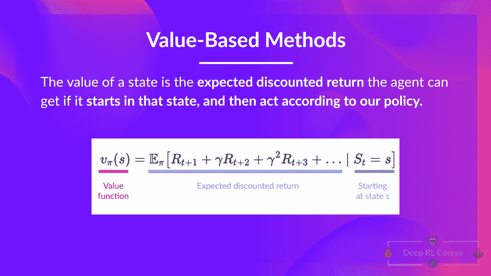
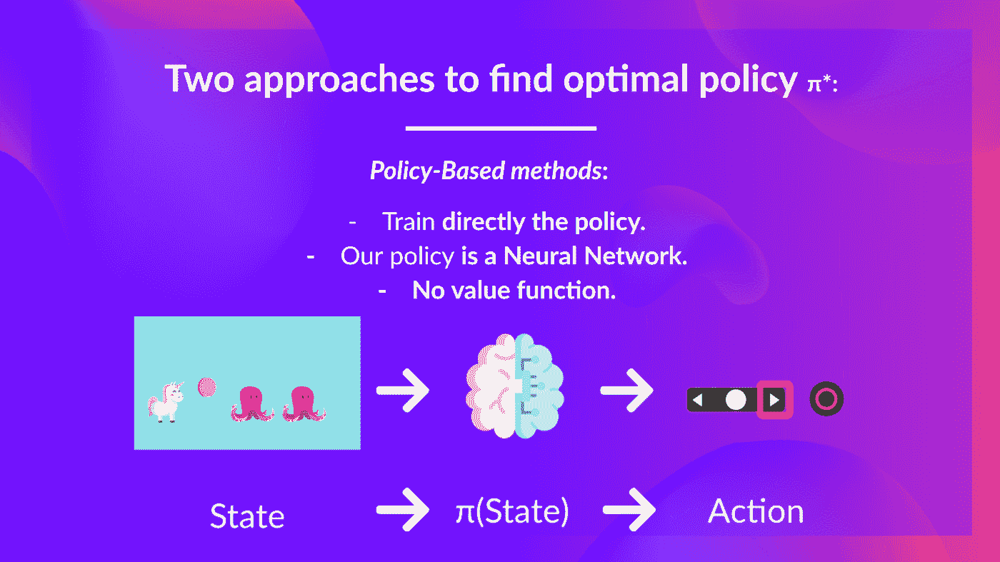
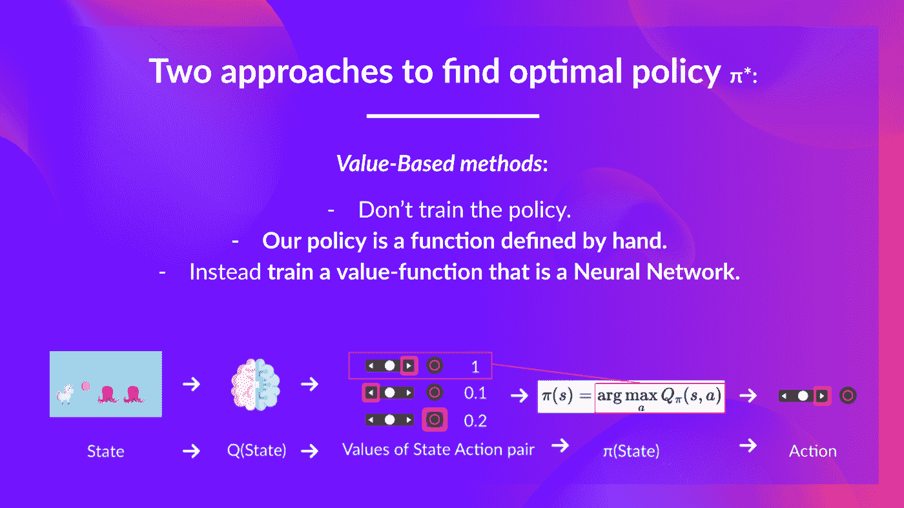
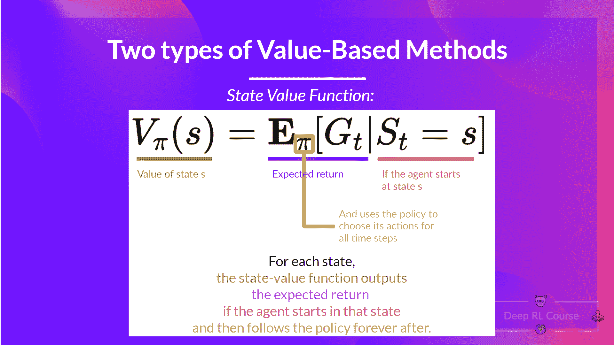
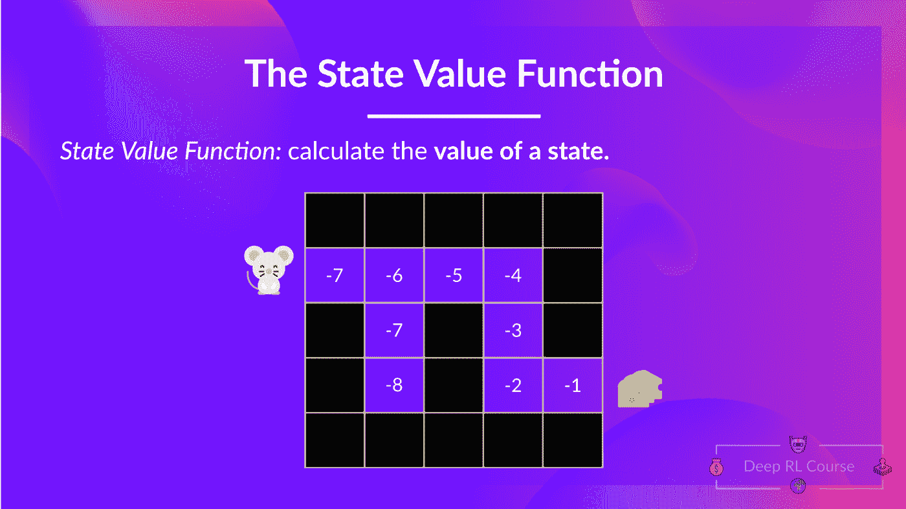
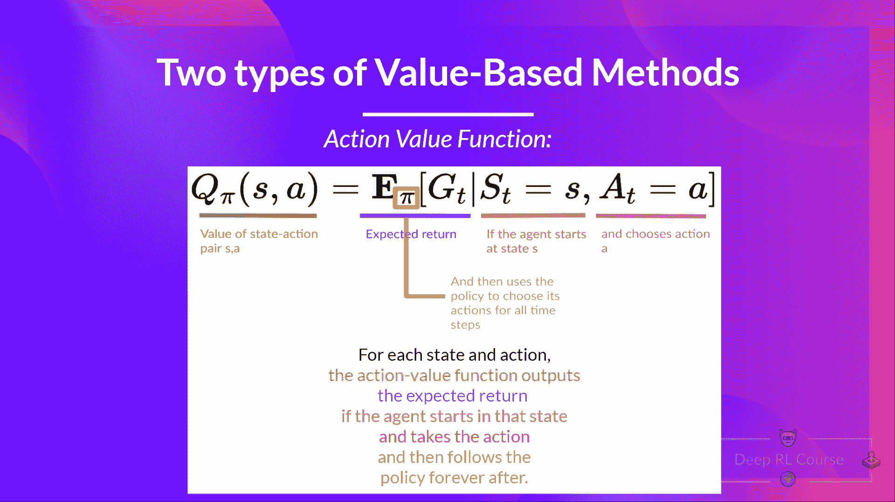
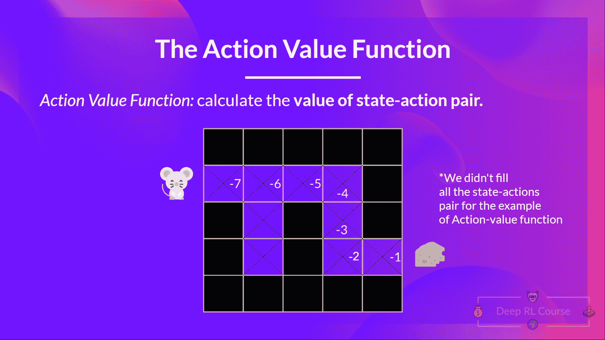
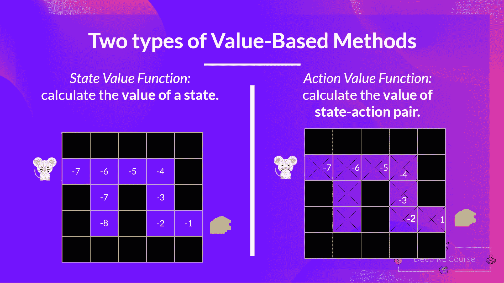

# 两种基于价值的方法

> 原文链接：[`huggingface.co/learn/deep-rl-course/unit2/two-types-value-based-methods`](https://huggingface.co/learn/deep-rl-course/unit2/two-types-value-based-methods)

在基于价值的方法中，**我们学习一个值函数**，它**将一个状态映射到在该状态时的预期值**。

一个状态的值是代理在该状态开始并根据我们的策略行动时可以获得的**预期折扣回报**。

但是根据我们的策略采取行动是什么意思呢？毕竟，在基于价值的方法中，我们没有策略，因为我们训练的是值函数而不是策略。

记住，**强化学习代理的目标是拥有一个最优策略π*。**

为了找到最优策略，我们学习了两种不同的方法：

+   *基于策略的方法：**直接训练策略**来选择在给定状态下采取什么行动（或在该状态下采取行动的概率分布）。在这种情况下，我们**没有值函数。**

策略以状态作为输入，并输出在该状态下应采取的动作（确定性策略：在给定状态下输出一个动作的策略，与输出动作概率分布的随机策略相反）。

因此，**我们不手动定义策略的行为；训练将定义它。**

+   *基于价值的方法：**通过训练一个值函数间接地**输出一个状态或状态-动作对的值。有了这个值函数，我们的策略**将采取一个动作。**

由于策略没有经过训练/学习，**我们需要指定其行为。**例如，如果我们想要一个策略，根据值函数，将采取总是导致最大奖励的行动，**我们将创建一个贪婪策略。**

给定一个状态，我们训练的动作值函数输出该状态下每个动作的值。然后，我们预定义的贪婪策略选择将在给定状态或状态动作对下产生最高值的动作。

因此，无论您使用什么方法来解决问题，**您都将有一个策略**。在基于价值的方法中，您不训练策略：您的策略**只是一个简单的预先指定函数**（例如，贪婪策略），它使用值函数给出的值来选择其动作。

因此，区别在于：

+   在基于策略的训练中，**通过直接训练策略来找到最优策略（表示为π*）。**

+   在基于价值的训练中，**找到一个最优值函数（表示为 Q*或 V*，我们将在下面研究区别）会导致有一个最优策略。**

事实上，在基于价值的方法中，大多数时间，您将使用**一个ε-贪婪策略**来处理探索/利用的权衡；我们将在本单元的第二部分讨论 Q 学习时详细讨论这一点。

正如我们上面提到的，我们有两种基于价值的函数：

## 状态值函数

我们将在策略π下编写状态值函数如下：

对于每个状态，状态值函数输出代理**从该状态开始**并在之后永远遵循策略时的预期回报（如果您愿意，对于所有未来时间步）。

如果我们考虑值为-7 的状态：这是从该状态开始并根据我们的策略（贪婪策略）采取行动的预期回报，所以向右、向右、向右、向下、向下、向右、向右。

## 动作值函数

在动作值函数中，对于每个状态和动作对，动作值函数**输出了期望回报**，如果代理在该状态开始，采取该动作，然后按照策略永远继续。

在策略<math><semantics><mrow><mi>π</mi></mrow><annotation encoding="application/x-tex">π</annotation></semantics></math>π下，采取动作<math><semantics><mrow><mi>a</mi></mrow><annotation encoding="application/x-tex">a</annotation></semantics></math>a 在状态<math><semantics><mrow><mi>s</mi></mrow><annotation encoding="application/x-tex">s</annotation></semantics></math>s 的价值是：

 

我们看到差异是：

+   对于状态值函数，我们计算**状态<math><semantics><mrow><msub><mi>S</mi><mi>t</mi></msub></mrow><annotation encoding="application/x-tex">S_t</annotation></semantics></math>的价值 St**

+   对于动作值函数，我们计算**状态-动作对（<math><semantics><mrow><msub><mi>S</mi><mi>t</mi></msub><mo separator="true">,</mo><msub><mi>A</mi><mi>t</mi></msub></mrow><annotation encoding="application/x-tex">S_t, A_t</annotation></semantics></math>）的价值，因此是在该状态采取该动作的价值。**

注意：我们没有填充动作值函数示例中的所有状态-动作对

无论我们选择哪种价值函数（状态值函数或动作值函数），**返回的值都是期望回报。**

然而，问题在于**计算每个状态或状态-动作对的价值，我们需要总结代理在该状态开始时可以获得的所有奖励。**

这可能是一个计算昂贵的过程，这就是**贝尔曼方程帮助我们的地方。**
