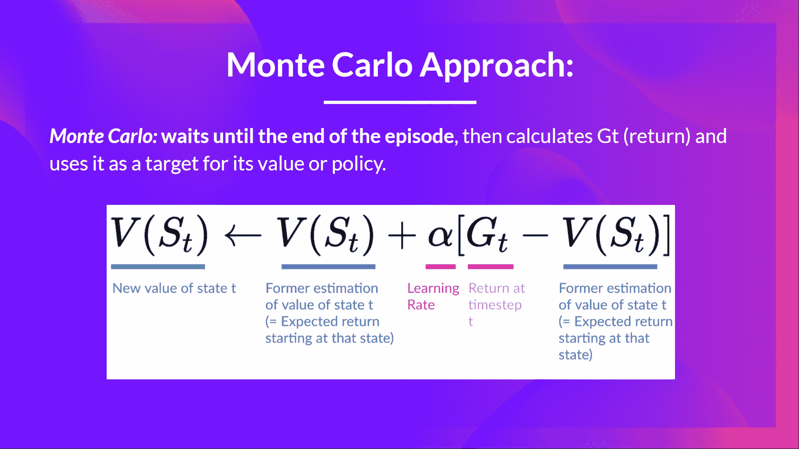
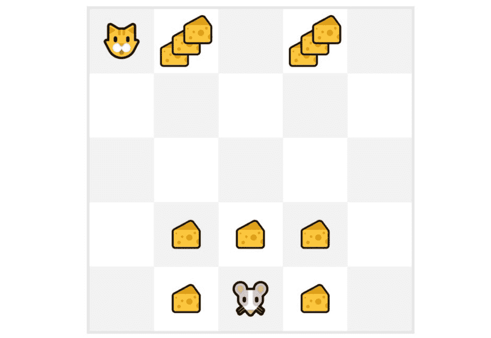
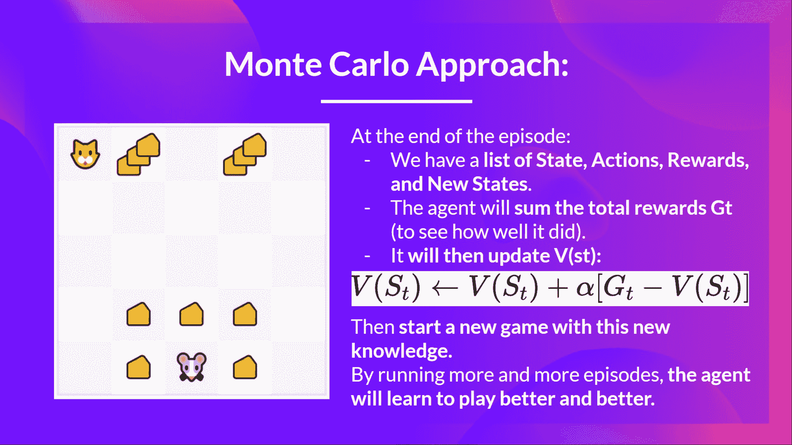
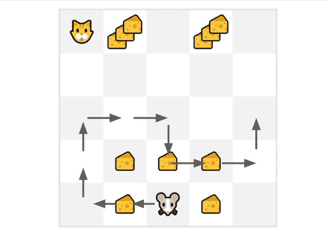
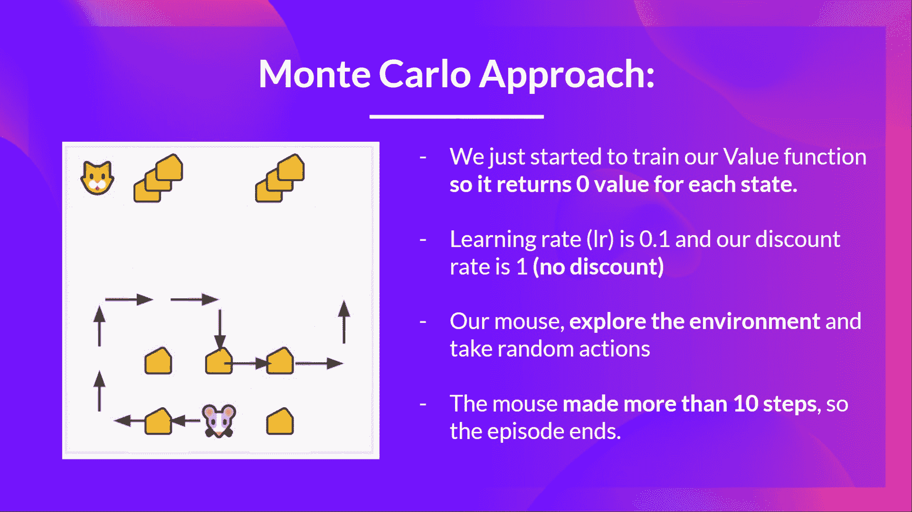
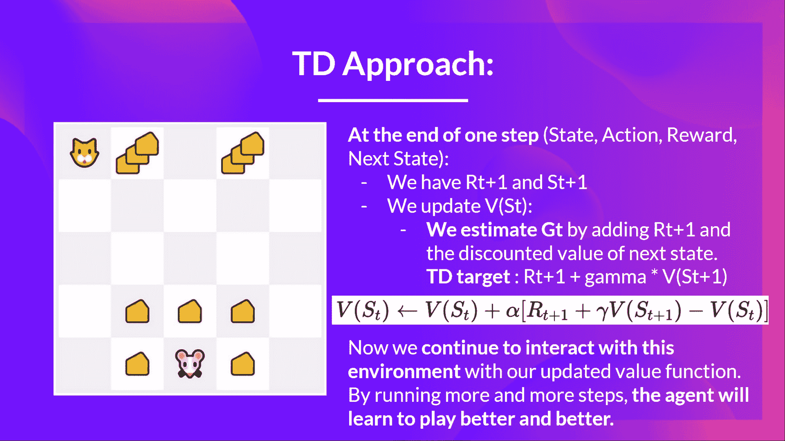
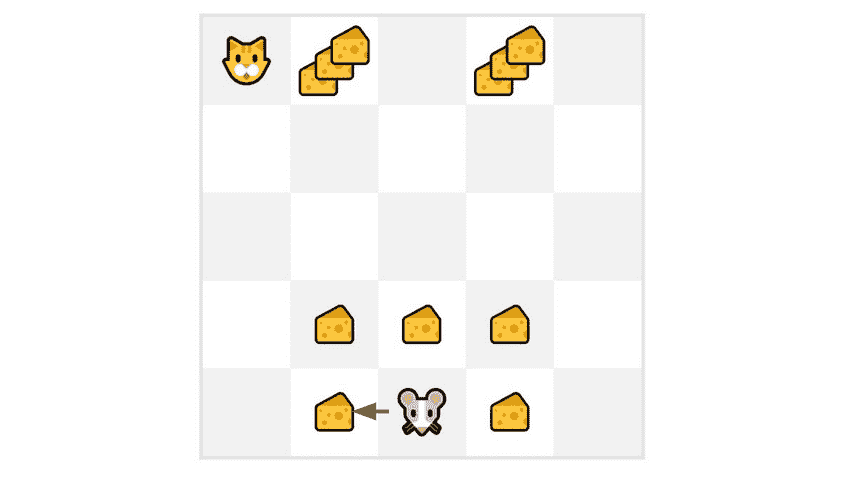
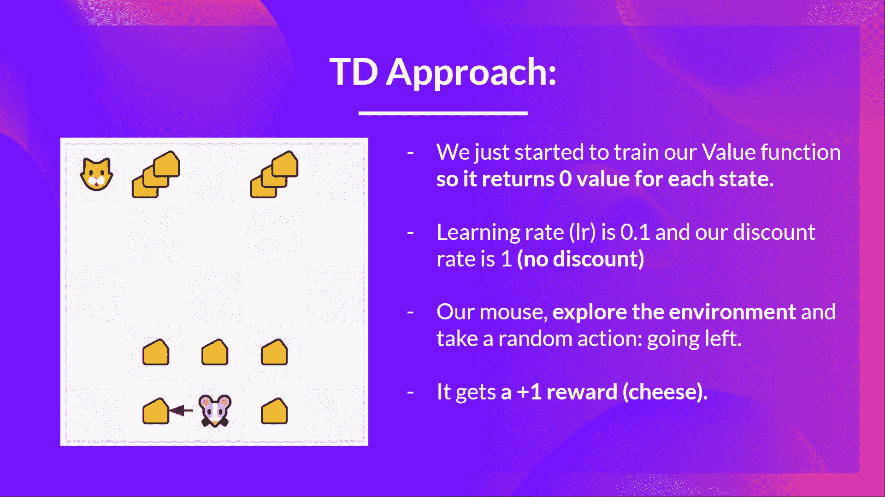
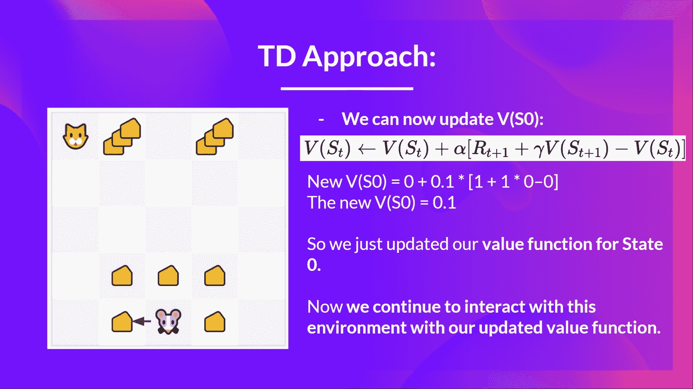

# 蒙特卡洛与时序差异学习

> 原文链接：[`huggingface.co/learn/deep-rl-course/unit2/mc-vs-td`](https://huggingface.co/learn/deep-rl-course/unit2/mc-vs-td)

在深入讨论 Q 学习之前，我们需要讨论的最后一件事是两种学习策略。

记住 RL 代理**通过与环境交互学习**。思路是**根据经验和获得的奖励，代理将更新其值函数或策略。**

蒙特卡洛和时序差异学习是两种不同的**训练值函数或策略函数的策略。**它们都**利用经验来解决 RL 问题。**

一方面，蒙特卡洛在学习之前使用**整个剧集的经验**。另一方面，时序差异使用**仅一步（<math><semantics><mrow><msub><mi>S</mi><mi>t</mi></msub><mo separator="true">,</mo><msub><mi>A</mi><mi>t</mi></msub><mo separator="true">,</mo><msub><mi>R</mi><mrow><mi>t</mi><mo>+</mo><mn>1</mn></mrow></msub><mo separator="true">,</mo><msub><mi>S</mi><mrow><mi>t</mi><mo>+</mo><mn>1</mn></mrow></msub></mrow><annotation encoding="application/x-tex">S_t, A_t, R_{t+1}, S_{t+1}</annotation></semantics></math>St​,At​,Rt+1​,St+1​ )进行学习。**

我们将使用基于值的方法示例来解释两者**。**

## 蒙特卡洛：在剧集结束时学习

蒙特卡洛等到剧集结束，计算<math><semantics><mrow><msub><mi>G</mi><mi>t</mi></msub></mrow><annotation encoding="application/x-tex">G_t</annotation></semantics></math>Gt​（回报）并将其用作**更新<math><semantics><mrow><mi>V</mi><mo stretchy="false">(</mo><msub><mi>S</mi><mi>t</mi></msub><mo stretchy="false">)</mo></mrow><annotation encoding="application/x-tex">V(S_t)</annotation></semantics></math>V(St​)的目标。**

因此，在更新我们的值函数之前，需要**完整的剧集互动。**

如果我们举个例子：

+   我们总是从**同一个起点开始剧集。**

+   **代理使用策略采取行动**。例如，使用ε贪婪策略，一种在探索（随机行动）和利用之间交替的策略。

+   我们得到**奖励和下一个状态。**

+   如果猫吃了老鼠或老鼠移动> 10 步，我们终止剧集。

+   在剧集结束时，**我们有一个状态、行动、奖励和下一个状态元组的列表** 例如[[状态瓷砖 3 底部，向左走，+1，状态瓷砖 2 底部]，[状态瓷砖 2 底部，向左走，+0，状态瓷砖 1 底部]...]

+   **代理将总奖励<math><semantics><mrow><msub><mi>G</mi><mi>t</mi></msub></mrow><annotation encoding="application/x-tex">G_t</annotation></semantics></math>Gt​**（看它表现如何）。

+   然后**根据公式更新<math><semantics><mrow><mi>V</mi><mo stretchy="false">(</mo><msub><mi>s</mi><mi>t</mi></msub><mo stretchy="false">)</mo></mrow><annotation encoding="application/x-tex">V(s_t)</annotation></semantics></math>V(st​)**

    

+   然后**用这些新知识开始新游戏**

通过运行更多的剧集，**代理将学会玩得越来越好。**

例如，如果我们使用蒙特卡洛训练状态值函数：

+   我们初始化我们的值函数**使其对每个状态返回 0 值**

+   我们的学习率（lr）为 0.1，折扣率为 1（=无折扣）

+   我们的老鼠**探索环境并采取随机行动**

    

+   老鼠走了超过 10 步，所以剧集结束了。

    

+   我们有一个状态、动作、奖励、下一个状态的列表，**我们需要计算回报<math><semantics><mrow><mi>G</mi><mrow><mi>t</mi><mo>=</mo><mn>0</mn></mrow></mrow><annotation encoding="application/x-tex">G{t=0}</annotation></semantics></math>Gt=0** <math><semantics><mrow><msub><mi>G</mi><mi>t</mi></msub><mo>=</mo><msub><mi>R</mi><mrow><mi>t</mi><mo>+</mo><mn>1</mn></mrow></msub><mo>+</mo><msub><mi>R</mi><mrow><mi>t</mi><mo>+</mo><mn>2</mn></mrow></msub><mo>+</mo><msub><mi>R</mi><mrow><mi>t</mi><mo>+</mo><mn>3</mn></mrow></msub><mi mathvariant="normal">.</mi><mi mathvariant="normal">.</mi><mi mathvariant="normal">.</mi></mrow><annotation encoding="application/x-tex">G_t = R_{t+1} + R_{t+2} + R_{t+3} ...</annotation></semantics></math>Gt​=Rt+1​+Rt+2​+Rt+3​...（为简单起见，我们不打折奖励） <math><semantics><mrow><msub><mi>G</mi><mn>0</mn></msub><mo>=</mo><msub><mi>R</mi><mn>1</mn></msub><mo>+</mo><msub><mi>R</mi><mn>2</mn></msub><mo>+</mo><msub><mi>R</mi><mn>3</mn></msub><mo>…</mo></mrow><annotation encoding="application/x-tex">G_0 = R_{1} + R_{2} + R_{3}…</annotation></semantics></math>G0​=R1​+R2​+R3​… <math><semantics><mrow><msub><mi>G</mi><mn>0</mn></msub><mo>=</mo><mn>1</mn><mo>+</mo><mn>0</mn><mo>+</mo><mn>0</mn><mo>+</mo><mn>0</mn><mo>+</mo><mn>0</mn><mo>+</mo><mn>0</mn><mo>+</mo><mn>1</mn><mo>+</mo><mn>1</mn><mo>+</mo><mn>0</mn><mo>+</mo><mn>0</mn></mrow><annotation encoding="application/x-tex">G_0 = 1 + 0 + 0 + 0 + 0 + 0 + 1 + 1 + 0 + 0</annotation></semantics></math>G0​=1+0+0+0+0+0+1+1+0+0 <math><semantics><mrow><msub><mi>G</mi><mn>0</mn></msub><mo>=</mo><mn>3</mn></mrow><annotation encoding="application/x-tex">G_0 = 3</annotation></semantics></math>G0​=3

+   现在我们可以计算**新的**<math><semantics><mrow><mi>V</mi><mo stretchy="false">(</mo><msub><mi>S</mi><mn>0</mn></msub><mo stretchy="false">)</mo></mrow><annotation encoding="application/x-tex">V(S_0)</annotation></semantics></math>V(S0​)：

     <math><semantics><mrow><mi>V</mi><mo stretchy="false">(</mo><msub><mi>S</mi><mn>0</mn></msub><mo stretchy="false">)</mo><mo>=</mo><mi>V</mi><mo stretchy="false">(</mo><msub><mi>S</mi><mn>0</mn></msub><mo stretchy="false">)</mo><mo>+</mo><mi>l</mi><mi>r</mi><mo>∗</mo><mo stretchy="false">[</mo><msub><mi>G</mi><mn>0</mn></msub><mtext>—</mtext><mi>V</mi><mo stretchy="false">(</mo><msub><mi>S</mi><mn>0</mn></msub><mo stretchy="false">)</mo><mo stretchy="false">]</mo></mrow><annotation encoding="application/x-tex">V(S_0) = V(S_0) + lr * [G_0 — V(S_0)]</annotation></semantics></math>V(S0​)=V(S0​)+lr∗[G0​—V(S0​)] <math><semantics><mrow><mi>V</mi><mo stretchy="false">(</mo><msub><mi>S</mi><mn>0</mn></msub><mo stretchy="false">)</mo><mo>=</mo><mn>0</mn><mo>+</mo><mn>0.1</mn><mo>∗</mo><mo stretchy="false">[</mo><mn>3</mn><mtext>–</mtext><mn>0</mn><mo stretchy="false">]</mo></mrow><annotation encoding="application/x-tex">V(S_0) = 0 + 0.1 * [3 – 0]</annotation></semantics></math>V(S0​)=0+0.1∗[3–0] <math><semantics><mrow><mi>V</mi><mo stretchy="false">(</mo><msub><mi>S</mi><mn>0</mn></msub><mo stretchy="false">)</mo><mo>=</mo><mn>0.3</mn></mrow><annotation encoding="application/x-tex">V(S_0) = 0.3</annotation></semantics></math>V(S0​)=0.3

## 时间差分学习：每一步学习

另一方面，**时间差异**只等待一个交互（一个步骤）<math><semantics><mrow><msub><mi>S</mi><mrow><mi>t</mi><mo>+</mo><mn>1</mn></mrow></msub></mrow><annotation encoding="application/x-tex">S_{t+1}</annotation></semantics></math>St+1​**来形成一个 TD 目标并更新<math><semantics><mrow><mi>V</mi><mo stretchy="false">(</mo><msub><mi>S</mi><mi>t</mi></msub><mo stretchy="false">)</mo></mrow><annotation encoding="application/x-tex">V(S_t)</annotation></semantics></math>V(St​)使用<math><semantics><mrow><msub><mi>R</mi><mrow><mi>t</mi><mo>+</mo><mn>1</mn></mrow></msub></mrow><annotation encoding="application/x-tex">R_{t+1}</annotation></semantics></math>Rt+1​和<math><semantics><mrow><mi>γ</mi><mo>∗</mo><mi>V</mi><mo stretchy="false">(</mo><msub><mi>S</mi><mrow><mi>t</mi><mo>+</mo><mn>1</mn></mrow></msub><mo stretchy="false">)</mo></mrow> <annotation encoding="application/x-tex">\gamma * V(S_{t+1})</annotation></semantics></math>γ∗V(St+1​)。

**TD 的想法是在每一步更新<math><semantics><mrow><mi>V</mi><mo stretchy="false">(</mo><msub><mi>S</mi><mi>t</mi></msub><mo stretchy="false">)</mo></mrow><annotation encoding="application/x-tex">V(S_t)</annotation></semantics></math>V(St​)。**

但是因为我们没有经历整个情节，我们没有<math><semantics><mrow><msub><mi>G</mi><mi>t</mi></msub></mrow><annotation encoding="application/x-tex">G_t</annotation></semantics></math>Gt​（预期回报）。相反，**我们通过添加<math><semantics><mrow><msub><mi>R</mi><mrow><mi>t</mi><mo>+</mo><mn>1</mn></mrow></msub></mrow><annotation encoding="application/x-tex">R_{t+1}</annotation></semantics></math>Rt+1​和下一个状态的折扣值来估计<math><semantics><mrow><msub><mi>G</mi><mi>t</mi></msub></mrow><annotation encoding="application/x-tex">G_t</annotation></semantics></math>Gt​。**

这被称为自举。它被称为这样**因为 TD 部分地基于现有估计<math><semantics><mrow><mi>V</mi><mo stretchy="false">(</mo><msub><mi>S</mi><mrow><mi>t</mi><mo>+</mo><mn>1</mn></mrow></msub><mo stretchy="false">)</mo></mrow><annotation encoding="application/x-tex">V(S_{t+1})</annotation></semantics></math>V(St+1​)的更新，而不是完整的样本<math><semantics><mrow><msub><mi>G</mi><mi>t</mi></msub></mrow><annotation encoding="application/x-tex">G_t</annotation></semantics></math>Gt​。**

这种方法称为 TD(0)或**一步 TD（在任何单个步骤之后更新值函数）。**

如果我们采用相同的例子，

+   我们初始化我们的值函数，使其对每个状态返回 0 值。

+   我们的学习率（lr）为 0.1，折扣率为 1（无折扣）。

+   我们的老鼠开始探索环境并采取随机行动：**向左走**

+   它得到了奖励<math><semantics><mrow><msub><mi>R</mi><mrow><mi>t</mi><mo>+</mo><mn>1</mn></mrow></msub><mo>=</mo><mn>1</mn></mrow><annotation encoding="application/x-tex">R_{t+1} = 1</annotation></semantics></math>Rt+1​=1，因为**它吃了一块奶酪**

    

我们现在可以更新<math><semantics><mrow><mi>V</mi><mo stretchy="false">(</mo><msub><mi>S</mi><mn>0</mn></msub><mo stretchy="false">)</mo></mrow><annotation encoding="application/x-tex">V(S_0)</annotation></semantics></math>V(S0​)：

新的<math><semantics><mrow><mi>V</mi><mo stretchy="false">(</mo><msub><mi>S</mi><mn>0</mn></msub><mo stretchy="false">)</mo><mo>=</mo><mi>V</mi><mo stretchy="false">(</mo><msub><mi>S</mi><mn>0</mn></msub><mo stretchy="false">)</mo><mo>+</mo><mi>l</mi><mi>r</mi><mo>∗</mo><mo stretchy="false">[</mo><msub><mi>R</mi><mn>1</mn></msub><mo>+</mo><mi>γ</mi><mo>∗</mo><mi>V</mi><mo stretchy="false">(</mo><msub><mi>S</mi><mn>1</mn></msub><mo stretchy="false">)</mo><mo>−</mo><mi>V</mi><mo stretchy="false">(</mo><msub><mi>S</mi><mn>0</mn></msub><mo stretchy="false">)</mo><mo stretchy="false">]</mo></mrow><annotation encoding="application/x-tex">V(S_0) = V(S_0) + lr * [R_1 + \gamma * V(S_1) - V(S_0)]</annotation></semantics></math>V(S0​)=V(S0​)+lr∗[R1​+γ∗V(S1​)−V(S0​)]

新的<math><semantics><mrow><mi>V</mi><mo stretchy="false">(</mo><msub><mi>S</mi><mn>0</mn></msub><mo stretchy="false">)</mo><mo>=</mo><mn>0</mn><mo>+</mo><mn>0.1</mn><mo>∗</mo><mo stretchy="false">[</mo><mn>1</mn><mo>+</mo><mn>1</mn><mo>∗</mo><mn>0</mn><mtext>–</mtext><mn>0</mn><mo stretchy="false">]</mo></mrow><annotation encoding="application/x-tex">V(S_0) = 0 + 0.1 * [1 + 1 * 0–0]</annotation></semantics></math>V(S0​)=0+0.1∗[1+1∗0–0]

新的<math><semantics><mrow><mi>V</mi><mo stretchy="false">(</mo><msub><mi>S</mi><mn>0</mn></msub><mo stretchy="false">)</mo><mo>=</mo><mn>0.1</mn></mrow><annotation encoding="application/x-tex">V(S_0) = 0.1</annotation></semantics></math>V(S0​)=0.1

所以我们刚刚更新了状态 0 的值函数。

现在我们**继续与这个环境互动，使用我们更新后的值函数。**

总结一下：

+   使用*蒙特卡洛*方法，我们从完整的一集更新值函数，因此**使用该一集的实际准确的折扣回报。**

+   使用*TD 学习*，我们从一步更新值函数，并用一个估计的回报替换我们不知道的<math><semantics><mrow><msub><mi>G</mi><mi>t</mi></msub></mrow><annotation encoding="application/x-tex">G_t</annotation></semantics></math>Gt​，称为 TD 目标。

    
