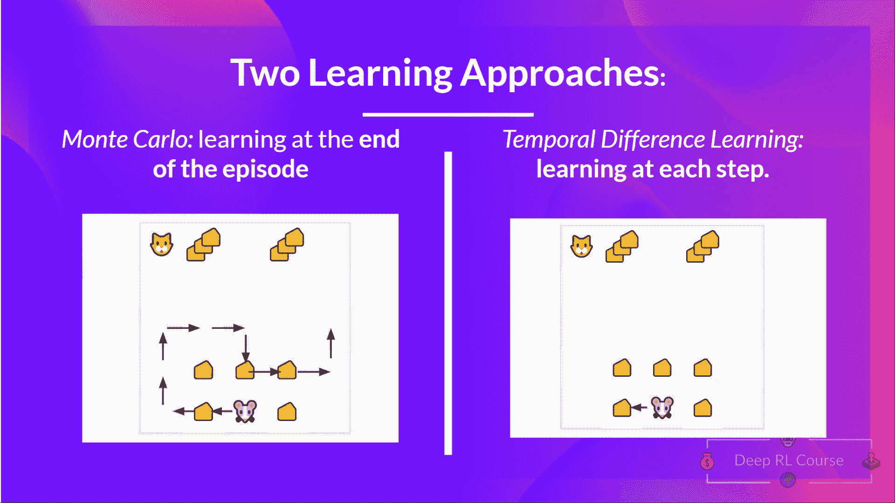

# 中途总结

> 原文链接：[`huggingface.co/learn/deep-rl-course/unit2/mid-way-recap`](https://huggingface.co/learn/deep-rl-course/unit2/mid-way-recap)

在深入学习 Q 学习之前，让我们总结一下我们刚刚学到的内容。

我们有两种基于价值的函数：

+   状态值函数：输出期望的回报，如果**代理从给定状态开始，并根据策略永远行动。**

+   动作值函数：输出期望的回报，如果**代理从给定状态开始，采取该状态下的给定动作，然后根据策略永远行动。**

+   在基于价值的方法中，我们不是学习策略，而是**手动定义策略**，并学习价值函数。如果我们有一个最优价值函数，我们**将有一个最优策略。**

有两种方法来更新价值函数：

+   通过*蒙特卡洛方法*，我们从完整的一集中更新价值函数，因此我们**使用该一集的实际折扣回报。**

+   通过*TD 学习方法*，我们从一步中更新价值函数，用估计的回报替换未知的<math><semantics><mrow><msub><mi>G</mi><mi>t</mi></msub></mrow><annotation encoding="application/x-tex">G_t</annotation></semantics></math>Gt​，称为 TD 目标。

