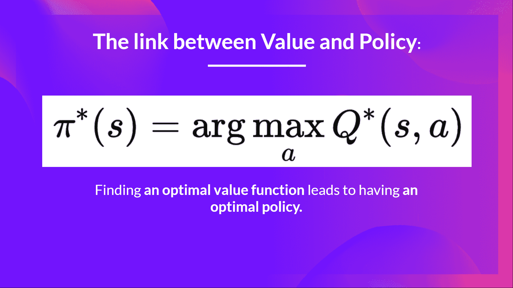

# Q-Learning 回顾

> 原文链接：[`huggingface.co/learn/deep-rl-course/unit2/q-learning-recap`](https://huggingface.co/learn/deep-rl-course/unit2/q-learning-recap)

*Q-Learning* **是强化学习算法**：

+   训练一个*Q 函数*，一个**动作值函数**，在内部内存中，由一个包含所有状态-动作对值的*Q 表*编码。

+   给定一个状态和动作，我们的 Q 函数**将在其 Q 表中搜索相应的值。**

+   当训练完成时，**我们有一个最优的 Q 函数，或者等效地，一个最优的 Q 表。**

+   如果我们**有一个最优的 Q 函数**，我们就有一个最优的策略，因为我们**知道，对于每个状态，要采取的最佳动作是什么。**

但是，在开始时，我们的**Q 表是无用的，因为它为每个状态-动作对给出任意值（大多数情况下，我们将 Q 表初始化为 0 值）**。但是，当我们探索环境并更新我们的 Q 表时，它将给我们一个越来越好的近似值。

这是 Q-Learning 的伪代码：

