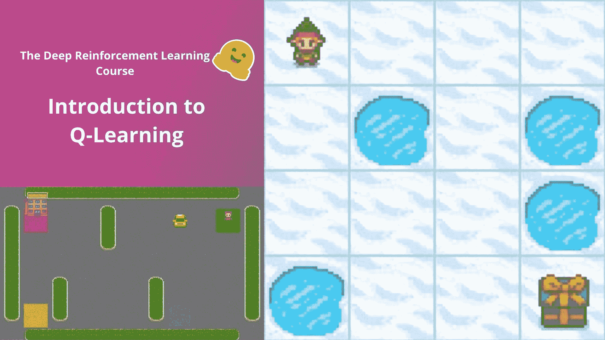
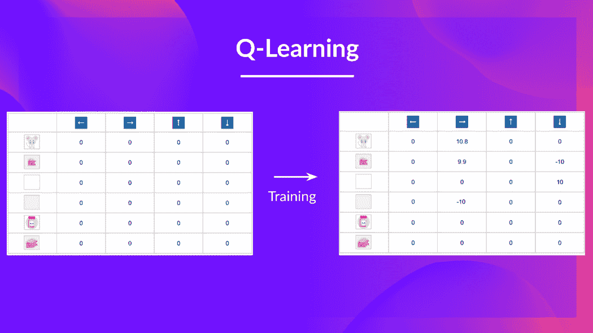
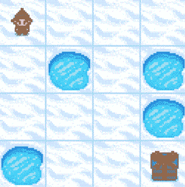
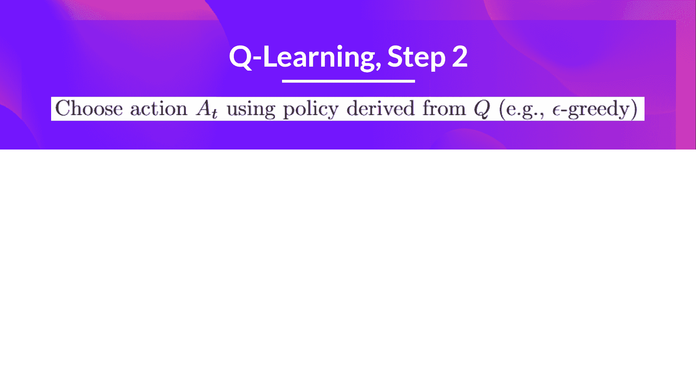
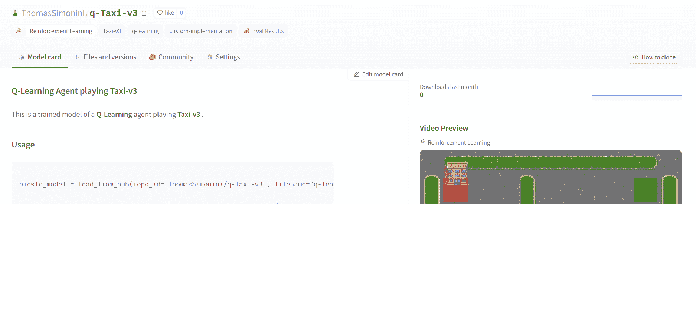
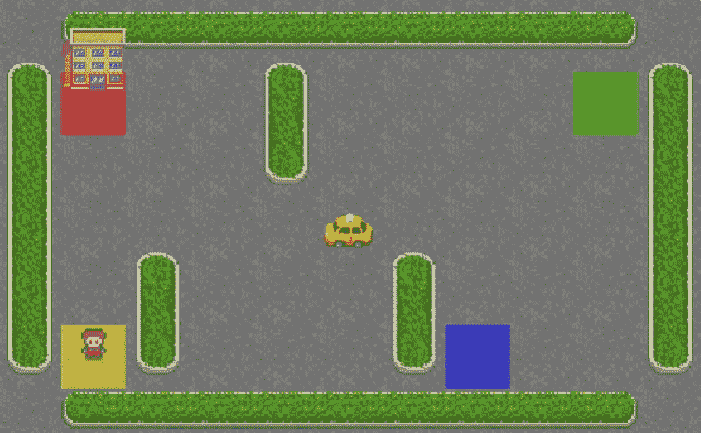
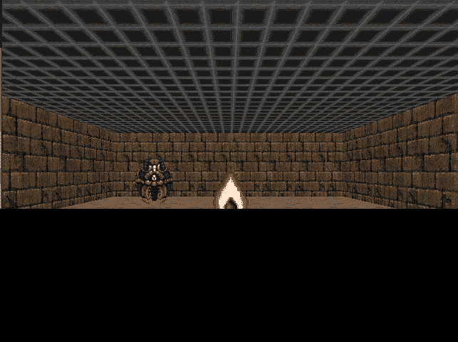

# 实践

> 原始文本：[`huggingface.co/learn/deep-rl-course/unit2/hands-on`](https://huggingface.co/learn/deep-rl-course/unit2/hands-on)

 

现在我们已经学习了 Q 学习算法，让我们从头开始实现它，并在两个环境中训练我们的 Q 学习代理：

1.  [冰湖-v1（非滑和滑版本）](https://gymnasium.farama.org/environments/toy_text/frozen_lake/) ☃️：在这里，我们的代理将需要**从起始状态（S）到目标状态（G）**只能在冰冻的瓷砖（F）上行走，并避开洞（H）。

1.  [一个自动出租车](https://gymnasium.farama.org/environments/toy_text/taxi/) 🚖 需要**学会导航**城市，**将乘客从 A 点运送到 B 点**。


感谢[排行榜](https://huggingface.co/spaces/huggingface-projects/Deep-Reinforcement-Learning-Leaderboard)，您将能够将您的结果与其他同学进行比较，并交流最佳实践以提高您的代理分数。谁将赢得第 2 单元的挑战？

要验证这个实践对[认证过程](https://huggingface.co/deep-rl-course/en/unit0/introduction#certification-process)，您需要将训练有素的出租车模型推送到 Hub，并**获得>= 4.5 的结果**。

要找到您的结果，请转到[排行榜](https://huggingface.co/spaces/huggingface-projects/Deep-Reinforcement-Learning-Leaderboard)并找到您的模型，**结果=平均奖励-奖励的标准差**

有关认证过程的更多信息，请查看此部分👉[`huggingface.co/deep-rl-course/en/unit0/introduction#certification-process`](https://huggingface.co/deep-rl-course/en/unit0/introduction#certification-process)

您可以在这里检查您的进度👉[`huggingface.co/spaces/ThomasSimonini/Check-my-progress-Deep-RL-Course`](https://huggingface.co/spaces/ThomasSimonini/Check-my-progress-Deep-RL-Course)

**要开始实践，请点击“在 Colab 中打开”按钮**👇：


我们强烈建议学生使用 Google Colab 进行实践练习，而不是在个人计算机上运行它们。

通过使用 Google Colab，**您可以专注于学习和实验，而不必担心设置环境的技术细节**。

# 第 2 单元：使用 FrozenLake-v1 ⛄和 Taxi-v3 🚕的 Q 学习



在这个笔记本中，**您将从头开始编写您的第一个强化学习代理**来玩冰湖 ❄️ 使用 Q 学习，与社区分享，并尝试不同的配置。

⬇️ 这是您将在几分钟内实现的示例。 ⬇️


### 🎮 环境：

+   [FrozenLake-v1](https://gymnasium.farama.org/environments/toy_text/frozen_lake/)

+   [Taxi-v3](https://gymnasium.farama.org/environments/toy_text/taxi/)

### 📚 RL 库：

+   Python 和 NumPy

+   [体育馆](https://gymnasium.farama.org/)

我们不断努力改进我们的教程，所以**如果您在这个笔记本中发现一些问题**，请[在 GitHub Repo 上提出问题](https://github.com/huggingface/deep-rl-class/issues)。

## 本笔记本的目标🏆

在笔记本的末尾，您将：

+   能够使用**体育馆**，这个环境库。

+   能够从头开始编写 Q 学习代理。

+   能够**将您训练有素的代理和代码推送到 Hub**，并附带一个漂亮的视频回放和评估分数🔥。

## 这个笔记本来自深度强化学习课程


在这门免费课程中，您将：

+   📖 学习深度强化学习的**理论和实践**。

+   🧑‍💻 学习使用著名的深度 RL 库，如 Stable Baselines3、RL Baselines3 Zoo、CleanRL 和 Sample Factory 2.0。

+   🤖 在独特环境中**训练代理**

更多信息请查看📚课程大纲👉[`simoninithomas.github.io/deep-rl-course`](https://simoninithomas.github.io/deep-rl-course)

不要忘记**[注册课程](http://eepurl.com/ic5ZUD)**（我们正在收集您的电子邮件，以便能够**在每个单元发布时向您发送链接，并向您提供有关挑战和更新的信息）**。

保持联系的最佳方式是加入我们的 discord 服务器，与社区和我们交流👉🏻[`discord.gg/ydHrjt3WP5`](https://discord.gg/ydHrjt3WP5)

## 先决条件🏗️

在开始使用笔记本之前，您需要：

🔲 📚 **通过阅读第 2 单元学习[Q 学习](https://huggingface.co/deep-rl-course/unit2/introduction)** 🤗

## Q-Learning 的小结

*Q 学习* **是强化学习算法**：

+   训练*Q 函数*，一个**动作值函数**，由一个包含所有状态-动作对值的*Q 表*在内存中编码。

+   给定一个状态和动作，我们的 Q 函数**将在 Q 表中搜索相应的值。**


+   当训练完成时，**我们有一个最优的 Q 函数，因此有一个最优的 Q 表。**

+   如果我们**有一个最优的 Q 函数**，我们就有一个最优的策略，因为我们**知道对于每个状态，要采取的最佳行动。**


但是，在开始时，**我们的 Q 表是无用的，因为它为每个状态-动作对给出任意值（大多数情况下，我们将 Q 表初始化为 0 值）**。但是，随着我们探索环境并更新我们的 Q 表，它将给出越来越好的近似值



这是 Q 学习的伪代码：


# 让我们编写我们的第一个强化学习算法🚀

要验证这个实践项目的[认证流程](https://huggingface.co/deep-rl-course/en/unit0/introduction#certification-process)，您需要将训练过的 Taxi 模型推送到 Hub，并**获得>=4.5 的结果**。

要找到您的结果，请转到[排行榜](https://huggingface.co/spaces/huggingface-projects/Deep-Reinforcement-Learning-Leaderboard)并找到您的模型，**结果=平均奖励-奖励的标准差**

有关认证流程的更多信息，请查看此部分👉[`huggingface.co/deep-rl-course/en/unit0/introduction#certification-process`](https://huggingface.co/deep-rl-course/en/unit0/introduction#certification-process)

## 安装依赖项并创建虚拟显示🔽

在笔记本中，我们需要生成一个重播视频。为此，在 Colab 中，**我们需要有一个虚拟屏幕来渲染环境**（从而记录帧）。

因此，以下单元将安装库并创建和运行虚拟屏幕🖥

我们将安装多个：

+   `gymnasium`：包含 FrozenLake-v1 ⛄和 Taxi-v3 🚕环境。

+   `pygame`：用于 FrozenLake-v1 和 Taxi-v3 用户界面。

+   `numpy`：用于处理我们的 Q 表。

Hugging Face Hub 🤗作为一个中心化的地方，任何人都可以分享和探索模型和数据集。它具有版本控制、指标、可视化和其他功能，让您可以轻松与他人合作。

您可以在这里查看所有可用的深度 RL 模型（如果它们使用 Q 学习）👉[`huggingface.co/models?other=q-learning`](https://huggingface.co/models?other=q-learning)

```py
pip install -r https://raw.githubusercontent.com/huggingface/deep-rl-class/main/notebooks/unit2/requirements-unit2.txt
```

```py
sudo apt-get update
sudo apt-get install -y python3-opengl
apt install ffmpeg xvfb
pip3 install pyvirtualdisplay
```

为了确保新安装的库被使用，**有时需要重新启动笔记本运行时**。下一个单元格将强制**运行时崩溃，因此您需要重新连接并从这里开始运行代码**。通过这个技巧，**我们将能够运行我们的虚拟屏幕**。

```py
import os

os.kill(os.getpid(), 9)
```

```py
# Virtual display
from pyvirtualdisplay import Display

virtual_display = Display(visible=0, size=(1400, 900))
virtual_display.start()
```

## 导入包📦

除了安装的库，我们还使用：

+   `random`：生成随机数（对 epsilon-贪婪策略有用）。

+   `imageio`：生成重播视频。

```py
import numpy as np
import gymnasium as gym
import random
import imageio
import os
import tqdm

import pickle5 as pickle
from tqdm.notebook import tqdm
```

我们现在准备编写我们的 Q 学习算法🔥

# 第 1 部分：冰冻湖⛄（非滑动版本）

## 创建和理解冰冻湖环境⛄（https://gymnasium.farama.org/environments/toy_text/frozen_lake/）

* * *

💡 当您开始使用环境时，养成一个好习惯是检查其文档

👉 [`gymnasium.farama.org/environments/toy_text/frozen_lake/`](https://gymnasium.farama.org/environments/toy_text/frozen_lake/)

* * *

我们将训练我们的 Q 学习代理**从起始状态（S）导航到目标状态（G），只能在冰冻瓷砖（F）上行走，避免掉入洞中（H）**。

我们可以有两种环境大小：

+   `map_name="4x4"`：一个 4x4 网格版本

+   `map_name="8x8"`：一个 8x8 网格版本

环境有两种模式：

+   `is_slippery=False`：由于冰冻湖的非滑动性质，代理始终**朝着预期方向移动**。

+   `is_slippery=True`：由于冰冻湖的滑动性质，代理**可能不总是朝着预期方向移动**（随机的）。

现在让我们保持简单，使用 4x4 地图和非滑动。我们添加一个名为`render_mode`的参数，指定环境应如何可视化。在我们的情况下，因为我们**希望在最后记录环境的视频，我们需要将 render_mode 设置为 rgb_array**。

如[文档中所述](https://gymnasium.farama.org/api/env/#gymnasium.Env.render)，“rgb_array”：返回代表环境当前状态的单个帧。一个帧是一个形状为（x，y，3）的 np.ndarray，表示 x 乘 y 像素图像的 RGB 值。

```py
# Create the FrozenLake-v1 environment using 4x4 map and non-slippery version and render_mode="rgb_array"
env = gym.make()  # TODO use the correct parameters
```

### 解决方案

```py
env = gym.make("FrozenLake-v1", map_name="4x4", is_slippery=False, render_mode="rgb_array")
```

您可以创建自己的自定义网格，如下所示：

```py
desc=["SFFF", "FHFH", "FFFH", "HFFG"]
gym.make('FrozenLake-v1', desc=desc, is_slippery=True)
```

但我们现在将使用默认环境。

### 让我们看看环境是什么样子的：

```py
# We create our environment with gym.make("<name_of_the_environment>")- `is_slippery=False`: The agent always moves in the intended direction due to the non-slippery nature of the frozen lake (deterministic).
print("_____OBSERVATION SPACE_____ \n")
print("Observation Space", env.observation_space)
print("Sample observation", env.observation_space.sample())  # Get a random observation
```

我们看到`Observation Space Shape Discrete(16)`，观察是一个整数，表示**代理的当前位置为 current_row * ncols + current_col（其中行和列都从 0 开始）**。

例如，4x4 地图中的目标位置可以计算如下：3 * 4 + 3 = 15。可能的观察次数取决于地图的大小。**例如，4x4 地图有 16 种可能的观察。**

例如，这就是状态=0 的样子：



```py
print("\n _____ACTION SPACE_____ \n")
print("Action Space Shape", env.action_space.n)
print("Action Space Sample", env.action_space.sample())  # Take a random action
```

动作空间（代理可以采取的可能动作集）是离散的，有 4 个可用动作🎮：

+   0：向左移动

+   1：向下移动

+   2：向右移动

+   3：向上移动

奖励函数💰：

+   达到目标：+1

+   到达洞：0

+   到达冰冻：0

## 创建和初始化 Q 表🗄️

（👀 伪代码的第 1 步）


现在是初始化我们的 Q 表的时候了！要知道要使用多少行（状态）和列（动作），我们需要知道动作和观察空间。我们已经知道它们的值了，但我们希望以编程方式获取它们，以便我们的算法可以推广到不同的环境。Gym 为我们提供了一种方法：`env.action_space.n`和`env.observation_space.n`

```py
state_space =
print("There are ", state_space, " possible states")

action_space =
print("There are ", action_space, " possible actions")
```

```py
# Let's create our Qtable of size (state_space, action_space) and initialized each values at 0 using np.zeros. np.zeros needs a tuple (a,b)
def initialize_q_table(state_space, action_space):
  Qtable =
  return Qtable
```

```py
Qtable_frozenlake = initialize_q_table(state_space, action_space)
```

### 解决方案

```py
state_space = env.observation_space.n
print("There are ", state_space, " possible states")

action_space = env.action_space.n
print("There are ", action_space, " possible actions")
```

```py
# Let's create our Qtable of size (state_space, action_space) and initialized each values at 0 using np.zeros
def initialize_q_table(state_space, action_space):
    Qtable = np.zeros((state_space, action_space))
    return Qtable
```

```py
Qtable_frozenlake = initialize_q_table(state_space, action_space)
```

## 定义贪婪策略🤖

请记住，由于 Q 学习是一种**离策略**算法，我们有两种策略。这意味着我们在**行动和更新值函数时使用不同的策略**。

+   Epsilon-贪婪策略（行动策略）

+   贪婪策略（更新策略）

贪婪策略也将是 Q 学习代理完成训练后的最终策略。贪婪策略用于使用 Q 表选择动作。


```py
def greedy_policy(Qtable, state):
  # Exploitation: take the action with the highest state, action value
  action =

  return action
```

#### 解决方案

```py
def greedy_policy(Qtable, state):
    # Exploitation: take the action with the highest state, action value
    action = np.argmax(Qtable[state][:])

    return action
```

## 定义 epsilon-greedy 策略 🤖

Epsilon-greedy 是处理探索/利用权衡的训练策略。

使用 epsilon-greedy 的想法：

+   以*概率 1-ɛ*：**我们进行利用**（即我们的代理选择具有最高状态-动作对值的动作）。

+   以*概率ɛ*：我们进行**探索**（尝试随机动作）。

随着训练的进行，我们逐渐**减少 epsilon 值，因为我们将需要越来越少的探索和更多的利用**。



```py
def epsilon_greedy_policy(Qtable, state, epsilon):
  # Randomly generate a number between 0 and 1
  random_num =
  # if random_num > greater than epsilon --> exploitation
  if random_num > epsilon:
    # Take the action with the highest value given a state
    # np.argmax can be useful here
    action =
  # else --> exploration
  else:
    action = # Take a random action

  return action
```

#### 解决方案

```py
def epsilon_greedy_policy(Qtable, state, epsilon):
    # Randomly generate a number between 0 and 1
    random_num = random.uniform(0, 1)
    # if random_num > greater than epsilon --> exploitation
    if random_num > epsilon:
        # Take the action with the highest value given a state
        # np.argmax can be useful here
        action = greedy_policy(Qtable, state)
    # else --> exploration
    else:
        action = env.action_space.sample()

    return action
```

## 定义超参数 ⚙️

与探索相关的超参数是最重要的之一。

+   我们需要确保我们的代理**探索足够的状态空间**以学习一个良好的值近似。为此，我们需要逐渐减少 epsilon 的衰减。

+   如果您将 epsilon 减少得太快（衰减率太高），**您会冒着代理被卡住的风险**，因为您的代理没有探索足够的状态空间，因此无法解决问题。

```py
# Training parameters
n_training_episodes = 10000  # Total training episodes
learning_rate = 0.7  # Learning rate

# Evaluation parameters
n_eval_episodes = 100  # Total number of test episodes

# Environment parameters
env_id = "FrozenLake-v1"  # Name of the environment
max_steps = 99  # Max steps per episode
gamma = 0.95  # Discounting rate
eval_seed = []  # The evaluation seed of the environment

# Exploration parameters
max_epsilon = 1.0  # Exploration probability at start
min_epsilon = 0.05  # Minimum exploration probability
decay_rate = 0.0005  # Exponential decay rate for exploration prob
```

## 创建训练循环方法


训练循环如下：

```py
For episode in the total of training episodes:

Reduce epsilon (since we need less and less exploration)
Reset the environment

  For step in max timesteps:
    Choose the action At using epsilon greedy policy
    Take the action (a) and observe the outcome state(s') and reward (r)
    Update the Q-value Q(s,a) using Bellman equation Q(s,a) + lr [R(s,a) + gamma * max Q(s',a') - Q(s,a)]
    If done, finish the episode
    Our next state is the new state
```

```py
def train(n_training_episodes, min_epsilon, max_epsilon, decay_rate, env, max_steps, Qtable):
  for episode in tqdm(range(n_training_episodes)):
    # Reduce epsilon (because we need less and less exploration)
    epsilon = min_epsilon + (max_epsilon - min_epsilon)*np.exp(-decay_rate*episode)
    # Reset the environment
    state, info = env.reset()
    step = 0
    terminated = False
    truncated = False

    # repeat
    for step in range(max_steps):
      # Choose the action At using epsilon greedy policy
      action =

      # Take action At and observe Rt+1 and St+1
      # Take the action (a) and observe the outcome state(s') and reward (r)
      new_state, reward, terminated, truncated, info =

      # Update Q(s,a):= Q(s,a) + lr [R(s,a) + gamma * max Q(s',a') - Q(s,a)]
      Qtable[state][action] =

      # If terminated or truncated finish the episode
      if terminated or truncated:
        break

      # Our next state is the new state
      state = new_state
  return Qtable
```

#### 解决方案

```py
def train(n_training_episodes, min_epsilon, max_epsilon, decay_rate, env, max_steps, Qtable):
    for episode in tqdm(range(n_training_episodes)):
        # Reduce epsilon (because we need less and less exploration)
        epsilon = min_epsilon + (max_epsilon - min_epsilon) * np.exp(-decay_rate * episode)
        # Reset the environment
        state, info = env.reset()
        step = 0
        terminated = False
        truncated = False

        # repeat
        for step in range(max_steps):
            # Choose the action At using epsilon greedy policy
            action = epsilon_greedy_policy(Qtable, state, epsilon)

            # Take action At and observe Rt+1 and St+1
            # Take the action (a) and observe the outcome state(s') and reward (r)
            new_state, reward, terminated, truncated, info = env.step(action)

            # Update Q(s,a):= Q(s,a) + lr [R(s,a) + gamma * max Q(s',a') - Q(s,a)]
            Qtable[state][action] = Qtable[state][action] + learning_rate * (
                reward + gamma * np.max(Qtable[new_state]) - Qtable[state][action]
            )

            # If terminated or truncated finish the episode
            if terminated or truncated:
                break

            # Our next state is the new state
            state = new_state
    return Qtable
```

## 训练 Q-Learning 代理 🏃

```py
Qtable_frozenlake = train(n_training_episodes, min_epsilon, max_epsilon, decay_rate, env, max_steps, Qtable_frozenlake)
```

## 让我们看看我们的 Q-Learning 表现如何 👀

```py
Qtable_frozenlake
```

## 评估方法 📝

+   我们定义了要使用的评估方法来测试我们的 Q-Learning 代理。

```py
def evaluate_agent(env, max_steps, n_eval_episodes, Q, seed):
    """
    Evaluate the agent for ``n_eval_episodes`` episodes and returns average reward and std of reward.
    :param env: The evaluation environment
    :param n_eval_episodes: Number of episode to evaluate the agent
    :param Q: The Q-table
    :param seed: The evaluation seed array (for taxi-v3)
    """
    episode_rewards = []
    for episode in tqdm(range(n_eval_episodes)):
        if seed:
            state, info = env.reset(seed=seed[episode])
        else:
            state, info = env.reset()
        step = 0
        truncated = False
        terminated = False
        total_rewards_ep = 0

        for step in range(max_steps):
            # Take the action (index) that have the maximum expected future reward given that state
            action = greedy_policy(Q, state)
            new_state, reward, terminated, truncated, info = env.step(action)
            total_rewards_ep += reward

            if terminated or truncated:
                break
            state = new_state
        episode_rewards.append(total_rewards_ep)
    mean_reward = np.mean(episode_rewards)
    std_reward = np.std(episode_rewards)

    return mean_reward, std_reward
```

## 评估我们的 Q-Learning 代理 📈

+   通常，您应该有一个平均奖励为 1.0

+   由于状态空间非常小（16），**环境相对容易**。您可以尝试[用滑动版本替换它](https://www.gymlibrary.dev/environments/toy_text/frozen_lake)，这会引入随机性，使环境更加复杂。

```py
# Evaluate our Agent
mean_reward, std_reward = evaluate_agent(env, max_steps, n_eval_episodes, Qtable_frozenlake, eval_seed)
print(f"Mean_reward={mean_reward:.2f} +/- {std_reward:.2f}")
```

## 将我们训练好的模型发布到 Hub 🔥

现在我们在训练后看到了良好的结果，**我们可以用一行代码将训练好的模型发布到 Hub 🤗**。

这里是一个模型卡的示例：



在幕后，Hub 使用基于 git 的存储库（如果您不知道 git 是什么，不用担心），这意味着您可以随着实验和改进代理更新模型的新版本。

#### 不要修改这段代码

```py
from huggingface_hub import HfApi, snapshot_download
from huggingface_hub.repocard import metadata_eval_result, metadata_save

from pathlib import Path
import datetime
import json
```

```py
def record_video(env, Qtable, out_directory, fps=1):
    """
    Generate a replay video of the agent
    :param env
    :param Qtable: Qtable of our agent
    :param out_directory
    :param fps: how many frame per seconds (with taxi-v3 and frozenlake-v1 we use 1)
    """
    images = []
    terminated = False
    truncated = False
    state, info = env.reset(seed=random.randint(0, 500))
    img = env.render()
    images.append(img)
    while not terminated or truncated:
        # Take the action (index) that have the maximum expected future reward given that state
        action = np.argmax(Qtable[state][:])
        state, reward, terminated, truncated, info = env.step(
            action
        )  # We directly put next_state = state for recording logic
        img = env.render()
        images.append(img)
    imageio.mimsave(out_directory, [np.array(img) for i, img in enumerate(images)], fps=fps)
```

```py
def push_to_hub(repo_id, model, env, video_fps=1, local_repo_path="hub"):
    """
    Evaluate, Generate a video and Upload a model to Hugging Face Hub.
    This method does the complete pipeline:
    - It evaluates the model
    - It generates the model card
    - It generates a replay video of the agent
    - It pushes everything to the Hub

    :param repo_id: repo_id: id of the model repository from the Hugging Face Hub
    :param env
    :param video_fps: how many frame per seconds to record our video replay
    (with taxi-v3 and frozenlake-v1 we use 1)
    :param local_repo_path: where the local repository is
    """
    _, repo_name = repo_id.split("/")

    eval_env = env
    api = HfApi()

    # Step 1: Create the repo
    repo_url = api.create_repo(
        repo_id=repo_id,
        exist_ok=True,
    )

    # Step 2: Download files
    repo_local_path = Path(snapshot_download(repo_id=repo_id))

    # Step 3: Save the model
    if env.spec.kwargs.get("map_name"):
        model["map_name"] = env.spec.kwargs.get("map_name")
        if env.spec.kwargs.get("is_slippery", "") == False:
            model["slippery"] = False

    # Pickle the model
    with open((repo_local_path) / "q-learning.pkl", "wb") as f:
        pickle.dump(model, f)

    # Step 4: Evaluate the model and build JSON with evaluation metrics
    mean_reward, std_reward = evaluate_agent(
        eval_env, model["max_steps"], model["n_eval_episodes"], model["qtable"], model["eval_seed"]
    )

    evaluate_data = {
        "env_id": model["env_id"],
        "mean_reward": mean_reward,
        "n_eval_episodes": model["n_eval_episodes"],
        "eval_datetime": datetime.datetime.now().isoformat(),
    }

    # Write a JSON file called "results.json" that will contain the
    # evaluation results
    with open(repo_local_path / "results.json", "w") as outfile:
        json.dump(evaluate_data, outfile)

    # Step 5: Create the model card
    env_name = model["env_id"]
    if env.spec.kwargs.get("map_name"):
        env_name += "-" + env.spec.kwargs.get("map_name")

    if env.spec.kwargs.get("is_slippery", "") == False:
        env_name += "-" + "no_slippery"

    metadata = {}
    metadata["tags"] = [env_name, "q-learning", "reinforcement-learning", "custom-implementation"]

    # Add metrics
    eval = metadata_eval_result(
        model_pretty_name=repo_name,
        task_pretty_name="reinforcement-learning",
        task_id="reinforcement-learning",
        metrics_pretty_name="mean_reward",
        metrics_id="mean_reward",
        metrics_value=f"{mean_reward:.2f} +/- {std_reward:.2f}",
        dataset_pretty_name=env_name,
        dataset_id=env_name,
    )

    # Merges both dictionaries
    metadata = {**metadata, **eval}

    model_card = f"""
  # **Q-Learning** Agent playing1 **{env_id}**
  This is a trained model of a **Q-Learning** agent playing **{env_id}** .

  ## Usage

  model = load_from_hub(repo_id="{repo_id}", filename="q-learning.pkl")

  # Don't forget to check if you need to add additional attributes (is_slippery=False etc)
  env = gym.make(model["env_id"])
  """

    evaluate_agent(env, model["max_steps"], model["n_eval_episodes"], model["qtable"], model["eval_seed"])

    readme_path = repo_local_path / "README.md"
    readme = ""
    print(readme_path.exists())
    if readme_path.exists():
        with readme_path.open("r", encoding="utf8") as f:
            readme = f.read()
    else:
        readme = model_card

    with readme_path.open("w", encoding="utf-8") as f:
        f.write(readme)

    # Save our metrics to Readme metadata
    metadata_save(readme_path, metadata)

    # Step 6: Record a video
    video_path = repo_local_path / "replay.mp4"
    record_video(env, model["qtable"], video_path, video_fps)

    # Step 7\. Push everything to the Hub
    api.upload_folder(
        repo_id=repo_id,
        folder_path=repo_local_path,
        path_in_repo=".",
    )

    print("Your model is pushed to the Hub. You can view your model here: ", repo_url)
```

### 。

通过使用`push_to_hub` **您可以评估、记录重放、生成您的代理的模型卡并将其推送到 Hub**。

这样：

+   您可以**展示我们的工作** 🔥

+   您可以**可视化您的代理进行游戏** 👀

+   您可以**与社区分享一个其他人可以使用的代理** 💾

+   您可以**访问排行榜 🏆 查看您的代理与同学相比的表现如何** 👉 [`huggingface.co/spaces/huggingface-projects/Deep-Reinforcement-Learning-Leaderboard`](https://huggingface.co/spaces/huggingface-projects/Deep-Reinforcement-Learning-Leaderboard)

为了能够与社区分享您的模型，还有三个步骤要遵循：

1️⃣（如果尚未完成）创建一个 HF 账户 ➡ [`huggingface.co/join`](https://huggingface.co/join)

2️⃣ 登录，然后，您需要从 Hugging Face 网站存储您的身份验证令牌。

+   创建一个新的令牌（[`huggingface.co/settings/tokens`](https://huggingface.co/settings/tokens)）**具有写入权限**


```py
from huggingface_hub import notebook_login

notebook_login()
```

如果您不想使用 Google Colab 或 Jupyter Notebook，您需要使用这个命令：`huggingface-cli login`（或`login`）

3️⃣ 现在我们准备使用`push_to_hub()`函数将训练好的代理推送到🤗 Hub 🔥

+   让我们创建**包含超参数和 Q 表的模型字典**。

```py
model = {
    "env_id": env_id,
    "max_steps": max_steps,
    "n_training_episodes": n_training_episodes,
    "n_eval_episodes": n_eval_episodes,
    "eval_seed": eval_seed,
    "learning_rate": learning_rate,
    "gamma": gamma,
    "max_epsilon": max_epsilon,
    "min_epsilon": min_epsilon,
    "decay_rate": decay_rate,
    "qtable": Qtable_frozenlake,
}
```

让我们填写`push_to_hub`函数：

+   `repo_id`：将要创建/更新的 Hugging Face Hub 存储库的名称（`repo_id = {username}/{repo_name}`）💡 一个好的`repo_id`是`{username}/q-{env_id}`

+   `model`：包含超参数和 Q 表的模型字典。

+   `env`：环境。

+   `commit_message`：提交的消息

```py
model
```

```py
username = ""  # FILL THIS
repo_name = "q-FrozenLake-v1-4x4-noSlippery"
push_to_hub(repo_id=f"{username}/{repo_name}", model=model, env=env)
```

恭喜🥳，你刚刚从头开始实现、训练和上传了你的第一个强化学习代理。FrozenLake-v1 no_slippery 是一个非常简单的环境，让我们尝试一个更难的🔥。

# 第 2 部分：Taxi-v3 🚖

## 创建并理解 Taxi-v3 🚕

* * *

💡 当你开始使用一个环境时，养成一个好习惯是查看其文档

👉 [`gymnasium.farama.org/environments/toy_text/taxi/`](https://gymnasium.farama.org/environments/toy_text/taxi/)

* * *

在`Taxi-v3` 🚕中，网格世界中有四个指定位置，分别用 R（红色）、G（绿色）、Y（黄色）和 B（蓝色）表示。

当剧集开始时，**出租车从随机方格开始**，乘客在随机位置。出租车驶向乘客的位置，**接载乘客**，驶向乘客的目的地（另外四个指定位置之一），然后**放下乘客**。一旦乘客下车，剧集结束。



```py
env = gym.make("Taxi-v3", render_mode="rgb_array")
```

有**500 个离散状态，因为有 25 个出租车位置，5 个乘客可能的位置**（包括乘客在出租车上的情况），以及**4 个目的地位置**。

```py
state_space = env.observation_space.n
print("There are ", state_space, " possible states")
```

```py
action_space = env.action_space.n
print("There are ", action_space, " possible actions")
```

动作空间（代理可以采取的可能动作集）是离散的，有**6 个可用动作🎮**：

+   0：向南移动

+   1：向北移动

+   2：向东移动

+   3：向西移动

+   4：接载乘客

+   5：放下乘客

奖励函数💰：

+   每步-1，除非触发其他奖励。

+   +20 送达乘客。

+   -10 执行“接载”和“放下”动作非法。

```py
# Create our Q table with state_size rows and action_size columns (500x6)
Qtable_taxi = initialize_q_table(state_space, action_space)
print(Qtable_taxi)
print("Q-table shape: ", Qtable_taxi.shape)
```

## 定义超参数⚙️

⚠ 不要修改 EVAL_SEED：eval_seed 数组**允许我们为每个同学评估您的代理，使出租车的起始位置相同**

```py
# Training parameters
n_training_episodes = 25000  # Total training episodes
learning_rate = 0.7  # Learning rate

# Evaluation parameters
n_eval_episodes = 100  # Total number of test episodes

# DO NOT MODIFY EVAL_SEED
eval_seed = [
    16,
    54,
    165,
    177,
    191,
    191,
    120,
    80,
    149,
    178,
    48,
    38,
    6,
    125,
    174,
    73,
    50,
    172,
    100,
    148,
    146,
    6,
    25,
    40,
    68,
    148,
    49,
    167,
    9,
    97,
    164,
    176,
    61,
    7,
    54,
    55,
    161,
    131,
    184,
    51,
    170,
    12,
    120,
    113,
    95,
    126,
    51,
    98,
    36,
    135,
    54,
    82,
    45,
    95,
    89,
    59,
    95,
    124,
    9,
    113,
    58,
    85,
    51,
    134,
    121,
    169,
    105,
    21,
    30,
    11,
    50,
    65,
    12,
    43,
    82,
    145,
    152,
    97,
    106,
    55,
    31,
    85,
    38,
    112,
    102,
    168,
    123,
    97,
    21,
    83,
    158,
    26,
    80,
    63,
    5,
    81,
    32,
    11,
    28,
    148,
]  # Evaluation seed, this ensures that all classmates agents are trained on the same taxi starting position
# Each seed has a specific starting state

# Environment parameters
env_id = "Taxi-v3"  # Name of the environment
max_steps = 99  # Max steps per episode
gamma = 0.95  # Discounting rate

# Exploration parameters
max_epsilon = 1.0  # Exploration probability at start
min_epsilon = 0.05  # Minimum exploration probability
decay_rate = 0.005  # Exponential decay rate for exploration prob
```

## 训练我们的 Q 学习代理🏃

```py
Qtable_taxi = train(n_training_episodes, min_epsilon, max_epsilon, decay_rate, env, max_steps, Qtable_taxi)
Qtable_taxi
```

## 创建一个模型字典💾并将我们训练好的模型发布到 Hub🔥

+   我们创建一个模型字典，其中包含所有训练超参数以实现可重现性和 Q 表。

```py
model = {
    "env_id": env_id,
    "max_steps": max_steps,
    "n_training_episodes": n_training_episodes,
    "n_eval_episodes": n_eval_episodes,
    "eval_seed": eval_seed,
    "learning_rate": learning_rate,
    "gamma": gamma,
    "max_epsilon": max_epsilon,
    "min_epsilon": min_epsilon,
    "decay_rate": decay_rate,
    "qtable": Qtable_taxi,
}
```

```py
username = ""  # FILL THIS
repo_name = ""  # FILL THIS
push_to_hub(repo_id=f"{username}/{repo_name}", model=model, env=env)
```

现在它在 Hub 上，你可以通过排行榜与同学们比较你的 Taxi-v3 的结果🏆👉 [`huggingface.co/spaces/huggingface-projects/Deep-Reinforcement-Learning-Leaderboard`](https://huggingface.co/spaces/huggingface-projects/Deep-Reinforcement-Learning-Leaderboard)


# 第 3 部分：从 Hub 加载🔽

Hugging Face Hub 🤗 令人惊叹的地方在于你可以轻松地加载社区中强大的模型。

从 Hub 加载已保存的模型非常容易：

1.  你可以前往[`huggingface.co/models?other=q-learning`](https://huggingface.co/models?other=q-learning)查看所有保存的 q-learning 模型列表。

1.  你选择一个并复制其 repo_id


1.  然后我们只需要使用`load_from_hub`：

+   repo_id

+   文件名：存储在存储库中的已保存模型。

#### 不要修改这段代码

```py
from urllib.error import HTTPError

from huggingface_hub import hf_hub_download

def load_from_hub(repo_id: str, filename: str) -> str:
    """
    Download a model from Hugging Face Hub.
    :param repo_id: id of the model repository from the Hugging Face Hub
    :param filename: name of the model zip file from the repository
    """
    # Get the model from the Hub, download and cache the model on your local disk
    pickle_model = hf_hub_download(repo_id=repo_id, filename=filename)

    with open(pickle_model, "rb") as f:
        downloaded_model_file = pickle.load(f)

    return downloaded_model_file
```

### 。

```py
model = load_from_hub(repo_id="ThomasSimonini/q-Taxi-v3", filename="q-learning.pkl")  # Try to use another model

print(model)
env = gym.make(model["env_id"])

evaluate_agent(env, model["max_steps"], model["n_eval_episodes"], model["qtable"], model["eval_seed"])
```

```py
model = load_from_hub(
    repo_id="ThomasSimonini/q-FrozenLake-v1-no-slippery", filename="q-learning.pkl"
)  # Try to use another model

env = gym.make(model["env_id"], is_slippery=False)

evaluate_agent(env, model["max_steps"], model["n_eval_episodes"], model["qtable"], model["eval_seed"])
```

## 一些额外的挑战🏆

学习的最佳方式是**尝试自己动手**！正如你所看到的，当前的代理表现不佳。作为第一个建议，你可以训练更多步骤。进行 100 万步训练后，我们看到了一些很好的结果！

在[排行榜](https://huggingface.co/spaces/huggingface-projects/Deep-Reinforcement-Learning-Leaderboard)中，你会找到你的代理。你能登顶吗？

以下是一些提升排行榜的想法：

+   训练更多步骤

+   通过查看同学们的工作，尝试不同的超参数。

+   **将你的新训练模型推送**到 Hub🔥

在冰上行走和开出租车对你来说太无聊了吗？尝试**改变环境**，为什么不使用 FrozenLake-v1 滑动版本？查看它们是如何工作的[使用 gymnasium 文档](https://gymnasium.farama.org/)并玩得开心🎉。

* * *

恭喜🥳，你刚刚实现、训练和上传了你的第一个强化学习代理。

理解 Q 学习是理解基于价值的方法的重要一步。

在下一个使用深度 Q 学习的单元中，我们将看到创建和更新 Q 表是一个不错的策略，**但是，这并不具有可扩展性。**

例如，想象一下你创建了一个学习玩毁灭的代理程序。



毁灭是一个庞大的环境，具有巨大的状态空间（数百万个不同的状态）。为该环境创建和更新 Q 表将不高效。

这就是为什么我们将在下一个单元中学习深度 Q 学习，这是一种算法，**我们使用一个神经网络来近似，给定一个状态，每个动作的不同 Q 值。**


在第三单元见！🔥

## 继续学习，保持棒棒的 🤗
