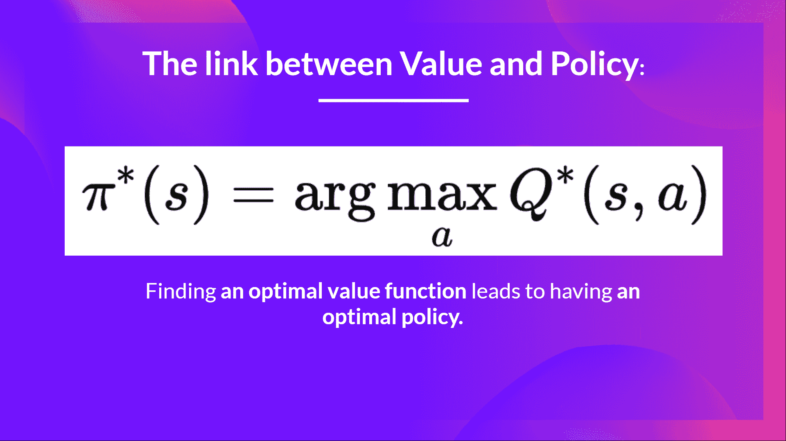
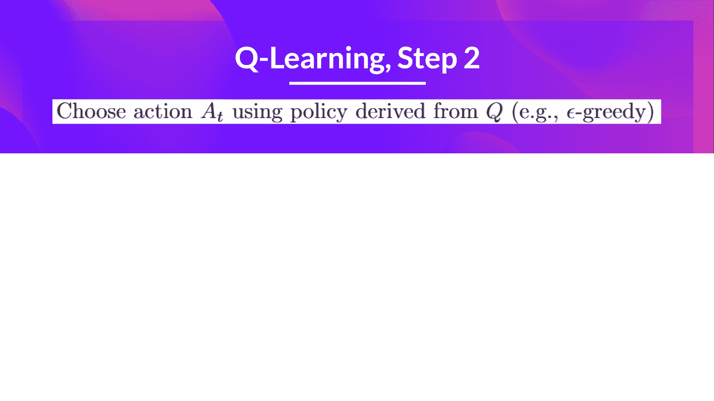
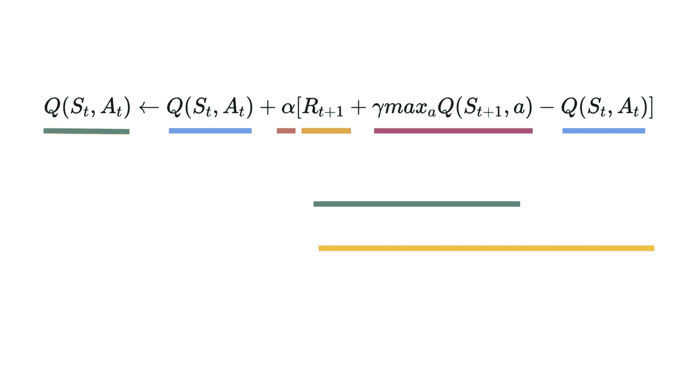
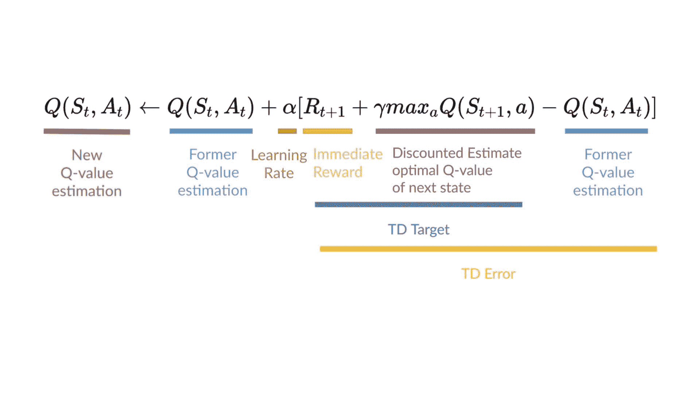
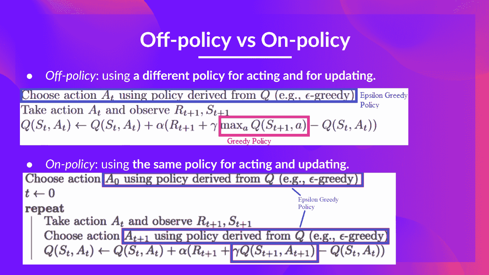

# 第二次测验

> 原文链接：[`huggingface.co/learn/deep-rl-course/unit2/quiz2`](https://huggingface.co/learn/deep-rl-course/unit2/quiz2)

学习和[避免能力幻觉](https://www.coursera.org/lecture/learning-how-to-learn/illusions-of-competence-BuFzf)的最佳方法**是测试自己。** 这将帮助你找到**需要加强知识的地方**。

### Q1: 什么是 Q 学习？

### Q2: 什么是 Q 表？

### Q3: 如果我们有一个最优的 Q 函数 Q*，为什么我们会有一个最优的策略？

解答

因为如果我们有一个最优的 Q 函数，我们有一个最优的策略，因为我们知道对于每个状态，采取的最佳行动是什么。

### Q4: 你能解释什么是 Epsilon-Greedy 策略吗？

解答
 Epsilon Greedy 策略是处理探索/利用权衡的策略。

这个想法是我们定义 epsilonɛ = 1.0：

+   以概率 1 - ɛ进行利用（也就是我们的代理选择具有最高状态-动作对值的动作）。

+   以概率ɛ进行探索（尝试随机动作）。

### Q5: 我们如何更新状态、动作对的 Q 值？

 

解答
 

### Q6: 在政策和离政策之间有什么区别

解答
 

恭喜你完成了这个测验🥳，如果你错过了一些元素，请花时间再次阅读章节以加强（😏）你的知识。
