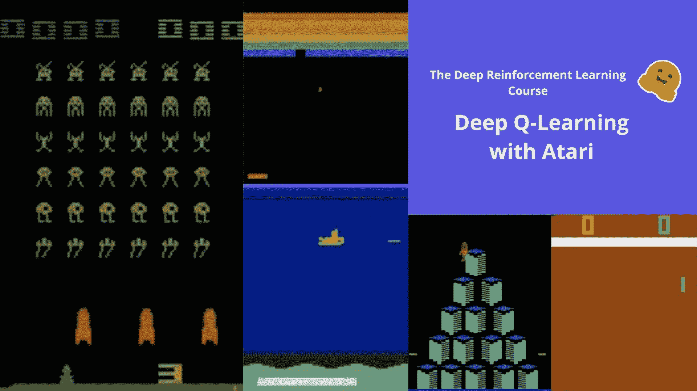

# 深度 Q-Learning

> 原文链接：[`huggingface.co/learn/deep-rl-course/unit3/introduction`](https://huggingface.co/learn/deep-rl-course/unit3/introduction)

在上一个单元中，我们学习了我们的第一个强化学习算法：Q-Learning，**从头开始实现**，并在两个环境中进行了训练，FrozenLake-v1 ☃️和 Taxi-v3 🚕。

我们用这个简单的算法取得了出色的结果，但这些环境相对简单，因为**状态空间是离散且较小的**（FrozenLake-v1 有 16 个不同的状态，Taxi-v3 有 500 个）。相比之下，Atari 游戏中的状态空间可以**包含<math><semantics><mrow><mn>1</mn><msup><mn>0</mn><mn>9</mn></msup></mrow><annotation encoding="application/x-tex">10^{9}</annotation></semantics></math>109 到<math><semantics><mrow><mn>1</mn><msup><mn>0</mn><mn>11</mn></msup></mrow><annotation encoding="application/x-tex">10^{11}</annotation></semantics></math>1011 个状态**。

但正如我们将看到的，**在大状态空间环境中生成和更新 Q 表可能变得无效**。

因此，在本单元中，**我们将学习我们的第一个深度强化学习代理**：深度 Q-Learning。深度 Q-Learning 不使用 Q 表，而是使用一个神经网络，该神经网络接受一个状态，并根据该状态近似计算每个动作的 Q 值。

**我们将使用[RL-Zoo](https://github.com/DLR-RM/rl-baselines3-zoo)**来训练它玩太空侵略者和其他 Atari 环境，RL-Zoo 是一个使用 Stable-Baselines 的 RL 训练框架，提供了用于训练、评估代理、调整超参数、绘制结果和录制视频的脚本。

让我们开始吧！🚀
