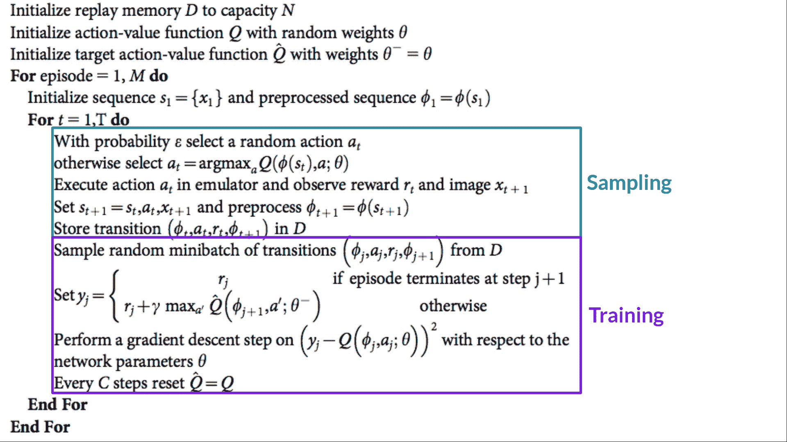
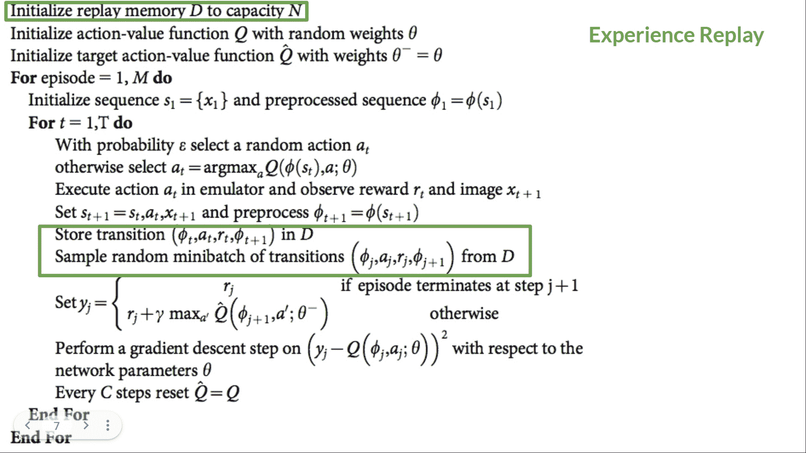
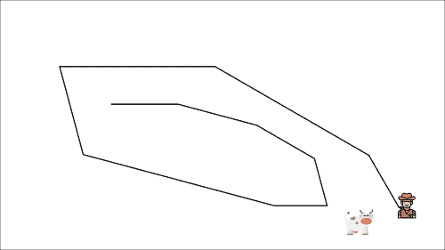
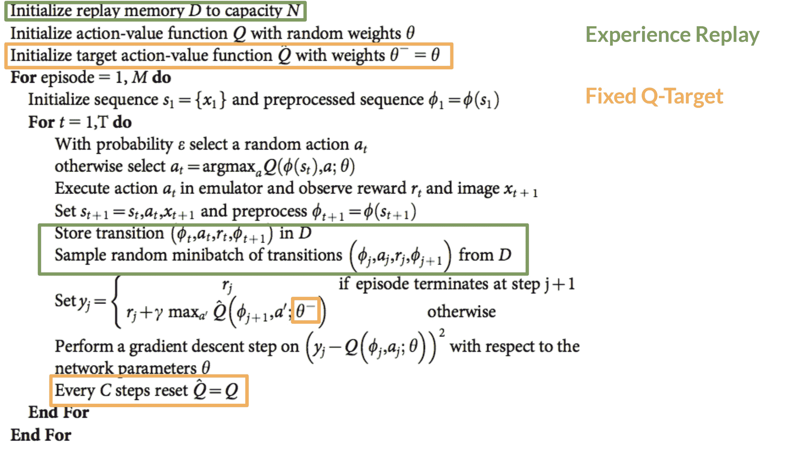

# 深度 Q 学习算法

> 原文：[`huggingface.co/learn/deep-rl-course/unit3/deep-q-algorithm`](https://huggingface.co/learn/deep-rl-course/unit3/deep-q-algorithm)

我们了解到深度 Q 学习**使用深度神经网络来逼近每个可能动作的不同 Q 值**（值函数估计）。

不同之处在于，在训练阶段，我们不直接更新状态-动作对的 Q 值，而是像我们在 Q 学习中所做的那样：

在深度 Q 学习中，我们创建一个**损失函数，比较我们的 Q 值预测和 Q 目标，并使用梯度下降来更新我们的深度 Q 网络的权重，以更好地逼近我们的 Q 值**。

深度 Q 学习训练算法有*两个阶段*：

+   **采样**：我们执行动作并**将观察到的经验元组存储在重播记忆中**。

+   **训练**：随机选择一个**小批量元组，并通过梯度下降更新步骤从这批元组中学习**。

这不是与 Q 学习相比的唯一区别。深度 Q 学习训练**可能会遭受不稳定性**，主要是因为结合了非线性 Q 值函数（神经网络）和自举（当我们使用现有估计更新目标而不是实际完整回报时）。

为了帮助我们稳定训练，我们实施了三种不同的解决方案：

1.  *经验重播*以更**有效地利用经验**。

1.  *固定 Q 目标* **以稳定训练**。

1.  *双重深度 Q 学习*，以**处理 Q 值过高估的问题**。

让我们来看看它们！

## 经验重播以更有效地利用经验

为什么我们创建一个重播记忆？

深度 Q 学习中的经验重播有两个功能：

1.  **更有效地利用训练经验**。通常，在在线强化学习中，代理与环境交互，获取经验（状态、动作、奖励和下一个状态），从中学习（更新神经网络），然后丢弃它们。这是低效的。

经验重播通过**更有效地利用训练经验**来帮助。我们使用一个重播缓冲区，保存经验样本**在训练期间可以重复使用**。

⇒ 这使代理可以**多次从相同经验中学习**。

1.  **避免忘记先前的经验（也称为灾难性干扰或灾难性遗忘），减少经验之间的相关性**。

+   **灾难性遗忘**：如果我们将经验的顺序样本提供给我们的神经网络，我们会遇到的问题是，随着获取新经验，它往往会忘记**之前的经验**。例如，如果代理在第一级别，然后在第二级别，这是不同的，它可能会忘记如何在第一级别中行为和玩耍。

解决方案是创建一个重播缓冲区，存储经验元组，同时与环境交互，然后随机抽取一小批元组。这可以防止**网络仅学习最近所做的事情**。

经验重播还有其他好处。通过随机抽样经验，我们消除了观察序列中的相关性，并避免**动作值震荡或灾难性发散**。

在深度 Q 学习伪代码中，我们**用容量 N 初始化一个重播记忆缓冲区 D**（N 是您可以定义的超参数）。然后我们将经验存储在内存中，并抽取一批经验来在训练阶段馈送深度 Q 网络。

## 固定 Q 目标以稳定训练

当我们想要计算 TD 误差（又名损失）时，我们计算**TD 目标（Q 目标）与当前 Q 值（Q 的估计）之间的差异**。

但是**我们没有关于真实 TD 目标的任何想法**。我们需要估计它。使用贝尔曼方程，我们看到 TD 目标只是在该状态采取该动作的奖励加上下一个状态的折扣最高 Q 值。

然而，问题在于我们正在使用相同的参数（权重）来估计 TD 目标**和**Q 值。因此，TD 目标和我们正在更改的参数之间存在显著的相关性。

因此，在训练的每一步中，**我们的 Q 值和目标值都会发生变化。**我们正在接近我们的目标，但目标也在移动。这就像追逐一个移动的目标！这可能导致训练中的显著振荡。

就像你是一个牛仔（Q 估计），你想抓住一头牛（Q 目标）。你的目标是靠近（减少误差）。

在每个时间步中，您试图接近牛，而牛也在每个时间步中移动（因为您使用相同的参数）。

  这导致了一个奇怪的追逐路径（训练中的显著振荡）。

相反，我们在伪代码中看到的是：

+   使用具有固定参数的**单独网络**来估计 TD 目标

+   **每隔 C 步从我们的深度 Q 网络复制参数**以更新目标网络。

## 双重 DQN

双重 DQN，或双重深度 Q 学习神经网络，由[Hado van Hasselt](https://papers.nips.cc/paper/3964-double-q-learning)引入。这种方法**解决了 Q 值的过度估计问题。**

要理解这个问题，请记住我们如何计算 TD 目标：

通过计算 TD 目标，我们面临一个简单的问题：我们如何确定**下一个状态的最佳动作是具有最高 Q 值的动作？**

我们知道 Q 值的准确性取决于我们尝试的动作**和**我们探索的相邻状态。

因此，在训练开始时，我们对于要采取的最佳动作没有足够的信息。因此，将最大 Q 值（嘈杂的）作为最佳动作可能导致错误的正例。如果非最优动作经常**比最佳最佳动作获得更高的 Q 值，学习将变得复杂。**

解决方案是：当我们计算 Q 目标时，我们使用两个网络来将动作选择与目标 Q 值生成分离。我们：

+   使用我们的**DQN 网络**来选择下一个状态要采取的最佳动作（具有最高 Q 值的动作）。

+   使用我们的**目标网络**来计算在下一个状态采取该动作的目标 Q 值。

因此，双重 DQN 帮助我们减少 Q 值的过度估计，从而帮助我们更快地进行训练并实现更稳定的学习。

自从这三个改进在深度 Q 学习中出现后，还有许多其他改进，例如优先经验重放和对抗深度 Q 学习。它们超出了本课程的范围，但如果您感兴趣，请查看我们在阅读列表中放置的链接。
