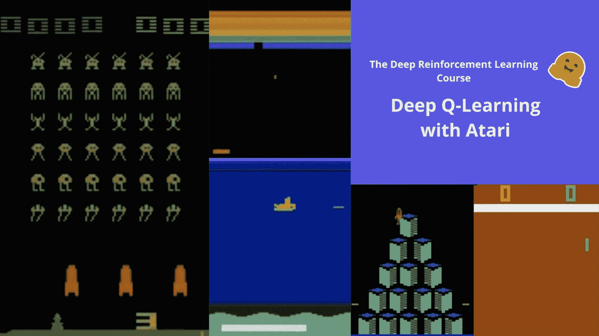

# 实践

> 原始文本：[`huggingface.co/learn/deep-rl-course/unit3/hands-on`](https://huggingface.co/learn/deep-rl-course/unit3/hands-on)

 

现在您已经学习了深度 Q 学习背后的理论，**您已经准备好训练您的深度 Q 学习代理玩 Atari 游戏**。我们将从 Space Invaders 开始，但您可以使用任何您想要的 Atari 游戏🔥


我们使用的是[RL-Baselines-3 Zoo 集成](https://github.com/DLR-RM/rl-baselines3-zoo)，这是一个没有 Double-DQN、Dueling-DQN 或 Prioritized Experience Replay 等扩展的深度 Q 学习的基本版本。

此外，**如果您想在此实践之后自己学习实现深度 Q 学习**，您绝对应该查看 CleanRL 实现：[`github.com/vwxyzjn/cleanrl/blob/master/cleanrl/dqn_atari.py`](https://github.com/vwxyzjn/cleanrl/blob/master/cleanrl/dqn_atari.py)

要验证此实践以进行认证过程，您需要将训练好的模型推送到 Hub 并**获得 >= 200 的结果**。

要找到您的结果，请转到排行榜并找到您的模型，**结果 = 平均奖励 - 奖励的标准差**

**如果找不到您的模型，请转到页面底部并点击刷新按钮。**

有关认证过程的更多信息，请查看此部分👉[`huggingface.co/deep-rl-course/en/unit0/introduction#certification-process`](https://huggingface.co/deep-rl-course/en/unit0/introduction#certification-process)

您可以在这里检查您的进度👉[`huggingface.co/spaces/ThomasSimonini/Check-my-progress-Deep-RL-Course`](https://huggingface.co/spaces/ThomasSimonini/Check-my-progress-Deep-RL-Course)

**要开始实践，请点击“在 Colab 中打开”按钮**👇：


# 第三单元：使用 RL Baselines3 Zoo 进行 Atari 游戏的深度 Q 学习 👾



在这个实践中，**您将训练一个深度 Q 学习代理**来玩 Space Invaders，使用的是基于[Stable-Baselines3](https://stable-baselines3.readthedocs.io/en/master/)的训练框架[RL Baselines3 Zoo](https://github.com/DLR-RM/rl-baselines3-zoo)，该框架提供了用于训练、评估代理、调整超参数、绘制结果和录制视频的脚本。

我们使用的是[RL-Baselines-3 Zoo 集成，一个基本版本的深度 Q 学习](https://stable-baselines3.readthedocs.io/en/master/modules/dqn.html)，没有 Double-DQN、Dueling-DQN 和 Prioritized Experience Replay 等扩展。

### 🎮 环境:

+   [SpacesInvadersNoFrameskip-v4](https://gymnasium.farama.org/environments/atari/space_invaders/)

您可以在这里查看 Space Invaders 版本之间的差异👉[`gymnasium.farama.org/environments/atari/space_invaders/#variants`](https://gymnasium.farama.org/environments/atari/space_invaders/#variants)

### 📚 RL-Library:

+   [RL-Baselines3-Zoo](https://github.com/DLR-RM/rl-baselines3-zoo)

## 此实践的目标 🏆

在实践结束时，您将：

+   能够更深入地理解**RL Baselines3 Zoo 的工作原理**。

+   能够**将训练好的代理和代码推送到 Hub**，并附带一个漂亮的视频回放和评估分数🔥。

## 先决条件 🏗️

在深入实践之前，您需要：

🔲 📚 **[通过阅读第三单元学习深度 Q 学习](https://huggingface.co/deep-rl-course/unit3/introduction)** 🤗

我们不断努力改进我们的教程，所以**如果您在这个实践中发现了一些问题**，请[在 Github Repo 上提出问题](https://github.com/huggingface/deep-rl-class/issues)。

# 让我们训练一个玩 Atari 太空侵略者的深度 Q 学习智能体👾 并将其上传到 Hub。

我们强烈建议学生**使用 Google Colab 进行实践练习，而不是在个人计算机上运行它们**。

通过使用 Google Colab，**您可以专注于学习和实验，而不必担心设置环境的技术细节**。

为了验证这个实践过程的认证，您需要将训练好的模型推送到 Hub 并**获得 >= 200 的结果**。

要找到您的结果，请转到排行榜并找到您的模型，**结果 = 平均奖励 - 奖励的标准差**

有关认证流程的更多信息，请查看此部分👉 [`huggingface.co/deep-rl-course/en/unit0/introduction#certification-process`](https://huggingface.co/deep-rl-course/en/unit0/introduction#certification-process)

## 设置 GPU 💪

+   为了**加速智能体的训练，我们将使用 GPU**。要做到这一点，转到`Runtime > Change Runtime type`


+   `硬件加速器 > GPU`


# 安装 RL-Baselines3 Zoo 及其依赖项📚

如果你看到`ERROR: pip's dependency resolver does not currently take into account all the packages that are installed.` **这是正常的，不是关键错误** 这是版本冲突。但我们需要的包已经安装好了。

```py
# For now we install this update of RL-Baselines3 Zoo
pip install git+https://github.com/DLR-RM/rl-baselines3-zoo@update/hf
```

如果上面的版本不再存在。取消注释并安装下面的版本

```py
#pip install rl_zoo3==2.0.0a9
```

```py
apt-get install swig cmake ffmpeg
```

为了能够在 Gymnasium 中使用 Atari 游戏，我们需要安装 atari 包。并接受 rom 许可证以下载 rom 文件（游戏文件）。

```py
!pip install gymnasium[atari]
!pip install gymnasium[accept-rom-license]
```

## 创建一个虚拟显示🔽

在实践过程中，我们需要生成一个重播视频。为了做到这一点，如果您在无头机器上训练它，**我们需要有一个虚拟屏幕来能够渲染环境**（从而记录帧）。

因此，以下单元格将安装库并创建并运行一个虚拟屏幕🖥

```py
apt install python-opengl
apt install ffmpeg
apt install xvfb
pip3 install pyvirtualdisplay
```

```py
# Virtual display
from pyvirtualdisplay import Display

virtual_display = Display(visible=0, size=(1400, 900))
virtual_display.start()
```

## 训练我们的深度 Q 学习智能体玩太空侵略者 👾

要使用 RL-Baselines3-Zoo 训练一个智能体，我们只需要做两件事：

1.  创建一个包含我们训练超参数的超参数配置文件，名为`dqn.yml`。

这是一个模板示例：

```py
SpaceInvadersNoFrameskip-v4:
  env_wrapper:
    - stable_baselines3.common.atari_wrappers.AtariWrapper
  frame_stack: 4
  policy: 'CnnPolicy'
  n_timesteps: !!float 1e7
  buffer_size: 100000
  learning_rate: !!float 1e-4
  batch_size: 32
  learning_starts: 100000
  target_update_interval: 1000
  train_freq: 4
  gradient_steps: 1
  exploration_fraction: 0.1
  exploration_final_eps: 0.01
  # If True, you need to deactivate handle_timeout_termination
  # in the replay_buffer_kwargs
  optimize_memory_usage: False
```

在这里我们看到：

+   我们使用`Atari Wrapper`对输入进行预处理（帧缩减，灰度化，堆叠 4 帧）

+   我们使用`CnnPolicy`，因为我们使用卷积层来处理帧

+   我们为 1000 万个`n_timesteps`进行训练

+   内存（经验重放）大小为 100000，即您保存的经验步数，用于再次训练您的智能体。

💡 我的建议是**将训练步骤减少到 1M**，这将在 P100 上花费约 90 分钟。`!nvidia-smi`会告诉您正在使用的 GPU。在 1000 万步骤中，这将花费约 9 小时。我建议在您的本地计算机上运行此操作（或其他地方）。只需点击：`File>Download`。

在超参数优化方面，我的建议是专注于这 3 个超参数：

+   `learning_rate`

+   `buffer_size (经验记忆大小)`

+   `batch_size`

作为一个良好的实践，您需要**查看文档以了解每个超参数的作用**：[`stable-baselines3.readthedocs.io/en/master/modules/dqn.html#parameters`](https://stable-baselines3.readthedocs.io/en/master/modules/dqn.html#parameters)

1.  我们开始训练并将模型保存在`logs`文件夹📁

+   在`--algo`之后定义算法，在`-f`之后保存模型，在`-c`之后是超参数配置。

```py
python -m rl_zoo3.train --algo ________ --env SpaceInvadersNoFrameskip-v4  -f _________  -c _________
```

#### 解决方案

```py
python -m rl_zoo3.train --algo dqn  --env SpaceInvadersNoFrameskip-v4 -f logs/ -c dqn.yml
```

## 让我们评估我们的智能体👀

+   RL-Baselines3-Zoo 提供了`enjoy.py`，一个用于评估我们智能体的 Python 脚本。在大多数 RL 库中，我们将评估脚本称为`enjoy.py`。

+   让我们对其进行 5000 个时间步的评估🔥

```py
python -m rl_zoo3.enjoy  --algo dqn  --env SpaceInvadersNoFrameskip-v4  --no-render  --n-timesteps _________  --folder logs/
```

#### 解决方案

```py
python -m rl_zoo3.enjoy  --algo dqn  --env SpaceInvadersNoFrameskip-v4  --no-render  --n-timesteps 5000  --folder logs/
```

## 在 Hub 上发布我们训练好的模型🚀

现在我们看到训练后获得了良好的结果，我们可以用一行代码将我们训练好的模型发布到 Hub 🤗。


通过使用`rl_zoo3.push_to_hub` **您可以评估、记录重播、生成您的代理的模型卡并将其推送到 hub**。

这样：

+   您可以展示我们的工作🔥

+   您可以**观看您的代理玩**👀

+   您可以**与社区分享其他人可以使用的代理**💾

+   您可以**访问排行榜🏆，查看您的代理与同学相比表现如何**👉 [`huggingface.co/spaces/huggingface-projects/Deep-Reinforcement-Learning-Leaderboard`](https://huggingface.co/spaces/huggingface-projects/Deep-Reinforcement-Learning-Leaderboard)

要能够与社区分享您的模型，还有三个步骤要遵循：

1️⃣（如果尚未完成）创建一个 HF 账户 ➡ [`huggingface.co/join`](https://huggingface.co/join)

2️⃣登录，然后，您需要从 Hugging Face 网站存储您的身份验证令牌。

+   创建一个新的令牌（[`huggingface.co/settings/tokens`](https://huggingface.co/settings/tokens)）**具有写入角色**


+   复制令牌

+   运行下面的单元格并粘贴令牌

```py
from huggingface_hub import notebook_login # To log to our Hugging Face account to be able to upload models to the Hub.
notebook_login()
!git config --global credential.helper store
```

如果您不想使用 Google Colab 或 Jupyter Notebook，您需要使用这个命令：`huggingface-cli login`

3️⃣我们现在准备将我们训练的代理推送到🤗 Hub🔥

让我们运行 push_to_hub.py 文件将我们训练的代理上传到 Hub。

`--repo-name`：存储库的名称

`-orga`：您的 Hugging Face 用户名

`-f`：训练模型文件夹所在位置（在我们的情况下为`logs`）


```py
python -m rl_zoo3.push_to_hub  --algo dqn  --env SpaceInvadersNoFrameskip-v4  --repo-name _____________________ -orga _____________________ -f logs/
```

#### 解决方案

```py
python -m rl_zoo3.push_to_hub  --algo dqn  --env SpaceInvadersNoFrameskip-v4  --repo-name dqn-SpaceInvadersNoFrameskip-v4  -orga ThomasSimonini  -f logs/
```

###。

恭喜🥳您刚刚使用 RL-Baselines-3 Zoo 训练和上传了您的第一个 Deep Q-Learning 代理。上面的脚本应该显示了一个指向模型存储库的链接，例如[`huggingface.co/ThomasSimonini/dqn-SpaceInvadersNoFrameskip-v4`](https://huggingface.co/ThomasSimonini/dqn-SpaceInvadersNoFrameskip-v4)。当您访问此链接时，您可以：

+   在右侧查看**代理的视频预览**。

+   点击“文件和版本”查看存储库中的所有文件。

+   点击“在 stable-baselines3 中使用”获取显示如何加载模型的代码片段。

+   一个模型卡（`README.md`文件），其中包含对模型和您使用的超参数的描述。

在幕后，Hub 使用基于 git 的存储库（如果您不知道 git 是什么，不用担心），这意味着您可以随着实验和改进您的代理更新模型的新版本。

**使用[排行榜](https://huggingface.co/spaces/huggingface-projects/Deep-Reinforcement-Learning-Leaderboard)与同学比较您的代理的结果**🏆

## 加载一个强大的训练模型🔥

+   Stable-Baselines3 团队在 Hub 上上传了**超过 150 个训练有素的深度强化学习代理**。

您可以在这里找到它们：👉 [`huggingface.co/sb3`](https://huggingface.co/sb3)

一些示例：

+   Asteroids: [`huggingface.co/sb3/dqn-AsteroidsNoFrameskip-v4`](https://huggingface.co/sb3/dqn-AsteroidsNoFrameskip-v4)

+   Beam Rider: [`huggingface.co/sb3/dqn-BeamRiderNoFrameskip-v4`](https://huggingface.co/sb3/dqn-BeamRiderNoFrameskip-v4)

+   Breakout: [`huggingface.co/sb3/dqn-BreakoutNoFrameskip-v4`](https://huggingface.co/sb3/dqn-BreakoutNoFrameskip-v4)

+   Road Runner: [`huggingface.co/sb3/dqn-RoadRunnerNoFrameskip-v4`](https://huggingface.co/sb3/dqn-RoadRunnerNoFrameskip-v4)

让我们加载一个玩 Beam Rider 的代理：[`huggingface.co/sb3/dqn-BeamRiderNoFrameskip-v4`](https://huggingface.co/sb3/dqn-BeamRiderNoFrameskip-v4)

1.  我们使用`rl_zoo3.load_from_hub`下载模型，并将其放在一个新文件夹中，我们可以称之为`rl_trained`

```py
# Download model and save it into the logs/ folder
python -m rl_zoo3.load_from_hub --algo dqn --env BeamRiderNoFrameskip-v4 -orga sb3 -f rl_trained/
```

1.  让我们评估 5000 个时间步长

```py
python -m rl_zoo3.enjoy --algo dqn --env BeamRiderNoFrameskip-v4 -n 5000  -f rl_trained/ --no-render
```

为什么不尝试训练您自己的**Deep Q-Learning 代理玩 BeamRiderNoFrameskip-v4？🏆。**

如果您想尝试，请查看[`huggingface.co/sb3/dqn-BeamRiderNoFrameskip-v4#hyperparameters`](https://huggingface.co/sb3/dqn-BeamRiderNoFrameskip-v4#hyperparameters) **在模型卡中，您可以看到训练代理的超参数。**

但是找到超参数可能是一项艰巨的任务。幸运的是，我们将在下一个单元中看到如何**使用 Optuna 来优化超参数🔥。**

## 一些额外的挑战🏆

学习的最佳方式是**自己尝试**！

在[排行榜](https://huggingface.co/spaces/huggingface-projects/Deep-Reinforcement-Learning-Leaderboard)中，您将找到您的代理。您能登顶吗？

以下是您可以尝试训练代理的环境列表：

+   BeamRiderNoFrameskip-v4

+   BreakoutNoFrameskip-v4

+   EnduroNoFrameskip-v4

+   PongNoFrameskip-v4

此外，**如果您想自己学习实现深度 Q 学习**，您绝对应该查看 CleanRL 的实现：[`github.com/vwxyzjn/cleanrl/blob/master/cleanrl/dqn_atari.py`](https://github.com/vwxyzjn/cleanrl/blob/master/cleanrl/dqn_atari.py)


* * *

恭喜您完成了本章！

如果您仍然对所有这些元素感到困惑...这是完全正常的！**对我和所有学习 RL 的人来说都是如此。**

在继续之前花时间真正**掌握材料并尝试额外的挑战**。掌握这些元素并建立坚实的基础非常重要。

在下一个单元中，**我们将学习有关[Optuna](https://optuna.org/)的内容**。在深度强化学习中，找到一组良好的训练超参数是最关键的任务之一。Optuna 是一个帮助您自动化搜索的库。

### 这是一个与您共同构建的课程👷🏿‍♀️

最后，我们希望根据您的反馈逐步改进和更新课程。如果您有意见，请填写此表格👉 [`forms.gle/3HgA7bEHwAmmLfwh9`](https://forms.gle/3HgA7bEHwAmmLfwh9)

我们不断努力改进我们的教程，所以**如果您在本笔记本中发现问题**，请[在 Github Repo 上提出问题](https://github.com/huggingface/deep-rl-class/issues)。

我们在奖励单元 2 见！🔥

### 继续学习，保持精彩🤗
