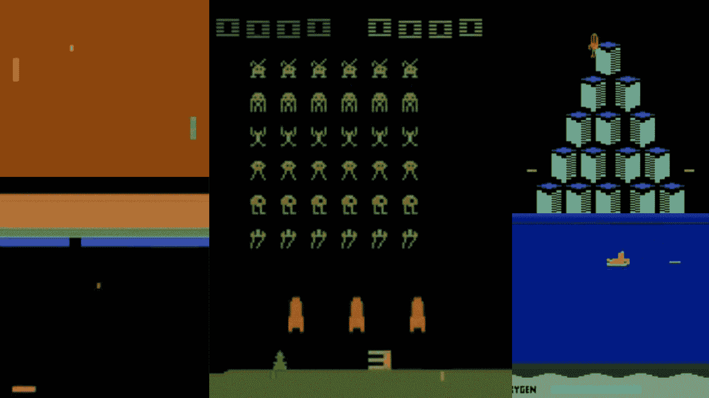

# 结论

> 原文链接：[`huggingface.co/learn/deep-rl-course/unit3/conclusion`](https://huggingface.co/learn/deep-rl-course/unit3/conclusion)

恭喜您完成了本章！这里有很多信息。恭喜您完成了教程。您刚刚训练了您的第一个深度 Q 学习代理并在 Hub 上分享了🥳。

在继续之前，请花时间真正掌握材料。

不要犹豫在其他环境中训练您的代理人（Pong，Seaquest，QBert，Ms Pac Man）。**学习的最佳方式是自己尝试！**

在下一个单元中，**我们将学习 Optuna**。在深度强化学习中最关键的任务之一是找到一组良好的训练超参数。Optuna 是一个帮助您自动搜索的库。

最后，我们很想知道您对课程的看法以及我们如何改进。如果您有反馈，请填写此表格👉 [填写表格](https://forms.gle/BzKXWzLAGZESGNaE9)

### 继续学习，保持出色🤗
