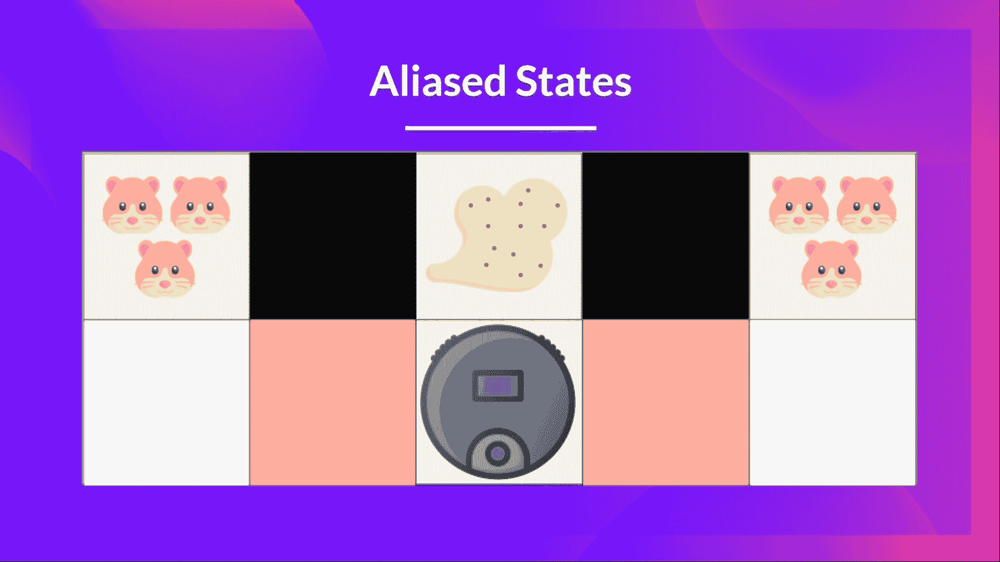
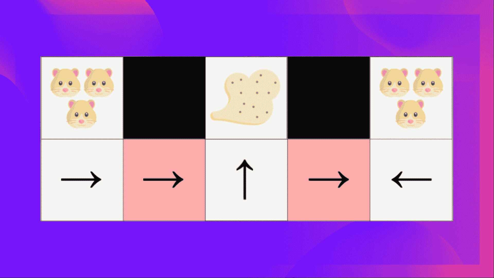
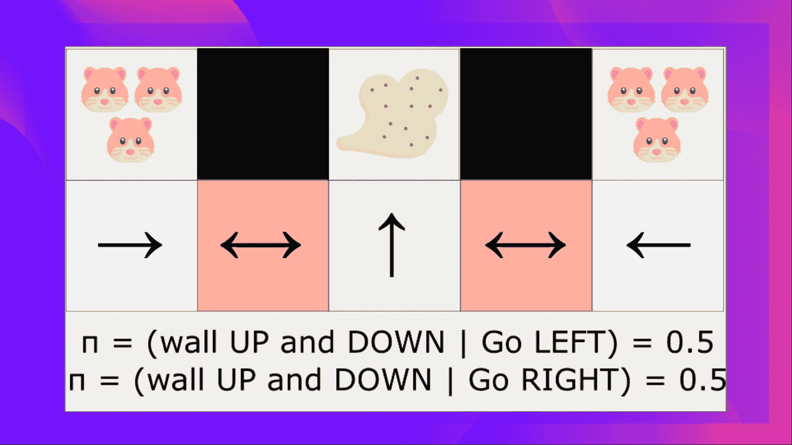

# 策略梯度方法的优缺点

> 原文链接：[`huggingface.co/learn/deep-rl-course/unit4/advantages-disadvantages`](https://huggingface.co/learn/deep-rl-course/unit4/advantages-disadvantages)

此时，你可能会问，“但深度 Q 学习很棒！为什么要使用策略梯度方法？”。为了回答这个问题，让我们来研究**策略梯度方法的优缺点**。

## 优势

相比值基方法，策略梯度方法有多个优势。让我们看看其中一些：

### 集成的简单性

我们可以直接估计策略，而无需存储额外数据（动作值）。

### 策略梯度方法可以学习随机策略

策略梯度方法可以**学习随机策略，而值函数则不能**。

这有两个后果：

1.  我们**不需要手动实现探索/利用权衡**。由于我们输出了动作的概率分布，代理会探索**状态空间，而不总是采取相同的轨迹。**

1.  我们还摆脱了**感知别名**的问题。感知别名是指两个状态看起来（或者确实）相同，但需要不同的动作。

让我们举个例子：我们有一个智能吸尘器，其目标是吸尘并避免杀死仓鼠。

我们的吸尘器只能感知墙壁的位置。

问题在于**这两个红色状态是别名状态，因为代理对每个状态感知到上下墙壁**。

在确定性策略下，策略在红色状态下要么总是向右移动，要么总是向左移动。**任何一种情况都会导致我们的代理被卡住，永远无法吸尘**。

在基于值的强化学习算法下，我们学习一个**准确定策略**（“贪婪ε策略”）。因此，我们的代理可能**花费很长时间才能找到灰尘**。

另一方面，一个最佳的随机策略**将在红色状态中随机向左或向右移动**。因此，**它不会被卡住，并且有很高的概率到达目标状态**。

### 策略梯度方法在高维动作空间和连续动作空间中更有效。

深度 Q 学习的问题在于，它们的**预测为每个可能的动作分配一个分数（最大预期未来奖励）**，在每个时间步骤中，给定当前状态。

但如果我们有无限的动作可能性呢？

例如，对于自动驾驶汽车，每个状态下都可以有（近乎）无限的动作选择（方向盘转动 15°、17.2°、19.4°、按喇叭等）。**我们需要为每个可能的动作输出一个 Q 值**！而**对连续输出取最大动作本身就是一个优化问题**！

相反，使用策略梯度方法，我们输出一个**动作的概率分布**。

### 策略梯度方法具有更好的收敛性质

在基于值的方法中，我们使用一个激进的运算符**改变值函数：我们取 Q 估计的最大值**。因此，如果估计的动作值发生微小变化导致不同的动作具有最大值，那么动作概率可能会因为估计的动作值的微小变化而发生剧烈变化。

例如，在训练期间，最佳动作是向左（Q 值为 0.22），然后在训练步骤之后是向右（因为右侧 Q 值变为 0.23），我们大幅改变了策略，因为现在策略将大部分时间向右而不是向左。

另一方面，在策略梯度方法中，随机策略动作偏好（采取动作的概率）**随时间平滑变化**。

## 缺点

自然地，策略梯度方法也有一些缺点：

+   **策略梯度方法经常收敛到局部最大值，而不是全局最优值。**

+   策略梯度走得更慢，**一步一步：训练可能需要更长时间（低效）。**

+   策略梯度可能具有很高的方差。我们将在演员-评论单元中看到为什么，以及我们如何解决这个问题。

👉 如果您想深入了解策略梯度方法的优缺点，[您可以查看这个视频](https://youtu.be/y3oqOjHilio)。
